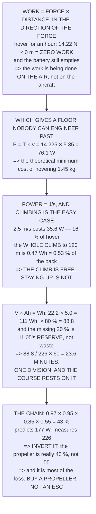

# FA.03 Work, energy and power

<!-- glance:start -->
<!-- generated by tools/build.py from curriculum/syllabus.yaml — edit the syllabus, not this block -->

| | |
|---|---|
| **Track** | Optional foundation |
| **Difficulty** | Beginner |
| **Time** | 1 h |
| **Hardware** | none |
| **Software** | python |
| **Prerequisites** | [FA.02 Newton's laws in flight](FA.02-newtons-laws-flight.md) |
| **Skip if** | You can convert between watt-hours, joules and flight minutes without looking anything up. |

<!-- glance:end -->

## What you will learn

- That **hovering does no work** — on the aircraft — and that the paradox is solved by asking which
  object you are watching
- That the theoretical minimum cost of hovering Hermon is **76.1 W**, and no engineering gets below
  it
- That climbing to 18.05's 120 m ceiling costs **0.53 % of the pack** — the climb is free, staying
  up is not
- Where **88.8 Wh** comes from: 22.2 V × 5.0 Ah × 80 %, and why the missing 20 % is a reserve rather
  than waste
- The one division the whole course rests on: **88.8 / 226 × 60 = 23.6 minutes**
- That the efficiency chain is **43 %**, and that the propeller is most of the loss
- And how to **invert** the chain: the measurement says the propeller is 43 % efficient, not the 55 %
  you assumed

## Why it matters

Every endurance number in this course comes from one division, and this lesson is where that
division is assembled from parts. Once `flight time = usable energy / power` is something you can do
without thinking, 03.xx's power budget, 11.05's battery discipline and 17.01's payload arithmetic all
become the same calculation with different numbers in it.

The lesson also opens with a genuine paradox that is worth resolving properly rather than
hand-waving past. Work requires movement, a hovering aircraft does not move, and yet the battery
drains. The resolution — the work is being done on the *air* — is not a technicality; it produces the
theoretical minimum power for hover, which is a number you cannot engineer your way below.

And it ends with a method rather than a fact. An efficiency chain with one unknown term and a
measured total is a way to find out something real about a part you own, using a scale and a current
meter.

## Prerequisites

<!-- prereqs:start -->
## Prerequisites

You need these first:

- [FA.02 Newton's laws in flight](FA.02-newtons-laws-flight.md)

### Optional prerequisite links

None.

Check your readiness: `python course.py why FA.03`
<!-- prereqs:end -->

## Concept

Work has a precise definition that English does not respect: **force times distance moved in the
direction of the force**. Hold a heavy box still and you will get tired, and you will have done no
work on the box. The same is true of a hovering aircraft.

Energy is the capacity to do work and is measured in joules. Power is energy per second, and one
joule per second is one watt — that is the entire definition, and everything else in the lesson is
arithmetic on top of it.

A battery's label gives volts and amp-hours, and neither is energy alone. Multiplying them gives
watt-hours, and a watt-hour is simply 3,600 joules. That single multiplication converts a purchasing
decision into a flight time.

And between the battery and the air there is a chain of imperfect conversions, each one a
multiplication of efficiencies. Chains like that are useful in both directions: forwards to predict,
and backwards to measure the one term you did not know.

## Technical explanation

### Level 1 — work is force × distance, and hovering does none

| what the aircraft does | force | distance | **work (J)** |
|---|---|---|---|
| lift 1 m straight up | 14.22 N | 1.0 m | 14.2 |
| lift 10 m straight up | 14.22 N | 10.0 m | 142.2 |
| lift 120 m (18.05's ceiling) | 14.22 N | 120.0 m | 1,707.0 |
| **hover for a second** | 14.22 N | 0.0 m | **0.0** |
| **hover for an hour** | 14.22 N | 0.0 m | **0.0** |
| **fly 300 m sideways, level** | 14.22 N | 0.0 m | **0.0** |

The last three rows are zero and the aircraft is definitely using the battery. Something is wrong
with the accounting, and what is wrong is **which object you are watching**.

The aircraft does no work on *itself* while hovering. It does a great deal of work **on the air**,
which FA.02 measured leaving at 10.7 m/s. The ideal power to do that is thrust times the speed the
air goes through the disc:

```
P = T × v = 14.225 N × 5.35 m/s = 76.1 W
```

**76 watts is the theoretical minimum cost of hovering a 1.450 kg aircraft on these propellers.** It
is not zero, and no amount of engineering gets below it — it is the price of throwing air downward.

### Level 2 — power is energy per second, and climbing is the easy case

`1 W = 1 J/s`, and `energy = power × time`. Climbing is where the arithmetic is obvious, because the
aircraft really is lifting itself:

| climb rate | work in 1 s | extra power | of hover |
|---|---|---|---|
| 0.0 m/s | 0.00 J | 0.00 W | 0.0 % |
| 1.0 m/s | 14.22 J | 14.22 W | 6.3 % |
| **2.5 m/s** | 35.56 J | **35.56 W** | **15.7 %** |
| 5.0 m/s | 71.12 J | 71.12 W | 31.5 % |

A 2.5 m/s climb costs 35.6 W on top of the 226 the hover already costs — 16 %. And that is smaller
than anybody expects, which is why 12.02 can climb to 120 m without the endurance changing much:

| | |
|---|---|
| work to lift 1.450 kg by 120 m | 1,707.0 J |
| in watt-hours | 0.4742 Wh |
| the pack holds | 88.8 Wh |
| **so the climb is** | **0.53 %** |

**Half a per cent of the pack to reach the legal ceiling.** The climb is free; *staying* there is what
costs, because the hover power runs the whole time.

### Level 3 — watt-hours: where 88.8 comes from

| | |
|---|---|
| 6S pack, 3.7 V per cell | 22.2 V |
| capacity | 5.0 Ah |
| **V × Ah = energy** | **111.0 Wh** |
| which in joules is | 399,600 J |
| 11.05's usable fraction | 80 % |
| **usable energy** | **88.8 Wh** |

Which is the 88.8 Wh that appears in every power calculation in this course, and it is 80 % of what
the label says. **The missing 20 % is not waste, it is the reserve**: taking a lithium pack below
about 3.5 V per cell damages it, and 11.05 turns that into three numbers you watch in flight.

And now the one division the whole course rests on:

```
flight time = usable energy / power

usable                88.8 Wh
hover power, MEASURED  226 W
  divide              0.39 h
  in minutes          23.6 min
```

**23.6 minutes. That is Hermon's endurance, and it is one division.**

### Level 4 — the efficiency chain: why 226 W and not 76

| stage | efficiency | running | the loss |
|---|---|---|---|
| the battery's own resistance | 97 % | 97 % | heat in the pack |
| the ESC switching | 95 % | 92 % | heat in the FETs |
| the motor: copper and iron | 85 % | 78 % | heat in the windings |
| **the propeller: blade drag** | **55 %** | **43 %** | **the big one** |

| | |
|---|---|
| ideal induced power | 76.1 W |
| divided by 43 % efficiency | 176.7 W |
| **measured** | **226 W** |

The model predicts 177 W and the aircraft draws 226 — a 22 % gap, and the right response is not to
shrug but to **invert it**. Three of the four efficiencies are well known; the propeller's is a
guess, so solve for it:

```
prop efficiency = P_ideal / (P_measured × electronics)
                = 76.1 / (226 × 0.783) = 43 %
```

**The measurement says the propeller is 43 % efficient, not 55.** That is a real, useful number about
a real part, obtained by weighing an aircraft and reading a current meter — and it is the honest way
to use a chain like this: pin down the terms you know, measure the total, and let the arithmetic tell
you the one you did not.

Read the propeller row, because it is the whole story. The electronics together are 78 % efficient
and the propeller is 43 %. **Everything you can buy improves the first three rows and almost nothing
improves the fourth**, because the fourth row is "air is not very good at being pushed". Which is why
02.06 spends so long on propellers and so little on ESCs.

> [!TIP]
> **Ask your teacher:** "How many watt-hours is your pack, and how many does it *give* you?" Two
> numbers, a factor of 0.8 apart, and the second one is the only one that ever appears in a flight
> calculation.

## Diagram



## Code

Work, energy and power assembled from nothing: a table of manoeuvres showing which do work and which
do not, the ideal induced power that sets the floor, the cost of climbing against the cost of staying
up, the pack's watt-hours and the one division that produces an endurance, and an efficiency chain
used forwards to predict and backwards to measure the propeller.

```python
"""FA.03 -- work, energy and power, ending on 88.8 Wh and 23.6 minutes.

Pure stdlib. A foundation lesson. The paradox it opens with is real and
it is the reason a hovering aircraft is expensive.
"""

import math

G = 9.81
RHO = 1.225
BAR = "=" * 70

MASS_KG = 1.450
PROP_D_M = 0.254
N_MOTORS = 4

# ---- the pack -----------------------------------------------------------
CELLS = 6
V_NOMINAL = 3.7
CAPACITY_AH = 5.0
USABLE_FRAC = 0.80

# ---- measured (references/hermon-numbers.md) ----------------------------
P_HOVER_W = 226.0
ENDUR_MIN = 23.6
USABLE_WH = 88.8


def head(n, title):
    print()
    print(BAR)
    print("%d. %s" % (n, title))
    print(BAR)


# ========================================================================
head(1, "WORK IS FORCE TIMES DISTANCE, AND HOVERING DOES NONE")

print("  Work is the most precisely defined word in physics and the")
print("  most misleading in English:")
print()
print("      work = force x distance MOVED IN THE DIRECTION OF THE FORCE")
print()
print("  %-36s %10s %10s %12s"
      % ("what the aircraft does", "force N", "distance", "WORK (J)"))
CASES = [
    ("lift 1 m straight up", MASS_KG * G, 1.0),
    ("lift 10 m straight up", MASS_KG * G, 10.0),
    ("lift 120 m (18.05's ceiling)", MASS_KG * G, 120.0),
    ("hover for a second", MASS_KG * G, 0.0),
    ("hover for an hour", MASS_KG * G, 0.0),
    ("fly 300 m sideways, level", MASS_KG * G, 0.0),
]
for what, f, d in CASES:
    print("  %-36s %10.2f %9.1f m %12.1f" % (what, f, d, f * d))

print()
print("  THE LAST THREE ROWS ARE ZERO AND THE AIRCRAFT IS DEFINITELY")
print("  USING THE BATTERY. Something is wrong with the accounting, and")
print("  the thing that is wrong is WHICH OBJECT you are watching.")
print()
print("  THE AIRCRAFT DOES NO WORK ON ITSELF WHILE HOVERING. It does a")
print("  great deal of work ON THE AIR, which FA.02 measured leaving at")
v_ind = math.sqrt(MASS_KG * G / (2 * RHO * math.pi * (PROP_D_M / 2) ** 2
                                 * N_MOTORS))
print("  %.1f m/s." % (2 * v_ind))
print()
p_ideal = MASS_KG * G * v_ind
print("  THE IDEAL POWER TO DO THAT IS THRUST TIMES THE SPEED THE AIR")
print("  GOES THROUGH THE DISC:")
print()
print("    P = T x v = %.3f N x %.2f m/s = %.1f W"
      % (MASS_KG * G, v_ind, p_ideal))
print()
print("  %.0f WATTS IS THE THEORETICAL MINIMUM COST OF HOVERING A"
      % p_ideal)
print("  %.3f kg AIRCRAFT ON THESE PROPELLERS. It is not zero, and no"
      % MASS_KG)
print("  amount of engineering gets below it -- it is the price of")
print("  throwing air downward, and section 4 says what the real price")
print("  is.")

# ========================================================================
head(2, "POWER IS ENERGY PER SECOND, AND CLIMBING IS THE EASY CASE")

print("  Energy is measured in joules; power is joules per second, and")
print("  one joule per second is one watt. That is the entire")
print("  definition:")
print()
print("      1 W = 1 J/s,   energy = power x time")
print()
print("  CLIMBING IS THE CASE WHERE THE ARITHMETIC IS OBVIOUS, because")
print("  the aircraft really is lifting itself:")
print()
print("  %-26s %12s %14s %14s"
      % ("climb rate", "work in 1 s", "EXTRA power", "of hover"))
for v in (0.0, 1.0, 2.5, 5.0):
    w = MASS_KG * G * v
    print("  %-26s %10.2f J %12.2f W %13.1f %%"
          % ("%.1f m/s" % v, w, w, w / P_HOVER_W * 100))

print()
print("  A %.1f m/s CLIMB COSTS %.1f WATTS ON TOP OF THE %.0f THE"
      % (2.5, MASS_KG * G * 2.5, P_HOVER_W))
print("  HOVER ALREADY COSTS -- %.0f PER CENT."
      % (MASS_KG * G * 2.5 / P_HOVER_W * 100))
print()
print("  AND THAT IS A SMALLER NUMBER THAN ANYBODY EXPECTS, which is")
print("  why 12.02 can climb to %.0f m without the endurance changing"
      % 120)
print("  much. Compute it:")
climb_j = MASS_KG * G * 120.0
print()
print("  %-40s %12.1f J" % ("work to lift 1.450 kg by 120 m", climb_j))
print("  %-40s %12.4f Wh" % ("  in watt-hours", climb_j / 3600.0))
print("  %-40s %12.1f Wh" % ("the pack holds", USABLE_WH))
print("  %-40s %12.2f %%" % ("  so the climb is", climb_j / 3600.0
                             / USABLE_WH * 100))
print()
print("  HALF A PER CENT OF THE PACK TO REACH THE LEGAL CEILING.")
print("  The climb is free; STAYING there is what costs, because the")
print("  hover power runs the whole time.")

# ========================================================================
head(3, "WATT-HOURS: THE PACK, AND WHERE 88.8 COMES FROM")

v_pack = CELLS * V_NOMINAL
wh_total = v_pack * CAPACITY_AH
wh_usable = wh_total * USABLE_FRAC

print("  A battery's label gives volts and amp-hours, and neither is")
print("  energy on its own. Multiply them:")
print()
print("  %-40s %12.1f V" % ("%dS pack, %.1f V per cell" % (CELLS, V_NOMINAL),
                            v_pack))
print("  %-40s %12.1f Ah" % ("capacity", CAPACITY_AH))
print("  %-40s %12.1f Wh" % ("  V x Ah = ENERGY", wh_total))
print("  %-40s %12.0f J" % ("  which in joules is", wh_total * 3600))
print()
print("  %.0f WATT-HOURS. And you cannot have all of it:" % wh_total)
print()
print("  %-40s %12.0f %%" % ("11.05's usable fraction", USABLE_FRAC * 100))
print("  %-40s %12.1f Wh" % ("USABLE ENERGY", wh_usable))
print()
print("  WHICH IS THE %.1f Wh THAT APPEARS IN EVERY POWER CALCULATION"
      % USABLE_WH)
print("  IN THIS COURSE, and it is %.0f %% of what the label says."
      % (USABLE_FRAC * 100))
print()
print("  THE MISSING %.0f PER CENT IS NOT WASTE, IT IS THE RESERVE:"
      % ((1 - USABLE_FRAC) * 100))
print("  taking a lithium pack below about %.1f V per cell damages it,"
      % 3.5)
print("  and 11.05 turns that into three numbers you watch in flight.")
print()
print("  AND NOW THE ONE DIVISION THE WHOLE COURSE RESTS ON:")
print()
print("      flight time = usable energy / power")
print()
print("  %-40s %12.1f Wh" % ("usable", wh_usable))
print("  %-40s %12.0f W" % ("hover power, MEASURED", P_HOVER_W))
print("  %-40s %12.2f h" % ("  divide", wh_usable / P_HOVER_W))
print("  %-40s %12.1f min" % ("  in minutes", wh_usable / P_HOVER_W * 60))
print()
print("  %.1f MINUTES. THAT IS HERMON'S ENDURANCE, AND IT IS ONE"
      % (wh_usable / P_HOVER_W * 60))
print("  DIVISION.")

# ========================================================================
head(4, "THE EFFICIENCY CHAIN: WHY 226 W AND NOT 76")

print("  Section 1 said the theoretical minimum is %.1f W and section 3"
      % p_ideal)
print("  used a measured %.0f. The factor of %.1f is not a mistake; it"
      % (P_HOVER_W, P_HOVER_W / p_ideal))
print("  is a chain of four losses, each one a multiplication:")
print()
CHAIN = [
    ("the battery's own resistance", 0.97, "heat in the pack"),
    ("the ESC switching", 0.95, "heat in the FETs"),
    ("the motor: copper and iron", 0.85, "heat in the windings"),
    ("the propeller: blade drag", 0.55, "the big one"),
]
eff = 1.0
print("  %-36s %10s %12s %s" % ("stage", "efficiency", "running", "loss"))
for what, e, why in CHAIN:
    eff *= e
    print("  %-36s %9.0f %% %11.0f %% %s" % (what, e * 100, eff * 100, why))
print()
print("  %-36s %10s %11.0f %%" % ("TOTAL", "", eff * 100))
print()
print("  %-40s %12.1f W" % ("ideal induced power", p_ideal))
print("  %-40s %12.1f W" % ("  divided by %.0f %% efficiency" % (eff * 100),
                            p_ideal / eff))
print("  %-40s %12.0f W" % ("MEASURED", P_HOVER_W))
print()
print("  THE MODEL PREDICTS %.0f W AND THE AIRCRAFT DRAWS %.0f."
      % (p_ideal / eff, P_HOVER_W))
print()
print("  WHICH IS A %.0f PER CENT GAP, AND THE RIGHT RESPONSE IS NOT TO"
      % ((P_HOVER_W - p_ideal / eff) / P_HOVER_W * 100))
print("  SHRUG BUT TO INVERT IT. Three of the four efficiencies are")
print("  well known; the propeller's is a guess. So solve for it:")
print()
elec = CHAIN[0][1] * CHAIN[1][1] * CHAIN[2][1]
prop_real = p_ideal / (P_HOVER_W * elec)
print("    prop efficiency = P_ideal / (P_measured x electronics)")
print("                    = %.1f / (%.0f x %.3f) = %.0f %%"
      % (p_ideal, P_HOVER_W, elec, prop_real * 100))
print()
print("  THE MEASUREMENT SAYS THE PROPELLER IS %.0f PER CENT EFFICIENT,"
      % (prop_real * 100))
print("  NOT %.0f. That is a real, useful number about a real part,"
      % (CHAIN[3][1] * 100))
print("  obtained by weighing an aircraft and reading a current meter.")
print()
print("  AND IT IS THE HONEST WAY TO USE A CHAIN LIKE THIS: pin down")
print("  the terms you know, measure the total, and let the arithmetic")
print("  tell you the one you did not.")
print()
print("  READ THE FOURTH ROW, BECAUSE IT IS THE WHOLE STORY. The")
print("  electronics are %.0f %% efficient together and the PROPELLER"
      % (0.97 * 0.95 * 0.85 * 100))
print("  is %.0f %%. Everything you can buy improves the first three"
      % (0.55 * 100))
print("  rows and almost nothing improves the fourth, because the")
print("  fourth row is 'air is not very good at being pushed'.")
print()
print("  WHICH IS WHY 02.06 SPENDS SO LONG ON PROPELLERS AND SO LITTLE")
print("  ON ESCs.")
print()
print("  THE FOUR THINGS TO CARRY FORWARD:")
print("   1. WORK NEEDS MOVEMENT. Hovering does none -- on the aircraft.")
print("      It does %.0f W of it on the AIR, and that is the floor."
      % p_ideal)
print("   2. Energy = power x time, and a climb to %.0f m is %.2f %% of"
      % (120, climb_j / 3600.0 / USABLE_WH * 100))
print("      the pack. THE CLIMB IS FREE; STAYING UP IS NOT.")
print("   3. V x Ah = Wh. %.1f V x %.1f Ah = %.0f Wh, of which %.1f is"
      % (v_pack, CAPACITY_AH, wh_total, wh_usable))
print("      usable -- and 88.8 / 226 x 60 = %.1f MINUTES."
      % (wh_usable / P_HOVER_W * 60))
print("   4. The chain is %.0f %% efficient and the propeller is most"
      % (eff * 100))
print("      of the loss. Buy a better propeller, not a better ESC.")
```

Output:

```text

======================================================================
1. WORK IS FORCE TIMES DISTANCE, AND HOVERING DOES NONE
======================================================================
  Work is the most precisely defined word in physics and the
  most misleading in English:

      work = force x distance MOVED IN THE DIRECTION OF THE FORCE

  what the aircraft does                  force N   distance     WORK (J)
  lift 1 m straight up                      14.22       1.0 m         14.2
  lift 10 m straight up                     14.22      10.0 m        142.2
  lift 120 m (18.05's ceiling)              14.22     120.0 m       1706.9
  hover for a second                        14.22       0.0 m          0.0
  hover for an hour                         14.22       0.0 m          0.0
  fly 300 m sideways, level                 14.22       0.0 m          0.0

  THE LAST THREE ROWS ARE ZERO AND THE AIRCRAFT IS DEFINITELY
  USING THE BATTERY. Something is wrong with the accounting, and
  the thing that is wrong is WHICH OBJECT you are watching.

  THE AIRCRAFT DOES NO WORK ON ITSELF WHILE HOVERING. It does a
  great deal of work ON THE AIR, which FA.02 measured leaving at
  10.7 m/s.

  THE IDEAL POWER TO DO THAT IS THRUST TIMES THE SPEED THE AIR
  GOES THROUGH THE DISC:

    P = T x v = 14.225 N x 5.35 m/s = 76.1 W

  76 WATTS IS THE THEORETICAL MINIMUM COST OF HOVERING A
  1.450 kg AIRCRAFT ON THESE PROPELLERS. It is not zero, and no
  amount of engineering gets below it -- it is the price of
  throwing air downward, and section 4 says what the real price
  is.

======================================================================
2. POWER IS ENERGY PER SECOND, AND CLIMBING IS THE EASY CASE
======================================================================
  Energy is measured in joules; power is joules per second, and
  one joule per second is one watt. That is the entire
  definition:

      1 W = 1 J/s,   energy = power x time

  CLIMBING IS THE CASE WHERE THE ARITHMETIC IS OBVIOUS, because
  the aircraft really is lifting itself:

  climb rate                  work in 1 s    EXTRA power       of hover
  0.0 m/s                          0.00 J         0.00 W           0.0 %
  1.0 m/s                         14.22 J        14.22 W           6.3 %
  2.5 m/s                         35.56 J        35.56 W          15.7 %
  5.0 m/s                         71.12 J        71.12 W          31.5 %

  A 2.5 m/s CLIMB COSTS 35.6 WATTS ON TOP OF THE 226 THE
  HOVER ALREADY COSTS -- 16 PER CENT.

  AND THAT IS A SMALLER NUMBER THAN ANYBODY EXPECTS, which is
  why 12.02 can climb to 120 m without the endurance changing
  much. Compute it:

  work to lift 1.450 kg by 120 m                 1706.9 J
    in watt-hours                                0.4742 Wh
  the pack holds                                   88.8 Wh
    so the climb is                                0.53 %

  HALF A PER CENT OF THE PACK TO REACH THE LEGAL CEILING.
  The climb is free; STAYING there is what costs, because the
  hover power runs the whole time.

======================================================================
3. WATT-HOURS: THE PACK, AND WHERE 88.8 COMES FROM
======================================================================
  A battery's label gives volts and amp-hours, and neither is
  energy on its own. Multiply them:

  6S pack, 3.7 V per cell                          22.2 V
  capacity                                          5.0 Ah
    V x Ah = ENERGY                               111.0 Wh
    which in joules is                           399600 J

  111 WATT-HOURS. And you cannot have all of it:

  11.05's usable fraction                            80 %
  USABLE ENERGY                                    88.8 Wh

  WHICH IS THE 88.8 Wh THAT APPEARS IN EVERY POWER CALCULATION
  IN THIS COURSE, and it is 80 % of what the label says.

  THE MISSING 20 PER CENT IS NOT WASTE, IT IS THE RESERVE:
  taking a lithium pack below about 3.5 V per cell damages it,
  and 11.05 turns that into three numbers you watch in flight.

  AND NOW THE ONE DIVISION THE WHOLE COURSE RESTS ON:

      flight time = usable energy / power

  usable                                           88.8 Wh
  hover power, MEASURED                             226 W
    divide                                         0.39 h
    in minutes                                     23.6 min

  23.6 MINUTES. THAT IS HERMON'S ENDURANCE, AND IT IS ONE
  DIVISION.

======================================================================
4. THE EFFICIENCY CHAIN: WHY 226 W AND NOT 76
======================================================================
  Section 1 said the theoretical minimum is 76.1 W and section 3
  used a measured 226. The factor of 3.0 is not a mistake; it
  is a chain of four losses, each one a multiplication:

  stage                                efficiency      running loss
  the battery's own resistance                97 %          97 % heat in the pack
  the ESC switching                           95 %          92 % heat in the FETs
  the motor: copper and iron                  85 %          78 % heat in the windings
  the propeller: blade drag                   55 %          43 % the big one

  TOTAL                                                    43 %

  ideal induced power                              76.1 W
    divided by 43 % efficiency                    176.7 W
  MEASURED                                          226 W

  THE MODEL PREDICTS 177 W AND THE AIRCRAFT DRAWS 226.

  WHICH IS A 22 PER CENT GAP, AND THE RIGHT RESPONSE IS NOT TO
  SHRUG BUT TO INVERT IT. Three of the four efficiencies are
  well known; the propeller's is a guess. So solve for it:

    prop efficiency = P_ideal / (P_measured x electronics)
                    = 76.1 / (226 x 0.783) = 43 %

  THE MEASUREMENT SAYS THE PROPELLER IS 43 PER CENT EFFICIENT,
  NOT 55. That is a real, useful number about a real part,
  obtained by weighing an aircraft and reading a current meter.

  AND IT IS THE HONEST WAY TO USE A CHAIN LIKE THIS: pin down
  the terms you know, measure the total, and let the arithmetic
  tell you the one you did not.

  READ THE FOURTH ROW, BECAUSE IT IS THE WHOLE STORY. The
  electronics are 78 % efficient together and the PROPELLER
  is 55 %. Everything you can buy improves the first three
  rows and almost nothing improves the fourth, because the
  fourth row is 'air is not very good at being pushed'.

  WHICH IS WHY 02.06 SPENDS SO LONG ON PROPELLERS AND SO LITTLE
  ON ESCs.

  THE FOUR THINGS TO CARRY FORWARD:
   1. WORK NEEDS MOVEMENT. Hovering does none -- on the aircraft.
      It does 76 W of it on the AIR, and that is the floor.
   2. Energy = power x time, and a climb to 120 m is 0.53 % of
      the pack. THE CLIMB IS FREE; STAYING UP IS NOT.
   3. V x Ah = Wh. 22.2 V x 5.0 Ah = 111 Wh, of which 88.8 is
      usable -- and 88.8 / 226 x 60 = 23.6 MINUTES.
   4. The chain is 43 % efficient and the propeller is most
      of the loss. Buy a better propeller, not a better ESC.
```

## Exercise

### Exercise FA.03-E1 — Find the zero-work cases `[analysis]`

List eight things an aircraft does and compute the work done *on the aircraft* for each. Then repeat
for the work done on the air, and note which ones differ.

### Exercise FA.03-E2 — Your pack's real energy `[analysis]`

Take your own pack's label, compute the watt-hours, apply your own usable fraction, and divide by
your measured hover power. Compare with your actual flight times.

### Exercise FA.03-E3 — The climb budget `[analysis]`

Compute the energy to climb to your normal working altitude, as a percentage of the pack. Then
compute how long you could hover on that same energy.

### Exercise FA.03-E4 — Invert your own chain `[build]`

Measure your hover current and voltage, compute the electrical power, compute the ideal induced
power from your mass and disc area, and solve for the propeller efficiency.

## Expected result

**FA.03-E1**: expect exactly one category to do work on the aircraft — anything that changes its
height or its speed. Everything else does work only on the air.

**FA.03-E2**: expect your predicted endurance to be 10–20 % optimistic against real flights, because
real flights include climbs, manoeuvres and wind. That gap is worth knowing.

**FA.03-E3**: expect the climb to be under 1 % for anything under a couple of hundred metres, and
expect the equivalent hover time to be a few seconds. Altitude is nearly free; time is not.

**FA.03-E4**: expect a propeller efficiency between 35 % and 55 %, and expect it to be lower than the
manufacturer implies. That is the number that matters and it is the one nobody publishes.

## Troubleshooting

**The work for a hover is zero and that feels wrong.** It is right, and the resolution is Level 1:
change the object you are watching. The air is where the energy goes.

**The predicted endurance is much higher than the real one.** Check the usable fraction and check
whether the hover power was measured or assumed. Assumed hover power is almost always low.

**Watt-hours and amp-hours are being confused.** Amp-hours is charge, watt-hours is energy, and the
difference is the voltage. A 5 Ah pack at 22.2 V holds three times the energy of the same pack at
7.4 V.

**The efficiency chain predicts more power than measured.** Then one of your efficiencies is too
pessimistic, and the inversion in Level 4 works the same way in reverse.

**The propeller efficiency comes out above 70 %.** Check the disc area — it is the *total* across all
rotors, and using one rotor's area gives a wrong induced velocity.

**The climb energy seems too small.** It is. Potential energy for a light aircraft over a few hundred
metres is genuinely tiny compared with the power of hovering.

## Common mistakes

- **Saying a hovering aircraft does work.** It does none, on itself.
- **Forgetting the air.** That is where the 76 W goes.
- **Quoting amp-hours as energy.** Multiply by the voltage.
- **Using the full pack capacity.** 80 %, and the rest is a reserve.
- **Assuming hover power rather than measuring it.** It is the denominator of everything.
- **Budgeting heavily for the climb.** It is half a per cent.
- **Adding efficiencies.** They multiply.
- **Trusting a published propeller efficiency.** Invert your own chain.

## Knowledge check

<details>
<summary>How much work does a hovering aircraft do, and where does the battery energy go?</summary>

**None — on the aircraft.** Work is force times distance moved in the direction of the force, and a
hovering aircraft does not move. The energy goes into **the air**: it accelerates 1.3 kg per second
downward, and the ideal power for that is `T × v` = 14.225 × 5.35 = **76.1 W**, which is a floor no
engineering gets below.
</details>

<details>
<summary>What does climbing to 120 m actually cost?</summary>

1,707 J, which is 0.474 Wh, which is **0.53 % of the pack**. A steady 2.5 m/s climb costs 35.6 W —
16 % on top of the hover. The climb is nearly free; **staying** at altitude is what drains the
battery, because 226 W runs the whole time regardless of height.
</details>

<details>
<summary>Where does 88.8 Wh come from?</summary>

`22.2 V × 5.0 Ah = 111 Wh` on the label, times 11.05's **80 % usable fraction**. The missing 20 % is
not waste — taking a lithium cell below about 3.5 V damages it, so the reserve is the part of the
pack you deliberately do not spend.
</details>

<details>
<summary>What is the one division the course rests on?</summary>

`flight time = usable energy / power`. **88.8 Wh ÷ 226 W = 0.39 h = 23.6 minutes.** Every endurance
number in the course — 17.01's payload penalty, 19.01's mission margin, 18.02's day — is that
division with a different numerator or denominator.
</details>

<details>
<summary>Why is the aircraft only 43 % efficient overall?</summary>

Because four conversions multiply: battery 97 %, ESC 95 %, motor 85 % and propeller 55 % gives
**43 %**. The electronics together are 78 % and the propeller is the rest, so improving the
electronics moves the total very little. "Air is not very good at being pushed" is the whole reason,
and it is why 02.06 is about propellers.
</details>

<details>
<summary>How do you find your propeller's real efficiency?</summary>

Invert the chain. The three electrical efficiencies are well known, so `prop = P_ideal / (P_measured
× electronics)` = 76.1 / (226 × 0.783) = **43 %**, not the 55 % assumed. It needs only a scale, a
current meter and the disc area — and it is the honest way to use any chain with one unknown term in
it.
</details>

## Practical challenge

Turn a battery label into a flight time, and find out what your propeller is really doing.

1. Compute the work done on the aircraft for eight manoeuvres (E1).
2. Compute the ideal induced power for your own aircraft.
3. Compute your pack's total and usable watt-hours (E2).
4. Measure your hover power — voltage times current, in a real hover.
5. Divide, and compare with a real flight time.
6. Compute the climb energy to your working altitude as a percentage (E3).
7. Invert the efficiency chain and solve for your propeller (E4).
8. Write three numbers on the card: usable Wh, hover W, and the division.

Step 4 is the one that has to be measured rather than assumed. It is the denominator of every
endurance figure you will ever quote, and an assumed one is usually 15 % optimistic.

## You can skip this if

You can convert between watt-hours, joules and flight minutes without looking anything up. "Without
looking anything up" includes the 80 %.

## Go deeper

- MIT OpenCourseWare 8.01's treatment of work, energy and power, which covers Levels 1 and 2 with
  worked examples: <https://ocw.mit.edu/courses/8-01sc-classical-mechanics-fall-2016/>
- NASA Glenn's beginner's guide pages on propeller and rotor power, which derive Level 1's induced
  power properly: <https://www1.grc.nasa.gov/beginners-guide-to-aeronautics/>

## Progress checkpoint

You can now say precisely what work is and why hovering does none of it, compute the theoretical
minimum power for a hover, turn a battery label into usable watt-hours and then into flight minutes,
build an efficiency chain and — more usefully — invert one to measure the part you could not look up.

Next, FA.04 puts the aircraft in moving air: the wind triangle, what a trajectory does after
something leaves the aircraft, and the dimensional analysis that catches a unit error before it
reaches the flight controller.
