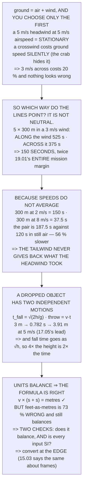

# FA.04 Wind vectors, trajectories and unit sanity

<!-- glance:start -->
<!-- generated by tools/build.py from curriculum/syllabus.yaml — edit the syllabus, not this block -->

| | |
|---|---|
| **Track** | Optional foundation |
| **Difficulty** | Beginner |
| **Time** | 1 h |
| **Hardware** | none |
| **Software** | python |
| **Prerequisites** | [FA.03 Work, energy and power](FA.03-work-energy-power.md) |
| **Skip if** | You can solve a wind triangle and catch a unit error by dimensional analysis before it reaches the aircraft. |

<!-- glance:end -->

## What you will learn

- That `ground = air + wind`, and that **you only ever choose the first one**
- That a headwind equal to your airspeed leaves the aircraft **working normally and going nowhere**
- That a crosswind costs ground speed **silently**, because the controller crabs into it and nothing
  looks wrong
- **The result**: survey lines *along* a 3 m/s wind take 525 s and lines *across* it take 375 — a
  difference of **150 seconds, twice 19.01's entire mission margin**
- That **speeds do not average**: 300 m at 2 m/s and 300 m at 8 m/s is 56 % slower than 600 m at 5
- That fall time goes as **√h**, so dropping from higher is much less bad than it looks
- And that dimensional analysis proves the **formula** while only SI-at-the-edge proves the
  **numbers** — feet-as-metres is **73 % wrong with every unit still balancing**

## Why it matters

Three separate things in the main path are the same piece of arithmetic wearing different clothes.
12.02's survey planning, 17.05's release lead and 11.04's wind limit are all "a velocity plus a
velocity, done properly", and once the wind triangle is comfortable they stop being three topics.

The lesson's best result is one that 12.02 could have used and did not state: in wind, **which way
the survey lines point is a free choice and not a neutral one.** Lines along the wind and lines
across it differ by more than the entire margin 19.01 computed for the capstone mission, and the
decision costs nothing to make at planning time.

And it ends on the error that has probably destroyed more aircraft than any other single mistake: a
number in the wrong units, in a formula whose units balance perfectly.

## Prerequisites

<!-- prereqs:start -->
## Prerequisites

You need these first:

- [FA.03 Work, energy and power](FA.03-work-energy-power.md)

### Optional prerequisite links

None.

Check your readiness: `python course.py why FA.04`
<!-- prereqs:end -->

## Concept

An aircraft flies through the **air** and arrives over the **ground**, and the wind is the
difference between those two. That is FA.01's vector addition with new labels on it: the aircraft
controls its velocity through the air, the weather supplies the wind, and only their sum matters to
the mission.

The consequence people miss is that **speeds do not average**. Half a route into a headwind and half
with a tailwind is always slower than the same route in still air, because you spend longer in the
slow half. That is a general property of averaging rates, and it decides how a survey should be laid
out.

The second idea is that a released object has two entirely independent motions: it accelerates
downward and it keeps whatever horizontal speed it had. They do not interact, which makes trajectory
arithmetic two separate one-line calculations rather than one hard one.

And the third is a working habit. Checking units catches a formula that is structurally wrong. It
does **not** catch a number in the wrong units, because feet and metres are both lengths — so the
second check is separate and it is "convert at the edge".

## Technical explanation

### Level 1 — the wind triangle

```
ground velocity = air velocity + wind velocity
```

The aircraft controls the first. The wind supplies the second. Only the third matters to the
mission, and you never choose it directly.

| flying at 5 m/s into | wind | ground speed | of airspeed |
|---|---|---|---|
| no wind | 0.0 | 5.0 m/s | 100 % |
| a 2 m/s tailwind | 2.0 | 7.0 m/s | 140 % |
| a 2 m/s headwind | −2.0 | 3.0 m/s | 60 % |
| a 3 m/s headwind | −3.0 | 2.0 m/s | 40 % |
| **a 5 m/s headwind** | −5.0 | **0.0 m/s** | **0 %** |

The last row is the one people do not picture: a headwind equal to the airspeed means the aircraft is
**stationary over the ground while flying at 5 m/s through the air**. It is working normally and
going nowhere.

And a crosswind is the Pythagoras case. To hold a straight ground track the aircraft must point
partly **into** the wind, and what is left over is the ground speed:

| crosswind | crab angle | ground speed | of airspeed |
|---|---|---|---|
| 0.0 m/s | 0.0° | 5.00 m/s | 100 % |
| 1.0 m/s | 11.5° | 4.90 m/s | 98 % |
| 2.0 m/s | 23.6° | 4.58 m/s | 92 % |
| 3.0 m/s | 36.9° | 4.00 m/s | 80 % |
| 4.0 m/s | 53.1° | 3.00 m/s | 60 % |

**A crosswind costs ground speed without anybody noticing**, because the aircraft is not being blown
off course — the controller is quietly crabbing into it — and the only symptom is that the survey
takes longer.

### Level 2 — so which way should the survey lines point?

18.01's survey is 5 lines of 300 m, and in wind the direction of those lines is a free choice:

| wind | **along** the lines | **across** them | penalty |
|---|---|---|---|
| 0 m/s | 300 s | 300 s | 0 % |
| 1 m/s | 325 s | 306 s | 6 % |
| 2 m/s | 386 s | 327 s | 18 % |
| **3 m/s** | **525 s** | **375 s** | **40 %** |
| 4 m/s | 967 s | 500 s | 93 % |

**In a 3 m/s wind, lines along the wind take 525 seconds and lines across it take 375 — a difference
of 150 seconds.** And 19.01's whole mission margin was seventy-one.

The reason is that **speeds do not average**:

| | |
|---|---|
| upwind leg, 300 m at 2 m/s | 150.0 s |
| downwind leg, 300 m at 8 m/s | 37.5 s |
| **the pair** | **187.5 s** |
| the same 600 m in still air | 120.0 s |
| **slower by** | **56 %** |

**The tailwind never gives back what the headwind took, because you spend longer in the headwind.**
That is the whole reason to fly the lines **across** the wind, and it is a free decision made at
planning time.

### Level 3 — trajectories: what happens after something leaves

Drop something and two independent things happen at once: **vertically** it accelerates downward at
9.81 m/s², and **horizontally** it keeps whatever speed it had. They do not interact, which is the
entire trick:

```
t_fall = √(2h/g)    and    throw = v × t_fall
```

| height | fall time | at 2 m/s | at 5 m/s | at 10 m/s |
|---|---|---|---|---|
| 1 m | 0.452 s | 0.90 m | 2.26 m | 4.52 m |
| **3 m** | **0.782 s** | 1.56 m | **3.91 m** | 7.82 m |
| 10 m | 1.428 s | 2.86 m | 7.14 m | 14.28 m |
| 30 m | 2.473 s | 4.95 m | 12.37 m | 24.73 m |
| 120 m | 4.946 s | 9.89 m | 24.73 m | 49.46 m |

The 3 m row is 17.05's drop: fall time 0.782 s, and at 12.02's 5 m/s the pod travels 3.91 m forward
before it lands — which is why you do not release over the target.

And notice the shape of the first column. **Fall time goes as the square root of height**, so
quadrupling the height only doubles the fall time. Which is why dropping from higher is less bad
than it looks — and why 17.05's real problem was never the ballistics.

### Level 4 — dimensional analysis, and the error it does not catch

Every formula has units on both sides and they must match. Take 17.05's release lead,
`lead = v × (√(2h/g) + t_latency)`:

| term | units |
|---|---|
| v | m/s |
| h | m |
| g | m/s² |
| 2h/g | m / (m/s²) = **s²** |
| √(2h/g) | **s** |
| t_latency | s |
| **v × (s + s)** | **m/s × s = METRES** |

The answer is in metres, which is what a lead should be. If it had come out in m/s or s, the formula
would be wrong and you would know before flying.

**Now the error dimensional analysis does not catch**, which is therefore the dangerous one — somebody
reads the height from a display in **feet** and puts it into the formula unchanged:

| | |
|---|---|
| true height, metres | 3.000 |
| the same height, feet | 9.843 |
| fall time, correct | 0.782 s |
| fall time, feet-as-metres | 1.417 s |
| lead, correct | 4.34 m |
| **lead, wrong** | **7.51 m** |
| **too long by** | **73 %** |

**Seventy-three per cent, and every unit in the formula still balances**, because feet and metres are
both lengths. Dimensional analysis checks the **shape** of a formula and not the **scale** of its
inputs.

So there are two checks and you need both:

1. **Do the units balance?** — catches a wrong formula
2. **Is every input in SI?** — catches a wrong number

And the second has a cheap discipline: **convert at the edge**. Read feet from the display, convert
immediately, and let every line of code after that be in metres, seconds and radians. 15.03 makes
the same argument about coordinate frames, for exactly the same reason.

> [!TIP]
> **Ask your teacher:** "Which way do your survey lines run?" If the answer is "whichever way the
> field is", Level 2 says that is worth up to 93 % of the flight time — and rotating the pattern
> ninety degrees is a two-second change in the planner.

## Diagram



## Code

The wind triangle and its consequences: ground speed for head, tail and crosswinds with the crab
angle, the survey-line orientation decision priced in seconds against 19.01's margin, the
harmonic-mean trap shown explicitly, projectile motion producing 17.05's release lead, and a
dimensional-analysis check followed by the units error it cannot catch.

```python
"""FA.04 -- wind triangles, trajectories, and catching a unit error.

Pure stdlib. A foundation lesson, and its best result is one 12.02 could
have used: which way to point the survey lines.
"""

import math

G = 9.81
FT_PER_M = 3.28084
BAR = "=" * 70

AIRSPEED_MS = 5.0         # 12.02's survey speed, through the AIR
LINE_M = 300.0
N_LINES = 5               # 18.01's 120 m survey
DROP_H_M = 3.0
REL_LATENCY_S = 0.0855    # 17.02


def head(n, title):
    print()
    print(BAR)
    print("%d. %s" % (n, title))
    print(BAR)


# ========================================================================
head(1, "THE WIND TRIANGLE: THREE VECTORS, AND ONE OF THEM IS FREE")

print("  An aircraft flies through the AIR and arrives over the GROUND,")
print("  and the wind is the difference. FA.01's vector addition, with")
print("  a new name on it:")
print()
print("      ground velocity = air velocity + wind velocity")
print()
print("  The aircraft controls the FIRST one. The wind supplies the")
print("  SECOND. Only the third one matters to the mission, and you")
print("  never get to choose it directly.")
print()
print("  %-26s %12s %12s %14s"
      % ("flying at %.0f m/s into" % AIRSPEED_MS, "wind", "ground speed",
         "of airspeed"))
for label, w in (("no wind", 0.0), ("a 2 m/s tailwind", 2.0),
                 ("a 2 m/s headwind", -2.0),
                 ("a 3 m/s tailwind", 3.0),
                 ("a 3 m/s headwind", -3.0),
                 ("a 5 m/s headwind", -5.0)):
    gs = AIRSPEED_MS + w
    print("  %-26s %10.1f %11.1f m/s %12.0f %%"
          % (label, w, gs, gs / AIRSPEED_MS * 100))

print()
print("  THE LAST ROW IS THE ONE PEOPLE DO NOT PICTURE: a headwind")
print("  equal to the airspeed means the aircraft is STATIONARY over")
print("  the ground while flying at %.0f m/s through the air. It is"
      % AIRSPEED_MS)
print("  working normally and going nowhere.")
print()
print("  AND A CROSSWIND IS THE PYTHAGORAS CASE. To hold a straight")
print("  ground track the aircraft must point PARTLY INTO the wind,")
print("  and what is left over is the ground speed:")
print()
print("  %-20s %12s %12s %14s"
      % ("crosswind", "crab angle", "ground speed", "of airspeed"))
for w in (0.0, 1.0, 2.0, 3.0, 4.0, 4.9):
    if w >= AIRSPEED_MS:
        continue
    crab = math.degrees(math.asin(w / AIRSPEED_MS))
    gs = math.sqrt(AIRSPEED_MS ** 2 - w ** 2)
    print("  %-20s %10.1f deg %10.2f m/s %12.0f %%"
          % ("%.1f m/s" % w, crab, gs, gs / AIRSPEED_MS * 100))

print()
print("  A CROSSWIND COSTS GROUND SPEED WITHOUT ANYBODY NOTICING,")
print("  because the aircraft is not being blown off course -- the")
print("  controller is quietly crabbing into it -- and the only")
print("  symptom is that the survey takes longer.")

# ========================================================================
head(2, "SO WHICH WAY SHOULD THE SURVEY LINES POINT?")

print("  18.01's survey is %d lines of %.0f m. In wind, the direction"
      % (N_LINES, LINE_M))
print("  of those lines is a free choice and it is not a neutral one.")
print()
print("  %-24s %14s %14s %14s"
      % ("wind", "ALONG the lines", "ACROSS them", "penalty"))
total_m = N_LINES * LINE_M
t_calm = total_m / AIRSPEED_MS
for w in (0.0, 1.0, 2.0, 3.0, 4.0):
    if w >= AIRSPEED_MS:
        continue
    # along: alternate legs up and down wind
    up = math.ceil(N_LINES / 2.0)
    down = N_LINES - up
    t_along = up * LINE_M / max(AIRSPEED_MS - w, 1e-6) \
        + down * LINE_M / (AIRSPEED_MS + w)
    # across: every leg is a crosswind
    t_across = total_m / math.sqrt(AIRSPEED_MS ** 2 - w ** 2)
    print("  %-24s %12.0f s %12.0f s %12.0f %%"
          % ("%.0f m/s" % w, t_along, t_across,
             (t_along - t_across) / t_across * 100))
print("  %-24s %12.0f s %12.0f s" % ("(no wind at all)", t_calm, t_calm))

w = 3.0
up = math.ceil(N_LINES / 2.0)
down = N_LINES - up
t_along = up * LINE_M / (AIRSPEED_MS - w) + down * LINE_M / (AIRSPEED_MS + w)
t_across = total_m / math.sqrt(AIRSPEED_MS ** 2 - w ** 2)

print()
print("  IN A %.0f m/s WIND, LINES ALONG THE WIND TAKE %.0f SECONDS AND"
      % (w, t_along))
print("  LINES ACROSS IT TAKE %.0f -- A DIFFERENCE OF %.0f SECONDS."
      % (t_across, t_along - t_across))
print()
print("  AND 19.01's WHOLE MISSION MARGIN WAS %.0f SECONDS." % 71)
print()
print("  THE REASON IS THAT SPEEDS DO NOT AVERAGE. Flying %.0f m at"
      % LINE_M)
print("  %.0f m/s and %.0f m at %.0f m/s is not the same as flying"
      % (AIRSPEED_MS - w, LINE_M, AIRSPEED_MS + w))
print("  %.0f m at %.0f: the slow leg lasts much longer, so it"
      % (2 * LINE_M, AIRSPEED_MS))
print("  dominates the total.")
print()
print("  %-34s %14.1f s" % ("upwind leg, %.0f m at %.0f m/s"
                            % (LINE_M, AIRSPEED_MS - w),
                            LINE_M / (AIRSPEED_MS - w)))
print("  %-34s %14.1f s" % ("downwind leg, %.0f m at %.0f m/s"
                            % (LINE_M, AIRSPEED_MS + w),
                            LINE_M / (AIRSPEED_MS + w)))
print("  %-34s %14.1f s" % ("the pair", LINE_M / (AIRSPEED_MS - w)
                            + LINE_M / (AIRSPEED_MS + w)))
print("  %-34s %14.1f s" % ("  the same %.0f m in still air" % (2 * LINE_M),
                            2 * LINE_M / AIRSPEED_MS))
print("  %-34s %14.0f %%" % ("  slower by",
                             (LINE_M / (AIRSPEED_MS - w)
                              + LINE_M / (AIRSPEED_MS + w))
                             / (2 * LINE_M / AIRSPEED_MS) * 100 - 100))
print()
print("  THE TAILWIND NEVER GIVES BACK WHAT THE HEADWIND TOOK, because")
print("  you spend longer in the headwind. That is the whole reason to")
print("  FLY THE LINES ACROSS THE WIND, and it is a free decision made")
print("  at planning time.")

# ========================================================================
head(3, "TRAJECTORIES: WHAT HAPPENS AFTER SOMETHING LEAVES")

print("  Drop something and two independent things happen at once:")
print()
print("    VERTICALLY   it accelerates downward at %.2f m/s2" % G)
print("    HORIZONTALLY it keeps whatever speed it had")
print()
print("  They do not interact, which is the entire trick. So:")
print()
print("      t_fall = sqrt(2h/g)   and   throw = v x t_fall")
print()
print("  %-16s %12s %14s %14s %14s"
      % ("height", "fall time", "at 2 m/s", "at 5 m/s", "at 10 m/s"))
for h in (1.0, 3.0, 10.0, 30.0, 120.0):
    t = math.sqrt(2 * h / G)
    print("  %-16s %10.3f s %12.2f m %12.2f m %12.2f m"
          % ("%.0f m" % h, t, 2 * t, 5 * t, 10 * t))

t3 = math.sqrt(2 * DROP_H_M / G)
print()
print("  THE %.0f m ROW IS 17.05's DROP. Fall time %.3f s, and at"
      % (DROP_H_M, t3))
print("  12.02's %.0f m/s the pod travels %.2f m forward before it"
      % (5.0, 5 * t3))
print("  lands -- which is why you do not release over the target.")
print()
print("  AND NOTICE THE SHAPE OF THE FIRST COLUMN. Fall time goes as")
print("  the SQUARE ROOT of height, so:")
for a, b in ((3.0, 12.0), (10.0, 40.0)):
    print("    %.0f m -> %.0f m is %.0f times the height and only %.1f"
          % (a, b, b / a, math.sqrt(b / a)))
    print("    times the fall time")
print()
print("  WHICH IS WHY DROPPING FROM HIGHER IS LESS BAD THAN IT LOOKS --")
print("  and why 17.05's real problem was never the ballistics.")

# ========================================================================
head(4, "DIMENSIONAL ANALYSIS: CATCHING THE ERROR BEFORE THE AIRCRAFT DOES")

print("  Every formula has units on both sides and they must match.")
print("  That is not pedantry -- it is a free error check that catches")
print("  the single most common mistake in this field.")
print()
print("  TAKE 17.05's RELEASE LEAD:")
print("      lead = v x (sqrt(2h/g) + t_latency)")
print()
print("  %-24s %-28s" % ("term", "units"))
for term, units in (("v", "m/s"), ("h", "m"), ("g", "m/s2"),
                    ("2h/g", "m / (m/s2) = s2"),
                    ("sqrt(2h/g)", "s"), ("t_latency", "s"),
                    ("v x (s + s)", "m/s x s = METRES")):
    print("  %-24s %-28s" % (term, units))
print()
print("  THE ANSWER IS IN METRES, WHICH IS WHAT A LEAD SHOULD BE. If")
print("  it had come out in m/s or s, the formula would be wrong and")
print("  you would know before flying.")
print()
print("  NOW THE ERROR THAT DIMENSIONAL ANALYSIS DOES NOT CATCH, and")
print("  which is therefore the dangerous one:")
print()
h_ft = DROP_H_M * FT_PER_M
print("  Somebody reads the height from a display in FEET and puts it")
print("  into the formula unchanged:")
print()
print("  %-34s %14.3f" % ("true height, metres", DROP_H_M))
print("  %-34s %14.3f" % ("the same height, feet", h_ft))
t_wrong = math.sqrt(2 * h_ft / G)
lead_right = 5.0 * (t3 + REL_LATENCY_S)
lead_wrong = 5.0 * (t_wrong + REL_LATENCY_S)
print("  %-34s %14.3f s" % ("fall time, correct", t3))
print("  %-34s %14.3f s" % ("fall time, feet-as-metres", t_wrong))
print("  %-34s %14.2f m" % ("lead, correct", lead_right))
print("  %-34s %14.2f m" % ("lead, WRONG", lead_wrong))
print("  %-34s %14.0f %%" % ("  too long by",
                             (lead_wrong - lead_right) / lead_right * 100))
print()
print("  %.0f PER CENT, AND EVERY UNIT IN THE FORMULA STILL BALANCES,"
      % ((lead_wrong - lead_right) / lead_right * 100))
print("  because feet and metres are both lengths. Dimensional")
print("  analysis checks the SHAPE of a formula and not the SCALE of")
print("  its inputs.")
print()
print("  SO THERE ARE TWO CHECKS AND YOU NEED BOTH:")
print("    1. DO THE UNITS BALANCE?   catches a wrong formula")
print("    2. IS EVERY INPUT IN SI?   catches a wrong number")
print()
print("  AND THE SECOND ONE HAS A CHEAP DISCIPLINE: convert at the")
print("  EDGE. Read feet from the display, convert immediately, and")
print("  let every line of code after that be in metres, seconds and")
print("  radians. 15.03 makes the same argument about coordinate")
print("  frames and for exactly the same reason.")
print()
print("  THE FOUR THINGS TO CARRY FORWARD:")
print("   1. ground = air + wind, and you only choose the first.")
print("   2. SPEEDS DO NOT AVERAGE. Lines along a %.0f m/s wind cost"
      % w)
print("      %.0f s more than lines across it -- %.1f times 19.01's"
      % (t_along - t_across, (t_along - t_across) / 71.0))
print("      whole mission margin. FLY ACROSS THE WIND.")
print("   3. t_fall = sqrt(2h/g) and throw = v t. Fall time goes as the")
print("      SQUARE ROOT of height, so height is cheaper than it looks.")
print("   4. Units balancing proves the FORMULA. Only SI-at-the-edge")
print("      proves the NUMBERS -- and feet-as-metres is %.0f %% wrong"
      % ((lead_wrong - lead_right) / lead_right * 100))
print("      with every unit still balancing.")
```

Output:

```text

======================================================================
1. THE WIND TRIANGLE: THREE VECTORS, AND ONE OF THEM IS FREE
======================================================================
  An aircraft flies through the AIR and arrives over the GROUND,
  and the wind is the difference. FA.01's vector addition, with
  a new name on it:

      ground velocity = air velocity + wind velocity

  The aircraft controls the FIRST one. The wind supplies the
  SECOND. Only the third one matters to the mission, and you
  never get to choose it directly.

  flying at 5 m/s into               wind ground speed    of airspeed
  no wind                           0.0         5.0 m/s          100 %
  a 2 m/s tailwind                  2.0         7.0 m/s          140 %
  a 2 m/s headwind                 -2.0         3.0 m/s           60 %
  a 3 m/s tailwind                  3.0         8.0 m/s          160 %
  a 3 m/s headwind                 -3.0         2.0 m/s           40 %
  a 5 m/s headwind                 -5.0         0.0 m/s            0 %

  THE LAST ROW IS THE ONE PEOPLE DO NOT PICTURE: a headwind
  equal to the airspeed means the aircraft is STATIONARY over
  the ground while flying at 5 m/s through the air. It is
  working normally and going nowhere.

  AND A CROSSWIND IS THE PYTHAGORAS CASE. To hold a straight
  ground track the aircraft must point PARTLY INTO the wind,
  and what is left over is the ground speed:

  crosswind              crab angle ground speed    of airspeed
  0.0 m/s                     0.0 deg       5.00 m/s          100 %
  1.0 m/s                    11.5 deg       4.90 m/s           98 %
  2.0 m/s                    23.6 deg       4.58 m/s           92 %
  3.0 m/s                    36.9 deg       4.00 m/s           80 %
  4.0 m/s                    53.1 deg       3.00 m/s           60 %
  4.9 m/s                    78.5 deg       0.99 m/s           20 %

  A CROSSWIND COSTS GROUND SPEED WITHOUT ANYBODY NOTICING,
  because the aircraft is not being blown off course -- the
  controller is quietly crabbing into it -- and the only
  symptom is that the survey takes longer.

======================================================================
2. SO WHICH WAY SHOULD THE SURVEY LINES POINT?
======================================================================
  18.01's survey is 5 lines of 300 m. In wind, the direction
  of those lines is a free choice and it is not a neutral one.

  wind                     ALONG the lines    ACROSS them        penalty
  0 m/s                             300 s          300 s            0 %
  1 m/s                             325 s          306 s            6 %
  2 m/s                             386 s          327 s           18 %
  3 m/s                             525 s          375 s           40 %
  4 m/s                             967 s          500 s           93 %
  (no wind at all)                  300 s          300 s

  IN A 3 m/s WIND, LINES ALONG THE WIND TAKE 525 SECONDS AND
  LINES ACROSS IT TAKE 375 -- A DIFFERENCE OF 150 SECONDS.

  AND 19.01's WHOLE MISSION MARGIN WAS 71 SECONDS.

  THE REASON IS THAT SPEEDS DO NOT AVERAGE. Flying 300 m at
  2 m/s and 300 m at 8 m/s is not the same as flying
  600 m at 5: the slow leg lasts much longer, so it
  dominates the total.

  upwind leg, 300 m at 2 m/s                  150.0 s
  downwind leg, 300 m at 8 m/s                 37.5 s
  the pair                                    187.5 s
    the same 600 m in still air               120.0 s
    slower by                                    56 %

  THE TAILWIND NEVER GIVES BACK WHAT THE HEADWIND TOOK, because
  you spend longer in the headwind. That is the whole reason to
  FLY THE LINES ACROSS THE WIND, and it is a free decision made
  at planning time.

======================================================================
3. TRAJECTORIES: WHAT HAPPENS AFTER SOMETHING LEAVES
======================================================================
  Drop something and two independent things happen at once:

    VERTICALLY   it accelerates downward at 9.81 m/s2
    HORIZONTALLY it keeps whatever speed it had

  They do not interact, which is the entire trick. So:

      t_fall = sqrt(2h/g)   and   throw = v x t_fall

  height              fall time       at 2 m/s       at 5 m/s      at 10 m/s
  1 m                   0.452 s         0.90 m         2.26 m         4.52 m
  3 m                   0.782 s         1.56 m         3.91 m         7.82 m
  10 m                  1.428 s         2.86 m         7.14 m        14.28 m
  30 m                  2.473 s         4.95 m        12.37 m        24.73 m
  120 m                 4.946 s         9.89 m        24.73 m        49.46 m

  THE 3 m ROW IS 17.05's DROP. Fall time 0.782 s, and at
  12.02's 5 m/s the pod travels 3.91 m forward before it
  lands -- which is why you do not release over the target.

  AND NOTICE THE SHAPE OF THE FIRST COLUMN. Fall time goes as
  the SQUARE ROOT of height, so:
    3 m -> 12 m is 4 times the height and only 2.0
    times the fall time
    10 m -> 40 m is 4 times the height and only 2.0
    times the fall time

  WHICH IS WHY DROPPING FROM HIGHER IS LESS BAD THAN IT LOOKS --
  and why 17.05's real problem was never the ballistics.

======================================================================
4. DIMENSIONAL ANALYSIS: CATCHING THE ERROR BEFORE THE AIRCRAFT DOES
======================================================================
  Every formula has units on both sides and they must match.
  That is not pedantry -- it is a free error check that catches
  the single most common mistake in this field.

  TAKE 17.05's RELEASE LEAD:
      lead = v x (sqrt(2h/g) + t_latency)

  term                     units                       
  v                        m/s                         
  h                        m                           
  g                        m/s2                        
  2h/g                     m / (m/s2) = s2             
  sqrt(2h/g)               s                           
  t_latency                s                           
  v x (s + s)              m/s x s = METRES            

  THE ANSWER IS IN METRES, WHICH IS WHAT A LEAD SHOULD BE. If
  it had come out in m/s or s, the formula would be wrong and
  you would know before flying.

  NOW THE ERROR THAT DIMENSIONAL ANALYSIS DOES NOT CATCH, and
  which is therefore the dangerous one:

  Somebody reads the height from a display in FEET and puts it
  into the formula unchanged:

  true height, metres                         3.000
  the same height, feet                       9.843
  fall time, correct                          0.782 s
  fall time, feet-as-metres                   1.417 s
  lead, correct                                4.34 m
  lead, WRONG                                  7.51 m
    too long by                                  73 %

  73 PER CENT, AND EVERY UNIT IN THE FORMULA STILL BALANCES,
  because feet and metres are both lengths. Dimensional
  analysis checks the SHAPE of a formula and not the SCALE of
  its inputs.

  SO THERE ARE TWO CHECKS AND YOU NEED BOTH:
    1. DO THE UNITS BALANCE?   catches a wrong formula
    2. IS EVERY INPUT IN SI?   catches a wrong number

  AND THE SECOND ONE HAS A CHEAP DISCIPLINE: convert at the
  EDGE. Read feet from the display, convert immediately, and
  let every line of code after that be in metres, seconds and
  radians. 15.03 makes the same argument about coordinate
  frames and for exactly the same reason.

  THE FOUR THINGS TO CARRY FORWARD:
   1. ground = air + wind, and you only choose the first.
   2. SPEEDS DO NOT AVERAGE. Lines along a 3 m/s wind cost
      150 s more than lines across it -- 2.1 times 19.01's
      whole mission margin. FLY ACROSS THE WIND.
   3. t_fall = sqrt(2h/g) and throw = v t. Fall time goes as the
      SQUARE ROOT of height, so height is cheaper than it looks.
   4. Units balancing proves the FORMULA. Only SI-at-the-edge
      proves the NUMBERS -- and feet-as-metres is 73 % wrong
      with every unit still balancing.
```

## Exercise

### Exercise FA.04-E1 — Your own wind triangle `[analysis]`

For your own cruise airspeed, tabulate ground speed against wind from a full tailwind to a full
headwind, and for crosswinds compute the crab angle. Find the crosswind at which you lose 20 % of
your ground speed.

### Exercise FA.04-E2 — Rotate your survey `[analysis]`

Take a real survey you have flown, compute its duration with the lines along and across a plausible
wind, and find the difference in seconds. Compare that with your endurance margin.

### Exercise FA.04-E3 — Prove that speeds do not average `[analysis]`

Compute the time for a there-and-back route at three wind speeds and compare with the still-air time.
Then find the wind speed at which the round trip takes twice as long.

### Exercise FA.04-E4 — Break a formula on purpose `[build]`

Take any formula from the main path, substitute one input in the wrong unit, and compute how wrong
the answer is. Then add a unit check at the edge of your own code and verify it catches it.

## Expected result

**FA.04-E1**: expect 20 % of ground speed to go at a crosswind of about 60 % of your airspeed, and
expect the crab angle there to be around 37°, which is a lot more than it feels.

**FA.04-E2**: expect the difference to be between 10 % and 90 % of the flight depending on the wind
fraction, and expect it to exceed your margin at surprisingly modest winds.

**FA.04-E3**: the round trip takes twice as long when the wind is about 71 % of the airspeed, and it
becomes infinite at 100 %. Both numbers are worth knowing.

**FA.04-E4**: expect the wrong answer to be plausible-looking, which is the point. Unit errors do not
produce obviously silly numbers; they produce numbers that are wrong by a factor near one.

## Troubleshooting

**The survey takes longer than planned in light wind.** Level 2. Check the line orientation before
suspecting anything else.

**The aircraft seems to be flying sideways.** It is crabbing, which is correct in a crosswind. The
ground track is straight; the nose is not.

**The ground speed reads lower than the airspeed with no headwind showing.** A crosswind. Level 1's
second table — a 3 m/s crosswind at 5 m/s airspeed costs 20 % and shows as no headwind at all.

**The release lands long by a factor of about 1.8.** Suspect feet and metres. That is 73 % and it is
Level 4's exact case.

**A formula's units do not balance.** Then the formula is wrong, and you have found it for free.
Check for a missing square root or a stray factor of g.

**The units balance and the answer is still wrong.** Then it is an input, not the formula. Check
every number for its unit at the point it entered the calculation.

**The round-trip time blows up.** Check whether the wind exceeds the airspeed. At or above it, the
upwind leg never completes.

## Common mistakes

- **Averaging the two ground speeds.** They do not average; 56 % wrong.
- **Laying survey lines along the wind.** Up to 93 % more flight time.
- **Ignoring a crosswind because nothing looks wrong.** The crab hides it.
- **Forgetting that fall time goes as √h.** Height is cheaper than it looks.
- **Releasing over the target.** 3.91 m of throw at 5 m/s from 3 m.
- **Trusting a units check to catch a wrong number.** It cannot; both are lengths.
- **Converting units deep inside a calculation.** Convert at the edge, once.
- **Mixing feet and metres anywhere at all.** 73 %.

## Knowledge check

<details>
<summary>What happens when the headwind equals the airspeed?</summary>

The aircraft is **stationary over the ground** while flying normally through the air at 5 m/s. Ground
velocity is air velocity plus wind velocity, and those two cancel. Nothing is wrong with the
aircraft; it simply has no ground speed, and a mission planned in ground distance never completes.
</details>

<details>
<summary>Why is a crosswind easy to miss?</summary>

Because the controller crabs into it automatically, so the ground track stays straight and nothing
looks wrong. But the ground speed is `√(v² − w²)`: a 3 m/s crosswind on a 5 m/s airspeed leaves
4.0 m/s — **20 % gone** — with a 37° crab angle and no headwind indication at all.
</details>

<details>
<summary>Which way should survey lines run, and what is it worth?</summary>

**Across the wind.** For 5 lines of 300 m in a 3 m/s wind, lines along the wind take 525 s and lines
across it take 375 — **150 seconds**, which is more than twice 19.01's entire mission margin. At
4 m/s it is a 93 % penalty. The decision is free and it is made in the planner.
</details>

<details>
<summary>Why do speeds not average?</summary>

Because you spend longer at the slower speed. 300 m at 2 m/s takes 150 s and 300 m at 8 m/s takes
37.5 — a total of 187.5 against 120 s for the same 600 m in still air, **56 % slower**. The headwind
leg dominates the total, so the tailwind never gives back what the headwind took.
</details>

<details>
<summary>How do you compute where a dropped object lands?</summary>

As two independent motions. Vertically it accelerates at g, so `t_fall = √(2h/g)`; horizontally it
keeps the aircraft's speed, so `throw = v × t_fall`. From 3 m at 5 m/s that is 0.782 s and **3.91 m**
— which is why 17.05 releases short of the target rather than over it.
</details>

<details>
<summary>Why is dropping from a greater height less bad than it looks?</summary>

Because fall time goes as **√h**. Four times the height is only twice the fall time, so the throw
grows as the square root too: 3 m gives 3.91 m of throw at 5 m/s and 120 m gives 24.73 — forty times
the height for six times the throw.
</details>

<details>
<summary>What does a units check prove, and what does it miss?</summary>

It proves the **formula's shape**: `v × (√(2h/g) + t)` comes out in m/s × s = metres, which is what a
lead should be. It cannot detect a number in the wrong unit, because **feet and metres are both
lengths** — and a height read in feet and used as metres makes the lead **73 % too long** with every
unit still balancing.
</details>

<details>
<summary>What is the discipline that catches a units error?</summary>

**Convert at the edge.** Read whatever the display gives you, convert it to SI immediately at the
boundary of your code, and let everything inside be metres, seconds and radians. 15.03 makes exactly
the same argument about coordinate frames: do the conversion once, in one place, where it can be
tested.
</details>

## Practical challenge

Make the wind triangle and the units discipline automatic.

1. Build your own ground-speed table for head, tail and crosswinds (E1).
2. Find the crosswind that costs you 20 % of ground speed, and write it down.
3. Take a real survey and compute it both ways against a plausible wind (E2).
4. Compare the difference with your own endurance margin.
5. Add "line orientation vs wind" to your planning checklist.
6. Compute the round-trip penalty at three wind speeds (E3).
7. Build your release-lead table from `t = √(2h/g)` at your drop heights.
8. Put a unit conversion at the edge of your own code and break it on purpose (E4).

Step 5 is the one that pays back on every windy day for the rest of your flying, and it costs one
line on a checklist.

## You can skip this if

You can solve a wind triangle and catch a unit error by dimensional analysis before it reaches the
aircraft. "Catch" includes knowing which errors dimensional analysis cannot see.

## Go deeper

- The FAA's *Pilot's Handbook of Aeronautical Knowledge*, whose navigation chapter covers the wind
  triangle, crab angle and ground speed exactly as Level 1 does:
  <https://www.faa.gov/regulations_policies/handbooks_manuals/aviation/phak>
- NASA Glenn's beginner's guide pages on projectile motion, for Level 3's two independent motions:
  <https://www1.grc.nasa.gov/beginners-guide-to-aeronautics/>

## Progress checkpoint

You can now solve a wind triangle in either direction, explain why a crosswind is invisible and
expensive, choose a survey's line orientation for a reason, compute where a released object lands,
and run both of the checks that stand between a formula and a wrong answer.

That completes the flight-aerodynamics foundation. Next, the FEL sequence does the same thing for
the electrical half of the aircraft — starting from what a volt is and ending on the same 226 W.
