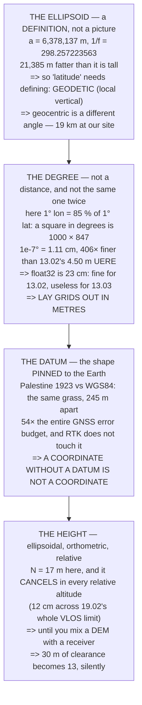

# FGL.01 Earth coordinates and datums: what a latitude really is

<!-- glance:start -->
<!-- generated by tools/build.py from curriculum/syllabus.yaml — edit the syllabus, not this block -->

| | |
|---|---|
| **Track** | Optional foundation |
| **Difficulty** | Beginner |
| **Time** | 1 h |
| **Hardware** | none |
| **Software** | python |
| **Prerequisites** | none |
| **Skip if** | You can explain why two datums disagree by hundreds of metres and which height your altimeter reports. |

<!-- glance:end -->

## What you will learn

- That the Earth is **21,385 m fatter across the equator than through the poles**, and that
  "latitude" is therefore an angle you have to *define* before it means anything
- That there are two honest definitions of latitude and they disagree by **19 km of ground** at our
  site — which is the first thing to check when a conversion is wrong by something that size
- That a degree of longitude here is **85 % of a degree of latitude**, so a square in degrees is a
  1000 × 847 rectangle on the ground
- That `1e-7` degrees is **1.11 cm** — **406× finer than [13.02](../../13-navigation-gnss/13.02-error-sources.md)'s
  4.50 m error budget** — and that **float32 is 23 cm**: invisible to 13.02, useless to
  [13.03](../../13-navigation-gnss/13.03-rtk-and-ppk.md)
- What a **datum** is, and why the wrong one is **245 m** of perfectly repeatable error — **54× the
  entire GNSS budget**
- That GNSS reports **ellipsoidal** height, maps report **orthometric**, and here they differ by
  **17 m**
- And the one case where those 17 m reach the aircraft: **a DEM mixed with a receiver**, which turns
  30 m of clearance into 13

## Why it matters

[13.01](../../13-navigation-gnss/13.01-gnss-fundamentals.md) opens with two constants and a
coordinate conversion, and assumes you know what they mean. This lesson is that assumption, and it
takes an hour.

It matters for a practical reason too. Almost every hard bug in navigation software is one of four
things: the wrong latitude definition, degrees treated as metres, the wrong datum, or the wrong
height. Each produces a beautifully consistent, entirely wrong answer, and each has a signature size
— 19 km, a 15 % rectangle, 245 m, 17 m. Learn the four sizes and you will recognise the bug from the
error alone.

And one of them is a safety item rather than a software one. Mix a terrain database with a GNSS
height, and 30 metres of planned clearance becomes 13 with nothing on any screen to say so.

## Prerequisites

<!-- prereqs:start -->
## Prerequisites

None — you can start here.

### Optional prerequisite links

None.

Check your readiness: `python course.py why FGL.01`
<!-- prereqs:end -->

## Concept

A coordinate is not a measurement of the world. It is a measurement **against a model** of the
world, and the model has to be agreed in advance by everyone who will ever read the number.

There are three layers to that agreement, and people collapse them into one word:

1. **The ellipsoid** — the shape. WGS84 says the Earth is a specific squashed sphere, `a` =
   6,378,137 m exactly, flattening 1/298.257223563. That is a definition, not an observation.
2. **The datum** — where that shape is *pinned*. Same shape, different pin, every coordinate on
   Earth changes by hundreds of metres while nothing physical moves.
3. **The height reference** — the ellipsoid is smooth and the sea is not, so "altitude" means two
   different surfaces depending on who is speaking.

A drone operator can ignore almost all of this almost all of the time, because the flight controller
works in *relative* altitude and *one* datum. This lesson is about the moments when that stops being
true, and each of them arrives from outside the aircraft: a client's coordinates, an old map, a
terrain database.

## Technical explanation

### Level 1 — what a latitude actually is

| | |
|---|---|
| equatorial radius `a` | 6,378,137.0 m |
| polar radius `b` | 6,356,752.3 m |
| **the difference** | **21,384.7 m** |
| flattening 1/f | 298.257223563 |

On a sphere, latitude is obvious: the angle at the centre. On an ellipsoid there are two honest
answers, because **the local vertical does not point at the centre of the Earth**:

- **geocentric** — the angle at the centre
- **geodetic** — the angle of the local vertical, which way is *down* where you are standing

| geodetic | geocentric | difference | on the ground |
|---|---|---|---|
| 0.0 | 0.0000 | 0.0000 | 0 m |
| 15.0 | 14.9041 | 0.0959 | 10,615 m |
| 31.0 | 30.8304 | 0.1696 | 18,807 m |
| **32.5** | **32.3259** | **0.1741** | **19,312 m** |
| 45.0 | 44.8076 | **0.1924** | **21,384 m** |
| 60.0 | 59.8331 | 0.1669 | 18,597 m |
| 90.0 | 90.0000 | 0.0000 | 0 m |

The two definitions disagree by up to **0.19°**, at 45° of latitude, which is **21 km of ground**. At
our site it is **19 km**.

**Every latitude you will ever see is geodetic** — your receiver, your map, your flight controller,
13.01's solver. Geocentric latitude lives inside orbital mechanics, and its only practical relevance
to you is as a diagnosis: **a conversion that is wrong by about twenty kilometres has confused the
two.**

### Level 2 — a degree is not a distance, and not the same one twice

| latitude | 1° lat (m) | 1° lon (m) | lon/lat |
|---|---|---|---|
| 0.0 | 110,574.3 | 111,319.5 | 1.007 |
| 15.0 | 110,648.7 | 107,550.5 | 0.972 |
| **32.5** | **110,895.6** | **93,976.8** | **0.847** |
| 45.0 | 111,131.8 | 78,846.8 | 0.709 |
| 60.0 | 111,412.3 | 55,800.0 | 0.501 |
| 75.0 | 111,618.4 | 28,902.0 | 0.259 |

**At our site a degree of longitude is 85 % of a degree of latitude.** A square in degrees is a
**1000 × 847 rectangle** on the ground — which is why [18.01](../../18-civil-ops/18.01-uav-missions.md)'s
survey grids are laid out in metres and never in degrees.

Latitude is not constant either: it grows **1,120 m** from the equator to the pole, because the
ellipsoid is flatter there.

| decimals | latitude | longitude |
|---|---|---|
| 3 | 110.8956 m | 93.9768 m |
| 4 | 11.0896 m | 9.3977 m |
| 5 | 1.1090 m | 0.9398 m |
| 6 | 0.1109 m | 0.0940 m |
| **7** | **0.0111 m** | **0.0094 m** |
| 8 | 0.0011 m | 0.0009 m |

A MAVLink position is an **integer of 1e-7 degrees** — **1.11 cm** of latitude. 13.02's whole error
budget, the UERE, is **4.50 m**. So **the format is 406 times finer than the measurement**, and
every digit past the fifth decimal is carrying noise rather than information.

Which answers the storage question too:

| | resolution | on the ground |
|---|---|---|
| float32 | 2.05e-06° | **0.227 m** |
| float64 | 4.09e-15° | 0.5 nm |
| int × 1e-7° | 1.00e-07° | 0.0111 m |

**float32 is 23 centimetres** — invisible against 13.02's 4.50 m, and **fatal to 13.03's RTK
centimetres**, where it is **11× the entire error you paid for**. The format is a decision about
which lesson you are in, and since the aircraft carries both, ArduPilot and MAVLink chose the
integer.

### Level 3 — datums: why two latitudes disagree by hundreds of metres

An ellipsoid is a shape. A **datum** is that shape *pinned* to the Earth — its centre, its
orientation, its scale. Change the pin and every coordinate changes while every physical thing stays
exactly where it was.

Before satellites, each country pinned its own ellipsoid to fit its own territory well, because
nobody could measure the Earth's centre of mass. WGS84 can, so it is **geocentric**.

| | |
|---|---|
| WGS84 `a` | 6,378,137.0 m |
| Clarke 1880 (Benoit) `a` **[S]** | 6,378,300.8 m |
| **the ellipsoids differ by** | **163.8 m** |
| and the datums' centres differ by **[S]** | dX −275.72, dY +94.78, dZ +340.89 m |
| **total** | **448.57 m** |

Take our site's WGS84 coordinate and ask what the old survey called the very same patch of grass:

| | latitude | longitude |
|---|---|---|
| WGS84 (your receiver) | 32.5000000 | 35.4000000 |
| Palestine 1923 **[S]** | 32.4994381 | 35.3974784 |
| difference | −0.0005619° | −0.0025216° |
| **difference (m)** | **−62.3 m** | **−237.0 m** |

**The same patch of grass, 245 metres apart.**

| | |
|---|---|
| that shift | 245 m |
| 13.02's whole error budget | 4.50 m |
| **the datum error is** | **54×** |

**A datum error is not a big version of a GNSS error. It is a different category:** perfectly
precise, perfectly repeatable, perfectly wrong, and no amount of averaging or RTK touches it. 13.03's
centimetres are centimetres *from a datum*.

Three places it reaches a drone operator:

- a scanned or old paper map, or a cadastral plot boundary
- a national grid — Israel's ITM is on GRS80, which agrees with WGS84 to centimetres, but the older
  ICS grid does not **[S]**
- anything a client sends you as "coordinates" with no datum named, which is most things

> **A coordinate without a datum is not a coordinate.** Ask. It costs one email and it is worth 245
> metres.

> [!TIP]
> **Ask your teacher:** "What datum is this in?" — about any coordinate anyone hands you. The
> interesting part is how often nobody knows, and the honest follow-up is "how would we find out?"
> For anything recorded after about 2000 the answer is almost always WGS84, and *almost* is doing a
> lot of work in that sentence.

### Level 4 — which height, and does it reach the aircraft?

Three heights, one word:

- **ellipsoidal** — above the WGS84 ellipsoid. What a GNSS receiver actually computes.
- **orthometric** — above the **geoid**, the surface water would settle on. What maps, DEMs and
  "altitude" normally mean.
- **relative** — above the point you took off from. What the flight controller flies.

The geoid is lumpy because the Earth's mass is lumpy, and here it sits about **17 m above** the
ellipsoid **[S]**:

| | |
|---|---|
| GNSS says (ellipsoidal) | 380.0 m |
| geoid separation N **[S]** | 17.0 m |
| the map says (orthometric) | 363.0 m |

**17 metres of disagreement, and both numbers are right.**

| | N cancels? | error |
|---|---|---|
| takeoff-relative altitude | yes | 0.0 m |
| a fence ceiling at 120 m AGL | yes | 0.0 m |
| [12.05](../../12-autonomous-flight/12.05-auto-takeoff-land-precision.md)'s RTL altitude | yes | 0.0 m |
| **terrain following from a DEM** | **NO** | **17.0 m** |
| **a client's "fly at 250 m AMSL"** | **NO** | **17.0 m** |
| [18.04](../../18-civil-ops/18.04-airspace-in-operations.md)'s 400 ft grid square | yes | 0.0 m |

It cancels almost everywhere, because the flight controller subtracts the home height from the
current height and N is the same at both ends. Across a whole site it barely moves at all:

| site | geoid change |
|---|---|
| 100 m across | 0.005 m |
| 500 m across | 0.025 m |
| 1,000 m across | 0.050 m |
| 2,420 m across | 0.121 m |

Even across 19.02's 2,420 m VLOS limit the geoid moves **12 cm**, against 13.02's vertical error of
roughly 7 m — **58 times smaller than the thing it hides behind**.

**But it does not cancel between two databases.** A DEM is orthometric and a receiver is ellipsoidal:

| | |
|---|---|
| intended clearance above terrain | 30.0 m |
| N, applied in the wrong direction | 17.0 m |
| **actual clearance** | **13.0 m** |
| of what you asked for | **43 %** |

**13 m of clearance instead of 30, on a number nobody mentioned.** That is the whole risk in this
lesson, and it is why [05.05](../../05-sensors/05.05-flow-and-rangefinders.md)'s rangefinder exists:
**a rangefinder measures the ground, and the ground has no datum.**

## Diagram



## Code

Each of the four in turn, derived rather than asserted: geodetic against geocentric latitude on the
real ellipsoid, metres per degree from the two radii of curvature, a three-parameter datum shift done
properly through ECEF, and the geoid separation followed through every altitude the aircraft actually
uses.

```python
"""FGL.01 -- what a latitude really is: the ellipsoid, the datum, the geoid.

Pure stdlib. A foundation lesson for 13.01, which assumes all of this
and gets straight to pseudoranges.
"""

import math

BAR = "=" * 70

# WGS84, exactly as 13.01 defines it
A = 6378137.0
INV_F = 298.257223563
F = 1.0 / INV_F
E2 = F * (2.0 - F)
B = A * (1.0 - F)

SITE_LAT = 32.5           # the Israeli field the course flies from
SITE_LON = 35.4
AGL = 120.0               # 18.04's ceiling


def head(n, title):
    print()
    print(BAR)
    print("%d. %s" % (n, title))
    print(BAR)
    print()


def geodetic_to_ecef(lat_deg, lon_deg, h, a=A, e2=E2):
    la, lo = math.radians(lat_deg), math.radians(lon_deg)
    n = a / math.sqrt(1.0 - e2 * math.sin(la) ** 2)
    x = (n + h) * math.cos(la) * math.cos(lo)
    y = (n + h) * math.cos(la) * math.sin(lo)
    z = (n * (1.0 - e2) + h) * math.sin(la)
    return x, y, z


def ecef_to_geodetic(x, y, z, a=A, e2=E2):
    """Bowring's method, two iterations is plenty at these scales."""
    lo = math.atan2(y, x)
    p = math.hypot(x, y)
    la = math.atan2(z, p * (1.0 - e2))
    for _ in range(8):
        n = a / math.sqrt(1.0 - e2 * math.sin(la) ** 2)
        h = p / math.cos(la) - n
        la = math.atan2(z, p * (1.0 - e2 * n / (n + h)))
    n = a / math.sqrt(1.0 - e2 * math.sin(la) ** 2)
    h = p / math.cos(la) - n
    return math.degrees(la), math.degrees(lo), h


def m_per_deg_lat(lat_deg, a=A, e2=E2):
    la = math.radians(lat_deg)
    m = a * (1.0 - e2) / (1.0 - e2 * math.sin(la) ** 2) ** 1.5
    return m * math.pi / 180.0


def m_per_deg_lon(lat_deg, a=A, e2=E2):
    la = math.radians(lat_deg)
    n = a / math.sqrt(1.0 - e2 * math.sin(la) ** 2)
    return n * math.cos(la) * math.pi / 180.0


# ======================================================================
head(1, "WHAT A LATITUDE ACTUALLY IS")

print("  The Earth is not a sphere. It is 21 km fatter across the")
print("  equator than through the poles, because it spins:")
print()
print("  %-38s %14.1f m" % ("equatorial radius a", A))
print("  %-38s %14.1f m" % ("polar radius b", B))
print("  %-38s %14.1f m" % ("  the difference", A - B))
print("  %-38s %14.1f" % ("flattening 1/f", INV_F))
print()
print("  Those are WGS84's numbers -- the SAME two constants 13.01's")
print("  solver opens with. An ellipsoid is not a picture of the Earth;")
print("  it is a DEFINITION that lets a number mean something.")
print()
print("  And on an ellipsoid there are two honest ways to say")
print("  'latitude', and they are NOT the same angle:")
print()
print("    GEOCENTRIC  the angle at the centre of the Earth")
print("    GEODETIC    the angle of the LOCAL VERTICAL -- which way is")
print("                down where you are standing")
print()
print("  %-14s %14s %14s %14s" % ("geodetic", "geocentric", "difference",
                                  "on the ground"))
worst = (0.0, 0.0)
for lat in (0.0, 15.0, 31.0, SITE_LAT, 45.0, 60.0, 75.0, 90.0):
    gc = math.degrees(math.atan((1.0 - E2) * math.tan(math.radians(lat))))
    d = lat - gc
    metres = d * m_per_deg_lat(lat)
    if d > worst[1]:
        worst = (lat, d)
    print("  %-12.1f %14.4f %14.4f %13.0f m" % (lat, gc, d, metres))

print()
print("  THE TWO DEFINITIONS DISAGREE BY UP TO %.2f DEGREES, at %.0f"
      % (worst[1], worst[0]))
print("  degrees of latitude -- which is %.0f km of ground."
      % (worst[1] * m_per_deg_lat(worst[0]) / 1000.0))
d_site = SITE_LAT - math.degrees(
    math.atan((1.0 - E2) * math.tan(math.radians(SITE_LAT))))
print("  At our site it is %.0f km." % (d_site * m_per_deg_lat(SITE_LAT)
                                        / 1000.0))
print()
print("  EVERY LATITUDE YOU WILL EVER SEE IS GEODETIC -- your receiver,")
print("  your map, your flight controller, 13.01's solver. Geocentric")
print("  latitude appears only inside orbital mechanics, and it is the")
print("  first thing to check if a conversion you wrote is out by")
print("  something like twenty kilometres.")

# ======================================================================
head(2, "A DEGREE IS NOT A DISTANCE (AND NOT THE SAME ONE TWICE)")

print("  A degree of latitude and a degree of longitude are different")
print("  lengths everywhere except the equator, and neither is constant:")
print()
print("  %-12s %16s %16s %12s" % ("latitude", "1 deg lat (m)",
                                  "1 deg lon (m)", "lon/lat"))
for lat in (0.0, 15.0, 31.0, SITE_LAT, 45.0, 60.0, 75.0):
    dlat, dlon = m_per_deg_lat(lat), m_per_deg_lon(lat)
    print("  %-10.1f %16.1f %16.1f %12.3f"
          % (lat, dlat, dlon, dlon / dlat))

DLAT, DLON = m_per_deg_lat(SITE_LAT), m_per_deg_lon(SITE_LAT)
print()
print("  AT OUR SITE A DEGREE OF LONGITUDE IS %.0f PER CENT OF A DEGREE"
      % (DLON / DLAT * 100))
print("  OF LATITUDE. So a square in degrees is a %.0f x %.0f rectangle"
      % (1000, 1000 * DLON / DLAT))
print("  on the ground, and a survey grid laid out in degrees is not")
print("  square -- which is why 18.01's grids are in METRES.")
print()
print("  And latitude itself is not constant: it grows %.0f m from the"
      % (m_per_deg_lat(90.0) - m_per_deg_lat(0.0)))
print("  equator to the pole, because the ellipsoid is flatter there.")
print()
print("  THE PRACTICAL VERSION -- what a decimal place is worth here:")
print()
print("  %-16s %16s %16s" % ("decimals", "latitude", "longitude"))
for n in range(3, 9):
    step = 10.0 ** (-n)
    print("  %-14d %14.4f m %14.4f m" % (n, step * DLAT, step * DLON))

print()
print("  A MAVLink position is an INTEGER OF 1e-7 DEGREES, which is")
print("  %.2f cm of latitude. 13.02's total error budget -- the UERE --"
      % (1e-7 * DLAT * 100))
print("  is 4.50 m. So THE FORMAT IS %.0f TIMES FINER THAN THE"
      % (4.50 / (1e-7 * DLAT)))
print("  MEASUREMENT, and every digit after the fifth decimal place is")
print("  carrying noise, not information.")
print()
print("  Which is also the answer to 'can I store a position as a")
print("  32-bit float?' A float32 has ~7 significant digits, and a")
print("  latitude of 32.5 already spends two of them:")
print()
f32 = 10.0 ** (math.log10(SITE_LAT) - 7.2)
f64 = 10.0 ** (math.log10(SITE_LAT) - 15.9)
print("  %-16s %16s %16s" % ("", "resolution", "on the ground"))
print("  %-16s %13.2e deg %13.3f m" % ("float32", f32, f32 * DLAT))
print("  %-16s %13.2e deg %13.1f nm" % ("float64", f64, f64 * DLAT * 1e9))
print("  %-16s %13.2e deg %13.4f m" % ("int * 1e-7 deg", 1e-7,
                                       1e-7 * DLAT))
print()
print("  FLOAT32 IS %.0f CENTIMETRES. Which is INVISIBLE against"
      % (f32 * DLAT * 100))
print("  13.02's 4.50 m UERE -- and FATAL to 13.03's RTK centimetres,")
print("  where it is %.0f x the entire error you paid for."
      % (f32 * DLAT / 0.02))
print()
print("  SO THE FORMAT IS A DECISION ABOUT WHICH LESSON YOU ARE IN,")
print("  and since the aircraft carries both, ArduPilot and MAVLink")
print("  chose the integer: 1e-7 degrees, %.2f cm, no rounding at all."
      % (1e-7 * DLAT * 100))

# ======================================================================
head(3, "DATUMS: WHY TWO LATITUDES DISAGREE BY HUNDREDS OF METRES")

print("  An ellipsoid is a shape. A DATUM is that shape PINNED to the")
print("  Earth -- its centre, its orientation, its scale. Change the")
print("  pin and every coordinate changes, while every physical thing")
print("  stays exactly where it was.")
print()
print("  Before satellites, each country pinned its own ellipsoid to")
print("  fit its own territory well, and nobody could measure the")
print("  Earth's centre of mass. WGS84 can, so it is GEOCENTRIC.")
print()

# Palestine 1923 / Clarke 1880 (Benoit) -> WGS84, EPSG-published
# 3-parameter Helmert [S] -- the magnitude is the point, not the
# last digit. Look the pair up before using it for real work.
CLARKE_A = 6378300.789
CLARKE_B = 6356566.435
CLARKE_F = (CLARKE_A - CLARKE_B) / CLARKE_A
CLARKE_E2 = CLARKE_F * (2.0 - CLARKE_F)
DX, DY, DZ = -275.7224, 94.7824, 340.8944     # [S]

print("  %-38s %14.1f m" % ("WGS84 a", A))
print("  %-38s %14.1f m" % ("Clarke 1880 (Benoit) a [S]", CLARKE_A))
print("  %-38s %14.1f m" % ("  the ellipsoids differ by", CLARKE_A - A))
print()
print("  and the two datums' CENTRES differ by [S]:")
print("  %-38s %14.2f m" % ("  dX", DX))
print("  %-38s %14.2f m" % ("  dY", DY))
print("  %-38s %14.2f m" % ("  dZ", DZ))
print("  %-38s %14.2f m"
      % ("  total", math.sqrt(DX * DX + DY * DY + DZ * DZ)))
print()
print("  Take our site's WGS84 coordinate and ask what the OLD survey")
print("  called the very same patch of grass:")
print()

x, y, z = geodetic_to_ecef(SITE_LAT, SITE_LON, 0.0)
# WGS84 -> local datum is the reverse of the published direction
ox, oy, oz = x - DX, y - DY, z - DZ
olat, olon, oh = ecef_to_geodetic(ox, oy, oz, CLARKE_A, CLARKE_E2)

print("  %-24s %14s %16s" % ("", "latitude", "longitude"))
print("  %-24s %14.7f %16.7f" % ("WGS84 (your receiver)", SITE_LAT,
                                 SITE_LON))
print("  %-24s %14.7f %16.7f" % ("Palestine 1923 [S]", olat, olon))
print("  %-24s %14.7f %16.7f" % ("  difference (deg)", olat - SITE_LAT,
                                 olon - SITE_LON))
dn = (olat - SITE_LAT) * DLAT
de = (olon - SITE_LON) * DLON
print("  %-24s %12.1f m %14.1f m" % ("  difference (m)", dn, de))
print()
print("  THE SAME PATCH OF GRASS, %.0f METRES APART." % math.hypot(dn, de))
print()
print("  %-38s %14.0f m" % ("that shift", math.hypot(dn, de)))
print("  %-38s %14.2f m" % ("13.02's whole error budget (UERE)", 4.50))
print("  %-38s %14.0f x" % ("  the datum error is", math.hypot(dn, de)
                            / 4.50))
print()
print("  A DATUM ERROR IS NOT A BIG VERSION OF A GNSS ERROR. It is a")
print("  DIFFERENT CATEGORY: perfectly precise, perfectly repeatable,")
print("  perfectly wrong, and no amount of averaging or RTK touches it.")
print("  13.03's centimetres are centimetres FROM A DATUM.")
print()
print("  THE THREE PLACES IT BITES A DRONE OPERATOR:")
print("    * a scanned or old paper map, or a cadastral plot boundary")
print("    * a national grid (Israel's ITM is on GRS80, which agrees")
print("      with WGS84 to centimetres -- but the older ICS grid does")
print("      not)")
print("    * anything a client sends you as 'coordinates' with no datum")
print("      named, which is most things")
print()
print("  THE RULE: A COORDINATE WITHOUT A DATUM IS NOT A COORDINATE.")
print("  Ask. It costs one email and it is worth %.0f metres."
      % math.hypot(dn, de))

# ======================================================================
head(4, "WHICH HEIGHT? THE ELLIPSOID, THE GEOID, AND WHAT THE DRONE USES")

N_GEOID = 17.0        # [S] geoid-ellipsoid separation, northern Israel
N_GRAD = 0.05         # [E] m per km of geoid slope, gentle in this region

print("  There are three heights and people use one word for all of")
print("  them:")
print()
print("    ELLIPSOIDAL   height above the WGS84 ellipsoid. This is what")
print("                  a GNSS receiver actually computes.")
print("    ORTHOMETRIC   height above the GEOID -- mean sea level, the")
print("                  surface water would settle on. This is what")
print("                  maps, DEMs and 'altitude' normally mean.")
print("    RELATIVE      height above the point you took off from.")
print("                  This is what the flight controller flies.")
print()
print("  The geoid is lumpy because the Earth's mass is lumpy, and it")
print("  sits %.0f m ABOVE the ellipsoid here [S]:" % N_GEOID)
print()
print("  %-38s %14.1f m" % ("GNSS says (ellipsoidal)", 380.0))
print("  %-38s %14.1f m" % ("geoid separation N [S]", N_GEOID))
print("  %-38s %14.1f m" % ("the map says (orthometric)", 380.0 - N_GEOID))
print()
print("  %.0f METRES OF DISAGREEMENT, AND BOTH NUMBERS ARE RIGHT."
      % N_GEOID)
print()
print("  NOW THE PART THAT MATTERS: DOES IT REACH THE AIRCRAFT?")
print()
print("  %-34s %14s %14s" % ("", "N cancels?", "error (m)"))
rows = (
    ("takeoff-relative altitude", True, 0.0),
    ("a fence ceiling at %.0f m AGL" % AGL, True, 0.0),
    ("12.05's RTL altitude", True, 0.0),
    ("terrain following from a DEM", False, N_GEOID),
    ("a client's 'fly at 250 m AMSL'", False, N_GEOID),
    ("18.04's 400 ft grid square", True, 0.0),
)
for what, cancels, err in rows:
    print("  %-34s %14s %14.1f" % (what, "yes" if cancels else "NO", err))

print()
print("  IT CANCELS ALMOST EVERYWHERE, because the flight controller")
print("  subtracts the HOME height from the current height and N is")
print("  the same at both ends. Over a whole survey site:")
print()
for site_m in (100.0, 500.0, 1000.0, 2420.0):
    print("  %-30s %14.3f m" % ("%.0f m across" % site_m,
                                site_m / 1000.0 * N_GRAD))
print()
print("  Even across 19.02's %.0f m VLOS limit the geoid moves %.0f cm,"
      % (2420.0, 2420.0 / 1000.0 * N_GRAD * 100))
print("  against 13.02's vertical error of roughly 7 m. THE GEOID IS")
print("  %.0f TIMES SMALLER THAN THE THING IT HIDES BEHIND."
      % (7.0 / (2420.0 / 1000.0 * N_GRAD)))
print()
print("  BUT IT DOES NOT CANCEL BETWEEN TWO DATABASES. A DEM is")
print("  orthometric and a receiver is ellipsoidal, and if you subtract")
print("  one from the other you get:")
print()
print("  %-38s %14.1f m" % ("intended clearance above terrain", 30.0))
print("  %-38s %14.1f m" % ("N, applied in the wrong direction", N_GEOID))
print("  %-38s %14.1f m" % ("  actual clearance", 30.0 - N_GEOID))
print("  %-38s %14.0f %%" % ("  of what you asked for",
                             (30.0 - N_GEOID) / 30.0 * 100))
print()
print("  %.0f m OF CLEARANCE INSTEAD OF %.0f, ON A NUMBER NOBODY"
      % (30.0 - N_GEOID, 30.0))
print("  MENTIONED. That is the whole risk in this lesson, and it is")
print("  why 05.05's rangefinder exists: a rangefinder measures the")
print("  ground, and the ground has no datum.")

# ======================================================================
print()
print(BAR)
print("THE FOUR THINGS TO CARRY FORWARD")
print(BAR)
print()
print("  1. A latitude is an angle to the LOCAL VERTICAL on a defined")
print("     ellipsoid. Geocentric latitude is a different angle and")
print("     %.0f km away at our site." % (d_site * DLAT / 1000.0))
print("  2. A degree of longitude is %.0f %% of a degree of latitude"
      % (DLON / DLAT * 100))
print("     here, so lay grids out in METRES. 1e-7 deg is %.2f cm --"
      % (1e-7 * DLAT * 100))
print("     %.0f x finer than 13.02's 4.50 m UERE. FLOAT32 IS %.0f cm:"
      % (4.50 / (1e-7 * DLAT), f32 * DLAT * 100))
print("     fine for 13.02, useless for 13.03.")
print("  3. A DATUM is the ellipsoid PINNED to the Earth. The wrong one")
print("     is %.0f m of perfectly repeatable error -- %.0f x the whole"
      % (math.hypot(dn, de), math.hypot(dn, de) / 4.50))
print("     GNSS budget. A COORDINATE WITHOUT A DATUM IS NOT A")
print("     COORDINATE.")
print("  4. GNSS gives ELLIPSOIDAL height, maps give ORTHOMETRIC, and")
print("     the %.0f m between them CANCELS in every relative altitude"
      % N_GEOID)
print("     the aircraft flies -- and does NOT cancel the moment you")
print("     mix a DEM with a receiver.")
```

Output:

```text

======================================================================
1. WHAT A LATITUDE ACTUALLY IS
======================================================================

  The Earth is not a sphere. It is 21 km fatter across the
  equator than through the poles, because it spins:

  equatorial radius a                         6378137.0 m
  polar radius b                              6356752.3 m
    the difference                              21384.7 m
  flattening 1/f                                  298.3

  Those are WGS84's numbers -- the SAME two constants 13.01's
  solver opens with. An ellipsoid is not a picture of the Earth;
  it is a DEFINITION that lets a number mean something.

  And on an ellipsoid there are two honest ways to say
  'latitude', and they are NOT the same angle:

    GEOCENTRIC  the angle at the centre of the Earth
    GEODETIC    the angle of the LOCAL VERTICAL -- which way is
                down where you are standing

  geodetic           geocentric     difference  on the ground
  0.0                  0.0000         0.0000             0 m
  15.0                14.9041         0.0959         10615 m
  31.0                30.8304         0.1696         18807 m
  32.5                32.3259         0.1741         19312 m
  45.0                44.8076         0.1924         21384 m
  60.0                59.8331         0.1669         18597 m
  75.0                74.9035         0.0965         10770 m
  90.0                90.0000         0.0000             0 m

  THE TWO DEFINITIONS DISAGREE BY UP TO 0.19 DEGREES, at 45
  degrees of latitude -- which is 21 km of ground.
  At our site it is 19 km.

  EVERY LATITUDE YOU WILL EVER SEE IS GEODETIC -- your receiver,
  your map, your flight controller, 13.01's solver. Geocentric
  latitude appears only inside orbital mechanics, and it is the
  first thing to check if a conversion you wrote is out by
  something like twenty kilometres.

======================================================================
2. A DEGREE IS NOT A DISTANCE (AND NOT THE SAME ONE TWICE)
======================================================================

  A degree of latitude and a degree of longitude are different
  lengths everywhere except the equator, and neither is constant:

  latitude        1 deg lat (m)    1 deg lon (m)      lon/lat
  0.0                110574.3         111319.5        1.007
  15.0               110648.7         107550.5        0.972
  31.0               110869.5          95504.3        0.861
  32.5               110895.6          93976.8        0.847
  45.0               111131.8          78846.8        0.709
  60.0               111412.3          55800.0        0.501
  75.0               111618.4          28902.0        0.259

  AT OUR SITE A DEGREE OF LONGITUDE IS 85 PER CENT OF A DEGREE
  OF LATITUDE. So a square in degrees is a 1000 x 847 rectangle
  on the ground, and a survey grid laid out in degrees is not
  square -- which is why 18.01's grids are in METRES.

  And latitude itself is not constant: it grows 1120 m from the
  equator to the pole, because the ellipsoid is flatter there.

  THE PRACTICAL VERSION -- what a decimal place is worth here:

  decimals                 latitude        longitude
  3                    110.8956 m        93.9768 m
  4                     11.0896 m         9.3977 m
  5                      1.1090 m         0.9398 m
  6                      0.1109 m         0.0940 m
  7                      0.0111 m         0.0094 m
  8                      0.0011 m         0.0009 m

  A MAVLink position is an INTEGER OF 1e-7 DEGREES, which is
  1.11 cm of latitude. 13.02's total error budget -- the UERE --
  is 4.50 m. So THE FORMAT IS 406 TIMES FINER THAN THE
  MEASUREMENT, and every digit after the fifth decimal place is
  carrying noise, not information.

  Which is also the answer to 'can I store a position as a
  32-bit float?' A float32 has ~7 significant digits, and a
  latitude of 32.5 already spends two of them:

                         resolution    on the ground
  float32               2.05e-06 deg         0.227 m
  float64               4.09e-15 deg           0.5 nm
  int * 1e-7 deg        1.00e-07 deg        0.0111 m

  FLOAT32 IS 23 CENTIMETRES. Which is INVISIBLE against
  13.02's 4.50 m UERE -- and FATAL to 13.03's RTK centimetres,
  where it is 11 x the entire error you paid for.

  SO THE FORMAT IS A DECISION ABOUT WHICH LESSON YOU ARE IN,
  and since the aircraft carries both, ArduPilot and MAVLink
  chose the integer: 1e-7 degrees, 1.11 cm, no rounding at all.

======================================================================
3. DATUMS: WHY TWO LATITUDES DISAGREE BY HUNDREDS OF METRES
======================================================================

  An ellipsoid is a shape. A DATUM is that shape PINNED to the
  Earth -- its centre, its orientation, its scale. Change the
  pin and every coordinate changes, while every physical thing
  stays exactly where it was.

  Before satellites, each country pinned its own ellipsoid to
  fit its own territory well, and nobody could measure the
  Earth's centre of mass. WGS84 can, so it is GEOCENTRIC.

  WGS84 a                                     6378137.0 m
  Clarke 1880 (Benoit) a [S]                  6378300.8 m
    the ellipsoids differ by                      163.8 m

  and the two datums' CENTRES differ by [S]:
    dX                                          -275.72 m
    dY                                            94.78 m
    dZ                                           340.89 m
    total                                        448.57 m

  Take our site's WGS84 coordinate and ask what the OLD survey
  called the very same patch of grass:

                                 latitude        longitude
  WGS84 (your receiver)        32.5000000       35.4000000
  Palestine 1923 [S]           32.4994381       35.3974784
    difference (deg)           -0.0005619       -0.0025216
    difference (m)                -62.3 m         -237.0 m

  THE SAME PATCH OF GRASS, 245 METRES APART.

  that shift                                        245 m
  13.02's whole error budget (UERE)                4.50 m
    the datum error is                               54 x

  A DATUM ERROR IS NOT A BIG VERSION OF A GNSS ERROR. It is a
  DIFFERENT CATEGORY: perfectly precise, perfectly repeatable,
  perfectly wrong, and no amount of averaging or RTK touches it.
  13.03's centimetres are centimetres FROM A DATUM.

  THE THREE PLACES IT BITES A DRONE OPERATOR:
    * a scanned or old paper map, or a cadastral plot boundary
    * a national grid (Israel's ITM is on GRS80, which agrees
      with WGS84 to centimetres -- but the older ICS grid does
      not)
    * anything a client sends you as 'coordinates' with no datum
      named, which is most things

  THE RULE: A COORDINATE WITHOUT A DATUM IS NOT A COORDINATE.
  Ask. It costs one email and it is worth 245 metres.

======================================================================
4. WHICH HEIGHT? THE ELLIPSOID, THE GEOID, AND WHAT THE DRONE USES
======================================================================

  There are three heights and people use one word for all of
  them:

    ELLIPSOIDAL   height above the WGS84 ellipsoid. This is what
                  a GNSS receiver actually computes.
    ORTHOMETRIC   height above the GEOID -- mean sea level, the
                  surface water would settle on. This is what
                  maps, DEMs and 'altitude' normally mean.
    RELATIVE      height above the point you took off from.
                  This is what the flight controller flies.

  The geoid is lumpy because the Earth's mass is lumpy, and it
  sits 17 m ABOVE the ellipsoid here [S]:

  GNSS says (ellipsoidal)                         380.0 m
  geoid separation N [S]                           17.0 m
  the map says (orthometric)                      363.0 m

  17 METRES OF DISAGREEMENT, AND BOTH NUMBERS ARE RIGHT.

  NOW THE PART THAT MATTERS: DOES IT REACH THE AIRCRAFT?

                                         N cancels?      error (m)
  takeoff-relative altitude                     yes            0.0
  a fence ceiling at 120 m AGL                  yes            0.0
  12.05's RTL altitude                          yes            0.0
  terrain following from a DEM                   NO           17.0
  a client's 'fly at 250 m AMSL'                 NO           17.0
  18.04's 400 ft grid square                    yes            0.0

  IT CANCELS ALMOST EVERYWHERE, because the flight controller
  subtracts the HOME height from the current height and N is
  the same at both ends. Over a whole survey site:

  100 m across                            0.005 m
  500 m across                            0.025 m
  1000 m across                           0.050 m
  2420 m across                           0.121 m

  Even across 19.02's 2420 m VLOS limit the geoid moves 12 cm,
  against 13.02's vertical error of roughly 7 m. THE GEOID IS
  58 TIMES SMALLER THAN THE THING IT HIDES BEHIND.

  BUT IT DOES NOT CANCEL BETWEEN TWO DATABASES. A DEM is
  orthometric and a receiver is ellipsoidal, and if you subtract
  one from the other you get:

  intended clearance above terrain                 30.0 m
  N, applied in the wrong direction                17.0 m
    actual clearance                               13.0 m
    of what you asked for                            43 %

  13 m OF CLEARANCE INSTEAD OF 30, ON A NUMBER NOBODY
  MENTIONED. That is the whole risk in this lesson, and it is
  why 05.05's rangefinder exists: a rangefinder measures the
  ground, and the ground has no datum.

======================================================================
THE FOUR THINGS TO CARRY FORWARD
======================================================================

  1. A latitude is an angle to the LOCAL VERTICAL on a defined
     ellipsoid. Geocentric latitude is a different angle and
     19 km away at our site.
  2. A degree of longitude is 85 % of a degree of latitude
     here, so lay grids out in METRES. 1e-7 deg is 1.11 cm --
     406 x finer than 13.02's 4.50 m UERE. FLOAT32 IS 23 cm:
     fine for 13.02, useless for 13.03.
  3. A DATUM is the ellipsoid PINNED to the Earth. The wrong one
     is 245 m of perfectly repeatable error -- 54 x the whole
     GNSS budget. A COORDINATE WITHOUT A DATUM IS NOT A
     COORDINATE.
  4. GNSS gives ELLIPSOIDAL height, maps give ORTHOMETRIC, and
     the 17 m between them CANCELS in every relative altitude
     the aircraft flies -- and does NOT cancel the moment you
     mix a DEM with a receiver.
```

## Exercise

### Exercise FGL.01-E1 — Find the twenty-kilometre bug `[analysis]`

Write a conversion that uses geocentric latitude where it should use geodetic. Measure the error at
your own latitude and confirm it matches Level 1's table.

### Exercise FGL.01-E2 — Metres per degree at your site `[analysis]`

Compute metres per degree of latitude and longitude for the field you actually fly from. Then take a
100 m × 100 m square in metres, convert it to degrees, and confirm the two side lengths differ.

### Exercise FGL.01-E3 — Shift a coordinate between datums `[analysis]`

Apply a published three-parameter shift to a coordinate near you, in both directions, and confirm you
get back where you started. Report the magnitude of the shift in metres.

### Exercise FGL.01-E4 — Find your geoid separation `[analysis]`

Look up N for your field from a geoid model, then compute what a 30 m terrain-following clearance
becomes if you apply it in the wrong direction. Write the number on your planning checklist.

## Expected result

**FGL.01-E1**: expect roughly 0.17–0.19° and 19–21 km, depending on latitude, and expect zero at the
equator and at the pole.

**FGL.01-E2**: expect the longitude side to be shorter everywhere north of the equator, by a factor
of `cos(latitude)` to within a fraction of a percent.

**FGL.01-E3**: expect a round trip accurate to millimetres, and expect the shift itself to be
somewhere between 50 m and 500 m for most historical datums.

**FGL.01-E4**: expect 15–20 m across Israel, and expect the wrong-direction answer to eat between a
third and two thirds of a typical clearance.

## Troubleshooting

**My conversion is out by about 20 km.** Level 1. Geodetic and geocentric latitude.

**It is out by about 250 m and perfectly consistent.** Level 3. Two datums.

**It is out by about 17 m, in altitude only.** Level 4. Ellipsoidal against orthometric.

**My grid is a rectangle when I wanted a square.** Level 2. You laid it out in degrees.

**The round trip through ECEF does not return the original.** The iteration in `ecef_to_geodetic` has
not converged, or you applied the shift in the published direction when you needed the reverse.

**The positions in my log all end in the same digits.** Something stored them as float32. Level 2's
0.227 m.

**Two GNSS receivers on the same mast disagree by 15 m in altitude.** Check whether one is reporting
ellipsoidal height and the other has applied a geoid model. Most receivers can do either.

## Common mistakes

- **Treating a degree as a fixed distance.** It is not, in either axis.
- **Laying out a survey grid in degrees.** 1000 × 847.
- **Accepting coordinates with no datum.** 245 m.
- **Assuming "altitude" means one thing.** It means three.
- **Applying a geoid separation to a relative altitude.** It already cancelled.
- **Mixing a DEM with a receiver height.** The one case that reaches the aircraft.
- **Storing a position as float32.** 23 cm, which matters exactly when RTK does.

## Knowledge check

<details>
<summary>What is the difference between geodetic and geocentric latitude, and how big is it?</summary>

Geodetic latitude is the angle of the **local vertical** — which way is down where you stand.
Geocentric latitude is the angle at the **centre of the Earth**. On an ellipsoid these differ,
because the local vertical does not point at the centre. The gap peaks at **0.19° at 45°**, which is
**21 km of ground**, and is **19 km at our site**. Everything you will ever read is geodetic, so the
practical value of knowing this is diagnostic: a twenty-kilometre error has this cause.
</details>

<details>
<summary>Why is a survey grid laid out in metres rather than degrees?</summary>

Because a degree of longitude is **85 % of a degree of latitude** here, so a "square" in degrees is a
**1000 × 847 m rectangle** on the ground — and the ratio changes with latitude, so the distortion is
not even constant across a large site. Metres are metres. 18.01's grids and every overlap calculation
in module 18 are in metres for this reason.
</details>

<details>
<summary>How precise is a MAVLink position, and how does that compare with the measurement?</summary>

It is an **integer of 1e-7 degrees**, which is **1.11 cm** of latitude at our site. 13.02's total
error budget — the UERE — is **4.50 m**, so **the format is 406× finer than the measurement**. Every
digit past the fifth decimal is carrying noise. That is not wasted: the format also has to serve
13.03's RTK, where centimetres are real.
</details>

<details>
<summary>What is a datum, and why can't averaging or RTK fix the wrong one?</summary>

A datum is an ellipsoid **pinned** to the Earth — centre, orientation, scale. Change the pin and
every coordinate shifts while nothing physical moves: Palestine 1923 and WGS84 describe the same
patch of grass **245 m apart**, which is **54× the whole GNSS error budget**. Averaging removes
random error and RTK removes correlated error, but a datum offset is neither — it is perfectly
precise, perfectly repeatable and perfectly wrong. RTK's centimetres are centimetres *from a datum*.
</details>

<details>
<summary>GNSS says 380 m and the map says 363 m. Which is wrong?</summary>

Neither. GNSS reports **ellipsoidal** height and the map reports **orthometric** height, and the
**geoid separation** here is about **17 m**. They are measurements against two different surfaces,
both correctly reported.
</details>

<details>
<summary>When do those 17 metres actually reach the aircraft?</summary>

Almost never, because the flight controller flies **relative** altitude — it subtracts the home
height from the current height, and N is the same at both ends. Even across 19.02's 2,420 m VLOS
limit the geoid moves **12 cm**, 58× smaller than 13.02's vertical error. It reaches the aircraft in
exactly one case: **mixing two databases**, a DEM (orthometric) with a receiver (ellipsoidal). Get
the sign wrong there and **30 m of terrain clearance becomes 13** with nothing on screen to say so.
</details>

## Practical challenge

Audit every coordinate your operation touches.

1. List every source of coordinates you use: client emails, maps, the planner, the log.
2. For each, write down the datum. Where you do not know, find out or write "unknown".
3. Compute metres per degree for your own field (E2) and put both numbers on the planning sheet.
4. Look up your geoid separation (E4) and write it next to them.
5. Find any place in your workflow where a DEM meets a GNSS height, and check the sign.
6. Check what precision your tooling stores positions at — integer, float32 or float64.
7. Write one line at the top of your planning sheet: the datum everything on this sheet is in.

Step 7 is the whole lesson. Most coordinate disasters are not arithmetic; they are two people
assuming different models and neither one saying so.

## You can skip this if

You can explain why two datums disagree by hundreds of metres and which height your altimeter
reports.

## Go deeper

- The WGS84 defining document, which is where `a` and `1/f` come from and is more readable than you
  would expect: <https://earth-info.nga.mil/index.php?dir=wgs84&action=wgs84>
- The EPSG geodetic parameter registry — every datum, ellipsoid and published transformation, and the
  place to check any of Level 3's `[S]` numbers before using them for real work:
  <https://epsg.org/home.html>
- NOAA's geoid models and online height calculator, for Level 4's N at your own field:
  <https://geodesy.noaa.gov/GEOID/>

## Progress checkpoint

You can now say what a latitude is a measurement *against*, convert a degree to metres in either axis
at any latitude, recognise a datum error by its size, and name the one case where the geoid reaches
the aircraft.

That is everything 13.01 assumes. Next, FGL.02 takes the global coordinate you now understand and
turns it into the local one the flight controller actually flies in — east, north and up, and the two
frames that disagree about which way is down.
