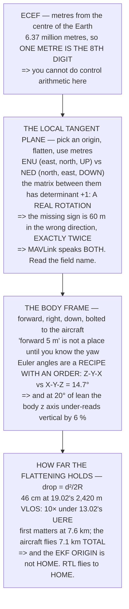

# FGL.02 Local frames: ENU, NED, and body

<!-- glance:start -->
<!-- generated by tools/build.py from curriculum/syllabus.yaml — edit the syllabus, not this block -->

| | |
|---|---|
| **Track** | Optional foundation |
| **Difficulty** | Beginner |
| **Time** | 1 h |
| **Hardware** | none |
| **Software** | python |
| **Prerequisites** | [FGL.01 Earth coordinates and datums: what a latitude really is](FGL.01-earth-coordinates-and-datums.md) |
| **Skip if** | You can convert a position between ENU, NED and body frames in code and catch a sign error by inspection. |

<!-- glance:end -->

## What you will learn

- Why local frames exist at all: in ECEF **one metre is the 8th significant digit** and a centimetre
  is the 10th
- That ENU and NED carry **identical information** separated by one sign — and that the matrix
  between them has **determinant +1**, so it is a genuine 180° rotation dressed up as a relabelling
- That getting that sign wrong is **60 m in the wrong direction**: exactly twice your intended
  altitude, every time
- That MAVLink speaks **both conventions in the same protocol**, and the field name is the only thing
  telling you which
- That "forward 5 metres" is **not a place** until you know the yaw
- That Euler angles are **a recipe with an order**: Z-Y-X against X-Y-Z is **14.7° apart** on the same
  three numbers
- That a flat Earth is wrong by **46 cm at 19.02's 2,420 m VLOS limit** — **10× smaller than
  [13.02](../../13-navigation-gnss/13.02-error-sources.md)'s 4.50 m UERE** — and first matters at
  **7.6 km**, which this aircraft cannot reach

## Why it matters

Frame errors are the most expensive class of bug in flight software, because they are not subtle and
they are not gradual. An aircraft with the wrong gain wobbles; an aircraft with the wrong sign on its
vertical axis flies into the ground at exactly the rate you asked it to climb.

They are also the easiest class to prevent, because every one of them fails a three-line test. A
round trip through the conversion, an assertion that the answer came back, and a name on every
variable saying what frame it is in. That is the whole defence, and this lesson is mostly an argument
for why it is worth writing.

There is a second payoff. Once you can move between frames confidently, a large amount of the
aircraft stops being mysterious: why the accelerometer is not an altimeter, why the EKF needs an
attitude solution before it can use an acceleration, and why ArduPilot's origin and its home point
are two different things.

## Prerequisites

<!-- prereqs:start -->
## Prerequisites

You need these first:

- [FGL.01 Earth coordinates and datums: what a latitude really is](FGL.01-earth-coordinates-and-datums.md)

### Optional prerequisite links

None.

Check your readiness: `python course.py why FGL.02`
<!-- prereqs:end -->

## Concept

There are only three frames on a drone and they answer three different questions.

**ECEF** — metres from the centre of the Earth — is where a GNSS solution is actually computed. It
is global, unambiguous and useless for control, because every quantity you care about is a difference
between two enormous numbers.

**A local tangent plane** — east, north and up from a chosen origin — is where planning and control
live. It is metres, it is flat, and it is an approximation that is excellent near the origin and
worse as you go.

**The body frame** — forward, right, down from the aircraft itself — is where sensors and actuators
live. Every accelerometer reading, every motor command and every camera pixel is born here, and has
to be rotated out before it means anything on the ground.

The work in this lesson is entirely bookkeeping: which order the axes go in, which way the third one
points, and in what order the rotations compose. None of it is difficult and all of it is
unforgiving.

## Technical explanation

### Level 1 — why a local frame at all

Our site, in ECEF:

| | |
|---|---|
| X | 4,389,032.576 m |
| Y | 3,119,123.099 m |
| Z | 3,407,323.169 m |
| distance from the centre | 6,372,000.238 m |

Now move **one metre north**:

| | before | after |
|---|---|---|
| X | 4,389,032.576 | 4,389,032.138 |
| Y | 3,119,123.099 | 3,119,122.788 |
| Z | 3,407,323.169 | 3,407,324.012 |
| **moved** | | **1.000 m** |

**One metre is the 8th significant digit**, and a centimetre is the 10th. A controller running at
400 Hz that wants to know whether it is 10 cm east of where it should be cannot ask that question in
ECEF without subtracting two six-million-metre numbers every cycle.

So: **pick an origin, flatten the Earth around it, and work in metres.** That is a local tangent
plane, and its axes are east, north and up. Everything from here is bookkeeping about which order
those three go in and which way the third one points — and that bookkeeping is where the accidents
live.

### Level 2 — ENU and NED: the same three numbers, two orders, one sign

| frame | axis 1 | axis 2 | axis 3 | used by |
|---|---|---|---|---|
| **ENU** | east | north | **UP** | ROS, maths |
| **NED** | north | east | **DOWN** | aviation, flight controllers |

The conversion is `N = n`, `E = e`, `D = −u`. It **looks** like a relabelling, and that is the trap.
Write it as a matrix and check the determinant:

```
     0      1      0
     1      0      0
     0      0     -1
```

| | |
|---|---|
| determinant | **+1** |

**It is +1, so both frames are right-handed and this is a genuine rotation** — a half turn about the
horizontal axis halfway between north and east. Which is precisely why it is dangerous: it reads
like renaming three columns, and it is a 180-degree rotation of the world.

| | 1 | 2 | 3 |
|---|---|---|---|
| a point in ENU | 12.0 | −5.0 | 30.0 |
| the same point in NED | −5.0 | 12.0 | −30.0 |

The failure mode is not subtle:

| | |
|---|---|
| you meant: up | 30.0 m |
| copied into NED as "down" | 30.0 m |
| **the aircraft goes** | **−30.0 m** |
| **total error** | **60.0 m** |

**60 metres in the wrong direction, from a missing minus sign.** There is no gradual version of this
bug and no partial failure: it is exactly twice your intended altitude, every time, and it is the
single most common frame error there is.

| where | convention |
|---|---|
| the flight controller's internals | NED |
| MAVLink `GLOBAL_POSITION_INT.relative_alt` | **UP**, millimetres |
| MAVLink `*_NED` setpoint messages | NED |
| ROS and most robotics libraries | ENU |
| a barometer, a rangefinder, your intuition | UP |

**The same protocol speaks both, and the field name is the only thing telling you which.** Read the
field name, every time.

The defence is a round trip — convert there and back and assert you got the original:

| | 1 | 2 | 3 |
|---|---|---|---|
| ENU → NED → ENU | 12.0 | −5.0 | 30.0 |
| **identical?** | | | **YES** |

Three lines, and it catches the whole class of error before it ever reaches an aircraft.

> [!TIP]
> **Ask your teacher:** "What frame is this variable in?" — about any variable in any flight-related
> code, including your own from last week. If the name does not answer the question, the name is
> wrong. `alt` is a bug; `alt_up_m` is documentation that the compiler cannot delete.

### Level 3 — the body frame: forward is not a direction

ENU and NED are fixed to the ground. The **body** frame is bolted to the aircraft: **x** forward out
of the nose, **y** right, **z** down — matching the flight controller's NED convention.

"Forward 5 metres" is not a place until you know the yaw:

| yaw | north | east |
|---|---|---|
| 0° | 5.00 | 0.00 |
| 45° | 3.54 | 3.54 |
| 90° | 0.00 | 5.00 |
| **180°** | **−5.00** | **0.00** |
| 270° | 0.00 | −5.00 |

**Same command, opposite ground track.** Which is why
[12.01](../../12-autonomous-flight/12.01-waypoints.md)'s waypoints are *positions* and not
*movements*, and why every "go forward" in a script is a bug waiting for a windy day to rotate the
aircraft.

The full rotation uses all three angles, and **the order is part of the definition**. Aerospace uses
Z-Y-X: yaw, then pitch, then roll. Do it in the other order and you get a different aircraft:

roll 20°, pitch 20°, yaw 30°, nose vector:

| | x | y | z |
|---|---|---|---|
| Z-Y-X (correct) | 0.8138 | 0.4698 | −0.3420 |
| X-Y-Z (wrong) | 0.8138 | 0.5712 | −0.1073 |
| | | | **14.7° apart** |

**14.7 degrees from the same three numbers.** Euler angles are not a vector; they are a **recipe**,
and the recipe has an order.

And the rotation is why an accelerometer is not an altimeter.
[05.02](../../05-sensors/05.02-imu.md)'s accelerometer measures in **body** axes, so when the
aircraft leans, its z axis stops pointing at the ground:

| lean | body z sees | of true vertical |
|---|---|---|
| 0° | 1.000 g | 100.0 % |
| 5° | 0.996 g | 99.6 % |
| 10° | 0.985 g | 98.5 % |
| **20°** | **0.940 g** | **94.0 %** |
| 30° | 0.866 g | 86.6 % |
| 45° | 0.707 g | 70.7 % |

At a 20° cruise lean the body z axis under-reads vertical acceleration by **6 %** — which is FA.01's
`1/cos` arriving from the other side, and exactly what the state estimator uses the attitude solution
*for*.

### Level 4 — the origin, and how far a flat Earth gets you

The Earth curves away from the tangent plane as the square of the distance: `drop = d² / 2R`.

| distance | drop | vs 13.02's 4.50 m |
|---|---|---|
| 100 m | 0.001 m | 0.0× |
| 500 m | 0.020 m | 0.0× |
| 1.0 km | 0.078 m | 0.0× |
| **2.4 km** | **0.460 m** | **0.1×** |
| 5.0 km | 1.962 m | 0.4× |
| 10.0 km | 7.848 m | 1.7× |
| 50.0 km | 196.202 m | 43.6× |

At 19.02's 2,420 m VLOS limit **the flat Earth is wrong by 46 cm — 10 times smaller than 13.02's
4.50 m UERE.**

So **inside visual line of sight, a flat Earth is free.** The curvature is not merely acceptable, it
is *invisible*: buried under an error you already have and cannot remove.

| | |
|---|---|
| curvature = 4.50 m at | **7.6 km** |
| 19.02's VLOS limit | 2.4 km |
| headroom | 3.1× |

**A multirotor cannot reach the distance at which its own flat-Earth assumption matters.** FA.03's
23.6 minutes at 5 m/s is **7.1 km of flying in total**, out and back included, against 7.6 km of
one-way distance needed.

Which leaves one real origin question: when does it move?

| origin | what breaks if it moves |
|---|---|
| home (the arm point) | every logged position |
| the EKF origin | nothing — it is set once |
| a survey corner | nothing — it is a datum |

**ArduPilot sets the EKF origin once, at the first good fix, and never moves it. Home is separate and
can move** — and [12.04](../../12-autonomous-flight/12.04-rtl-and-the-failsafe-tree.md)'s RTL flies
to **home**, not to the origin. Two points, two purposes, and confusing them is the other frame bug
that reaches the aircraft.

## Diagram



## Code

Four frames' worth of arithmetic, all derived: a one-metre move shown in ECEF digits, the ENU–NED
matrix with its determinant computed rather than asserted, a full Z-Y-X rotation compared against the
wrong order, and the tangent-plane drop against the GNSS error it hides under.

```python
"""FGL.02 -- local frames: ENU, NED and body, and the signs that bite.

Pure stdlib. A foundation lesson for 13.01 and 06.xx, both of which
assume you can move between frames without thinking about it.
"""

import math

BAR = "=" * 70

A = 6378137.0
INV_F = 298.257223563
F = 1.0 / INV_F
E2 = F * (2.0 - F)
R_MEAN = 6371000.0

SITE_LAT = 32.5
SITE_LON = 35.4
VLOS = 2420.0             # 19.02's measured VLOS limit


def head(n, title):
    print()
    print(BAR)
    print("%d. %s" % (n, title))
    print(BAR)
    print()


def ecef(lat_deg, lon_deg, h=0.0):
    la, lo = math.radians(lat_deg), math.radians(lon_deg)
    n = A / math.sqrt(1.0 - E2 * math.sin(la) ** 2)
    return ((n + h) * math.cos(la) * math.cos(lo),
            (n + h) * math.cos(la) * math.sin(lo),
            (n * (1.0 - E2) + h) * math.sin(la))


def mat3(rows):
    return rows


def mul(m, v):
    return tuple(sum(m[i][j] * v[j] for j in range(3)) for i in range(3))


def matmul(p, q):
    return tuple(tuple(sum(p[i][k] * q[k][j] for k in range(3))
                       for j in range(3)) for i in range(3))


def rx(a):
    c, s = math.cos(a), math.sin(a)
    return mat3(((1, 0, 0), (0, c, -s), (0, s, c)))


def ry(a):
    c, s = math.cos(a), math.sin(a)
    return mat3(((c, 0, s), (0, 1, 0), (-s, 0, c)))


def rz(a):
    c, s = math.cos(a), math.sin(a)
    return mat3(((c, -s, 0), (s, c, 0), (0, 0, 1)))


def ang(u, v):
    d = sum(a * b for a, b in zip(u, v))
    nu = math.sqrt(sum(a * a for a in u))
    nv = math.sqrt(sum(a * a for a in v))
    return math.degrees(math.acos(max(-1.0, min(1.0, d / (nu * nv)))))


# ======================================================================
head(1, "WHY A LOCAL FRAME AT ALL")

x, y, z = ecef(SITE_LAT, SITE_LON)
x2, y2, z2 = ecef(SITE_LAT + 1.0 / 110895.6, SITE_LON)   # one metre north

print("  FGL.01 gave you a global coordinate. Here it is in ECEF --")
print("  metres from the centre of the Earth, which is the frame every")
print("  GNSS solution is actually computed in:")
print()
for name, val in (("X", x), ("Y", y), ("Z", z)):
    print("  %-30s %20.3f m" % (name, val))
print("  %-30s %20.3f m" % ("  distance from the centre",
                            math.sqrt(x * x + y * y + z * z)))
print()
print("  NOW MOVE ONE METRE NORTH:")
print()
for name, v1, v2 in (("X", x, x2), ("Y", y, y2), ("Z", z, z2)):
    print("  %-14s %18.3f  ->%18.3f" % (name, v1, v2))
print("  %-14s %18s   %18.3f m"
      % ("  moved", "", math.sqrt((x2 - x) ** 2 + (y2 - y) ** 2
                                  + (z2 - z) ** 2)))
print()
sig = math.log10(max(abs(x), abs(y), abs(z)))
print("  ONE METRE IS THE %.0fTH SIGNIFICANT DIGIT of a number that is"
      % (sig + 1))
print("  %.0f million metres long, and a centimetre is the %.0fth."
      % (max(abs(x), abs(y), abs(z)) / 1e6, sig + 3))
print()
print("  That is the whole reason local frames exist. A controller")
print("  running at 400 Hz that wants to know whether it is 10 cm east")
print("  of where it should be cannot ask that question in ECEF without")
print("  subtracting two six-million-metre numbers, every cycle.")
print()
print("  SO: PICK AN ORIGIN, FLATTEN THE EARTH AROUND IT, AND WORK IN")
print("  METRES. That is a LOCAL TANGENT PLANE, and its axes are:")
print()
print("    E  east      N  north     U  up")
print()
print("  Everything from here is bookkeeping about which order those")
print("  three go in and which way the third one points -- and that")
print("  bookkeeping is where the accidents live.")

# ======================================================================
head(2, "ENU AND NED: THE SAME THREE NUMBERS, TWO ORDERS, ONE SIGN")

print("  %-22s %10s %10s %10s %14s"
      % ("frame", "axis 1", "axis 2", "axis 3", "used by"))
print("  %-22s %10s %10s %10s %14s"
      % ("ENU", "east", "north", "UP", "ROS, maths"))
print("  %-22s %10s %10s %10s %14s"
      % ("NED", "north", "east", "DOWN", "aviation, FC"))
print()
print("  They carry identical information. The conversion is:")
print()
print("    N = n,  E = e,  D = -u        and back again")
print()
print("  It LOOKS like a relabelling, and that is the trap. Write it")
print("  as a matrix and check its determinant:")
print()
M = ((0, 1, 0), (1, 0, 0), (0, 0, -1))
det = (M[0][0] * (M[1][1] * M[2][2] - M[1][2] * M[2][1])
       - M[0][1] * (M[1][0] * M[2][2] - M[1][2] * M[2][0])
       + M[0][2] * (M[1][0] * M[2][1] - M[1][1] * M[2][0]))
for row in M:
    print("      %6.0f %6.0f %6.0f" % row)
print()
print("  %-38s %14.0f" % ("determinant", det))
print()
print("  IT IS +1, SO BOTH FRAMES ARE RIGHT-HANDED and this is a")
print("  genuine ROTATION -- a half turn about the horizontal axis")
print("  halfway between north and east. Which is precisely why it is")
print("  dangerous: it reads like renaming three columns, and it is a")
print("  180-degree rotation of the world.")
print()

enu = (12.0, -5.0, 30.0)
ned = (enu[1], enu[0], -enu[2])
print("  %-26s %10s %10s %10s" % ("", "1", "2", "3"))
print("  %-26s %10.1f %10.1f %10.1f" % (("a point in ENU", ) + enu))
print("  %-26s %10.1f %10.1f %10.1f" % (("the same point in NED", ) + ned))
print()
print("  THE FAILURE MODE IS NOT SUBTLE. Take a climb command:")
print()
climb = 30.0
print("  %-34s %14.1f m" % ("you meant: up", climb))
print("  %-34s %14.1f m" % ("copied into NED as 'down'", climb))
print("  %-34s %14.1f m" % ("  the aircraft goes", -climb))
print("  %-34s %14.1f m" % ("  total error", 2 * climb))
print()
print("  %.0f METRES IN THE WRONG DIRECTION, from a missing minus sign."
      % (2 * climb))
print("  There is no gradual version of this bug and no partial")
print("  failure: it is exactly twice your intended altitude, every")
print("  time, and it is the single most common frame error there is.")
print()
print("  THE TWO PLACES IT HIDES ON A DRONE:")
print()
print("  %-40s %26s" % ("the flight controller's internals", "NED"))
print("  %-40s %26s" % ("MAVLink GLOBAL_POSITION_INT.relative_alt",
                        "UP, millimetres"))
print("  %-40s %26s" % ("MAVLink *_NED setpoint messages", "NED"))
print("  %-40s %26s" % ("ROS / most robotics libraries", "ENU"))
print("  %-40s %26s" % ("a barometer, a rangefinder, your intuition",
                        "UP"))
print()
print("  SO THE SAME PROTOCOL SPEAKS BOTH, and the field name is the")
print("  only thing telling you which. READ THE FIELD NAME, EVERY TIME.")
print()
print("  THE DEFENCE IS A ROUND TRIP. Convert there and back and")
print("  assert you got the original:")
print()
back = (ned[1], ned[0], -ned[2])
ok = all(abs(a - b) < 1e-12 for a, b in zip(enu, back))
print("  %-34s %10.1f %10.1f %10.1f" % (("ENU -> NED -> ENU", ) + back))
print("  %-34s %32s" % ("  identical?", "YES" if ok else "NO"))
print()
print("  It is three lines and it catches the whole class of error")
print("  before it ever reaches an aircraft.")

# ======================================================================
head(3, "THE BODY FRAME: FORWARD IS NOT A DIRECTION")

print("  ENU and NED are fixed to the ground. The BODY frame is")
print("  bolted to the aircraft:")
print()
print("    x  forward (out of the nose)")
print("    y  right")
print("    z  down (body NED, matching the FC)")
print()
print("  'Forward 5 metres' is not a place until you know the yaw:")
print()
print("  %-16s %14s %14s" % ("yaw", "north (m)", "east (m)"))
for yaw in (0.0, 45.0, 90.0, 180.0, 270.0):
    v = mul(rz(math.radians(yaw)), (5.0, 0.0, 0.0))
    print("  %-14.0f %14.2f %14.2f" % (yaw, v[0], v[1]))

print()
print("  SAME COMMAND, OPPOSITE GROUND TRACK. Which is why 12.01's")
print("  waypoints are positions and not movements, and why every")
print("  'go forward' command in a script is a bug waiting for a")
print("  windy day to rotate the aircraft.")
print()
print("  THE FULL ROTATION uses all three angles, and THE ORDER IS")
print("  PART OF THE DEFINITION. Aerospace uses Z-Y-X: yaw, then")
print("  pitch, then roll. Do it in the other order and you get a")
print("  different aircraft:")
print()

roll, pitch, yaw = math.radians(20.0), math.radians(20.0), math.radians(30.0)
r_zyx = matmul(matmul(rz(yaw), ry(pitch)), rx(roll))
r_xyz = matmul(matmul(rx(roll), ry(pitch)), rz(yaw))
fwd = (1.0, 0.0, 0.0)
v1, v2 = mul(r_zyx, fwd), mul(r_xyz, fwd)

print("  roll %.0f, pitch %.0f, yaw %.0f degrees, nose vector:"
      % (20.0, 20.0, 30.0))
print()
print("  %-22s %10s %10s %10s" % ("", "x", "y", "z"))
print("  %-22s %10.4f %10.4f %10.4f" % (("Z-Y-X (correct)", ) + v1))
print("  %-22s %10.4f %10.4f %10.4f" % (("X-Y-Z (wrong)", ) + v2))
print("  %-22s %32.1f deg apart" % ("", ang(v1, v2)))
print()
print("  %.1f DEGREES FROM THE SAME THREE NUMBERS. Euler angles are not"
      % ang(v1, v2))
print("  a vector; they are a RECIPE, and the recipe has an order.")
print()
print("  AND THE ROTATION IS WHY AN ACCELEROMETER IS NOT AN ALTIMETER.")
print("  05.02's accelerometer measures in BODY axes, so when the")
print("  aircraft leans, its z axis stops pointing at the ground:")
print()
print("  %-16s %18s %18s" % ("lean", "body z sees", "of true vertical"))
for lean in (0.0, 5.0, 10.0, 20.0, 30.0, 45.0):
    c = math.cos(math.radians(lean))
    print("  %-14.0f %16.3f g %16.1f %%" % (lean, c, c * 100))
print()
print("  At FA.01's %.0f-degree cruise lean the body z axis under-reads"
      % 20.0)
print("  vertical acceleration by %.0f per cent -- which is FA.01's"
      % ((1 - math.cos(math.radians(20.0))) * 100))
print("  1/cos arriving from the other side, and it is exactly what")
print("  06.xx's estimator uses the attitude solution FOR.")

# ======================================================================
head(4, "THE ORIGIN, AND HOW FAR A FLAT EARTH GETS YOU")

print("  A local frame needs an ORIGIN, and the Earth curves away from")
print("  the tangent plane as the square of the distance:")
print()
print("    drop = d^2 / (2R)")
print()
print("  %-20s %18s %20s" % ("distance", "drop (m)", "vs 13.02's 4.50 m"))
for d in (100.0, 500.0, 1000.0, VLOS, 5000.0, 10000.0, 50000.0):
    drop = d * d / (2 * R_MEAN)
    print("  %-18s %18.3f %18.1f x"
          % ("%.0f m" % d if d < 1000 else "%.1f km" % (d / 1000.0),
             drop, drop / 4.50))

drop_vlos = VLOS * VLOS / (2 * R_MEAN)
print()
print("  AT 19.02's %.0f m VLOS LIMIT THE FLAT EARTH IS WRONG BY %.0f cm"
      % (VLOS, drop_vlos * 100))
print("  -- which is %.0f TIMES SMALLER than 13.02's 4.50 m UERE."
      % (4.50 / drop_vlos))
print()
print("  SO INSIDE VISUAL LINE OF SIGHT, A FLAT EARTH IS FREE. The")
print("  curvature is not merely acceptable, it is INVISIBLE: it is")
print("  buried under an error you already have and cannot remove.")
print()
print("  The distance where curvature FIRST equals the GNSS error:")
print()
d_eq = math.sqrt(2 * R_MEAN * 4.50)
print("  %-38s %14.1f km" % ("curvature = 4.50 m at", d_eq / 1000.0))
print("  %-38s %14.1f km" % ("19.02's VLOS limit", VLOS / 1000.0))
print("  %-38s %14.1f x" % ("  headroom", d_eq / VLOS))
print()
print("  %.0f KILOMETRES. A MULTIROTOR CANNOT REACH THE DISTANCE AT"
      % (d_eq / 1000.0))
print("  WHICH ITS OWN FLAT-EARTH ASSUMPTION MATTERS -- FA.03's 23.6")
print("  minutes at 5 m/s is %.1f km of flying IN TOTAL, out and back"
      % (23.6 * 60 * 5.0 / 1000.0))
print("  included, against %.1f km of one-way distance needed."
      % (d_eq / 1000.0))
print()
print("  WHICH LEAVES ONLY ONE REAL ORIGIN QUESTION: WHEN DOES IT MOVE?")
print()
print("  %-32s %36s" % ("origin", "what breaks if it moves"))
print("  %-32s %36s" % ("home (arm point)", "every logged position"))
print("  %-32s %36s" % ("the EKF origin", "nothing -- it is set once"))
print("  %-32s %36s" % ("a survey corner", "nothing -- it is a datum"))
print()
print("  ARDUPILOT SETS THE EKF ORIGIN ONCE, at the first good fix, and")
print("  never moves it. HOME is separate and CAN move -- and 12.04's")
print("  RTL flies to HOME, not to the origin. Two points, two")
print("  purposes, and confusing them is the other frame bug that")
print("  reaches the aircraft.")

# ======================================================================
print()
print(BAR)
print("THE FOUR THINGS TO CARRY FORWARD")
print(BAR)
print()
print("  1. ECEF is %.0f million metres long, so one metre is its %.0fth"
      % (max(abs(x), abs(y), abs(z)) / 1e6, sig + 1))
print("     digit. LOCAL FRAMES EXIST TO MAKE SUBTRACTION SAFE.")
print("  2. ENU and NED hold the same information with ONE SIGN")
print("     between them, and getting it wrong is %.0f m in the wrong"
      % (2 * climb))
print("     direction -- exactly twice, every time. ROUND-TRIP IT.")
print("  3. 'Forward' is not a direction until you know the yaw, and")
print("     Euler angles are a RECIPE WITH AN ORDER: Z-Y-X against")
print("     X-Y-Z is %.1f degrees apart on the same three numbers."
      % ang(v1, v2))
print("  4. A flat Earth is wrong by %.0f cm at 19.02's VLOS limit --"
      % (drop_vlos * 100))
print("     %.0f x smaller than 13.02's UERE. It first matters at %.0f"
      % (4.50 / drop_vlos, d_eq / 1000.0))
print("     km, which this aircraft cannot reach.")
```

Output:

```text

======================================================================
1. WHY A LOCAL FRAME AT ALL
======================================================================

  FGL.01 gave you a global coordinate. Here it is in ECEF --
  metres from the centre of the Earth, which is the frame every
  GNSS solution is actually computed in:

  X                                       4389032.576 m
  Y                                       3119123.099 m
  Z                                       3407323.169 m
    distance from the centre              6372000.238 m

  NOW MOVE ONE METRE NORTH:

  X                     4389032.576  ->       4389032.138
  Y                     3119123.099  ->       3119122.788
  Z                     3407323.169  ->       3407324.012
    moved                                          1.000 m

  ONE METRE IS THE 8TH SIGNIFICANT DIGIT of a number that is
  4 million metres long, and a centimetre is the 10th.

  That is the whole reason local frames exist. A controller
  running at 400 Hz that wants to know whether it is 10 cm east
  of where it should be cannot ask that question in ECEF without
  subtracting two six-million-metre numbers, every cycle.

  SO: PICK AN ORIGIN, FLATTEN THE EARTH AROUND IT, AND WORK IN
  METRES. That is a LOCAL TANGENT PLANE, and its axes are:

    E  east      N  north     U  up

  Everything from here is bookkeeping about which order those
  three go in and which way the third one points -- and that
  bookkeeping is where the accidents live.

======================================================================
2. ENU AND NED: THE SAME THREE NUMBERS, TWO ORDERS, ONE SIGN
======================================================================

  frame                      axis 1     axis 2     axis 3        used by
  ENU                          east      north         UP     ROS, maths
  NED                         north       east       DOWN   aviation, FC

  They carry identical information. The conversion is:

    N = n,  E = e,  D = -u        and back again

  It LOOKS like a relabelling, and that is the trap. Write it
  as a matrix and check its determinant:

           0      1      0
           1      0      0
           0      0     -1

  determinant                                         1

  IT IS +1, SO BOTH FRAMES ARE RIGHT-HANDED and this is a
  genuine ROTATION -- a half turn about the horizontal axis
  halfway between north and east. Which is precisely why it is
  dangerous: it reads like renaming three columns, and it is a
  180-degree rotation of the world.

                                      1          2          3
  a point in ENU                   12.0       -5.0       30.0
  the same point in NED            -5.0       12.0      -30.0

  THE FAILURE MODE IS NOT SUBTLE. Take a climb command:

  you meant: up                                30.0 m
  copied into NED as 'down'                    30.0 m
    the aircraft goes                         -30.0 m
    total error                                60.0 m

  60 METRES IN THE WRONG DIRECTION, from a missing minus sign.
  There is no gradual version of this bug and no partial
  failure: it is exactly twice your intended altitude, every
  time, and it is the single most common frame error there is.

  THE TWO PLACES IT HIDES ON A DRONE:

  the flight controller's internals                               NED
  MAVLink GLOBAL_POSITION_INT.relative_alt            UP, millimetres
  MAVLink *_NED setpoint messages                                 NED
  ROS / most robotics libraries                                   ENU
  a barometer, a rangefinder, your intuition                         UP

  SO THE SAME PROTOCOL SPEAKS BOTH, and the field name is the
  only thing telling you which. READ THE FIELD NAME, EVERY TIME.

  THE DEFENCE IS A ROUND TRIP. Convert there and back and
  assert you got the original:

  ENU -> NED -> ENU                        12.0       -5.0       30.0
    identical?                                                    YES

  It is three lines and it catches the whole class of error
  before it ever reaches an aircraft.

======================================================================
3. THE BODY FRAME: FORWARD IS NOT A DIRECTION
======================================================================

  ENU and NED are fixed to the ground. The BODY frame is
  bolted to the aircraft:

    x  forward (out of the nose)
    y  right
    z  down (body NED, matching the FC)

  'Forward 5 metres' is not a place until you know the yaw:

  yaw                   north (m)       east (m)
  0                        5.00           0.00
  45                       3.54           3.54
  90                       0.00           5.00
  180                     -5.00           0.00
  270                     -0.00          -5.00

  SAME COMMAND, OPPOSITE GROUND TRACK. Which is why 12.01's
  waypoints are positions and not movements, and why every
  'go forward' command in a script is a bug waiting for a
  windy day to rotate the aircraft.

  THE FULL ROTATION uses all three angles, and THE ORDER IS
  PART OF THE DEFINITION. Aerospace uses Z-Y-X: yaw, then
  pitch, then roll. Do it in the other order and you get a
  different aircraft:

  roll 20, pitch 20, yaw 30 degrees, nose vector:

                                  x          y          z
  Z-Y-X (correct)            0.8138     0.4698    -0.3420
  X-Y-Z (wrong)              0.8138     0.5712    -0.1073
                                                     14.7 deg apart

  14.7 DEGREES FROM THE SAME THREE NUMBERS. Euler angles are not
  a vector; they are a RECIPE, and the recipe has an order.

  AND THE ROTATION IS WHY AN ACCELEROMETER IS NOT AN ALTIMETER.
  05.02's accelerometer measures in BODY axes, so when the
  aircraft leans, its z axis stops pointing at the ground:

  lean                    body z sees   of true vertical
  0                         1.000 g            100.0 %
  5                         0.996 g             99.6 %
  10                        0.985 g             98.5 %
  20                        0.940 g             94.0 %
  30                        0.866 g             86.6 %
  45                        0.707 g             70.7 %

  At FA.01's 20-degree cruise lean the body z axis under-reads
  vertical acceleration by 6 per cent -- which is FA.01's
  1/cos arriving from the other side, and it is exactly what
  06.xx's estimator uses the attitude solution FOR.

======================================================================
4. THE ORIGIN, AND HOW FAR A FLAT EARTH GETS YOU
======================================================================

  A local frame needs an ORIGIN, and the Earth curves away from
  the tangent plane as the square of the distance:

    drop = d^2 / (2R)

  distance                       drop (m)    vs 13.02's 4.50 m
  100 m                           0.001                0.0 x
  500 m                           0.020                0.0 x
  1.0 km                          0.078                0.0 x
  2.4 km                          0.460                0.1 x
  5.0 km                          1.962                0.4 x
  10.0 km                         7.848                1.7 x
  50.0 km                       196.202               43.6 x

  AT 19.02's 2420 m VLOS LIMIT THE FLAT EARTH IS WRONG BY 46 cm
  -- which is 10 TIMES SMALLER than 13.02's 4.50 m UERE.

  SO INSIDE VISUAL LINE OF SIGHT, A FLAT EARTH IS FREE. The
  curvature is not merely acceptable, it is INVISIBLE: it is
  buried under an error you already have and cannot remove.

  The distance where curvature FIRST equals the GNSS error:

  curvature = 4.50 m at                             7.6 km
  19.02's VLOS limit                                2.4 km
    headroom                                        3.1 x

  8 KILOMETRES. A MULTIROTOR CANNOT REACH THE DISTANCE AT
  WHICH ITS OWN FLAT-EARTH ASSUMPTION MATTERS -- FA.03's 23.6
  minutes at 5 m/s is 7.1 km of flying IN TOTAL, out and back
  included, against 7.6 km of one-way distance needed.

  WHICH LEAVES ONLY ONE REAL ORIGIN QUESTION: WHEN DOES IT MOVE?

  origin                                        what breaks if it moves
  home (arm point)                                every logged position
  the EKF origin                              nothing -- it is set once
  a survey corner                              nothing -- it is a datum

  ARDUPILOT SETS THE EKF ORIGIN ONCE, at the first good fix, and
  never moves it. HOME is separate and CAN move -- and 12.04's
  RTL flies to HOME, not to the origin. Two points, two
  purposes, and confusing them is the other frame bug that
  reaches the aircraft.

======================================================================
THE FOUR THINGS TO CARRY FORWARD
======================================================================

  1. ECEF is 4 million metres long, so one metre is its 8th
     digit. LOCAL FRAMES EXIST TO MAKE SUBTRACTION SAFE.
  2. ENU and NED hold the same information with ONE SIGN
     between them, and getting it wrong is 60 m in the wrong
     direction -- exactly twice, every time. ROUND-TRIP IT.
  3. 'Forward' is not a direction until you know the yaw, and
     Euler angles are a RECIPE WITH AN ORDER: Z-Y-X against
     X-Y-Z is 14.7 degrees apart on the same three numbers.
  4. A flat Earth is wrong by 46 cm at 19.02's VLOS limit --
     10 x smaller than 13.02's UERE. It first matters at 8
     km, which this aircraft cannot reach.
```

## Exercise

### Exercise FGL.02-E1 — Break it on purpose `[analysis]`

Write the ENU↔NED conversion with the sign wrong. Feed it a 30 m climb and confirm the 60 m error.
Then add the round-trip assertion and confirm it catches it.

### Exercise FGL.02-E2 — Name every variable `[analysis]`

Take any flight-related code you have written and rename every position and velocity variable to
carry its frame and unit. Count how many you could not confidently name.

### Exercise FGL.02-E3 — Rotate a nose vector `[analysis]`

Implement the Z-Y-X rotation. Verify it against three cases you can check by hand: yaw only, pitch
only at zero yaw, and roll only. Then compare against X-Y-Z at 20/20/30.

### Exercise FGL.02-E4 — Find your own flat-Earth limit `[analysis]`

Compute the tangent-plane drop at the largest distance you will ever operate at, and compare it with
your own GNSS error. State the distance at which you would need to stop flattening.

## Expected result

**FGL.02-E1**: expect exactly 60 m, not approximately. Expect the round trip to fail on the first
value you feed it.

**FGL.02-E2**: expect at least one variable you cannot name, and expect it to be the one that has
caused you trouble before.

**FGL.02-E3**: expect the three hand-checkable cases to be exact, and expect 14.7° between the two
orders at 20/20/30.

**FGL.02-E4**: expect an answer in the several-kilometre range, and expect it to be further than your
aircraft can fly.

## Troubleshooting

**The aircraft climbs when commanded to descend.** Level 2. The sign on the vertical axis.

**Positions are right but north and east are swapped.** Level 2, the other half — axis order rather
than sign.

**A script's "forward" command goes the wrong way after a turn.** Level 3. Forward is not a
direction.

**Two attitude libraries disagree by ten-ish degrees.** Level 3. Different Euler order, or different
sign conventions on pitch.

**Altitude estimates drift during aggressive flight.** Level 3's last table. The body z axis is not
vertical when the aircraft leans, and the estimator needs the attitude to correct it.

**Positions are off by metres over a large site.** Check the origin is where you think it is before
blaming curvature — at anything under a few kilometres, Level 4 says curvature is not your problem.

**RTL goes somewhere other than the EKF origin.** That is correct. RTL flies to home.

## Common mistakes

- **Assuming ENU↔NED is a relabelling.** Determinant +1; it is a half turn.
- **Trusting a variable named `alt`.** Up or down? Metres or millimetres?
- **Commanding movements instead of positions.** Yaw makes movements ambiguous.
- **Composing Euler angles in the wrong order.** 14.7°.
- **Using a raw accelerometer z as a vertical acceleration.** 94 % at 20°.
- **Worrying about Earth curvature on a multirotor.** 46 cm, under a 4.50 m error.
- **Confusing the EKF origin with home.** Two points, two purposes.

## Knowledge check

<details>
<summary>Why do local frames exist when ECEF is unambiguous?</summary>

Because ECEF coordinates are about **6.37 million metres** long, so **one metre is the 8th
significant digit** and a centimetre is the 10th. A control loop asking "am I 10 cm east of where I
should be?" would be subtracting two enormous numbers every cycle, hundreds of times a second. A
local tangent plane makes every quantity you care about a small number in metres.
</details>

<details>
<summary>What is the relationship between ENU and NED, and why is it dangerous?</summary>

They hold identical information: `N = n`, `E = e`, `D = −u`. The danger is that this reads like
renaming three columns, when the matrix's **determinant is +1** — both frames are right-handed and
this is a **genuine 180° rotation** about the axis halfway between north and east. Get the sign wrong
on a 30 m climb and the aircraft descends 30 m: **60 m of error, exactly twice your command, every
time.**
</details>

<details>
<summary>MAVLink is one protocol. Which convention does it use?</summary>

**Both.** `GLOBAL_POSITION_INT.relative_alt` is **up**, in millimetres; the `*_NED` setpoint messages
are **down**, in metres. The flight controller's internals are NED and most robotics libraries are
ENU. The field name is the only thing telling you which — so read the field name, and put the frame
and the unit in every variable name you write.
</details>

<details>
<summary>Why is "fly forward five metres" not a well-defined command?</summary>

Because *forward* is a **body-frame** direction and the body rotates. At yaw 0° it is 5 m north; at
yaw 180° it is 5 m south. Wind weathervanes an aircraft, an operator nudges the yaw stick, and the
same command now means the opposite thing. This is why 12.01's waypoints are positions rather than
movements.
</details>

<details>
<summary>Why does the order of Euler angles matter?</summary>

Because rotations do not commute. The same roll 20°, pitch 20°, yaw 30° composed Z-Y-X gives a nose
vector **14.7° away** from the same numbers composed X-Y-Z. Euler angles are not a vector; they are a
**recipe**, and half the recipe is the order. Aerospace uses Z-Y-X — yaw, then pitch, then roll — and
any library that does something else will silently disagree with your flight controller.
</details>

<details>
<summary>How far can you get away with a flat Earth?</summary>

Further than a multirotor can fly. The drop is `d²/2R`: **46 cm at 19.02's 2,420 m VLOS limit**,
which is **10× smaller than 13.02's 4.50 m UERE** — invisible under an error you already have.
Curvature first equals the GNSS error at **7.6 km**, and FA.03's 23.6 minutes at 5 m/s is 7.1 km of
flying *in total*. The flattening is free for this aircraft.
</details>

## Practical challenge

Make every frame in your stack explicit.

1. List every place a position or velocity crosses a boundary in your system — MAVLink, a log, a
   script, a library.
2. For each, write down the frame, the axis order, the sign of the vertical axis and the unit.
3. Rename the variables to carry all four (E2).
4. Add the round-trip assertion at every conversion (E1).
5. Implement the Z-Y-X rotation and verify against three hand-checkable cases (E3).
6. Compute your own flat-Earth limit and write it next to your operating radius (E4).
7. Find, in your own configuration, where the EKF origin is set and where home is set. Confirm they
   are different lines.

Step 7 catches the one frame bug on this list that is not a software bug: an operator who believes
RTL goes back to where the aircraft was switched on, when home has since been moved.

## You can skip this if

You can convert a position between ENU, NED and body frames in code and catch a sign error by
inspection.

## Go deeper

- The MAVLink common message set, where you can read `GLOBAL_POSITION_INT` and the `*_NED` setpoints
  side by side and see Level 2's problem in the specification itself:
  <https://mavlink.io/en/messages/common.html>
- ArduPilot's copter frame and coordinate-system notes, which state the NED convention the firmware
  actually uses: <https://ardupilot.org/dev/docs/code-overview-copter-poscontrol-and-navigation.html>
- REP-103, the ROS standard that fixes ENU and the right-hand rule, and is the reason half of
  robotics disagrees with half of aviation: <https://www.ros.org/reps/rep-0103.html>

## Progress checkpoint

You can now say why a local frame is necessary rather than merely convenient, convert between ENU and
NED knowing it is a rotation rather than a rename, rotate a body vector into the ground frame in the
right order, and state how far your flattening holds.

Next, FGL.03 stops flattening. Distance and bearing between two fixes on a round Earth — where the
haversine formula comes from, where it stops being enough, and how far apart a great circle and a
straight line on a map actually are.
