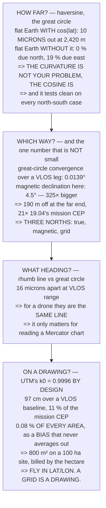

# FGL.03 Distance and bearing on a round Earth

<!-- glance:start -->
<!-- generated by tools/build.py from curriculum/syllabus.yaml — edit the syllabus, not this block -->

| | |
|---|---|
| **Track** | Optional foundation |
| **Difficulty** | Beginner |
| **Time** | 1 h |
| **Hardware** | none |
| **Software** | python |
| **Prerequisites** | [FGL.02 Local frames: ENU, NED, and body](FGL.02-local-frames-enu.md) |
| **Skip if** | You can compute distance and bearing between two fixes and say when a flat-Earth approximation is good enough. |

<!-- glance:end -->

## What you will learn

- The haversine formula, and why it is the right great-circle formula specifically at **short**
  ranges
- That at 19.02's 2,420 m VLOS limit a flat Earth **with** the cosine correction is out by **10
  microns** — so **the curvature is not your problem, the cosine is**
- That the cosine bug is **zero due north and 19 % due east**, which is exactly how it survives
  testing
- That great-circle bearing convergence over a VLOS leg is **0.0139°**, while **magnetic declination
  here is 325× that** and puts you **190 m off** — **21× [19.04](../../19-capstone-hermon-mission/19.04-phase-3-delivery-and-precision-rtl.md)'s
  entire mission CEP**
- That a rhumb line and a great circle differ by **16 microns** at VLOS range: for a drone, the same
  line
- That a **UTM metre is 0.9996 of a metre** — 97 cm over a VLOS baseline and **0.08 % of every area,
  as a bias**

## Why it matters

This lesson is mostly about discovering that you do not need most of it, and that is worth an hour
because the alternative is the opposite mistake: people reach for geodesy when the actual problem is
one line of trigonometry, and then trust the result.

Three of the four sections end with "for a drone, this is zero". The fourth ends with **190 metres**,
and it comes from the compass rather than from the Earth. Knowing which is which is the entire
practical value: when a position is wrong by hundreds of metres, geodesy is not the suspect —
declination, the datum ([FGL.01](FGL.01-earth-coordinates-and-datums.md)) and the frame
([FGL.02](FGL.02-local-frames-enu.md)) are, in that order.

The last section is the one that reaches a deliverable rather than a flight. A client who is paying
by the hectare is paying against a number that a projected grid gets consistently, quietly wrong.

## Prerequisites

<!-- prereqs:start -->
## Prerequisites

You need these first:

- [FGL.02 Local frames: ENU, NED, and body](FGL.02-local-frames-enu.md)

### Optional prerequisite links

None.

Check your readiness: `python course.py why FGL.03`
<!-- prereqs:end -->

## Concept

Two fixes, and four questions you might be asking:

- **How far apart are they?** — a great circle, computed by haversine.
- **Which way do I go?** — an initial bearing, which changes as you fly it.
- **What heading do I hold?** — a rhumb line, a different and slightly longer path.
- **Where do they sit on a drawing?** — a projection, which distorts something by construction.

On a planetary scale these four answers diverge dramatically, which is why the subject exists. On a
drone's scale three of them collapse into one, and the interesting work is knowing *which* scale each
question lives on — and noticing that the largest error in the neighbourhood is not a geodetic one at
all.

## Technical explanation

### Level 1 — haversine, and when you do not need it

Three ways to measure a distance:

- **haversine** — the great circle, correct everywhere
- **equirect** — flat Earth **with** the `cos(lat)` correction
- **naive** — flat Earth **without** it

| true distance | haversine | equirect | naive |
|---|---|---|---|
| 100 m | 100.000 | 100.000 | 109.678 |
| 1.0 km | 1000.000 | 1000.000 | 1096.811 |
| **2.4 km** | **2420.000** | **2420.000** | **2654.382** |
| 10.0 km | 10000.000 | 10000.001 | 10970.737 |
| 100.0 km | 100000.000 | 100000.685 | 109974.347 |
| 1000.0 km | 1000000.000 | 1000801.597 | 1130469.041 |

| true distance | equirect error | naive error |
|---|---|---|
| 100 m | 0.000 m | 9.7 % |
| **2.4 km** | **0.000 m** | **9.7 %** |
| 10.0 km | 0.001 m | 9.7 % |
| 100.0 km | 0.685 m | 10.0 % |
| 1000.0 km | 801.597 m | 13.0 % |

At 19.02's 2,420 m VLOS limit the **corrected** flat Earth is out by **10 microns** and the
uncorrected one by **9.7 %** — 234 metres.

> **So the round Earth is not your problem. The cosine is.**

And the cosine bug's size depends on which way you flew, which is why it survives testing:

| bearing of the leg | naive error | over 2,420 m |
|---|---|---|
| **0°** | **0.0 %** | **0 m** |
| 30° | 5.0 % | 120 m |
| 45° | 9.7 % | 234 m |
| 60° | 14.2 % | 344 m |
| **90°** | **18.6 %** | **449 m** |

**Zero due north, 19 % due east.** The error people actually ship is not "I used a flat Earth"; it is
"I treated a degree of longitude as a degree of latitude". FGL.01 said a degree of longitude is 85 %
of a degree of latitude here, so using the wrong one **overstates** an east-west distance by
`1/0.847` = **18 %** — and **disguises itself as zero on any north-south test case**.

Use haversine anyway. It is four lines, it costs nothing at the rates a mission planner runs at, and
it removes an entire category of question. Reserve the flat version for the inner loop, where the
controller runs at 400 Hz and the origin is 50 m away.

### Level 2 — bearing, and the error 300 times bigger

A great-circle bearing **changes along the route**:

| distance | initial | final | change |
|---|---|---|---|
| **2.4 km** | 90.0000 | 90.0139 | **0.0139** |
| 10.0 km | 90.0000 | 90.0573 | 0.0573 |
| 100.0 km | 90.0000 | 90.5729 | 0.5729 |
| 1,000 km | 90.0000 | 95.6871 | 5.6871 |
| 5,000 km | 90.0000 | 114.2377 | 24.2377 |

At 2,420 m the bearing turns by **0.0139°** — **58.6 cm** of cross-track over the whole leg. Now put
that next to the error in the instrument that actually measures your bearing:

| | |
|---|---|
| great-circle convergence over the leg | 0.0139° |
| **magnetic declination here [S]** | **4.5000°** |
| [05.03](../../05-sensors/05.03-compass-and-baro.md)'s compass error after calibration | 2.0000° |
| **declination / geodesy** | **325×** |

| leg | declination | compass 2° |
|---|---|---|
| 100 m | 7.9 m | 3.5 m |
| 500 m | 39.3 m | 17.5 m |
| 1,000 m | 78.5 m | 34.9 m |
| **2,420 m** | **190.1 m** | **84.5 m** |

**Uncorrected declination puts you 190 m off at the far end of 19.02's VLOS leg**, against 19.04's
8.87 m mission CEP. That is **21× the entire navigation error budget, from a number you set once in a
parameter.**

Three norths, and all three are in use:

| | |
|---|---|
| **true** north | the pole. What lat/lon means. |
| **magnetic** north | what the compass feels — 4.5° off here **[S]** |
| **grid** north | what a projection's y axis means |

ArduPilot's `COMPASS_AUTODEC` handles the first pair for you, from a world model and your position.
The third is Level 4's problem, and nothing handles it for you.

> [!TIP]
> **Ask your teacher:** "Is `COMPASS_AUTODEC` on, and what declination did it pick?" Then check the
> value against a published model for your site. It is one parameter, it is 190 m at VLOS range, and
> it is the only number in this lesson that is bigger than the errors you already accept.

### Level 3 — rhumb lines: the shortest path is not the easiest one

A **rhumb line** holds a constant bearing. A **great circle** is the shortest path. They are not the
same line, and the rhumb line is always longer:

| east-west leg | great circle | rhumb | penalty |
|---|---|---|---|
| **2.4 km** | 2,420.0 m | 2,420.0 m | **−0.0000 %** |
| 10.0 km | 10,000.0 m | 10,000.0 m | 0.0000 % |
| 100.0 km | 100,000.0 m | 100,000.4 m | 0.0004 % |
| 1,000 km | 1,000,000.0 m | 1,000,409.9 m | 0.0410 % |
| 5,000 km | 5,000,000.0 m | 5,035,905.8 m | 0.7181 % |

**At VLOS range the penalty is 16 microns.** Which is the answer for a drone: **there is no
difference.** A survey line, a transit, a return leg — all are the same line by both definitions, to
well under a centimetre.

It matters for exactly one thing you will do: reading a chart. A Mercator chart draws rhumb lines
straight and great circles curved, which is why long-haul routes look like they are going the wrong
way. Your sectional is not Mercator and your legs are 2 km, so this is context rather than technique.

### Level 4 — projections: when a metre is not a metre

Every projection distorts something. UTM chooses to distort **scale**, deliberately:

| | |
|---|---|
| scale factor at the central meridian | **0.9996** |
| the grid is short by | 0.0400 % |

That is a design decision, not a rounding error: shrinking the middle of the zone by 0.40 per mille
brings the error at the **edge** of the zone down to about the same size, instead of being twice as
big on one side.

| baseline | ground | UTM grid |
|---|---|---|
| 100 m | 100.000 | 99.960 |
| 1,000 m | 1000.000 | 999.600 |
| **2,420 m** | **2420.000** | **2419.032** |
| 10,000 m | 10000.000 | 9996.000 |

| | |
|---|---|
| over a VLOS leg, the grid is short by | **0.968 m** |
| 19.04's mission CEP | 8.87 m |
| the projection is | **11 %** of it |

**So a UTM "metre" is not a metre** — it is 0.9996 of one at the central meridian — and over a
VLOS-length baseline that is **97 cm**, about **11 % of the whole mission error**.

And it scales with **area**, which is where it reaches
[18.01](../../18-civil-ops/18.01-uav-missions.md):

| site | true | UTM | error |
|---|---|---|---|
| 1 ha | 1.0000 | 0.9992 | −0.0008 ha |
| 6 ha | 6.0000 | 5.9952 | −0.0048 ha |
| 25 ha | 25.0000 | 24.9800 | −0.0200 ha |
| **100 ha** | **100.0000** | **99.9200** | **−0.0800 ha** |

**0.08 % of area, every time, in the same direction.** A bias rather than a noise — so it does not
average away over a season of jobs, and on a 100 ha site it is **800 square metres** of land that a
client may be paying for by the hectare.

Three rules follow:

- plan and fly in **lat/lon** or in a **local metric** frame
- treat a projected grid as a **drawing**, not as measurements
- if a deliverable is in a grid, say **which** grid on the drawing — FGL.01's datum rule, one layer
  up

## Diagram



## Code

All four questions answered from first principles: haversine against two flat-Earth approximations
across six orders of magnitude, bearing convergence compared with the declination that dwarfs it,
rhumb against great circle, and UTM's scale factor followed into distance and then into area.

```python
"""FGL.03 -- distance and bearing on a round Earth, and when it matters.

Pure stdlib. A foundation lesson: the answer for a drone turns out to
be 'almost never', and the number that DOES matter is not geodesy.
"""

import math

BAR = "=" * 70

R = 6371008.8             # mean Earth radius, m
A = 6378137.0
INV_F = 298.257223563
F = 1.0 / INV_F
E2 = F * (2.0 - F)

SITE_LAT = 32.5
SITE_LON = 35.4
VLOS = 2420.0             # 19.02's measured VLOS limit
DECL = 4.5                # [S] magnetic declination, northern Israel
K0 = 0.9996               # UTM central-meridian scale factor


def head(n, title):
    print()
    print(BAR)
    print("%d. %s" % (n, title))
    print(BAR)
    print()


def m_per_deg_lat(lat):
    la = math.radians(lat)
    return (A * (1 - E2) / (1 - E2 * math.sin(la) ** 2) ** 1.5
            * math.pi / 180.0)


def m_per_deg_lon(lat):
    la = math.radians(lat)
    return (A / math.sqrt(1 - E2 * math.sin(la) ** 2) * math.cos(la)
            * math.pi / 180.0)


def haversine(lat1, lon1, lat2, lon2, r=R):
    p1, p2 = math.radians(lat1), math.radians(lat2)
    dp = p2 - p1
    dl = math.radians(lon2 - lon1)
    a = (math.sin(dp / 2) ** 2
         + math.cos(p1) * math.cos(p2) * math.sin(dl / 2) ** 2)
    return 2 * r * math.asin(math.sqrt(a))


def equirect(lat1, lon1, lat2, lon2, r=R):
    """Flat Earth WITH the cosine correction."""
    p1, p2 = math.radians(lat1), math.radians(lat2)
    x = math.radians(lon2 - lon1) * math.cos((p1 + p2) / 2)
    y = p2 - p1
    return r * math.hypot(x, y)


def naive(lat1, lon1, lat2, lon2, r=R):
    """Flat Earth WITHOUT it -- the bug this lesson is really about."""
    x = math.radians(lon2 - lon1)
    y = math.radians(lat2 - lat1)
    return r * math.hypot(x, y)


def bearing(lat1, lon1, lat2, lon2):
    p1, p2 = math.radians(lat1), math.radians(lat2)
    dl = math.radians(lon2 - lon1)
    y = math.sin(dl) * math.cos(p2)
    x = (math.cos(p1) * math.sin(p2)
         - math.sin(p1) * math.cos(p2) * math.cos(dl))
    return math.degrees(math.atan2(y, x)) % 360.0


def destination(lat1, lon1, brg_deg, d, r=R):
    p1, l1 = math.radians(lat1), math.radians(lon1)
    b, dr = math.radians(brg_deg), d / r
    p2 = math.asin(math.sin(p1) * math.cos(dr)
                   + math.cos(p1) * math.sin(dr) * math.cos(b))
    l2 = l1 + math.atan2(math.sin(b) * math.sin(dr) * math.cos(p1),
                         math.cos(dr) - math.sin(p1) * math.sin(p2))
    return math.degrees(p2), math.degrees(l2)


def rhumb_distance(lat1, lon1, lat2, lon2, r=R):
    p1, p2 = math.radians(lat1), math.radians(lat2)
    dp = p2 - p1
    dl = math.radians(lon2 - lon1)
    if abs(dl) > math.pi:
        dl -= math.copysign(2 * math.pi, dl)
    dpsi = math.log(math.tan(p2 / 2 + math.pi / 4)
                    / math.tan(p1 / 2 + math.pi / 4))
    q = dp / dpsi if abs(dpsi) > 1e-12 else math.cos(p1)
    return r * math.hypot(dp, q * dl)


def rhumb_bearing(lat1, lon1, lat2, lon2):
    p1, p2 = math.radians(lat1), math.radians(lat2)
    dl = math.radians(lon2 - lon1)
    if abs(dl) > math.pi:
        dl -= math.copysign(2 * math.pi, dl)
    dpsi = math.log(math.tan(p2 / 2 + math.pi / 4)
                    / math.tan(p1 / 2 + math.pi / 4))
    return math.degrees(math.atan2(dl, dpsi)) % 360.0


# ======================================================================
head(1, "HAVERSINE -- AND WHEN YOU DO NOT NEED IT")

print("  Two fixes, and you want the distance between them. On a")
print("  sphere the honest answer is the GREAT CIRCLE, and the")
print("  haversine formula computes it without the catastrophic")
print("  cancellation that the plain cosine rule suffers at short")
print("  range -- which is exactly the range a drone works at.")
print()
print("  Three ways to do it, tested against each other:")
print()
print("    HAVERSINE     the great circle, correct everywhere")
print("    EQUIRECT      flat Earth WITH the cos(lat) correction")
print("    NAIVE         flat Earth WITHOUT it")
print()
print("  %-14s %14s %14s %14s" % ("true dist", "haversine", "equirect",
                                  "naive"))
for d in (100.0, 1000.0, VLOS, 10000.0, 100000.0, 1000000.0):
    la2, lo2 = destination(SITE_LAT, SITE_LON, 45.0, d)
    h = haversine(SITE_LAT, SITE_LON, la2, lo2)
    e = equirect(SITE_LAT, SITE_LON, la2, lo2)
    n = naive(SITE_LAT, SITE_LON, la2, lo2)
    print("  %-12s %14.3f %14.3f %14.3f"
          % ("%.1f km" % (d / 1000.0) if d >= 1000 else "%.0f m" % d,
             h, e, n))

print()
print("  %-14s %14s %14s %14s" % ("true dist", "", "equirect err",
                                  "naive err"))
for d in (100.0, 1000.0, VLOS, 10000.0, 100000.0, 1000000.0):
    la2, lo2 = destination(SITE_LAT, SITE_LON, 45.0, d)
    h = haversine(SITE_LAT, SITE_LON, la2, lo2)
    e = equirect(SITE_LAT, SITE_LON, la2, lo2)
    n = naive(SITE_LAT, SITE_LON, la2, lo2)
    print("  %-12s %14s %13.3f m %12.1f %%"
          % ("%.1f km" % (d / 1000.0) if d >= 1000 else "%.0f m" % d,
             "", e - h, (n - h) / h * 100))

la2, lo2 = destination(SITE_LAT, SITE_LON, 45.0, VLOS)
e_err = equirect(SITE_LAT, SITE_LON, la2, lo2) - VLOS
n_err = (naive(SITE_LAT, SITE_LON, la2, lo2) - VLOS) / VLOS * 100
print()
print("  READ THOSE TWO COLUMNS AGAINST EACH OTHER. At 19.02's %.0f m"
      % VLOS)
print("  VLOS limit the CORRECTED flat Earth is out by %.0f MICRONS"
      % abs(e_err * 1e6))
print("  and the UNCORRECTED one by %.1f PER CENT -- %.0f metres."
      % (n_err, n_err / 100 * VLOS))
print()
print("  SO THE ROUND EARTH IS NOT YOUR PROBLEM. THE COSINE IS.")
print()
print("  And the cosine bug's SIZE DEPENDS ON WHICH WAY YOU FLEW,")
print("  which is why it survives testing -- fly the north line and")
print("  it is perfect:")
print()
print("  %-20s %18s %18s" % ("bearing of the leg", "naive error",
                             "over %.0f m" % VLOS))
for brg in (0.0, 30.0, 45.0, 60.0, 90.0):
    lb, ob = destination(SITE_LAT, SITE_LON, brg, VLOS)
    err = (naive(SITE_LAT, SITE_LON, lb, ob) - VLOS) / VLOS * 100
    print("  %-18s %16.1f %% %16.0f m"
          % ("%.0f deg" % brg, err, err / 100 * VLOS))
print()
print("  ZERO DUE NORTH, %.0f PER CENT DUE EAST."
      % ((naive(SITE_LAT, SITE_LON,
                *destination(SITE_LAT, SITE_LON, 90.0, VLOS)) - VLOS)
         / VLOS * 100))
print("  The error people actually ship is not 'I used a flat Earth';")
print("  it is 'I treated a degree of longitude as a degree of")
print("  latitude'. FGL.01 said a degree of longitude is %.0f per cent"
      % (m_per_deg_lon(SITE_LAT) / m_per_deg_lat(SITE_LAT) * 100))
print("  of a degree of latitude here, so using the wrong one")
print("  OVERSTATES an east-west distance by 1/%.3f = %.0f per cent --"
      % (m_per_deg_lon(SITE_LAT) / m_per_deg_lat(SITE_LAT),
         (m_per_deg_lat(SITE_LAT) / m_per_deg_lon(SITE_LAT) - 1) * 100))
print("  and disguises itself as ZERO on any north-south test case.")
print()
print("  USE HAVERSINE ANYWAY. It is four lines, it costs nothing at")
print("  the rates a mission planner runs at, and it removes an entire")
print("  category of question. Reserve the flat version for the inner")
print("  loop, where 07.xx runs at 400 Hz and the origin is 50 m away.")

# ======================================================================
head(2, "BEARING -- AND THE ERROR 300 TIMES BIGGER")

print("  A great-circle bearing CHANGES ALONG THE ROUTE. Fly a")
print("  constant-bearing line and you are not on a great circle:")
print()
print("  %-14s %14s %14s %14s" % ("distance", "initial", "final",
                                  "change"))
for d in (VLOS, 10000.0, 100000.0, 1000000.0, 5000000.0):
    la2, lo2 = destination(SITE_LAT, SITE_LON, 90.0, d)
    b1 = bearing(SITE_LAT, SITE_LON, la2, lo2)
    b2 = (bearing(la2, lo2, SITE_LAT, SITE_LON) + 180.0) % 360.0
    print("  %-12s %14.4f %14.4f %14.4f"
          % ("%.1f km" % (d / 1000.0), b1, b2, b2 - b1))

la2, lo2 = destination(SITE_LAT, SITE_LON, 90.0, VLOS)
b1 = bearing(SITE_LAT, SITE_LON, la2, lo2)
b2 = (bearing(la2, lo2, SITE_LAT, SITE_LON) + 180.0) % 360.0
conv = abs(b2 - b1)
print()
print("  At %.0f m the bearing turns by %.4f degrees -- which is"
      % (VLOS, conv))
print("  %.1f cm of cross-track over the whole leg."
      % (math.radians(conv) * VLOS * 100))
print()
print("  NOW PUT THAT NEXT TO THE ERROR IN THE INSTRUMENT THAT")
print("  ACTUALLY MEASURES YOUR BEARING:")
print()
print("  %-38s %14.4f deg" % ("great-circle convergence over the leg",
                              conv))
print("  %-38s %14.4f deg" % ("magnetic declination here [S]", DECL))
print("  %-38s %14.4f deg" % ("05.03's compass error after calibration",
                              2.0))
print("  %-38s %14.0f x" % ("  declination / geodesy", DECL / conv))
print()
print("  THE DECLINATION IS %.0f TIMES THE GEODESY." % (DECL / conv))
print()
print("  %-24s %14s %16s" % ("leg", "declination", "compass 2 deg"))
for d in (100.0, 500.0, 1000.0, VLOS):
    print("  %-22s %12.1f m %14.1f m"
          % ("%.0f m" % d, math.radians(DECL) * d,
             math.radians(2.0) * d))
print()
print("  UNCORRECTED DECLINATION PUTS YOU %.0f m OFF AT THE FAR END OF"
      % (math.radians(DECL) * VLOS))
print("  19.02's VLOS LEG, against 19.04's %.2f m mission CEP. That is"
      % 8.87)
print("  %.0f TIMES the entire navigation error budget, from a number"
      % (math.radians(DECL) * VLOS / 8.87))
print("  you set once in a parameter.")
print()
print("  THREE NORTHS, AND THEY ARE ALL IN USE:")
print()
print("  %-20s %48s" % ("TRUE north",
                         "the pole. What lat/lon means."))
print("  %-20s %48s" % ("MAGNETIC north",
                         "what the compass feels. %.1f deg off [S]"
                         % DECL))
print("  %-20s %48s" % ("GRID north",
                         "what a projection's y axis means"))
print()
print("  ArduPilot's COMPASS_AUTODEC handles the first pair for you,")
print("  from a world model and your position. The third one is")
print("  section 4's problem, and nothing handles it for you.")

# ======================================================================
head(3, "RHUMB LINES: THE SHORTEST PATH IS NOT THE EASIEST ONE")

print("  A RHUMB LINE holds a CONSTANT bearing. A GREAT CIRCLE is the")
print("  SHORTEST path. They are not the same line, and the rhumb line")
print("  is always the longer one:")
print()
print("  %-18s %16s %16s %14s" % ("east-west leg", "great circle",
                                  "rhumb", "penalty"))
for d in (VLOS, 10000.0, 100000.0, 1000000.0, 5000000.0):
    la2, lo2 = destination(SITE_LAT, SITE_LON, 90.0, d)
    gc = haversine(SITE_LAT, SITE_LON, la2, lo2)
    rl = rhumb_distance(SITE_LAT, SITE_LON, la2, lo2)
    print("  %-16s %14.1f m %14.1f m %12.4f %%"
          % ("%.1f km" % (d / 1000.0), gc, rl, (rl - gc) / gc * 100))

la2, lo2 = destination(SITE_LAT, SITE_LON, 90.0, VLOS)
gc = haversine(SITE_LAT, SITE_LON, la2, lo2)
rl = rhumb_distance(SITE_LAT, SITE_LON, la2, lo2)
print()
print("  AT VLOS RANGE THE PENALTY IS %.0f MICRONS." % abs((rl - gc) * 1e6))
print()
print("  Which is the answer for a drone: THERE IS NO DIFFERENCE. A")
print("  survey line, a transit, a return leg -- all of them are the")
print("  same line by both definitions, to well under a centimetre.")
print()
print("  It matters for exactly one thing you will do: reading an")
print("  aviation chart. A Mercator chart draws rhumb lines straight")
print("  and great circles curved, which is why long-haul routes look")
print("  like they are going the wrong way. Your sectional is not")
print("  Mercator and your legs are 2 km, so this is context, not")
print("  technique.")

# ======================================================================
head(4, "PROJECTIONS: WHEN A METRE IS NOT A METRE")

print("  A PROJECTION flattens the curved Earth onto a sheet, and")
print("  every projection distorts something. UTM chooses to distort")
print("  SCALE, and it does so deliberately:")
print()
print("  %-38s %14.4f" % ("scale factor at the central meridian", K0))
print("  %-38s %14.4f %%" % ("  i.e. the grid is short by",
                             (1 - K0) * 100))
print()
print("  That is not a rounding error, it is a DESIGN DECISION: by")
print("  shrinking the middle of the zone by %.2f per mille, the error"
      % ((1 - K0) * 1000))
print("  at the EDGE of the zone comes down to about the same size,")
print("  instead of being twice as big on one side.")
print()
print("  %-20s %16s %20s" % ("baseline", "ground (m)", "UTM grid (m)"))
for d in (100.0, 500.0, 1000.0, VLOS, 10000.0):
    print("  %-18s %16.3f %20.3f" % ("%.0f m" % d, d, d * K0))
print()
print("  %-38s %14.3f m" % ("over 19.02's VLOS leg, the grid is short by",
                            VLOS * (1 - K0)))
print("  %-38s %14.2f m" % ("19.04's mission CEP", 8.87))
print("  %-38s %14.0f %%" % ("  the projection is", VLOS * (1 - K0)
                             / 8.87 * 100))
print()
print("  SO A UTM 'METRE' IS NOT A METRE -- it is %.4f of one at the"
      % K0)
print("  central meridian -- and over a VLOS-length baseline that is")
print("  %.0f cm, about %.0f per cent of the whole mission error."
      % (VLOS * (1 - K0) * 100, VLOS * (1 - K0) / 8.87 * 100))
print()
print("  AND IT SCALES WITH AREA, WHICH IS WHERE IT BITES 18.01:")
print()
print("  %-22s %16s %18s %12s" % ("site", "true (ha)", "UTM (ha)",
                                  "error"))
for ha in (1.0, 6.0, 25.0, 100.0):
    print("  %-20s %16.4f %18.4f %10.4f ha"
          % ("%.0f ha" % ha, ha, ha * K0 * K0, ha * (K0 * K0 - 1)))
print()
print("  %.2f PER CENT OF AREA, EVERY TIME, IN THE SAME DIRECTION."
      % ((1 - K0 * K0) * 100))
print("  A bias, not a noise -- so it does not average away over a")
print("  season of jobs, and on a %.0f ha site it is %.0f square metres"
      % (100.0, abs(100.0 * (K0 * K0 - 1)) * 10000))
print("  of land that a client may be paying for by the hectare.")
print()
print("  THE THREE RULES THAT FOLLOW:")
print("    * plan and fly in LAT/LON or in a LOCAL METRIC frame")
print("    * treat a projected grid as a DRAWING, not as measurements")
print("    * if a deliverable is in a grid, say WHICH grid on the")
print("      drawing -- FGL.01's datum rule, one layer up")

# ======================================================================
print()
print(BAR)
print("THE FOUR THINGS TO CARRY FORWARD")
print(BAR)
print()
print("  1. Haversine is four lines and always right. The flat version")
print("     WITH cos(lat) is out by %.0f MICRONS at VLOS range; WITHOUT"
      % abs(e_err * 1e6))
print("     it, by up to %.0f per cent -- and by ZERO due north, which"
      % ((naive(SITE_LAT, SITE_LON,
                *destination(SITE_LAT, SITE_LON, 90.0, VLOS)) - VLOS)
         / VLOS * 100))
print("     is how it survives testing. THE COSINE IS THE BUG.")
print("  2. Great-circle bearing convergence over a VLOS leg is %.4f"
      % conv)
print("     degrees. MAGNETIC DECLINATION IS %.0f x THAT, and puts you"
      % (DECL / conv))
print("     %.0f m off -- %.0f x 19.04's whole mission CEP."
      % (math.radians(DECL) * VLOS, math.radians(DECL) * VLOS / 8.87))
print("  3. A rhumb line and a great circle differ by %.0f microns at"
      % abs((rl - gc) * 1e6))
print("     VLOS range. For a drone they are the same line.")
print("  4. A UTM metre is %.4f of a metre: %.0f cm over a VLOS leg and"
      % (K0, VLOS * (1 - K0) * 100))
print("     %.2f %% OF EVERY AREA, as a BIAS. Fly in lat/lon; treat a"
      % ((1 - K0 * K0) * 100))
print("     grid as a drawing.")
```

Output:

```text

======================================================================
1. HAVERSINE -- AND WHEN YOU DO NOT NEED IT
======================================================================

  Two fixes, and you want the distance between them. On a
  sphere the honest answer is the GREAT CIRCLE, and the
  haversine formula computes it without the catastrophic
  cancellation that the plain cosine rule suffers at short
  range -- which is exactly the range a drone works at.

  Three ways to do it, tested against each other:

    HAVERSINE     the great circle, correct everywhere
    EQUIRECT      flat Earth WITH the cos(lat) correction
    NAIVE         flat Earth WITHOUT it

  true dist           haversine       equirect          naive
  100 m               100.000        100.000        109.678
  1.0 km             1000.000       1000.000       1096.811
  2.4 km             2420.000       2420.000       2654.382
  10.0 km           10000.000      10000.001      10970.737
  100.0 km         100000.000     100000.685     109974.347
  1000.0 km       1000000.000    1000801.597    1130469.041

  true dist                       equirect err      naive err
  100 m                               0.000 m          9.7 %
  1.0 km                              0.000 m          9.7 %
  2.4 km                              0.000 m          9.7 %
  10.0 km                             0.001 m          9.7 %
  100.0 km                            0.685 m         10.0 %
  1000.0 km                         801.597 m         13.0 %

  READ THOSE TWO COLUMNS AGAINST EACH OTHER. At 19.02's 2420 m
  VLOS limit the CORRECTED flat Earth is out by 10 MICRONS
  and the UNCORRECTED one by 9.7 PER CENT -- 234 metres.

  SO THE ROUND EARTH IS NOT YOUR PROBLEM. THE COSINE IS.

  And the cosine bug's SIZE DEPENDS ON WHICH WAY YOU FLEW,
  which is why it survives testing -- fly the north line and
  it is perfect:

  bearing of the leg          naive error        over 2420 m
  0 deg                           0.0 %                0 m
  30 deg                          5.0 %              120 m
  45 deg                          9.7 %              234 m
  60 deg                         14.2 %              344 m
  90 deg                         18.6 %              449 m

  ZERO DUE NORTH, 19 PER CENT DUE EAST.
  The error people actually ship is not 'I used a flat Earth';
  it is 'I treated a degree of longitude as a degree of
  latitude'. FGL.01 said a degree of longitude is 85 per cent
  of a degree of latitude here, so using the wrong one
  OVERSTATES an east-west distance by 1/0.847 = 18 per cent --
  and disguises itself as ZERO on any north-south test case.

  USE HAVERSINE ANYWAY. It is four lines, it costs nothing at
  the rates a mission planner runs at, and it removes an entire
  category of question. Reserve the flat version for the inner
  loop, where 07.xx runs at 400 Hz and the origin is 50 m away.

======================================================================
2. BEARING -- AND THE ERROR 300 TIMES BIGGER
======================================================================

  A great-circle bearing CHANGES ALONG THE ROUTE. Fly a
  constant-bearing line and you are not on a great circle:

  distance              initial          final         change
  2.4 km              90.0000        90.0139         0.0139
  10.0 km             90.0000        90.0573         0.0573
  100.0 km            90.0000        90.5729         0.5729
  1000.0 km           90.0000        95.6871         5.6871
  5000.0 km           90.0000       114.2377        24.2377

  At 2420 m the bearing turns by 0.0139 degrees -- which is
  58.6 cm of cross-track over the whole leg.

  NOW PUT THAT NEXT TO THE ERROR IN THE INSTRUMENT THAT
  ACTUALLY MEASURES YOUR BEARING:

  great-circle convergence over the leg          0.0139 deg
  magnetic declination here [S]                  4.5000 deg
  05.03's compass error after calibration         2.0000 deg
    declination / geodesy                           325 x

  THE DECLINATION IS 325 TIMES THE GEODESY.

  leg                         declination    compass 2 deg
  100 m                           7.9 m            3.5 m
  500 m                          39.3 m           17.5 m
  1000 m                         78.5 m           34.9 m
  2420 m                        190.1 m           84.5 m

  UNCORRECTED DECLINATION PUTS YOU 190 m OFF AT THE FAR END OF
  19.02's VLOS LEG, against 19.04's 8.87 m mission CEP. That is
  21 TIMES the entire navigation error budget, from a number
  you set once in a parameter.

  THREE NORTHS, AND THEY ARE ALL IN USE:

  TRUE north                              the pole. What lat/lon means.
  MAGNETIC north                what the compass feels. 4.5 deg off [S]
  GRID north                           what a projection's y axis means

  ArduPilot's COMPASS_AUTODEC handles the first pair for you,
  from a world model and your position. The third one is
  section 4's problem, and nothing handles it for you.

======================================================================
3. RHUMB LINES: THE SHORTEST PATH IS NOT THE EASIEST ONE
======================================================================

  A RHUMB LINE holds a CONSTANT bearing. A GREAT CIRCLE is the
  SHORTEST path. They are not the same line, and the rhumb line
  is always the longer one:

  east-west leg          great circle            rhumb        penalty
  2.4 km                   2420.0 m         2420.0 m      -0.0000 %
  10.0 km                 10000.0 m        10000.0 m       0.0000 %
  100.0 km               100000.0 m       100000.4 m       0.0004 %
  1000.0 km             1000000.0 m      1000409.9 m       0.0410 %
  5000.0 km             5000000.0 m      5035905.8 m       0.7181 %

  AT VLOS RANGE THE PENALTY IS 16 MICRONS.

  Which is the answer for a drone: THERE IS NO DIFFERENCE. A
  survey line, a transit, a return leg -- all of them are the
  same line by both definitions, to well under a centimetre.

  It matters for exactly one thing you will do: reading an
  aviation chart. A Mercator chart draws rhumb lines straight
  and great circles curved, which is why long-haul routes look
  like they are going the wrong way. Your sectional is not
  Mercator and your legs are 2 km, so this is context, not
  technique.

======================================================================
4. PROJECTIONS: WHEN A METRE IS NOT A METRE
======================================================================

  A PROJECTION flattens the curved Earth onto a sheet, and
  every projection distorts something. UTM chooses to distort
  SCALE, and it does so deliberately:

  scale factor at the central meridian           0.9996
    i.e. the grid is short by                    0.0400 %

  That is not a rounding error, it is a DESIGN DECISION: by
  shrinking the middle of the zone by 0.40 per mille, the error
  at the EDGE of the zone comes down to about the same size,
  instead of being twice as big on one side.

  baseline                   ground (m)         UTM grid (m)
  100 m                       100.000               99.960
  500 m                       500.000              499.800
  1000 m                     1000.000              999.600
  2420 m                     2420.000             2419.032
  10000 m                   10000.000             9996.000

  over 19.02's VLOS leg, the grid is short by          0.968 m
  19.04's mission CEP                              8.87 m
    the projection is                                11 %

  SO A UTM 'METRE' IS NOT A METRE -- it is 0.9996 of one at the
  central meridian -- and over a VLOS-length baseline that is
  97 cm, about 11 per cent of the whole mission error.

  AND IT SCALES WITH AREA, WHICH IS WHERE IT BITES 18.01:

  site                          true (ha)           UTM (ha)        error
  1 ha                           1.0000             0.9992    -0.0008 ha
  6 ha                           6.0000             5.9952    -0.0048 ha
  25 ha                         25.0000            24.9800    -0.0200 ha
  100 ha                       100.0000            99.9200    -0.0800 ha

  0.08 PER CENT OF AREA, EVERY TIME, IN THE SAME DIRECTION.
  A bias, not a noise -- so it does not average away over a
  season of jobs, and on a 100 ha site it is 800 square metres
  of land that a client may be paying for by the hectare.

  THE THREE RULES THAT FOLLOW:
    * plan and fly in LAT/LON or in a LOCAL METRIC frame
    * treat a projected grid as a DRAWING, not as measurements
    * if a deliverable is in a grid, say WHICH grid on the
      drawing -- FGL.01's datum rule, one layer up

======================================================================
THE FOUR THINGS TO CARRY FORWARD
======================================================================

  1. Haversine is four lines and always right. The flat version
     WITH cos(lat) is out by 10 MICRONS at VLOS range; WITHOUT
     it, by up to 19 per cent -- and by ZERO due north, which
     is how it survives testing. THE COSINE IS THE BUG.
  2. Great-circle bearing convergence over a VLOS leg is 0.0139
     degrees. MAGNETIC DECLINATION IS 325 x THAT, and puts you
     190 m off -- 21 x 19.04's whole mission CEP.
  3. A rhumb line and a great circle differ by 16 microns at
     VLOS range. For a drone they are the same line.
  4. A UTM metre is 0.9996 of a metre: 97 cm over a VLOS leg and
     0.08 % OF EVERY AREA, as a BIAS. Fly in lat/lon; treat a
     grid as a drawing.
```

## Exercise

### Exercise FGL.03-E1 — Find the bearing that hides the bug `[analysis]`

Implement the naive distance and sweep the bearing from 0° to 90°. Confirm the error is zero at one
end and ~19 % at the other, and write down what that means for a test suite.

### Exercise FGL.03-E2 — Check your declination `[analysis]`

Look up the magnetic declination for your field from a current model. Compute the cross-track error
it would cause over your longest leg if uncorrected, and compare it with your position accuracy.

### Exercise FGL.03-E3 — Rhumb against great circle `[analysis]`

Compute both for a leg you actually fly and for a transatlantic flight. Report the penalty in each
case and state the distance at which it first reaches one metre.

### Exercise FGL.03-E4 — Price the projection `[analysis]`

Take the area of a site you have surveyed or plan to. Compute the difference between its true area
and its UTM area, in square metres and in whatever the client pays per hectare.

## Expected result

**FGL.03-E1**: expect exactly zero due north and a smooth `1/cos`-shaped rise to about 18–19 % due
east at Israeli latitudes.

**FGL.03-E2**: expect 4–5° across Israel, expect it to be drifting slowly year on year, and expect
the error to exceed your position accuracy by an order of magnitude.

**FGL.03-E3**: expect no measurable difference under 10 km and about one metre somewhere around
150–200 km on an east-west leg.

**FGL.03-E4**: expect 0.08 % — small as a percentage and surprisingly concrete once it is in square
metres and shekels.

## Troubleshooting

**Distances are consistently ~18 % too large east-west and correct north-south.** Level 1. The
missing cosine.

**Distance is correct but the aircraft flies the wrong way.** Bearing, not distance. Check
declination before anything else.

**The compass and the GPS track disagree by a few degrees.** That is `COMPASS_AUTODEC`, magnetic
interference, or both. Level 2's table gives the metres.

**Haversine returns zero for two distinct nearby points.** Single-precision floats. `asin(sqrt(a))`
with a tiny `a` needs the precision FGL.01's Level 2 argued for.

**My area does not match the client's.** Level 4 — but check the datum first. FGL.01's 245 m is a
much bigger suspect than 0.08 %.

**Two mapping tools give slightly different areas for the same polygon.** Different projections, or
one is computing on the ellipsoid and the other on a grid.

**A long leg's heading drifts even in still air.** That is great-circle convergence and it is real —
but at 0.0139° over 2.4 km, if you can see it, something else is wrong.

## Common mistakes

- **Treating a degree of longitude as a degree of latitude.** 18 %, invisible north-south.
- **Reaching for geodesy when the bug is the compass.** 325×.
- **Leaving declination uncorrected.** 190 m at VLOS range.
- **Worrying about rhumb lines on a 2 km leg.** 16 microns.
- **Measuring in a projected grid.** 0.9996, and 0.08 % of area.
- **Not naming the grid on a deliverable.** FGL.01's rule, one layer up.
- **Using the spherical cosine rule at short range.** It cancels catastrophically; that is what
  haversine exists to avoid.

## Knowledge check

<details>
<summary>Why haversine rather than the spherical law of cosines?</summary>

Both compute a great circle. The cosine rule takes `acos` of a number extremely close to 1 when the
two points are near each other, and floating-point cancellation there destroys the precision —
exactly at the ranges a drone works at. Haversine is formulated to stay well-conditioned at small
separations, which is why it is the standard choice despite being no more "correct".
</details>

<details>
<summary>How wrong is a flat Earth for a drone?</summary>

**With** the `cos(lat)` correction: **10 microns** at 19.02's 2,420 m VLOS limit, and one millimetre
at 10 km. Utterly negligible. **Without** it: **9.7 % on a 45° leg and 18.6 % due east**, 449 m at
VLOS range. So the curvature is not the problem — the cosine is, and the two get confused constantly.
</details>

<details>
<summary>Why does the missing-cosine bug survive testing?</summary>

Because its size depends on the **bearing of the leg**: **zero due north**, 5 % at 30°, 18.6 % due
east. A test suite whose fixtures happen to run north-south passes perfectly, and the failure only
shows up on an east-west survey line. Test the east-west case deliberately.
</details>

<details>
<summary>Which is bigger over a VLOS leg: bearing convergence or magnetic declination?</summary>

Declination, by **325×**. The great circle's bearing turns by **0.0139°** over 2,420 m — 58 cm of
cross-track. Declination here is **4.5°**, which is **190 m** at the same range, or **21× 19.04's
entire 8.87 m mission CEP**. The geodesy is invisible; the compass parameter is the whole game.
</details>

<details>
<summary>Does a rhumb line matter to a drone?</summary>

No. At VLOS range it differs from the great circle by **16 microns**, and it does not reach a metre
until well over a hundred kilometres. It matters for reading a Mercator chart — where rhumb lines are
straight and great circles look like detours — and for nothing you will fly.
</details>

<details>
<summary>What does UTM's 0.9996 do to your numbers?</summary>

It shrinks them. A UTM metre is **0.9996 of a metre** at the central meridian — by design, so the
error at the zone edge is no worse — which is **97 cm over a 2,420 m baseline** (11 % of the mission
CEP) and **0.08 % of every area**. Area distortion is the one that reaches a client, because it is a
**bias**: it never averages out, and on a 100 ha site it is **800 m²** billed in the same direction
every time.
</details>

## Practical challenge

Audit the arithmetic between a fix and a deliverable.

1. Find every distance calculation in your tooling and check each for the cosine (E1).
2. Add an east-west test case to each one.
3. Look up and set your declination; confirm `COMPASS_AUTODEC` picked the same value (E2).
4. Fly a 200 m out-and-back east-west leg and compare logged distance against a tape or a map.
5. Compute the rhumb/great-circle penalty on your longest leg and record that it is zero (E3).
6. Identify the projection behind every map product you deliver.
7. Compute the area error for your largest site and decide whether to state it on the deliverable
   (E4).

Step 7 is a professional judgement rather than a technical one: 0.08 % is small, it is systematic,
and the client is entitled to know which of those two facts you were relying on.

## You can skip this if

You can compute distance and bearing between two fixes and say when a flat-Earth approximation is
good enough.

## Go deeper

- Chris Veness's reference implementations of haversine, rhumb lines and the destination formula,
  with the derivations alongside: <https://www.movable-type.co.uk/scripts/latlong.html>
- NOAA's magnetic-field calculators, for Level 2's declination at your own site and its annual
  drift: <https://www.ncei.noaa.gov/products/world-magnetic-model>
- USGS's guide to map projections, which explains why every projection distorts something and what
  UTM chose: <https://pubs.usgs.gov/gip/70047422/report.pdf>

## Progress checkpoint

You can now compute a great-circle distance and bearing, say how far a flat Earth gets you and why
the usual failure is the cosine rather than the curvature, recognise declination as the dominant
bearing error, and explain why a projected grid is a drawing rather than a set of measurements.

Next, FGL.04 turns to the other half of a fix: not where the satellites' signal goes, but where the
satellites *are*. Dilution of precision, error propagation, and how a 4.50 m ranging error becomes a
position error of a size that depends entirely on geometry.
