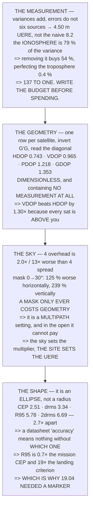

# FGL.04 Satellite geometry and error analysis

<!-- glance:start -->
<!-- generated by tools/build.py from curriculum/syllabus.yaml — edit the syllabus, not this block -->

| | |
|---|---|
| **Track** | Optional foundation |
| **Difficulty** | Intermediate |
| **Time** | 1 h 15 min |
| **Hardware** | none |
| **Software** | python |
| **Prerequisites** | [FGL.03 Distance and bearing on a round Earth](FGL.03-geodesy-distance-and-bearing.md) |
| **Skip if** | You can derive DOP from satellite geometry and turn a range error into a position error. |

<!-- glance:end -->

## What you will learn

- That **variances add and errors do not**: six sources root-sum-square to
  [13.02](../../13-navigation-gnss/13.02-error-sources.md)'s **4.50 m UERE**, not the naive sum of
  8.2
- That the squaring is why **perfecting the smallest term buys 0.4 %** while removing the largest
  buys **54 %** — a ratio of **137 to one**
- How to **build** DOP rather than read it: one row per satellite, form `GᵀG`, invert, read the
  diagonal
- That **DOP is dimensionless and contains no measurement** — it would be identical for a ₪50
  receiver and a ₪50,000 one
- That **VDOP beats HDOP by 1.30×** here purely because every satellite is above you
- That four satellites overhead is **2.0× worse horizontally and 13× worse vertically** than four
  spread out
- That **a mask only ever costs geometry** — 125 % horizontally at 30° — so it is a **multipath**
  setting, and in the open **it does not pay even if you delete multipath entirely**
- That the error is an **ellipse**, and that CEP, drms, R95 and 2drms differ by **2.7×** — so a
  datasheet's "accuracy" figure is meaningless without which one it is

## Why it matters

13.02 hands you two numbers — a 4.50 m UERE and a DOP — and multiplies them. This lesson builds both
from scratch, and building them changes what you can do with them.

Once you can form the geometry matrix, "the GPS is bad here" becomes a computation you can do in
advance from a satellite almanac and a horizon profile, before you drive to the site. And once you
can propagate the error budget, every accuracy purchase becomes a comparison rather than a hope: the
137-to-one ratio in Level 1 is the difference between buying the right receiver and buying an
expensive one.

The last section is the one that reaches the capstone. A position error is a **shape**, and the four
different radii people quote for it differ by nearly three times. 19.05's whole argument about
honest numbers starts here.

## Prerequisites

<!-- prereqs:start -->
## Prerequisites

You need these first:

- [FGL.03 Distance and bearing on a round Earth](FGL.03-geodesy-distance-and-bearing.md)

### Optional prerequisite links

None.

Check your readiness: `python course.py why FGL.04`
<!-- prereqs:end -->

## Concept

A GNSS fix is a least-squares solution, and least squares has a standard answer to "how wrong is
this?" that separates cleanly into two independent parts.

**How wrong is one measurement?** That is the **UERE** — the error in a single pseudorange, built by
propagating six independent physical sources. It depends on the atmosphere, the satellites, the
receiver and the site, and not at all on geometry.

**How much does the solution amplify that?** That is **DOP** — a pure number that falls out of the
satellite positions alone. It depends on geometry, and not at all on physics.

Multiply them and you get one sigma in one axis. Assemble those across axes and you get an ellipse,
which is what the error actually *is*. Everything else in this lesson is consequences.

## Technical explanation

### Level 1 — error propagation: variances add, errors do not

| source | σ (m) | variance | share |
|---|---|---|---|
| satellite clock | 1.1 | 1.21 | 6.0 % |
| ephemeris (orbit) | 0.8 | 0.64 | 3.2 % |
| **IONOSPHERE** | **4.0** | **16.00** | **79.1 %** |
| troposphere, modelled | 0.4 | 0.16 | 0.8 % |
| multipath (code) | 1.4 | 1.96 | 9.7 % |
| receiver noise | 0.5 | 0.25 | 1.2 % |
| **total variance** | | **20.22** | |
| **UERE = √total** | **4.50** | | |
| the naive sum would be | 8.2 | | |

**4.50 m, not 8.2.** The root-sum-square is 55 % of the naive sum, and that gap *is* the cancellation
— half the time the ionosphere is long while the multipath is short.

And the squaring is why the biggest term owns the answer:

| remove… | new UERE | improvement |
|---|---|---|
| satellite clock | 4.36 | 3.0 % |
| ephemeris (orbit) | 4.42 | 1.6 % |
| **IONOSPHERE** | **2.05** | **54.3 %** |
| **troposphere, modelled** | **4.48** | **0.4 %** |
| multipath (code) | 4.27 | 5.0 % |
| receiver noise | 4.47 | 0.6 % |

**Perfecting the troposphere buys 0.4 %. Removing the ionosphere buys 54.** That ratio — **137 to
one** — is the whole argument for writing the budget down before spending money.
[13.03](../../13-navigation-gnss/13.03-rtk-and-ppk.md)'s dual-frequency receiver attacks the 4.0 m
row; a better correlator attacks the 0.4 m row; **they cost about the same.**

### Level 2 — the geometry matrix: where DOP actually comes from

UERE is the error in **one range**. Your position error is that, **amplified** by where the
satellites happen to be — and the amplification is computable from geometry alone.

Each satellite gives one row: the unit vector pointing at it, negated, plus a `1` for
[13.01](../../13-navigation-gnss/13.01-gnss-fundamentals.md)'s clock unknown.

| sat | az | el | −e | −n | −u | clk |
|---|---|---|---|---|---|---|
| 1 | 10 | 72 | −0.0537 | −0.3043 | −0.9511 | 1 |
| 2 | 55 | 41 | −0.6182 | −0.4329 | −0.6561 | 1 |
| 3 | 95 | 18 | −0.9474 | 0.0829 | −0.3090 | 1 |
| … | | | | | | |
| 12 | 70 | 6 | −0.9345 | −0.3401 | −0.1045 | 1 |

Then three steps, and **there is no measurement in any of them**:

1. form `GᵀG` — a 4×4, from 12 rows
2. invert it → **Q**, the covariance *shape*
3. read the diagonal → the DOPs

```
   0.23216   -0.01531    0.01909    0.02765
  -0.01531    0.32047    0.01440   -0.00067
   0.01909    0.01440    0.93030    0.49548
   0.02765   -0.00067    0.49548    0.34870
```

| | from Q | value |
|---|---|---|
| **HDOP** | √(Qee+Qnn) | **0.743** |
| **VDOP** | √(Quu) | **0.965** |
| PDOP | √(Qee+Qnn+Quu) | 1.218 |
| TDOP | √(Qtt) | 0.591 |
| GDOP | √(all four) | 1.353 |

**DOP is dimensionless.** It is a pure multiplier, it contains no measurement, and it would be
identical for a receiver costing fifty shekels or fifty thousand. **The sky decides it.**

And notice **VDOP > HDOP** — 0.965 against 0.743, a factor of **1.30**. That is not a hardware
limitation and no receiver fixes it: every satellite is **above** you, so the vertical direction is
sampled from one side only. 13.02's "1.5–2× worse in altitude" is *this number*, and it is pure
geometry.

### Level 3 — what geometry does to it

| sky | n | HDOP | VDOP | PDOP |
|---|---|---|---|---|
| well spread, 12 sats | 12 | 0.74 | 0.96 | 1.22 |
| 4 sats, well spread | 4 | 2.35 | 3.25 | 4.01 |
| **4 sats, all overhead** | 4 | **4.81** | **41.19** | 41.47 |
| **4 sats, one quadrant** | 4 | **13.44** | 15.29 | 20.36 |

**Four satellites overhead is 2.0× worse horizontally and 13× worse vertically** than four well
spread — identical count, identical receiver, identical UERE. And four in one quadrant is **6×**
horizontally: the fix is nearly **singular**, because four satellites that close together barely span
three dimensions at all.

Which is why [05.04](../../05-sensors/05.04-gnss-receiver.md)'s preflight check is not "do I have a
3D fix". A 3D fix is four satellites. **The question is how many and where**, and HDOP is the one
number that answers both.

Now sweep the elevation mask:

| mask | sats | HDOP | VDOP | horizontal | vertical |
|---|---|---|---|---|---|
| **0°** | 12 | **0.74** | **0.96** | **3.34 m** | **4.34 m** |
| 5° | 12 | 0.74 | 0.96 | 3.34 m | 4.34 m |
| 10° | 10 | 0.89 | 1.24 | 4.00 m | 5.58 m |
| 15° | 9 | 1.03 | 1.46 | 4.62 m | 6.56 m |
| 20° | 8 | 1.11 | 1.79 | 5.01 m | 8.04 m |
| 25° | 7 | 1.54 | 2.95 | 6.91 m | 13.28 m |
| **30°** | 6 | **1.67** | **3.27** | **7.51 m** | **14.71 m** |
| 40° | 5 | 2.03 | 3.65 | 9.14 m | 16.39 m |

**Both columns got worse.** Raising the mask from 0 to 30° cost **125 % horizontally** (3.34 →
7.51 m) **and 239 % vertically** (4.34 → 14.71 m).

**The mask buys nothing geometric. It cannot.** Every satellite it removes is one less row in `G`,
and `GᵀG` only ever gets worse-conditioned. The **low** satellites in particular are the ones holding
the horizontal geometry open — they are the only ones sampling the horizontal plane edge-on.

So why does every receiver have one? Because **a mask is not a geometry setting; it is a multipath
setting.** A satellite at 5° arrives through a long grazing atmospheric path and off whatever is
standing near you. The mask trades a **known** geometric cost against an **unknown** measurement
benefit. So price it:

| | |
|---|---|
| horizontal error at mask 0 | 3.34 m |
| HDOP at mask 30 | 1.67 |
| **UERE needed to break even** | **2.00 m** |
| today's UERE | 4.50 m |
| UERE with multipath **removed entirely** | 4.27 m |

**Deleting multipath completely does not pay for it.** You would need a UERE of 2.00 m, and even a
perfect antenna in a perfect field leaves 4.27. **In the open, leave the mask low** — the trade is
not close, it is not even arguable.

It reverses next to a wall, and 13.02 already priced that: put a building five metres away and
multipath stops being the 1.4 m row and becomes the **largest** one. Then the mask is removing your
worst measurements rather than your best geometry, and the same arithmetic comes out the other way.

**Which is the general shape of every DOP decision: the sky sets the multiplier and the site sets the
UERE, and you only ever get to choose where you stand.**

| | |
|---|---|
| this sky at a 20° mask, 8 sats | HDOP 1.11 |
| 13.02's 8-satellite HDOP | HDOP 1.06 |

Two different constellations, independently constructed, landing **5 % apart**. The arithmetic is the
same arithmetic.

> [!TIP]
> **Ask your teacher:** "What elevation mask is this receiver set to, and why that number?" The
> honest answer is almost always "it came that way". Level 3 says the setting is a site decision —
> low in the open, higher next to a wall — and that nobody who set it once has ever made it again.

### Level 4 — from a number to a shape: the confidence ellipse

"Position error = DOP × UERE" gives **one sigma in one axis**. It is not a radius and it is not a
guarantee:

| | |
|---|---|
| σ east | 2.17 m |
| σ north | 2.55 m |
| σ up | 4.34 m |
| **drms = HDOP × UERE** | **3.34 m** |
| ellipse aspect (N/E) | 1.17 |

**The error is an ellipse, not a circle**, and its shape is the sky's shape. Here it is nearly round;
in a street it is a cigar across the street.

| name | × drms | metres | contains |
|---|---|---|---|
| CEP (50 %) | 0.75 | **2.51 m** | 50 % of fixes |
| drms (1σ) | 1.00 | 3.34 m | 63–68 % **[E]** |
| R95 | 1.73 | 5.78 m | 95 % of fixes |
| 2drms | 2.00 | **6.69 m** | 95–98 % **[E]** |

**A datasheet saying "2.5 m accuracy" is quoting one of these and almost never says which** — and
they differ by **2.7×** from end to end. 19.05's rule applies: a number without its interval is a
press release.

| | |
|---|---|
| this sky, R95 horizontal | 5.78 m |
| [19.04](../../19-capstone-hermon-mission/19.04-phase-3-delivery-and-precision-rtl.md)'s mission CEP | 8.87 m |
| [12.05](../../12-autonomous-flight/12.05-auto-takeoff-land-precision.md)'s landing criterion | 0.30 m |
| R95 / mission CEP | **0.7×** |
| **R95 / landing criterion** | **19×** |

**GNSS is 19 times too coarse to land on 12.05's criterion**, and no amount of averaging fixes it,
because 13.02's dominant terms are **biases**. That is not a gap you close with patience — it is the
whole reason 19.04 needed a **marker**, and why a printed sheet and an RTK receiver bought the same
100 %.

And the first ratio is the other half of the same story: GNSS alone is **0.7× the mission CEP**, so
navigating *to* the target was never the hard part — **arriving at it was.**

## Diagram



## Code

A complete DOP calculation in pure stdlib: the error budget propagated term by term, a geometry
matrix built from azimuth and elevation, a Gauss-Jordan inverse of `GᵀG`, four skies compared, an
elevation-mask sweep priced against the multipath it is supposed to buy, and the confidence ellipse
that comes out at the end.

```python
"""FGL.04 -- where DOP comes from, and what a position error is SHAPED like.

Pure stdlib. 13.02 USES dop and a 4.50 m UERE. This lesson BUILDS both:
the geometry matrix, its inverse, and the ellipse that comes out.
"""

import math

BAR = "=" * 70

# 13.02's single-frequency budget, one sigma, metres [S]
BUDGET = (
    ("satellite clock", 1.1),
    ("ephemeris (orbit)", 0.8),
    ("IONOSPHERE", 4.0),
    ("troposphere, modelled", 0.4),
    ("multipath (code)", 1.4),
    ("receiver noise", 0.5),
)

# A deterministic constellation: azimuth, elevation, in degrees.
# Its own set, not 13.02's -- it lands in the same range.
SATS = (
    (10.0, 72.0), (55.0, 41.0), (95.0, 18.0), (140.0, 63.0),
    (185.0, 29.0), (215.0, 8.0), (250.0, 47.0), (290.0, 21.0),
    (315.0, 76.0), (340.0, 12.0), (120.0, 35.0), (70.0, 6.0),
)

MISSION_CEP = 8.87        # 19.04
LAND_CRIT = 0.300         # 12.05


def head(n, title):
    print()
    print(BAR)
    print("%d. %s" % (n, title))
    print(BAR)
    print()


def los(az_deg, el_deg):
    """Unit vector receiver -> satellite, in ENU."""
    a, e = math.radians(az_deg), math.radians(el_deg)
    return (math.cos(e) * math.sin(a), math.cos(e) * math.cos(a),
            math.sin(e))


def geometry_matrix(sats):
    """One row per satellite: [-e, -n, -u, 1]."""
    return [[-v for v in los(az, el)] + [1.0] for az, el in sats]


def gtg(g):
    n = len(g[0])
    return [[sum(row[i] * row[j] for row in g) for j in range(n)]
            for i in range(n)]


def inverse(m):
    """Gauss-Jordan. Returns None if singular."""
    n = len(m)
    a = [list(row) + [1.0 if i == j else 0.0 for j in range(n)]
         for i, row in enumerate(m)]
    for c in range(n):
        p = max(range(c, n), key=lambda r: abs(a[r][c]))
        if abs(a[p][c]) < 1e-12:
            return None
        a[c], a[p] = a[p], a[c]
        d = a[c][c]
        a[c] = [v / d for v in a[c]]
        for r in range(n):
            if r != c and a[r][c] != 0.0:
                f = a[r][c]
                a[r] = [v - f * w for v, w in zip(a[r], a[c])]
    return [row[n:] for row in a]


def dops(sats):
    """(gdop, pdop, hdop, vdop, tdop) or None if the set is singular."""
    if len(sats) < 4:
        return None
    q = inverse(gtg(geometry_matrix(sats)))
    if q is None:
        return None
    qe, qn, qu, qt = q[0][0], q[1][1], q[2][2], q[3][3]
    if min(qe, qn, qu, qt) < 0:
        return None
    return (math.sqrt(qe + qn + qu + qt), math.sqrt(qe + qn + qu),
            math.sqrt(qe + qn), math.sqrt(qu), math.sqrt(qt),
            math.sqrt(qe), math.sqrt(qn))


# ======================================================================
head(1, "ERROR PROPAGATION: VARIANCES ADD, ERRORS DO NOT")

print("  Six independent things are wrong with every pseudorange, and")
print("  the question is what ONE number replaces them.")
print()
print("  IT IS NOT THE SUM. Independent errors partly cancel: half the")
print("  time the ionosphere is long while the multipath is short.")
print("  What adds is the VARIANCE -- sigma SQUARED:")
print()
print("  %-28s %12s %14s %12s" % ("source", "sigma (m)", "variance",
                                  "share"))
var_total = sum(s * s for _, s in BUDGET)
for name, s in BUDGET:
    print("  %-26s %12.1f %14.2f %11.1f %%"
          % (name, s, s * s, s * s / var_total * 100))
uere = math.sqrt(var_total)
print("  %-26s %12s %14.2f" % ("  total variance", "", var_total))
print("  %-26s %12.2f" % ("  UERE = sqrt(total)", uere))
print("  %-26s %12.1f" % ("  the naive SUM would be",
                          sum(s for _, s in BUDGET)))
print()
print("  %.2f m, NOT %.1f. The root-sum-square is %.0f per cent of the"
      % (uere, sum(s for _, s in BUDGET),
         uere / sum(s for _, s in BUDGET) * 100))
print("  naive sum, and that gap IS the cancellation.")
print()
print("  AND THE SQUARING IS WHY THE BIGGEST TERM OWNS THE ANSWER:")
print()
print("  %-32s %16s %14s" % ("remove...", "new UERE", "improvement"))
for name, s in BUDGET:
    u2 = math.sqrt(var_total - s * s)
    print("  %-30s %16.2f %13.1f %%"
          % (name, u2, (uere - u2) / uere * 100))
print()
best = max(BUDGET, key=lambda b: b[1])
worst = min(BUDGET, key=lambda b: b[1])
u_best = math.sqrt(var_total - best[1] ** 2)
u_worst = math.sqrt(var_total - worst[1] ** 2)
print("  PERFECTING THE %s BUYS %.1f PER CENT."
      % (worst[0].upper(), (uere - u_worst) / uere * 100))
print("  Removing the %s buys %.0f."
      % (best[0].lower(), (uere - u_best) / uere * 100))
print()
print("  THAT RATIO -- %.0f to one -- is the whole argument for writing"
      % ((uere - u_best) / (uere - u_worst)))
print("  the budget down before spending money. 13.03's dual-frequency")
print("  receiver attacks the %.1f m row. A better correlator attacks"
      % best[1])
print("  the %.1f m row. They cost about the same." % worst[1])

# ======================================================================
head(2, "THE GEOMETRY MATRIX: WHERE DOP ACTUALLY COMES FROM")

print("  UERE is the error in ONE RANGE. Your position error is that,")
print("  AMPLIFIED by where the satellites happen to be -- and the")
print("  amplification is computable, from geometry alone.")
print()
print("  Each satellite gives one row: the UNIT VECTOR pointing at it,")
print("  negated, plus a 1 for 13.01's clock unknown.")
print()
print("  %-12s %8s %8s %10s %10s %10s %6s"
      % ("sat", "az", "el", "-e", "-n", "-u", "clk"))
g = geometry_matrix(SATS)
for i, ((az, el), row) in enumerate(zip(SATS, g)):
    print("  %-10d %8.0f %8.0f %10.4f %10.4f %10.4f %6.0f"
          % (i + 1, az, el, row[0], row[1], row[2], row[3]))

print()
print("  THEN THREE STEPS, AND THERE IS NO MEASUREMENT IN ANY OF THEM:")
print()
print("    1. form G'G          (4x4, from %d rows)" % len(SATS))
print("    2. invert it         -> Q, the covariance SHAPE")
print("    3. read the diagonal -> the DOPs")
print()
q = inverse(gtg(g))
print("  Q, the inverse (east, north, up, clock):")
print()
for row in q:
    print("      %10.5f %10.5f %10.5f %10.5f" % tuple(row))
print()
d = dops(SATS)
gdop, pdop, hdop, vdop, tdop, se, sn = d
print("  %-30s %14s %14s" % ("", "from Q", "value"))
print("  %-30s %14s %14.3f" % ("HDOP", "sqrt(Qee+Qnn)", hdop))
print("  %-30s %14s %14.3f" % ("VDOP", "sqrt(Quu)", vdop))
print("  %-30s %14s %14.3f" % ("PDOP", "sqrt(Qee+Qnn+Quu)", pdop))
print("  %-30s %14s %14.3f" % ("TDOP", "sqrt(Qtt)", tdop))
print("  %-30s %14s %14.3f" % ("GDOP", "sqrt(all four)", gdop))
print()
print("  DOP IS DIMENSIONLESS. It is a pure MULTIPLIER, it contains no")
print("  measurement, and it would be identical for a receiver costing")
print("  fifty shekels or fifty thousand. THE SKY DECIDES IT.")
print()
print("  AND NOTICE VDOP > HDOP -- %.3f against %.3f, a factor of %.2f."
      % (vdop, hdop, vdop / hdop))
print("  That is not a hardware limitation and no receiver fixes it:")
print("  every satellite is ABOVE you, so the vertical direction is")
print("  sampled from one side only. 13.02's '1.5 to 2x worse in")
print("  altitude' is THIS NUMBER, and it is pure geometry.")

# ======================================================================
head(3, "WHAT GEOMETRY DOES TO IT")

print("  Four skies, same receiver, same UERE:")
print()
CASES = (
    ("well spread, 12 sats", SATS),
    ("4 sats, well spread", (SATS[0], SATS[4], SATS[7], SATS[6])),
    ("4 sats, all overhead", ((10.0, 78.0), (100.0, 72.0),
                              (190.0, 81.0), (280.0, 75.0))),
    ("4 sats, one quadrant", ((10.0, 40.0), (30.0, 55.0),
                              (50.0, 35.0), (70.0, 60.0))),
)
print("  %-26s %6s %10s %10s %10s"
      % ("sky", "n", "HDOP", "VDOP", "PDOP"))
for name, s in CASES:
    r = dops(s)
    if r is None:
        print("  %-24s %6d %10s" % (name, len(s), "SINGULAR"))
    else:
        print("  %-24s %6d %10.2f %10.2f %10.2f"
              % (name, len(s), r[2], r[3], r[1]))

print()
r_spread = dops((SATS[0], SATS[4], SATS[7], SATS[6]))
r_over = dops(((10.0, 78.0), (100.0, 72.0), (190.0, 81.0),
               (280.0, 75.0)))
print("  FOUR SATELLITES OVERHEAD IS %.1f TIMES WORSE HORIZONTALLY AND"
      % (r_over[2] / r_spread[2]))
print("  %.0f TIMES WORSE VERTICALLY than four well spread -- with the"
      % (r_over[3] / r_spread[3]))
print("  identical count, receiver and UERE. And four in one quadrant")
print("  is %.0f x horizontally: the fix is nearly SINGULAR, because"
      % (dops(CASES[3][1])[2] / r_spread[2]))
print("  four satellites that close together barely span three")
print("  dimensions at all.")
print()
print("  Which is why 05.04's preflight check is not 'do I have a 3D")
print("  fix'. A 3D fix is four satellites. THE QUESTION IS HOW MANY")
print("  AND WHERE, and HDOP is the one number that answers both.")
print()
print("  NOW THE RESULT THAT SURPRISES PEOPLE -- SWEEP THE MASK:")
print()
print("  %-14s %8s %10s %10s %14s %14s"
      % ("mask", "sats", "HDOP", "VDOP", "horiz (m)", "vert (m)"))
for mask in (0, 5, 10, 15, 20, 25, 30, 40):
    vis = tuple(s for s in SATS if s[1] >= mask)
    r = dops(vis)
    if r is None:
        print("  %-12s %8d %10s" % ("%d deg" % mask, len(vis),
                                    "NO FIX"))
    else:
        print("  %-12s %8d %10.2f %10.2f %14.2f %14.2f"
              % ("%d deg" % mask, len(vis), r[2], r[3],
                 r[2] * uere, r[3] * uere))

r0 = dops(SATS)
r30 = dops(tuple(s for s in SATS if s[1] >= 30))
print()
print("  BOTH COLUMNS GOT WORSE. Raising the mask from 0 to 30 degrees")
print("  cost %.0f PER CENT HORIZONTALLY (%.2f -> %.2f m) AND %.0f PER"
      % ((r30[2] - r0[2]) / r0[2] * 100, r0[2] * uere, r30[2] * uere,
         (r30[3] - r0[3]) / r0[3] * 100))
print("  CENT VERTICALLY (%.2f -> %.2f m)."
      % (r0[3] * uere, r30[3] * uere))
print()
print("  THE MASK BUYS NOTHING GEOMETRIC. IT CANNOT. Every satellite")
print("  it removes is one less row in G, and G'G only ever gets")
print("  worse-conditioned. The LOW satellites in particular are the")
print("  ones holding the horizontal geometry open -- they are the")
print("  only ones sampling the horizontal plane edge-on.")
print()
print("  SO WHY DOES EVERY RECEIVER HAVE ONE? Because a mask is not a")
print("  geometry setting; it is a MULTIPATH setting. A satellite at")
print("  5 degrees arrives through a long, grazing atmospheric path")
print("  and off whatever is standing near you. The mask trades a")
print("  KNOWN geometric cost against an UNKNOWN measurement benefit.")
print()
print("  SO PRICE THE TRADE. How good would the UERE have to become")
print("  for a 30-degree mask to break even?")
print()
u_break = r0[2] * uere / r30[2]
print("  %-40s %14.2f m" % ("horizontal error at mask 0", r0[2] * uere))
print("  %-40s %14.2f" % ("HDOP at mask 30", r30[2]))
print("  %-40s %14.2f m" % ("  UERE needed to break even", u_break))
print("  %-40s %14.2f m" % ("  today's UERE", uere))
print("  %-40s %14.2f m" % ("  UERE with multipath REMOVED ENTIRELY",
                            math.sqrt(var_total - 1.4 ** 2)))
print()
if math.sqrt(var_total - 1.4 ** 2) > u_break:
    print("  DELETING MULTIPATH COMPLETELY DOES NOT PAY FOR IT. You")
    print("  would need a UERE of %.2f m and even a perfect antenna in"
          % u_break)
    print("  a perfect field leaves %.2f."
          % math.sqrt(var_total - 1.4 ** 2))
    print()
    print("  IN THE OPEN, THEREFORE, LEAVE THE MASK LOW. The trade is")
    print("  not close -- it is not even arguable.")
else:
    print("  The trade can pay, but only just.")
print()
print("  IT REVERSES NEXT TO A WALL, and 13.02 already priced that:")
print("  put a building five metres away and multipath stops being")
print("  the %.1f m row and becomes the LARGEST one. Then the mask is"
      % 1.4)
print("  removing your worst measurements rather than your best")
print("  geometry, and the same arithmetic comes out the other way.")
print()
print("  WHICH IS THE GENERAL SHAPE OF EVERY DOP DECISION: THE SKY")
print("  SETS THE MULTIPLIER AND THE SITE SETS THE UERE, and you only")
print("  ever get to choose where you stand.")
print()
r20 = dops(tuple(s for s in SATS if s[1] >= 20))
print("  %-40s %14.2f" % ("this sky at a 20-degree mask, 8 sats",
                          r20[2]))
print("  %-40s %14.2f" % ("13.02's 8-satellite HDOP", 1.06))
print()
print("  Two different constellations, independently constructed,")
print("  landing %.0f per cent apart. THE ARITHMETIC IS THE SAME"
      % (abs(r20[2] - 1.06) / 1.06 * 100))
print("  ARITHMETIC.")

# ======================================================================
head(4, "FROM A NUMBER TO A SHAPE: THE CONFIDENCE ELLIPSE")

print("  'Position error = DOP x UERE' gives ONE SIGMA in one axis.")
print("  It is not a radius and it is not a guarantee:")
print()
sig_e, sig_n = se * uere, sn * uere
sig_u = vdop * uere
drms = math.hypot(sig_e, sig_n)
print("  %-34s %14.2f m" % ("sigma east", sig_e))
print("  %-34s %14.2f m" % ("sigma north", sig_n))
print("  %-34s %14.2f m" % ("sigma up", sig_u))
print("  %-34s %14.2f m" % ("  drms = HDOP x UERE", drms))
print("  %-34s %14.2f" % ("  ellipse aspect (N/E)", sig_n / sig_e))
print()
print("  THE ERROR IS AN ELLIPSE, NOT A CIRCLE, and its shape is the")
print("  sky's shape. Here it is nearly round; in a street it is a")
print("  cigar across the street.")
print()
print("  THE FOUR NUMBERS PEOPLE QUOTE, AND WHAT THEY MEAN:")
print()
print("  %-16s %12s %14s %24s"
      % ("name", "x drms", "metres", "contains"))
for name, k, pct in (("CEP (50%)", 0.75, "50 % of fixes"),
                     ("drms (1 sigma)", 1.00, "63-68 % [E]"),
                     ("R95", 1.73, "95 % of fixes"),
                     ("2drms", 2.00, "95-98 % [E]")):
    print("  %-14s %12.2f %14.2f %24s" % (name, k, k * drms, pct))
print()
print("  A DATASHEET SAYING '2.5 m ACCURACY' IS QUOTING ONE OF THESE")
print("  AND ALMOST NEVER SAYS WHICH -- and they differ by %.1f x from"
      % (2.00 / 0.75))
print("  end to end. 19.05's rule applies: a number without its")
print("  interval is a press release.")
print()
print("  NOW PUT THE HONEST ONE NEXT TO WHAT THE MISSION NEEDS:")
print()
print("  %-38s %14.2f m" % ("this sky, R95 horizontal", 1.73 * drms))
print("  %-38s %14.2f m" % ("19.04's mission CEP", MISSION_CEP))
print("  %-38s %14.2f m" % ("12.05's landing criterion", LAND_CRIT))
print()
print("  %-38s %14.1f x" % ("  R95 / mission CEP", 1.73 * drms
                            / MISSION_CEP))
print("  %-38s %14.0f x" % ("  R95 / landing criterion", 1.73 * drms
                            / LAND_CRIT))
print()
print("  READ THE SECOND RATIO. GNSS IS %.0f TIMES TOO COARSE TO LAND"
      % (1.73 * drms / LAND_CRIT))
print("  ON 12.05's CRITERION, and no amount of averaging fixes it,")
print("  because 13.02's dominant terms are BIASES. That is not a")
print("  gap you close with patience -- it is the whole reason 19.04")
print("  needed a MARKER, and why a printed sheet and an RTK receiver")
print("  bought the same 100 per cent.")
print()
print("  AND THE FIRST RATIO IS THE OTHER HALF OF THE SAME STORY:")
print("  GNSS alone is %.1f x the mission CEP, so navigation to the"
      % (1.73 * drms / MISSION_CEP))
print("  target was never the hard part -- ARRIVING AT IT WAS.")

# ======================================================================
print()
print(BAR)
print("THE FOUR THINGS TO CARRY FORWARD")
print(BAR)
print()
print("  1. VARIANCES ADD, ERRORS DO NOT. Six sources root-sum-square")
print("     to %.2f m, not %.1f -- and because of the squaring,"
      % (uere, sum(s for _, s in BUDGET)))
print("     perfecting the smallest term buys %.1f per cent."
      % ((uere - u_worst) / uere * 100))
print("  2. DOP is the inverse of G'G, read off the diagonal. It is")
print("     DIMENSIONLESS, it contains NO MEASUREMENT, and VDOP beats")
print("     HDOP by %.2f x because every satellite is above you."
      % (vdop / hdop))
print("  3. Four satellites overhead is %.1f x worse horizontally and"
      % (r_over[2] / r_spread[2]))
print("     %.0f x vertically than four spread out. AND A MASK ONLY"
      % (r_over[3] / r_spread[3]))
print("     EVER COSTS GEOMETRY -- %.0f %% and %.0f %% at 30 degrees."
      % ((r30[2] - r0[2]) / r0[2] * 100,
         (r30[3] - r0[3]) / r0[3] * 100))
print("     It is a MULTIPATH setting, and in the open it does not")
print("     pay: you would need a %.2f m UERE and a perfect antenna"
      % u_break)
print("     leaves %.2f." % math.sqrt(var_total - 1.4 ** 2))
print("  4. The error is an ELLIPSE. CEP, drms, R95 and 2drms differ")
print("     by %.1f x, and R95 here is %.1f m -- %.0f x 12.05's landing"
      % (2.0 / 0.75, 1.73 * drms, 1.73 * drms / LAND_CRIT))
print("     criterion. THAT is why 19.04 needed a marker.")
```

Output:

```text

======================================================================
1. ERROR PROPAGATION: VARIANCES ADD, ERRORS DO NOT
======================================================================

  Six independent things are wrong with every pseudorange, and
  the question is what ONE number replaces them.

  IT IS NOT THE SUM. Independent errors partly cancel: half the
  time the ionosphere is long while the multipath is short.
  What adds is the VARIANCE -- sigma SQUARED:

  source                          sigma (m)       variance        share
  satellite clock                     1.1           1.21         6.0 %
  ephemeris (orbit)                   0.8           0.64         3.2 %
  IONOSPHERE                          4.0          16.00        79.1 %
  troposphere, modelled               0.4           0.16         0.8 %
  multipath (code)                    1.4           1.96         9.7 %
  receiver noise                      0.5           0.25         1.2 %
    total variance                                 20.22
    UERE = sqrt(total)               4.50
    the naive SUM would be            8.2

  4.50 m, NOT 8.2. The root-sum-square is 55 per cent of the
  naive sum, and that gap IS the cancellation.

  AND THE SQUARING IS WHY THE BIGGEST TERM OWNS THE ANSWER:

  remove...                                new UERE    improvement
  satellite clock                            4.36           3.0 %
  ephemeris (orbit)                          4.42           1.6 %
  IONOSPHERE                                 2.05          54.3 %
  troposphere, modelled                      4.48           0.4 %
  multipath (code)                           4.27           5.0 %
  receiver noise                             4.47           0.6 %

  PERFECTING THE TROPOSPHERE, MODELLED BUYS 0.4 PER CENT.
  Removing the ionosphere buys 54.

  THAT RATIO -- 137 to one -- is the whole argument for writing
  the budget down before spending money. 13.03's dual-frequency
  receiver attacks the 4.0 m row. A better correlator attacks
  the 0.4 m row. They cost about the same.

======================================================================
2. THE GEOMETRY MATRIX: WHERE DOP ACTUALLY COMES FROM
======================================================================

  UERE is the error in ONE RANGE. Your position error is that,
  AMPLIFIED by where the satellites happen to be -- and the
  amplification is computable, from geometry alone.

  Each satellite gives one row: the UNIT VECTOR pointing at it,
  negated, plus a 1 for 13.01's clock unknown.

  sat                az       el         -e         -n         -u    clk
  1                10       72    -0.0537    -0.3043    -0.9511      1
  2                55       41    -0.6182    -0.4329    -0.6561      1
  3                95       18    -0.9474     0.0829    -0.3090      1
  4               140       63    -0.2918     0.3478    -0.8910      1
  5               185       29     0.0762     0.8713    -0.4848      1
  6               215        8     0.5680     0.8112    -0.1392      1
  7               250       47     0.6409     0.2333    -0.7314      1
  8               290       21     0.8773    -0.3193    -0.3584      1
  9               315       76     0.1711    -0.1711    -0.9703      1
  10              340       12     0.3345    -0.9192    -0.2079      1
  11              120       35    -0.7094     0.4096    -0.5736      1
  12               70        6    -0.9345    -0.3401    -0.1045      1

  THEN THREE STEPS, AND THERE IS NO MEASUREMENT IN ANY OF THEM:

    1. form G'G          (4x4, from 12 rows)
    2. invert it         -> Q, the covariance SHAPE
    3. read the diagonal -> the DOPs

  Q, the inverse (east, north, up, clock):

         0.23216   -0.01531    0.01909    0.02765
        -0.01531    0.32047    0.01440   -0.00067
         0.01909    0.01440    0.93030    0.49548
         0.02765   -0.00067    0.49548    0.34870

                                         from Q          value
  HDOP                            sqrt(Qee+Qnn)          0.743
  VDOP                                sqrt(Quu)          0.965
  PDOP                           sqrt(Qee+Qnn+Quu)          1.218
  TDOP                                sqrt(Qtt)          0.591
  GDOP                           sqrt(all four)          1.353

  DOP IS DIMENSIONLESS. It is a pure MULTIPLIER, it contains no
  measurement, and it would be identical for a receiver costing
  fifty shekels or fifty thousand. THE SKY DECIDES IT.

  AND NOTICE VDOP > HDOP -- 0.965 against 0.743, a factor of 1.30.
  That is not a hardware limitation and no receiver fixes it:
  every satellite is ABOVE you, so the vertical direction is
  sampled from one side only. 13.02's '1.5 to 2x worse in
  altitude' is THIS NUMBER, and it is pure geometry.

======================================================================
3. WHAT GEOMETRY DOES TO IT
======================================================================

  Four skies, same receiver, same UERE:

  sky                             n       HDOP       VDOP       PDOP
  well spread, 12 sats         12       0.74       0.96       1.22
  4 sats, well spread           4       2.35       3.25       4.01
  4 sats, all overhead          4       4.81      41.19      41.47
  4 sats, one quadrant          4      13.44      15.29      20.36

  FOUR SATELLITES OVERHEAD IS 2.0 TIMES WORSE HORIZONTALLY AND
  13 TIMES WORSE VERTICALLY than four well spread -- with the
  identical count, receiver and UERE. And four in one quadrant
  is 6 x horizontally: the fix is nearly SINGULAR, because
  four satellites that close together barely span three
  dimensions at all.

  Which is why 05.04's preflight check is not 'do I have a 3D
  fix'. A 3D fix is four satellites. THE QUESTION IS HOW MANY
  AND WHERE, and HDOP is the one number that answers both.

  NOW THE RESULT THAT SURPRISES PEOPLE -- SWEEP THE MASK:

  mask               sats       HDOP       VDOP      horiz (m)       vert (m)
  0 deg              12       0.74       0.96           3.34           4.34
  5 deg              12       0.74       0.96           3.34           4.34
  10 deg             10       0.89       1.24           4.00           5.58
  15 deg              9       1.03       1.46           4.62           6.56
  20 deg              8       1.11       1.79           5.01           8.04
  25 deg              7       1.54       2.95           6.91          13.28
  30 deg              6       1.67       3.27           7.51          14.71
  40 deg              5       2.03       3.65           9.14          16.39

  BOTH COLUMNS GOT WORSE. Raising the mask from 0 to 30 degrees
  cost 125 PER CENT HORIZONTALLY (3.34 -> 7.51 m) AND 239 PER
  CENT VERTICALLY (4.34 -> 14.71 m).

  THE MASK BUYS NOTHING GEOMETRIC. IT CANNOT. Every satellite
  it removes is one less row in G, and G'G only ever gets
  worse-conditioned. The LOW satellites in particular are the
  ones holding the horizontal geometry open -- they are the
  only ones sampling the horizontal plane edge-on.

  SO WHY DOES EVERY RECEIVER HAVE ONE? Because a mask is not a
  geometry setting; it is a MULTIPATH setting. A satellite at
  5 degrees arrives through a long, grazing atmospheric path
  and off whatever is standing near you. The mask trades a
  KNOWN geometric cost against an UNKNOWN measurement benefit.

  SO PRICE THE TRADE. How good would the UERE have to become
  for a 30-degree mask to break even?

  horizontal error at mask 0                         3.34 m
  HDOP at mask 30                                    1.67
    UERE needed to break even                        2.00 m
    today's UERE                                     4.50 m
    UERE with multipath REMOVED ENTIRELY             4.27 m

  DELETING MULTIPATH COMPLETELY DOES NOT PAY FOR IT. You
  would need a UERE of 2.00 m and even a perfect antenna in
  a perfect field leaves 4.27.

  IN THE OPEN, THEREFORE, LEAVE THE MASK LOW. The trade is
  not close -- it is not even arguable.

  IT REVERSES NEXT TO A WALL, and 13.02 already priced that:
  put a building five metres away and multipath stops being
  the 1.4 m row and becomes the LARGEST one. Then the mask is
  removing your worst measurements rather than your best
  geometry, and the same arithmetic comes out the other way.

  WHICH IS THE GENERAL SHAPE OF EVERY DOP DECISION: THE SKY
  SETS THE MULTIPLIER AND THE SITE SETS THE UERE, and you only
  ever get to choose where you stand.

  this sky at a 20-degree mask, 8 sats               1.11
  13.02's 8-satellite HDOP                           1.06

  Two different constellations, independently constructed,
  landing 5 per cent apart. THE ARITHMETIC IS THE SAME
  ARITHMETIC.

======================================================================
4. FROM A NUMBER TO A SHAPE: THE CONFIDENCE ELLIPSE
======================================================================

  'Position error = DOP x UERE' gives ONE SIGMA in one axis.
  It is not a radius and it is not a guarantee:

  sigma east                                   2.17 m
  sigma north                                  2.55 m
  sigma up                                     4.34 m
    drms = HDOP x UERE                         3.34 m
    ellipse aspect (N/E)                       1.17

  THE ERROR IS AN ELLIPSE, NOT A CIRCLE, and its shape is the
  sky's shape. Here it is nearly round; in a street it is a
  cigar across the street.

  THE FOUR NUMBERS PEOPLE QUOTE, AND WHAT THEY MEAN:

  name                   x drms         metres                 contains
  CEP (50%)              0.75           2.51            50 % of fixes
  drms (1 sigma)         1.00           3.34              63-68 % [E]
  R95                    1.73           5.78            95 % of fixes
  2drms                  2.00           6.69              95-98 % [E]

  A DATASHEET SAYING '2.5 m ACCURACY' IS QUOTING ONE OF THESE
  AND ALMOST NEVER SAYS WHICH -- and they differ by 2.7 x from
  end to end. 19.05's rule applies: a number without its
  interval is a press release.

  NOW PUT THE HONEST ONE NEXT TO WHAT THE MISSION NEEDS:

  this sky, R95 horizontal                         5.78 m
  19.04's mission CEP                              8.87 m
  12.05's landing criterion                        0.30 m

    R95 / mission CEP                               0.7 x
    R95 / landing criterion                          19 x

  READ THE SECOND RATIO. GNSS IS 19 TIMES TOO COARSE TO LAND
  ON 12.05's CRITERION, and no amount of averaging fixes it,
  because 13.02's dominant terms are BIASES. That is not a
  gap you close with patience -- it is the whole reason 19.04
  needed a MARKER, and why a printed sheet and an RTK receiver
  bought the same 100 per cent.

  AND THE FIRST RATIO IS THE OTHER HALF OF THE SAME STORY:
  GNSS alone is 0.7 x the mission CEP, so navigation to the
  target was never the hard part -- ARRIVING AT IT WAS.

======================================================================
THE FOUR THINGS TO CARRY FORWARD
======================================================================

  1. VARIANCES ADD, ERRORS DO NOT. Six sources root-sum-square
     to 4.50 m, not 8.2 -- and because of the squaring,
     perfecting the smallest term buys 0.4 per cent.
  2. DOP is the inverse of G'G, read off the diagonal. It is
     DIMENSIONLESS, it contains NO MEASUREMENT, and VDOP beats
     HDOP by 1.30 x because every satellite is above you.
  3. Four satellites overhead is 2.0 x worse horizontally and
     13 x vertically than four spread out. AND A MASK ONLY
     EVER COSTS GEOMETRY -- 125 % and 239 % at 30 degrees.
     It is a MULTIPATH setting, and in the open it does not
     pay: you would need a 2.00 m UERE and a perfect antenna
     leaves 4.27.
  4. The error is an ELLIPSE. CEP, drms, R95 and 2drms differ
     by 2.7 x, and R95 here is 5.8 m -- 19 x 12.05's landing
     criterion. THAT is why 19.04 needed a marker.
```

## Exercise

### Exercise FGL.04-E1 — Price your own upgrade `[analysis]`

Take Level 1's budget and a receiver upgrade you are considering. Work out which rows it changes, by
how much, and what the new UERE is. State the improvement as a percentage.

### Exercise FGL.04-E2 — Build a DOP calculator `[analysis]`

Implement the geometry matrix and the inverse. Verify it on a case you can check by hand: four
satellites at 0/90/180/270 azimuth and equal elevation should give a symmetric Q.

### Exercise FGL.04-E3 — Find the worst sky that still gives a fix `[analysis]`

Try satellite configurations that give a valid fix with the worst possible HDOP. Report the
configuration and the number, and explain what makes it bad.

### Exercise FGL.04-E4 — Decide your own mask `[analysis]`

For your own site, compute the DOP cost of masks from 0° to 30° with a realistic satellite set. Then
estimate the multipath at your site and decide whether the trade pays.

## Expected result

**FGL.04-E1**: expect the improvement to be much smaller than the marketing implies unless the
upgrade attacks the ionosphere row.

**FGL.04-E2**: expect the symmetric case to give equal Qee and Qnn, and expect a singular matrix
whenever three satellites are coplanar with the receiver.

**FGL.04-E3**: expect HDOP in the tens, and expect the worst cases to be tight clusters rather than
small counts.

**FGL.04-E4**: expect the open-field answer to be "leave it low" and the urban answer to be "raise
it", and expect the crossover to be sharper than you thought.

## Troubleshooting

**My matrix inversion fails.** The satellites are degenerate — coplanar, or fewer than four. That is
not a numerical problem, it is 13.01's singular case.

**My DOP is below 1.** That is normal with many well-spread satellites. DOP below 1 means the
solution is *better* than a single range, because it is averaging.

**HDOP looks fine but positions jump.** DOP describes geometry, not measurements. A jump is
multipath or a satellite dropping out, both of which live in the UERE.

**VDOP is always worse than HDOP.** Correct, and unfixable — Level 2. Every satellite is above you.

**Raising the mask did not help.** Level 3. It never helps geometry; it only ever helps measurements,
and only where multipath is large.

**My CEP and the datasheet's disagree by about 2×.** Level 4. You are comparing CEP with 2drms.

**The reported HDOP changes when nothing moved.** Satellites rise and set. The sky is not a constant.

## Common mistakes

- **Adding errors instead of variances.** 8.2 versus 4.50.
- **Attacking the small term.** 0.4 % against 54 %.
- **Treating DOP as a receiver quality metric.** It contains no measurement at all.
- **Checking "3D fix" instead of HDOP.** A 3D fix is four satellites, anywhere.
- **Raising the mask to "clean up" a fix.** It costs geometry, always.
- **Quoting an accuracy without saying CEP, drms, R95 or 2drms.** 2.7×.
- **Expecting averaging to fix a GNSS position.** The dominant terms are biases.

## Knowledge check

<details>
<summary>Why is the UERE 4.50 m when the six sources sum to 8.2?</summary>

Because the sources are **independent**, so they partly cancel — half the time the ionosphere is long
while the multipath is short. What adds is the **variance**, σ², and the total is √20.22 = **4.50 m**,
which is 55 % of the naive sum. The same squaring is what makes the ionosphere, at 79 % of the
variance, own the answer.
</details>

<details>
<summary>Which term should you spend money on, and by how much does it matter?</summary>

The largest one. Removing the **ionosphere** improves the UERE by **54 %**; perfecting the
**troposphere** improves it by **0.4 %**. That is **137 to one** — and a dual-frequency receiver and
a better correlator cost about the same. Write the budget down before you buy anything.
</details>

<details>
<summary>Where does DOP come from?</summary>

From the satellites' directions and nothing else. Each satellite contributes one row of the geometry
matrix `G`: its unit line-of-sight vector, negated, plus a 1 for the clock unknown. Form `GᵀG`,
invert it to get `Q`, and read the diagonal: HDOP = √(Qee+Qnn), VDOP = √(Quu), and so on. **No
measurement enters the calculation**, which is why DOP is dimensionless and identical for any
receiver.
</details>

<details>
<summary>Why is vertical accuracy always worse than horizontal?</summary>

Because **every satellite is above you**. The horizontal plane is sampled from all sides; the
vertical direction is sampled from one side only, so the geometry constrains it less. Here VDOP is
**1.30× HDOP**, and in worse geometry the gap widens dramatically — four satellites overhead give
VDOP 41 against HDOP 4.8. No receiver fixes this; it is the shape of the problem.
</details>

<details>
<summary>Does raising the elevation mask improve the fix?</summary>

Never geometrically. Going from 0° to 30° cost **125 % horizontally and 239 % vertically** in this
sky, because the low satellites are the ones holding the horizontal geometry open. A mask is a
**multipath** setting, trading a known geometric cost against an unknown measurement benefit — and in
the open the trade does not pay: you would need a **2.00 m** UERE to break even, and deleting
multipath entirely only gets you to 4.27. Next to a wall, where multipath becomes the largest term,
it reverses.
</details>

<details>
<summary>Someone quotes "2.5 m accuracy". What have they told you?</summary>

Almost nothing, until they say **which radius**. For this sky: CEP is 2.51 m, drms 3.34, R95 5.78 and
2drms 6.69 — the same error described four ways, **2.7× apart end to end**. The useful comparison is
against a requirement: R95 here is **0.7× 19.04's mission CEP** but **19× 12.05's landing
criterion**, which is precisely why the mission could navigate on GNSS and had to land on a marker.
</details>

## Practical challenge

Predict a site before you drive to it.

1. Get a satellite almanac or a DOP-prediction tool for your area and date.
2. Sketch the horizon profile at your site — buildings, hills, the hangar.
3. Compute HDOP and VDOP through the working day with that horizon applied (E2, E3).
4. Identify the worst hour, and whether it is worse than your requirement.
5. Compute the UERE you actually expect there, adjusting the multipath row for the surroundings.
6. Multiply, and express the answer as R95 rather than as a sigma (E1).
7. Decide the mask from steps 4 and 5 rather than from the default (E4).
8. After the flight, compare the logged HDOP against your prediction.

Step 8 is what turns this from arithmetic into a skill. Predict, fly, compare — three times, and you
will trust the prediction more than the preflight display.

## You can skip this if

You can derive DOP from satellite geometry and turn a range error into a position error.

## Go deeper

- The US government's GPS performance standards, which define the accuracy metrics in Level 4 and
  state which one every published figure uses: <https://gssc.esa.int/navipedia/index.php/GPS_Performances>
- An online DOP and satellite-visibility planner, for the Practical challenge's prediction step:
  <https://www.gnssplanning.com/>
- Chapter-length treatments of least-squares positioning and the covariance matrix in the ESA GNSS
  navigation manual, which is where Level 2's three steps come from:
  <https://gssc.esa.int/navipedia/index.php/Main_Page>

## Progress checkpoint

You can now propagate an error budget properly, build a DOP from satellite geometry rather than
reading it off a screen, explain why a mask can only ever cost geometry, and turn both numbers into
the ellipse a position error actually is.

That completes the FGL sequence — coordinates, frames, geodesy and error. Next, the FRA lessons take
up the other invisible half of the aircraft: the radio link, from decibels to the band you are
legally allowed to use.
