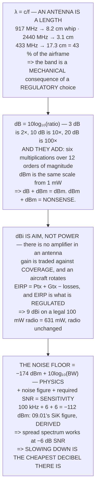

# FRA.01 RF in 45 minutes: frequency, wavelength, decibels

<!-- glance:start -->
<!-- generated by tools/build.py from curriculum/syllabus.yaml — edit the syllabus, not this block -->

| | |
|---|---|
| **Track** | Optional foundation |
| **Difficulty** | Beginner |
| **Time** | 45 min |
| **Hardware** | none |
| **Software** | python |
| **Prerequisites** | none |
| **Skip if** | You can do decibel arithmetic in your head and convert dBm to milliwatts without a table. |

<!-- glance:end -->

## What you will learn

- That `λ = c/f`, and that **an antenna is a length, not a component**: 8.2 cm at 917 MHz, 3.1 cm at
  2440
- Decibel arithmetic you can do in your head — **3 dB is 2×, 10 dB is 10×, 20 dB is 100×** — and why
  they **add**
- That `dB` is a ratio and `dBm` is a power, so **dB + dBm = dBm and dBm + dBm is nonsense**
- That **dBi is aim, not power**, and that the regulator measures **EIRP** — so a 9 dBi antenna on a
  legal 100 mW radio is **631 mW** with nothing on the radio changed
- That the noise floor is **−174 dBm per hertz** and nothing you buy changes it
- How to **derive** [09.01](../../09-telemetry-datalink/09.01-rf-and-link-budget.md)'s **−112 dBm**
  SiK sensitivity from a physical constant, a bandwidth and two engineering numbers
- That a spread-spectrum receiver works at **−6 dB SNR**, which is why the same radio hears **12 dB
  further** at a lower rate — and that **slowing down is the cheapest decibel in radio**

## Why it matters

Module 09 opens with a link budget: a column of numbers with `dBm`, `dB` and `dBi` after them, added
up. If those three units are not solid, the entire module reads as arithmetic you are trusting rather
than following.

Forty-five minutes fixes that, and it fixes more than notation. Two of the four sections end in a
decision you will actually make. Section 1 says the band you pick determines a piece of hardware that
has to physically fit on the aircraft. Section 3 says the legal limit is on something you can breach
by changing an antenna — an accessory most people do not think of as a radio at all.

And section 4 is the one worth the whole lesson: the receiver sensitivity everyone quotes from a
datasheet turns out to be derivable in three terms, one of which is a constant of nature.

## Prerequisites

<!-- prereqs:start -->
## Prerequisites

None — you can start here.

### Optional prerequisite links

None.

Check your readiness: `python course.py why FRA.01`
<!-- prereqs:end -->

## Concept

Radio has a reputation for being a different kind of engineering, and most of that reputation comes
from two pieces of notation rather than from any actual difficulty.

The first is that everything is in **decibels**, because a radio link spans twelve orders of
magnitude between what leaves the transmitter and what arrives at the receiver. Logarithms turn that
into small numbers that add.

The second is that **frequency and length are the same fact**. A band is not an abstract channel
assignment; it is a physical size, and it determines what your antenna looks like and where it fits.

Underneath both sits one number that is not an engineering choice at all: the thermal noise floor.
It is set by temperature and by how much spectrum you choose to listen to, and it is the floor every
link budget eventually hits.

## Technical explanation

### Level 1 — frequency and wavelength: the band picks the antenna

| MHz | λ | half | quarter |
|---|---|---|---|
| 433 | 69.2 cm | 34.6 cm | **17.3 cm** |
| 868 | 34.5 cm | 17.3 cm | 8.6 cm |
| **917** | **32.7 cm** | 16.3 cm | **8.2 cm** |
| 1200 | 25.0 cm | 12.5 cm | 6.2 cm |
| **2440** | **12.3 cm** | 6.1 cm | **3.1 cm** |
| 5800 | 5.2 cm | 2.6 cm | 1.3 cm |

The quarter-wave column is the one that matters, because **an antenna is not a component you choose —
it is a length**:

| band | whip | on a 40 cm airframe |
|---|---|---|
| 433 | 17.3 cm | **awkward: 43 % of the airframe** |
| 917 | 8.2 cm | fine, sticking out below |
| 2440 | 3.1 cm | trivial, hides anywhere |
| 5800 | 1.3 cm | trivial, hides anywhere |

So the band is not a free choice. [09.04](../../09-telemetry-datalink/09.04-telemetry-917.md)'s
917 MHz telemetry needs an 8.2 cm whip and
[09.02](../../09-telemetry-datalink/09.02-control-link-elrs.md)'s 2440 MHz control needs 3.1 cm. On
Hermon one of those hangs below the frame and one clips to an arm — **a mechanical consequence of a
regulatory choice**.

And it works backwards, which is the useful direction: measure a mystery antenna, multiply by four,
divide `c` by it.

| | |
|---|---|
| 8.2 cm whip → | 914.0 MHz |
| 3.1 cm whip → | 2417.7 MHz |
| 17.3 cm whip → | 433.2 MHz |

### Level 2 — decibels: why everything in radio is a logarithm

A transmitter puts out 0.1 watts. A receiver hears 0.00000000001 watts. Those are the **same link**.

`dB = 10 log₁₀(power ratio)`

| ratio | dB | remember it as |
|---|---|---|
| 1× | 0.0 | the same |
| **2×** | **3.0** | **DOUBLE** |
| 4× | 6.0 | |
| **10×** | **10.0** | **TEN TIMES** |
| **100×** | **20.0** | |
| 1000× | 30.0 | |
| 0.5× | −3.0 | **HALF** |
| 0.25× | −6.0 | |
| 0.1× | −10.0 | a tenth |

Three numbers cover almost everything — **3 dB = 2×, 10 dB = 10×, 20 dB = 100×** — and they **compose
by adding**:

| stage | dB | running total |
|---|---|---|
| transmitter | 20.0 | 20.0 dBm |
| cable | −1.0 | 19.0 dBm |
| antenna | 2.0 | 21.0 dBm |
| free space | −120.0 | −99.0 dBm |
| antenna | 2.0 | −97.0 dBm |
| cable | −1.0 | **−98.0 dBm** |
| | | = 1.58e−10 mW |

**Six multiplications spanning twelve orders of magnitude, done by adding six small numbers.** That
is why radio is in dB.

`dBm` is the same scale with a zero point: **0 dBm = 1 mW**.

| power | dBm | what it is |
|---|---|---|
| 1 mW | 0.0 | the reference |
| 25 mW | 14.0 | a 25 mW video transmitter |
| **100 mW** | **20.0** | 09.01's telemetry radio |
| 1000 mW | 30.0 | 1 W, well over most limits |
| **6.31e−12 mW** | **−112.0** | 09.01's SiK sensitivity |

**A dB is a ratio and a dBm is a power.** Adding dB to dBm gives dBm; adding dBm to dBm is
meaningless, and it is the most common mistake on this page.

### Level 3 — dBi: gain is not power, it is aim

An antenna has no amplifier in it. A "6 dBi" antenna does not make four times the power — **it sends
four times as much in one direction and less everywhere else.** `dBi` is measured against an
**isotropic** radiator: a theoretical point that radiates equally in every direction, which does not
exist and cannot be built, and is therefore a clean reference.

| antenna | dBi | × in beam | what you give up |
|---|---|---|---|
| isotropic (imaginary) | 0.00 | 1.0× | nothing — and nothing to give |
| half-wave dipole | 2.15 | 1.6× | straight up and down its own axis |
| **a typical whip [E]** | **2.00** | 1.6× | the same: nulls off the tip |
| 5-element patch **[E]** | 9.00 | 7.9× | everything behind it |
| a dish **[E]** | 24.00 | 251.2× | everything but a narrow cone |

Read the last column downwards. **Gain is a trade against coverage**, and on an aircraft that moves
and rotates, coverage is the thing you cannot afford to lose — which is why the drone end of a link
is almost always 2 dBi and the gain, if any, lives on the ground.

`EIRP = Ptx + Gtx − losses`, and **EIRP is what the regulator measures**:

| | |
|---|---|
| 09.01's transmitter | 20.0 dBm |
| its antenna | +2.0 dB |
| cable | −1.0 dB |
| **EIRP** | **21.0 dBm** = 125.9 mW |

A 100 mW limit is usually a limit on **EIRP**, not on the radio — so bolting a 9 dBi antenna onto a
compliant 100 mW transmitter puts you at **631 mW of EIRP and outside the rules, with nothing on the
radio changed**. [09.05](../../09-telemetry-datalink/09.05-spectrum-and-regulation.md) has the
Israeli numbers.

> [!TIP]
> **Ask your teacher:** "What is the EIRP of this setup?" — not "what power is the radio". They are
> different questions with different answers, and only one of them is the one the regulator asks.

### Level 4 — the noise floor: where −112 dBm comes from

Every resistor in the universe generates noise because it is warm, and that sets the quietest signal
any receiver can ever hear:

`noise floor = −174 dBm + 10 log₁₀(bandwidth in Hz)`

**Nothing you buy changes the −174.**

| bandwidth | noise floor | |
|---|---|---|
| 1 Hz | −174.0 dBm | the constant itself |
| 25 kHz | −130.0 dBm | a narrow FSK channel |
| **100 kHz** | **−124.0 dBm** | 09.04's SiK telemetry **[E]** |
| 500 kHz | −117.0 dBm | a LoRa / ELRS channel **[E]** |
| 20 MHz | −101.0 dBm | WiFi |

**Narrower is quieter, and that is the whole trick.** Going from 20 MHz to 100 kHz buys **23 dB**,
free, by refusing to listen to 99.5 % of the spectrum you were hearing.

Then two more terms give a sensitivity:

`sensitivity = noise floor + noise figure + required SNR`

| link | BW | NF | SNR | **derived** | 09.01 quotes |
|---|---|---|---|---|---|
| **09.04's SiK, 917 MHz** | 100 kHz | 6 | 6 | **−112.0** | **−112.0** |
| 09.02's ELRS 50 Hz | 500 kHz | 6 | **−6** | −117.0 | −117.0 |
| 09.02's ELRS 500 Hz | 500 kHz | 6 | 6 | −105.0 | −105.0 |

**The first row lands on 09.01's −112 dBm exactly**, from a physical constant, a bandwidth and two
engineering numbers. It is not a datasheet figure you have to take on trust.

And look at the second row's SNR: **minus six**. A spread-spectrum receiver decodes a signal **6 dB
below the noise it is sitting in**, by knowing the code and integrating for longer. That is why
09.02's 50 Hz mode hears **12 dB further down than its 500 Hz mode on the same radio** — and 12 dB is
a factor of **4.0 in range**, which FRA.02 will turn into kilometres.

| | dB | costs |
|---|---|---|
| 10× the transmit power | +10 | power, heat, and the law |
| a 9 dBi antenna | +7 | coverage, on a moving aircraft |
| **1/10th the data rate** | **+10** | **nothing but latency** |

**Slowing down is the cheapest decibel in radio, and it is the one people reach for last.**

## Diagram



## Code

Every number above, computed: wavelengths and quarter-waves across the bands a drone uses, the
decibel ladder and a worked chain, antenna gain as a ratio with its EIRP consequence, and the thermal
noise floor turned into three real receiver sensitivities that match what module 09 quotes.

```python
"""FRA.01 -- frequency, wavelength, decibels, and where -112 dBm comes from.

Pure stdlib. A foundation lesson for 09.01, which opens with a link
budget and assumes every unit in it.
"""

import math

BAR = "=" * 70

C = 299792458.0
K_DBM_HZ = -174.0         # kTB at 290 K, per hertz, in dBm

BANDS = (
    (433.0, "ISM, long range, big antenna"),
    (868.0, "ETSI Europe -- NOT licence-exempt here"),
    (917.0, "09.04's telemetry. Israel's licence-exempt window"),
    (1200.0, "video, analogue, heavily restricted"),
    (2440.0, "09.02's ELRS control, and everything else"),
    (5800.0, "video, short range, tiny antenna"),
)


def head(n, title):
    print()
    print(BAR)
    print("%d. %s" % (n, title))
    print(BAR)
    print()


def wavelength(f_mhz):
    return C / (f_mhz * 1e6)


def db(ratio):
    return 10.0 * math.log10(ratio)


def ratio(d):
    return 10.0 ** (d / 10.0)


# ======================================================================
head(1, "FREQUENCY AND WAVELENGTH: THE BAND PICKS THE ANTENNA")

print("  A radio wave travels at c, so its frequency and its length")
print("  are the same fact twice:")
print()
print("      lambda = c / f")
print()
print("  %-10s %12s %12s %12s %10s"
      % ("MHz", "lambda", "half", "quarter", ""))
for f, note in BANDS:
    lam = wavelength(f)
    print("  %-8.0f %12.1f cm %10.1f cm %10.1f cm"
          % (f, lam * 100, lam * 50, lam * 25))

print()
print("  THE QUARTER-WAVE COLUMN IS THE ONE THAT MATTERS, because an")
print("  antenna is not a component you choose -- IT IS A LENGTH.")
print("  A quarter-wave whip IS the quarter-wave number:")
print()
print("  %-14s %14s %34s"
      % ("band", "whip length", "on a 40 cm airframe"))
for f in (433.0, 917.0, 2440.0, 5800.0):
    q = wavelength(f) * 25
    if q > 12:
        verdict = "awkward: %.0f %% of the airframe" % (q / 40.0 * 100)
    elif q > 6:
        verdict = "fine, sticking out below"
    else:
        verdict = "trivial, hides anywhere"
    print("  %-12.0f %12.1f cm %34s" % (f, q, verdict))

print()
print("  SO THE BAND IS NOT A FREE CHOICE. 09.04's %s MHz telemetry"
      % 917)
print("  needs an %.1f cm whip and 09.02's %s MHz control needs %.1f."
      % (wavelength(917.0) * 25, 2440, wavelength(2440.0) * 25))
print("  On Hermon, one of those hangs below the frame and one clips")
print("  to an arm, and that is a MECHANICAL consequence of a")
print("  REGULATORY choice.")
print()
print("  AND THE SAME NUMBER WORKS BACKWARDS, WHICH IS THE USEFUL")
print("  DIRECTION: measure a mystery antenna, multiply by four,")
print("  divide c by it, and you know what band it is for.")
print()
for cm, guess in ((8.2, ""), (3.1, ""), (17.3, "")):
    f = C / (cm * 4 / 100.0) / 1e6
    print("  %-22s %14.1f MHz" % ("%.1f cm whip  ->" % cm, f))

# ======================================================================
head(2, "DECIBELS: WHY EVERYTHING IN RADIO IS A LOGARITHM")

print("  A transmitter puts out 0.1 watts. A receiver hears")
print("  0.00000000001 watts. Those are the SAME LINK, and no")
print("  engineer is going to write either number twice.")
print()
print("      dB = 10 log10( power ratio )")
print()
print("  %-22s %18s %14s" % ("ratio", "dB", "remember it as"))
for r, note in ((1.0, "the same"), (1.26, ""), (2.0, "DOUBLE"),
                (4.0, ""), (10.0, "TEN TIMES"), (100.0, ""),
                (1000.0, ""), (0.5, "HALF"), (0.25, ""),
                (0.1, "a tenth")):
    print("  %-20.2f x %16.1f dB %14s" % (r, db(r), note))

print()
print("  THREE NUMBERS COVER ALMOST EVERYTHING:")
print()
print("    3 dB  = 2 x          10 dB = 10 x        20 dB = 100 x")
print()
print("  and they COMPOSE BY ADDING, which is the entire point:")
print()
chain = (("transmitter", 20.0), ("cable", -1.0), ("antenna", 2.0),
         ("free space", -120.0), ("antenna", 2.0), ("cable", -1.0))
total = 0.0
print("  %-24s %12s %20s" % ("stage", "dB", "running total"))
for name, d in chain:
    total += d
    print("  %-22s %12.1f %18.1f dBm" % (name, d, total))
print()
print("  %-22s %12s %18.1f dBm" % ("  at the receiver", "", total))
print("  %-22s %12s %18.2e mW" % ("  which is", "", 10 ** (total / 10)))
print()
print("  SIX MULTIPLICATIONS SPANNING %.0f ORDERS OF MAGNITUDE, done"
      % 12)
print("  by adding six small numbers. THAT is why radio is in dB.")
print()
print("  dBm IS THE SAME SCALE WITH A ZERO POINT: 0 dBm = 1 mW.")
print()
print("  %-24s %16s %18s" % ("power", "dBm", "what it is"))
for mw, what in ((1.0, "the reference"), (25.0, "a 25 mW video tx"),
                 (100.0, "09.01's telemetry radio"),
                 (1000.0, "1 W, well over most limits"),
                 (10 ** -11.2, "09.01's SiK sensitivity")):
    print("  %-22s %16.1f %18s"
          % ("%.4g mW" % mw if mw >= 1 else "%.2e mW" % mw,
             db(mw), what))
print()
print("  A dB IS A RATIO AND A dBm IS A POWER. Adding dB to dBm gives")
print("  dBm; adding dBm to dBm is meaningless, and is the most common")
print("  mistake on this page.")

# ======================================================================
head(3, "dBi: GAIN IS NOT POWER, IT IS AIM")

print("  An antenna has no amplifier in it. A '6 dBi' antenna does")
print("  not make 4 times the power -- it SENDS 4 TIMES AS MUCH IN")
print("  ONE DIRECTION AND LESS EVERYWHERE ELSE.")
print()
print("  dBi is measured against an ISOTROPIC radiator: a")
print("  theoretical point that radiates equally in every direction.")
print("  It does not exist and cannot be built, which is exactly why")
print("  it makes a clean reference.")
print()
print("  %-26s %10s %12s %28s"
      % ("antenna", "dBi", "x in beam", "what you give up"))
ANT = (
    ("isotropic (imaginary)", 0.0, "nothing -- and nothing to give"),
    ("half-wave dipole", 2.15, "straight up and down its own axis"),
    ("a typical whip [E]", 2.0, "the same: nulls off the tip"),
    ("5-element patch [E]", 9.0, "everything behind it"),
    ("a dish [E]", 24.0, "everything but a narrow cone"),
)
for name, g, cost in ANT:
    print("  %-24s %10.2f %10.1f x %28s" % (name, g, ratio(g), cost))

print()
print("  READ THE LAST COLUMN DOWNWARDS. GAIN IS A TRADE AGAINST")
print("  COVERAGE, and on an aircraft that MOVES AND ROTATES, the")
print("  coverage is the thing you cannot afford to lose. Which is")
print("  why the drone end of a link is almost always %.1f dBi and the"
      % 2.0)
print("  gain, if any, lives on the ground.")
print()
print("  EIRP IS WHAT THE REGULATOR MEASURES:")
print()
print("      EIRP = Ptx + Gtx - losses")
print()
ptx, gtx, loss = 20.0, 2.0, 1.0
eirp = ptx + gtx - loss
print("  %-34s %14.1f dBm" % ("09.01's transmitter", ptx))
print("  %-34s %14.1f dB" % ("its antenna", gtx))
print("  %-34s %14.1f dB" % ("cable", -loss))
print("  %-34s %14.1f dBm" % ("  EIRP", eirp))
print("  %-34s %14.1f mW" % ("  which is", 10 ** (eirp / 10)))
print()
print("  NOTE WHAT THAT MEANS FOR A LEGAL LIMIT. A %.0f mW LIMIT IS"
      % 100)
print("  USUALLY A LIMIT ON EIRP, NOT ON THE RADIO -- so bolting a")
print("  %.0f dBi antenna onto a compliant %.0f mW transmitter can put"
      % (9.0, 100.0))
print("  you at %.0f mW of EIRP and outside the rules, with nothing"
      % (10 ** ((ptx + 9.0 - loss) / 10)))
print("  on the radio changed. 09.05 has the Israeli numbers.")

# ======================================================================
head(4, "THE NOISE FLOOR: WHERE -112 dBm COMES FROM")

print("  Every resistor in the universe generates noise, because it")
print("  is warm. That noise sets the quietest signal any receiver")
print("  can ever hear, and it is a PHYSICAL CONSTANT:")
print()
print("      noise floor = -174 dBm + 10 log10( bandwidth in Hz )")
print()
print("  at room temperature. Nothing you buy changes the -174.")
print()
print("  %-24s %18s %20s" % ("bandwidth", "noise floor", ""))
for bw, what in ((1.0, "one hertz -- the constant"),
                 (25e3, "a narrow FSK channel"),
                 (100e3, "09.04's SiK telemetry [E]"),
                 (500e3, "a LoRa / ELRS channel [E]"),
                 (20e6, "WiFi")):
    print("  %-22s %14.1f dBm %20s"
          % ("%.4g Hz" % bw, K_DBM_HZ + db(bw), what))

print()
print("  NARROWER IS QUIETER, AND THAT IS THE WHOLE TRICK. Going from")
print("  %.0f MHz to %.0f kHz buys %.0f dB -- for free, by refusing"
      % (20, 100, db(20e6) - db(100e3)))
print("  to listen to %.1f per cent of the spectrum you were hearing."
      % ((1 - 100e3 / 20e6) * 100))
print()
print("  THEN TWO MORE TERMS AND YOU HAVE A SENSITIVITY:")
print()
print("      sensitivity = noise floor + noise figure + required SNR")
print()
LINKS = (
    ("09.04's SiK, 917 MHz", 100e3, 6.0, 6.0, -112.0),
    ("09.02's ELRS 50 Hz", 500e3, 6.0, -6.0, -117.0),
    ("09.02's ELRS 500 Hz", 500e3, 6.0, 6.0, -105.0),
)
print("  %-24s %10s %8s %8s %12s %10s"
      % ("link", "BW", "NF", "SNR", "derived", "09.01"))
for name, bw, nf, snr, quoted in LINKS:
    s = K_DBM_HZ + db(bw) + nf + snr
    print("  %-22s %10s %8.0f %8.0f %10.1f %10.1f"
          % (name, "%.0f kHz" % (bw / 1e3), nf, snr, s, quoted))

sik = K_DBM_HZ + db(100e3) + 6.0 + 6.0
print()
print("  THE FIRST ROW LANDS ON 09.01's -112 dBm EXACTLY, from a")
print("  physical constant, a bandwidth and two engineering numbers.")
print("  It is not a datasheet figure you have to take on trust.")
print()
print("  AND LOOK AT THE SECOND ROW'S SNR: MINUS SIX.")
print()
print("  A spread-spectrum receiver decodes a signal %.0f dB BELOW the"
      % 6)
print("  noise it is sitting in, by knowing the code and integrating")
print("  for longer. That is why 09.02's 50 Hz mode hears %.0f dB"
      % abs(-117.0 - (-105.0)))
print("  further down than its 500 Hz mode ON THE SAME RADIO --")
print("  and %.0f dB is a factor of %.1f in RANGE, which FRA.02 will"
      % (12, 10 ** (12 / 20.0)))
print("  turn into kilometres.")
print()
print("  THE THREE LEVERS, AND ONLY ONE OF THEM IS FREE:")
print()
print("  %-30s %14s %24s" % ("", "dB", ""))
print("  %-28s %14s %24s" % ("10 x the transmit power", "+10",
                             "power, heat, and the law"))
print("  %-28s %14s %24s" % ("a 9 dBi antenna", "+7",
                             "coverage, on a moving aircraft"))
print("  %-28s %14s %24s" % ("1/10th the data rate", "+10",
                             "nothing but latency"))
print()
print("  SLOWING DOWN IS THE CHEAPEST DECIBEL IN RADIO, and it is the")
print("  one people reach for last.")

# ======================================================================
print()
print(BAR)
print("THE FOUR THINGS TO CARRY FORWARD")
print(BAR)
print()
print("  1. lambda = c/f, and AN ANTENNA IS A LENGTH. %.1f cm at"
      % (wavelength(917.0) * 25))
print("     917 MHz, %.1f cm at 2440 -- a mechanical consequence of a"
      % (wavelength(2440.0) * 25))
print("     regulatory choice.")
print("  2. dB = 10log10(ratio): 3 dB is 2 x, 10 dB is 10 x, 20 dB is")
print("     100 x, AND THEY ADD. dBm is the same scale from 1 mW.")
print("     dB + dBm = dBm; dBm + dBm = nonsense.")
print("  3. dBi is AIM, NOT POWER. The regulator measures EIRP, so a")
print("     %.0f dBi antenna on a legal %.0f mW radio is %.0f mW and"
      % (9.0, 100.0, 10 ** ((ptx + 9.0 - loss) / 10)))
print("     illegal with nothing on the radio changed.")
print("  4. -174 dBm/Hz is physics. %.0f kHz of bandwidth, %.0f dB of"
      % (100, 6))
print("     noise figure and %.0f dB of SNR give %.0f dBm -- 09.01's"
      % (6, sik))
print("     SiK sensitivity, DERIVED. And slowing down is the")
print("     cheapest decibel there is.")
```

Output:

```text

======================================================================
1. FREQUENCY AND WAVELENGTH: THE BAND PICKS THE ANTENNA
======================================================================

  A radio wave travels at c, so its frequency and its length
  are the same fact twice:

      lambda = c / f

  MHz              lambda         half      quarter           
  433              69.2 cm       34.6 cm       17.3 cm
  868              34.5 cm       17.3 cm        8.6 cm
  917              32.7 cm       16.3 cm        8.2 cm
  1200             25.0 cm       12.5 cm        6.2 cm
  2440             12.3 cm        6.1 cm        3.1 cm
  5800              5.2 cm        2.6 cm        1.3 cm

  THE QUARTER-WAVE COLUMN IS THE ONE THAT MATTERS, because an
  antenna is not a component you choose -- IT IS A LENGTH.
  A quarter-wave whip IS the quarter-wave number:

  band              whip length                on a 40 cm airframe
  433                  17.3 cm      awkward: 43 % of the airframe
  917                   8.2 cm           fine, sticking out below
  2440                  3.1 cm            trivial, hides anywhere
  5800                  1.3 cm            trivial, hides anywhere

  SO THE BAND IS NOT A FREE CHOICE. 09.04's 917 MHz telemetry
  needs an 8.2 cm whip and 09.02's 2440 MHz control needs 3.1.
  On Hermon, one of those hangs below the frame and one clips
  to an arm, and that is a MECHANICAL consequence of a
  REGULATORY choice.

  AND THE SAME NUMBER WORKS BACKWARDS, WHICH IS THE USEFUL
  DIRECTION: measure a mystery antenna, multiply by four,
  divide c by it, and you know what band it is for.

  8.2 cm whip  ->                 914.0 MHz
  3.1 cm whip  ->                2417.7 MHz
  17.3 cm whip  ->                433.2 MHz

======================================================================
2. DECIBELS: WHY EVERYTHING IN RADIO IS A LOGARITHM
======================================================================

  A transmitter puts out 0.1 watts. A receiver hears
  0.00000000001 watts. Those are the SAME LINK, and no
  engineer is going to write either number twice.

      dB = 10 log10( power ratio )

  ratio                                  dB remember it as
  1.00                 x              0.0 dB       the same
  1.26                 x              1.0 dB               
  2.00                 x              3.0 dB         DOUBLE
  4.00                 x              6.0 dB               
  10.00                x             10.0 dB      TEN TIMES
  100.00               x             20.0 dB               
  1000.00              x             30.0 dB               
  0.50                 x             -3.0 dB           HALF
  0.25                 x             -6.0 dB               
  0.10                 x            -10.0 dB        a tenth

  THREE NUMBERS COVER ALMOST EVERYTHING:

    3 dB  = 2 x          10 dB = 10 x        20 dB = 100 x

  and they COMPOSE BY ADDING, which is the entire point:

  stage                              dB        running total
  transmitter                    20.0               20.0 dBm
  cable                          -1.0               19.0 dBm
  antenna                         2.0               21.0 dBm
  free space                   -120.0              -99.0 dBm
  antenna                         2.0              -97.0 dBm
  cable                          -1.0              -98.0 dBm

    at the receiver                                -98.0 dBm
    which is                                    1.58e-10 mW

  SIX MULTIPLICATIONS SPANNING 12 ORDERS OF MAGNITUDE, done
  by adding six small numbers. THAT is why radio is in dB.

  dBm IS THE SAME SCALE WITH A ZERO POINT: 0 dBm = 1 mW.

  power                                 dBm         what it is
  1 mW                                0.0      the reference
  25 mW                              14.0   a 25 mW video tx
  100 mW                             20.0 09.01's telemetry radio
  1000 mW                            30.0 1 W, well over most limits
  6.31e-12 mW                      -112.0 09.01's SiK sensitivity

  A dB IS A RATIO AND A dBm IS A POWER. Adding dB to dBm gives
  dBm; adding dBm to dBm is meaningless, and is the most common
  mistake on this page.

======================================================================
3. dBi: GAIN IS NOT POWER, IT IS AIM
======================================================================

  An antenna has no amplifier in it. A '6 dBi' antenna does
  not make 4 times the power -- it SENDS 4 TIMES AS MUCH IN
  ONE DIRECTION AND LESS EVERYWHERE ELSE.

  dBi is measured against an ISOTROPIC radiator: a
  theoretical point that radiates equally in every direction.
  It does not exist and cannot be built, which is exactly why
  it makes a clean reference.

  antenna                           dBi    x in beam             what you give up
  isotropic (imaginary)          0.00        1.0 x nothing -- and nothing to give
  half-wave dipole               2.15        1.6 x straight up and down its own axis
  a typical whip [E]             2.00        1.6 x  the same: nulls off the tip
  5-element patch [E]            9.00        7.9 x         everything behind it
  a dish [E]                    24.00      251.2 x everything but a narrow cone

  READ THE LAST COLUMN DOWNWARDS. GAIN IS A TRADE AGAINST
  COVERAGE, and on an aircraft that MOVES AND ROTATES, the
  coverage is the thing you cannot afford to lose. Which is
  why the drone end of a link is almost always 2.0 dBi and the
  gain, if any, lives on the ground.

  EIRP IS WHAT THE REGULATOR MEASURES:

      EIRP = Ptx + Gtx - losses

  09.01's transmitter                          20.0 dBm
  its antenna                                   2.0 dB
  cable                                        -1.0 dB
    EIRP                                       21.0 dBm
    which is                                  125.9 mW

  NOTE WHAT THAT MEANS FOR A LEGAL LIMIT. A 100 mW LIMIT IS
  USUALLY A LIMIT ON EIRP, NOT ON THE RADIO -- so bolting a
  9 dBi antenna onto a compliant 100 mW transmitter can put
  you at 631 mW of EIRP and outside the rules, with nothing
  on the radio changed. 09.05 has the Israeli numbers.

======================================================================
4. THE NOISE FLOOR: WHERE -112 dBm COMES FROM
======================================================================

  Every resistor in the universe generates noise, because it
  is warm. That noise sets the quietest signal any receiver
  can ever hear, and it is a PHYSICAL CONSTANT:

      noise floor = -174 dBm + 10 log10( bandwidth in Hz )

  at room temperature. Nothing you buy changes the -174.

  bandwidth                       noise floor                     
  1 Hz                           -174.0 dBm one hertz -- the constant
  2.5e+04 Hz                     -130.0 dBm a narrow FSK channel
  1e+05 Hz                       -124.0 dBm 09.04's SiK telemetry [E]
  5e+05 Hz                       -117.0 dBm a LoRa / ELRS channel [E]
  2e+07 Hz                       -101.0 dBm                 WiFi

  NARROWER IS QUIETER, AND THAT IS THE WHOLE TRICK. Going from
  20 MHz to 100 kHz buys 23 dB -- for free, by refusing
  to listen to 99.5 per cent of the spectrum you were hearing.

  THEN TWO MORE TERMS AND YOU HAVE A SENSITIVITY:

      sensitivity = noise floor + noise figure + required SNR

  link                             BW       NF      SNR      derived      09.01
  09.04's SiK, 917 MHz      100 kHz        6        6     -112.0     -112.0
  09.02's ELRS 50 Hz        500 kHz        6       -6     -117.0     -117.0
  09.02's ELRS 500 Hz       500 kHz        6        6     -105.0     -105.0

  THE FIRST ROW LANDS ON 09.01's -112 dBm EXACTLY, from a
  physical constant, a bandwidth and two engineering numbers.
  It is not a datasheet figure you have to take on trust.

  AND LOOK AT THE SECOND ROW'S SNR: MINUS SIX.

  A spread-spectrum receiver decodes a signal 6 dB BELOW the
  noise it is sitting in, by knowing the code and integrating
  for longer. That is why 09.02's 50 Hz mode hears 12 dB
  further down than its 500 Hz mode ON THE SAME RADIO --
  and 12 dB is a factor of 4.0 in RANGE, which FRA.02 will
  turn into kilometres.

  THE THREE LEVERS, AND ONLY ONE OF THEM IS FREE:

                                             dB                         
  10 x the transmit power                 +10 power, heat, and the law
  a 9 dBi antenna                          +7 coverage, on a moving aircraft
  1/10th the data rate                    +10      nothing but latency

  SLOWING DOWN IS THE CHEAPEST DECIBEL IN RADIO, and it is the
  one people reach for last.

======================================================================
THE FOUR THINGS TO CARRY FORWARD
======================================================================

  1. lambda = c/f, and AN ANTENNA IS A LENGTH. 8.2 cm at
     917 MHz, 3.1 cm at 2440 -- a mechanical consequence of a
     regulatory choice.
  2. dB = 10log10(ratio): 3 dB is 2 x, 10 dB is 10 x, 20 dB is
     100 x, AND THEY ADD. dBm is the same scale from 1 mW.
     dB + dBm = dBm; dBm + dBm = nonsense.
  3. dBi is AIM, NOT POWER. The regulator measures EIRP, so a
     9 dBi antenna on a legal 100 mW radio is 631 mW and
     illegal with nothing on the radio changed.
  4. -174 dBm/Hz is physics. 100 kHz of bandwidth, 6 dB of
     noise figure and 6 dB of SNR give -112 dBm -- 09.01's
     SiK sensitivity, DERIVED. And slowing down is the
     cheapest decibel there is.
```

## Exercise

### Exercise FRA.01-E1 — Measure your antennas `[analysis]`

Measure every antenna on your aircraft and controller. Compute the band each one is cut for, and
check it against what it is plugged into.

### Exercise FRA.01-E2 — Decibels in your head `[analysis]`

Without a calculator, convert: 500 mW to dBm, −85 dBm to watts, and the ratio between −60 dBm and
−90 dBm. Then check all three.

### Exercise FRA.01-E3 — Compute your EIRP `[analysis]`

For each radio on your aircraft, write down transmit power, antenna gain and cable loss, and compute
EIRP in dBm and in mW. Compare against the limit for that band.

### Exercise FRA.01-E4 — Derive a sensitivity `[analysis]`

Take a receiver whose datasheet quotes a sensitivity. Find its bandwidth, assume a 6 dB noise figure,
and work backwards to the SNR it must be achieving. State whether that SNR is plausible.

## Expected result

**FRA.01-E1**: expect at least one antenna to be cut for a band it is not being used on — it is the
single most common build error in this subject.

**FRA.01-E2**: expect 27 dBm, about 3 picowatts, and 1000×. Expect the third to be the one you can do
fastest once the 10 dB rule is automatic.

**FRA.01-E3**: expect the antenna to contribute more than you expected and the cable to contribute
less, unless the cable is long or thin.

**FRA.01-E4**: expect an SNR between −10 and +10 dB. Anything outside that means the bandwidth you
assumed is wrong, not the physics.

## Troubleshooting

**My antenna is a different length from the quarter-wave figure.** Many are shortened electrically
with a coil, or are half-wave or 5/8-wave. Measure, then ask which design it is.

**The range is far worse than the budget says.** That is 09.01's entire subject, and the usual
answer is the Fresnel zone rather than the arithmetic.

**Adding dBm gives an absurd answer.** Because it is absurd. dB + dBm = dBm.

**A higher-gain antenna made the link worse.** Level 3. You narrowed the beam and the aircraft flew
out of it.

**My derived sensitivity is 10 dB off the datasheet.** Check the bandwidth first — it is the term
people guess at, and it moves the answer decibel for decibel.

**The receiver reports a stronger signal than the transmitter's EIRP.** Something is wrong with the
units or the reporting scale, because that is physically impossible.

**The 2.4 GHz link is fine and the 917 MHz one is not, at the same range.** Different sensitivities,
different bandwidths, different antennas, and a different noise environment. Take the budget apart
one term at a time.

## Common mistakes

- **Treating a band as an abstract channel.** It is a length.
- **Adding dBm to dBm.** Nonsense, and common.
- **Reading dBi as extra power.** It is aim.
- **Checking the radio's power against a legal limit.** The limit is on EIRP.
- **Putting a high-gain antenna on a rotating aircraft.** Coverage.
- **Believing a sensitivity without its bandwidth.** The two are one number.
- **Buying power before trying a lower data rate.** +10 dB for nothing but latency.

## Knowledge check

<details>
<summary>Why does the band you choose determine a piece of hardware?</summary>

Because `λ = c/f` and an antenna is a **length**. A quarter-wave whip is 17.3 cm at 433 MHz, **8.2 cm
at 917**, **3.1 cm at 2440** and 1.3 cm at 5800. On a 40 cm airframe the 433 MHz antenna is 43 % of
the aircraft and the 5.8 GHz one hides anywhere. That is a mechanical consequence of a regulatory
choice, and it is decided before you buy anything.
</details>

<details>
<summary>What are the three decibel numbers worth memorising, and why do they matter?</summary>

**3 dB = 2×, 10 dB = 10×, 20 dB = 100×.** They matter because decibels **add** where powers
*multiply*: a six-stage link spanning twelve orders of magnitude becomes six small numbers you can
total in your head. Everything else in radio notation follows from wanting that.
</details>

<details>
<summary>What is the difference between dB and dBm?</summary>

`dB` is a **ratio** — it says how much bigger or smaller, with no absolute value. `dBm` is a
**power**, referenced to 1 mW, so 0 dBm = 1 mW and 20 dBm = 100 mW. You can add dB to dBm and get
dBm. Adding dBm to dBm is meaningless, and it is the most common error in this subject.
</details>

<details>
<summary>An antenna is labelled 9 dBi. What does that buy and what does it cost?</summary>

It buys **7.9× the power density in one direction** — and it costs everything outside that direction.
There is no amplifier in an antenna; gain is **aim**. On an aircraft that rotates and moves in three
dimensions, losing coverage is worse than gaining range, which is why the airborne end is almost
always ~2 dBi and the gain lives on the ground. And because the regulator measures **EIRP**, that
9 dBi on a legal 100 mW radio is **631 mW** and illegal, with nothing on the radio changed.
</details>

<details>
<summary>Where does −112 dBm come from?</summary>

From `−174 dBm/Hz + 10 log₁₀(bandwidth) + noise figure + required SNR`. For 09.04's SiK telemetry:
−174 + 50 (for 100 kHz) + 6 (noise figure) + 6 (SNR for its modulation) = **−112 dBm**, which is
exactly what 09.01 quotes. The −174 is a constant of nature at room temperature and nothing you buy
changes it — **bandwidth is the only lever in that expression you own.**
</details>

<details>
<summary>Why does the same radio hear further at a lower data rate?</summary>

Because a slower rate means a narrower effective bandwidth and a longer integration, and both lower
the signal level the receiver can still decode. 09.02's ELRS needs **+6 dB SNR at 500 Hz** and
**−6 dB at 50 Hz** — it decodes *below* the noise by knowing the code. That is **12 dB**, which is a
factor of **4 in range**. Slowing down is the cheapest decibel in radio, and costs only latency.
</details>

## Practical challenge

Put a number on every radio on your aircraft.

1. Measure every antenna and identify its band (E1).
2. Find each radio's transmit power in dBm, not mW.
3. Find each one's cable loss, or measure it.
4. Compute EIRP for each (E3) and compare against the legal limit for that band.
5. Find each receiver's quoted sensitivity and its bandwidth.
6. Derive that sensitivity from the noise floor and see how close you get (E4).
7. For your control link, find the SNR at the two extreme data rates and compute the dB between them.
8. Convert that dB figure into a range ratio, and decide whether you are flying at the right rate.

Step 8 is the practical output. Most people fly at a rate chosen by a default, and the default is
usually optimised for a latency they do not need.

## You can skip this if

You can do decibel arithmetic in your head and convert dBm to milliwatts without a table.

## Go deeper

- The ARRL Handbook's introductory chapters on decibels, antennas and noise, which are the standard
  reference for everything in this lesson: <https://www.arrl.org/arrl-handbook-reference>
- ExpressLRS's documentation on packet rates and receiver sensitivity, where Level 4's −117/−105
  figures and their SNRs come from: <https://www.expresslrs.org/info/signal-health/>
- Semtech's LoRa modulation application note, which explains how a receiver decodes below the noise
  floor: <https://www.semtech.com/lora/what-is-lora>

## Progress checkpoint

You can now convert between frequency and antenna length in either direction, do decibel arithmetic
without a table, tell a ratio from a power, compute an EIRP the way a regulator would, and derive a
receiver sensitivity from first principles instead of trusting a datasheet.

Next, FRA.02 spends those units. The link budget — what free space does to a signal over distance,
why the answer is an absurd 146 km, and the two terms that turn that into the range you actually get.
