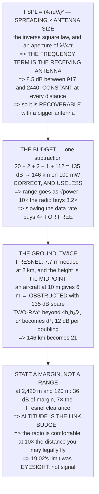

# FRA.02 The link budget

<!-- glance:start -->
<!-- generated by tools/build.py from curriculum/syllabus.yaml — edit the syllabus, not this block -->

| | |
|---|---|
| **Track** | Optional foundation |
| **Difficulty** | Beginner |
| **Time** | 1 h |
| **Hardware** | none |
| **Software** | python |
| **Prerequisites** | [FRA.01 RF in 45 minutes: frequency, wavelength, decibels](FRA.01-rf-in-45-minutes.md) |
| **Skip if** | You can compute an achievable range from a link budget and state the margin you left. |

<!-- glance:end -->

## What you will learn

- That free-space path loss is **spreading × antenna size**, and that **the frequency term is the
  receiving antenna, not the propagation** — 8.5 dB between 917 and 2440 MHz, **constant at every
  distance**
- How to assemble a link budget in one subtraction, landing on
  [09.01](../../09-telemetry-datalink/09.01-rf-and-link-budget.md)'s **135 dB and 146 km on 100 mW**
- That **range goes as the square root of power**: ten times the transmitter buys **3.2×**, while
  slowing the data rate buys **4× for free**
- That the **Fresnel zone** needs **7.7 m clear at 2 km**, and that the height that matters is the
  **midpoint** — half the aircraft's altitude, because the other end is standing on the ground
- That beyond a **breakpoint** the ground reflection turns `d²` into `d⁴`, and **146 km becomes 21**
- That the right statement about a link is **a margin at the range you fly**, not a range — and that
  19.02's mission has **36 dB of it**

## Why it matters

The link budget is the most-quoted and least-believed calculation in this hobby, because it produces
an answer off by two orders of magnitude and then everybody shrugs. That is a bad habit: the
calculation is not wrong, it is *incomplete*, and the missing pieces are exactly the ones you can do
something about.

Knowing them changes what you do on site. The Fresnel result says **altitude is the link budget** —
the same aircraft at 10 m is obstructed and at 120 m has seven times the clearance it needs, with
nothing changed but height. The two-ray result says there is a floor beyond which extra power buys
almost nothing.

And the last section changes how you *report* a link. "Two kilometres of range" is not a
specification. "Thirty-six decibels of margin at two point four kilometres" is, and it is the
difference between a claim and an engineering statement.

## Prerequisites

<!-- prereqs:start -->
## Prerequisites

You need these first:

- [FRA.01 RF in 45 minutes: frequency, wavelength, decibels](FRA.01-rf-in-45-minutes.md)

### Optional prerequisite links

None.

Check your readiness: `python course.py why FRA.02`
<!-- prereqs:end -->

## Concept

A link budget is an accounting exercise with one line of physics in it.

Everything you *have* is transmit power plus antenna gains minus cable losses. Everything the
receiver *needs* is its sensitivity — which [FRA.01](FRA.01-rf-in-45-minutes.md) derived from the
thermal noise floor. The difference is how many decibels you can afford to lose on the way.

The one line of physics is what the path takes. In free space that is pure geometry: the signal
spreads over a sphere and the receiver catches a small piece of it. Near the ground it is two other
things as well — an obstructed ellipsoid and a reflection that arrives out of phase — and both of
them are about **height** rather than about power.

Putting the three together gives a number you can defend, which is a different thing from the number
the formula gives.

## Technical explanation

### Level 1 — free-space path loss, and what the frequency term really is

Nothing absorbs a radio wave in free space. So why does a signal get weaker? **Because it spreads.**

| distance | sphere area (m²) | density |
|---|---|---|
| 1 m | 1.257e+01 | 7.958e−03 |
| 10 m | 1.257e+03 | 7.958e−05 |
| 100 m | 1.257e+05 | 7.958e−07 |
| 1000 m | 1.257e+07 | 7.958e−09 |
| 2420 m | 7.359e+07 | 1.359e−09 |

That is the inverse square law, and it is all there is. Doubling the distance quarters the density —
**6 dB**.

But a receiver does not catch a *density*, it catches a *power*, and how much depends on how big it
is. An isotropic antenna's effective area is `A = λ²/4π`:

| band | λ | isotropic area (m²) |
|---|---|---|
| 433 MHz | 0.692 m | 0.03815 |
| **917 MHz** | **0.327 m** | **0.00851** |
| **2440 MHz** | **0.123 m** | **0.00120** |
| 5800 MHz | 0.052 m | 0.00021 |

917 MHz catches **7.1×** more than 2440. Multiply the two and you have the whole formula:

`FSPL = (4πd/λ)²`

Read that carefully, because it is the most misunderstood line in radio. **The frequency term is not
propagation.** Free space does not attenuate 2.4 GHz more than 917 MHz — it treats them identically.
The 7.1× difference is **entirely the receiving antenna being smaller**, because a quarter wave at
2440 MHz is 3.1 cm instead of 8.2.

Which means **it is recoverable**: put a same-*size* antenna on 2.4 GHz — a bigger one in wavelengths
— and the gain comes back. That is why dishes are a high-band idea.

| distance | 917 MHz | 2440 MHz | difference |
|---|---|---|---|
| 100 m | 71.7 dB | 80.2 dB | **8.5 dB** |
| 1000 m | 91.7 dB | 100.2 dB | **8.5 dB** |
| 2420 m | 99.4 dB | 107.9 dB | **8.5 dB** |
| 10 km | 111.7 dB | 120.2 dB | **8.5 dB** |

**8.5 dB, constant at every distance** — the signature of a term that has nothing to do with
propagation at all.

### Level 2 — the budget, and the absurd answer

| | | running |
|---|---|---|
| transmitter | 20.0 dBm | 20.0 dBm |
| tx antenna | +2.0 dBi | 22.0 dBm |
| rx antenna | +2.0 dBi | 24.0 dBm |
| cable | −1.0 dB | 23.0 dBm |
| receiver sensitivity | −112.0 dBm | |
| **LINK BUDGET** | | **135.0 dB** |

135 dB to spend — 09.01's figure exactly.

| link | budget | free-space range |
|---|---|---|
| **09.04's SiK, 917 MHz** | **135.0 dB** | **146.3 km** |
| 09.02's ELRS 50 Hz | 140.0 dB | 97.8 km |
| 09.02's ELRS 250 Hz | 131.0 dB | 34.7 km |
| 09.02's ELRS 500 Hz | 128.0 dB | 24.6 km |

**146 kilometres on a hundred milliwatts.** That number is **correct** and it is **useless**, and
knowing both of those at once is the point of this lesson. It is correct because nothing in it is
wrong — the physics of Level 1 really does give 135 dB at 146 km. It is useless because free space
does not exist near the ground, which is where the whole flight happens.

Notice the shape of the scale first, though:

| extra | range | what buys it |
|---|---|---|
| +3 dB | 1.41× | double the power |
| +6 dB | 2.00× | 4× the power, or +6 dBi |
| **+12 dB** | **3.98×** | **ELRS 500 Hz → 50 Hz** |
| +20 dB | 10.00× | 100× the power |

**Range goes as the square root of power.** Ten times the transmitter buys **3.2×**; 09.02's free
12 dB from slowing down buys **4×**, from a setting.

### Level 3 — why you do not get it: the ground

**First, the Fresnel zone.** A radio link is not a line, it is an **ellipsoid**, and the signal
arrives through the whole volume. Block part of it and you lose signal with a clear line of sight:
`r = √(λ d₁ d₂ / d)`.

| span | r at midpoint | 60 % of it | at 2440 MHz |
|---|---|---|---|
| 500 m | 6.4 m | 3.8 m | 3.9 m |
| 1000 m | 9.0 m | 5.4 m | 5.5 m |
| **2000 m** | **12.8 m** | **7.7 m** | 7.8 m |
| 2420 m | 14.1 m | 8.4 m | 8.6 m |
| 5000 m | 20.2 m | 12.1 m | 12.4 m |

And the height that matters is at the **midpoint**, which is the **average of the two ends** — not
the aircraft's altitude:

| | |
|---|---|
| ground antenna on a tripod | 2.0 m |
| aircraft | 10.0 m |
| **the line of sight is** | **6.0 m** |
| it needs | 7.7 m |
| **verdict** | **OBSTRUCTED** |

**With 135 dB of budget spare.** The budget was never the constraint — the geometry was. And note
where the 6 m came from: **half the aircraft's altitude, because the other end of the link is
standing on the ground.**

**Second, the ground reflection.** A second copy of the signal arrives off the ground, and beyond a
breakpoint it starts cancelling the first: `d_break = 4 h₁ h₂ / λ`.

| geometry | h₁ | h₂ | breakpoint |
|---|---|---|---|
| both on the ground | 2.0 | 2.0 | 49 m |
| low hover | 2.0 | 10.0 | 245 m |
| half height | 2.0 | 50.0 | 1,224 m |
| **18.04's ceiling** | **2.0** | **120.0** | **2,936 m** |

Beyond the breakpoint, loss goes as `d⁴` instead of `d²` — **12 dB per doubling instead of 6**:

| distance | free space | two-ray **[E]** | penalty |
|---|---|---|---|
| 1.0 km | 91.7 dB | 91.7 dB | 0.0 dB |
| 2.4 km | 99.4 dB | 99.4 dB | 0.0 dB |
| 5.0 km | 105.7 dB | 110.3 dB | 4.6 dB |
| 10.0 km | 111.7 dB | 122.3 dB | 10.6 dB |
| 20.0 km | 117.7 dB | 134.4 dB | **16.7 dB** |

| | |
|---|---|
| free-space range | 146.3 km |
| **two-ray range at 120 m [E]** | **20.7 km** |
| the ground costs | **7.1×** |

**146 km becomes 21.** The formula was not wrong; the world had a floor in it.

> [!TIP]
> **Ask your teacher:** "How high is the ground station antenna?" It is the term nobody writes down
> and it appears in both of Level 3's results — it sets the Fresnel midpoint and it sets the
> breakpoint. A tripod is worth more than a bigger radio, and costs less.

### Level 4 — what this means for 19.02's mission

| | |
|---|---|
| 19.02's VLOS limit | 2,420 m |
| 18.04's ceiling | 120 m |
| Fresnel radius at midpoint | 14.1 m |
| 60 % of it | 8.4 m |
| **the line of sight clears** | **61.0 m** |
| **margin** | **7.2×** |

**Seven times the clearance it needs.** At 10 m it failed; at 120 m it passes by 7×, with nothing
changed but height. **Altitude is the link budget.**

| | |
|---|---|
| path loss at 2,420 m | 99.4 dB |
| the budget | 135.0 dB |
| **FADE MARGIN** | **35.6 dB** |

36 dB of margin is a factor of **3,655** in received power, and it is the right way to state a link:
**not a range, a margin at the range you fly.**

| margin | verdict | |
|---|---|---|
| 0 dB | MARGINAL | works on a good day |
| 6 dB | thin | a wing between you drops it |
| **10 dB** | **workable** | the usual design target |
| 20 dB | comfortable | survives most things |
| 30 dB | over-engineered | spend it elsewhere |

So the honest statement about 19.02's mission is not "146 km of range". It is: **at 2,420 m and 120 m
altitude we have 36 dB of fade margin and 7× the Fresnel clearance we need — so the radio is not what
limits this flight.**

19.02 already found what does: **eyesight**. The aircraft is a dot at 2,420 m and its attitude is
unreadable past 242. **The link budget is comfortable at ten times the distance you are legally
allowed to fly.**

## Diagram



## Code

The whole budget derived rather than quoted: the inverse-square law and the isotropic aperture
multiplied into FSPL, 09.01's 135 dB assembled line by line and inverted into a range, the Fresnel
radius with the midpoint geometry that decides it, and a two-ray breakpoint that turns the free-space
answer into the real one.

```python
"""FRA.02 -- the link budget, and the two terms that make the answer wrong.

Pure stdlib. A foundation lesson for 09.01, which computes 146 km and
then spends the rest of the lesson explaining why you do not get it.
"""

import math

BAR = "=" * 70

C = 299792458.0

# 09.01's link, exactly
P_TX = 20.0               # dBm
G_TX = 2.0                # dBi
G_RX = 2.0                # dBi
L_CABLE = 1.0             # dB, each end
SENS_SIK = -112.0         # dBm
F_SIK = 917.0             # MHz
F_ELRS = 2440.0

VLOS = 2420.0             # 19.02
AGL = 120.0               # 18.04's ceiling
H_GCS = 2.0               # [E] antenna on a tripod


def head(n, title):
    print()
    print(BAR)
    print("%d. %s" % (n, title))
    print(BAR)
    print()


def lam(f_mhz):
    return C / (f_mhz * 1e6)


def fspl(d_m, f_mhz):
    """Free-space path loss in dB, from first principles."""
    return 20 * math.log10(4 * math.pi * d_m / lam(f_mhz))


def budget(f_mhz, sens):
    """09.01's accounting: both antennas, one cable loss."""
    return P_TX + G_TX + G_RX - L_CABLE - sens


def range_for(loss_db, f_mhz):
    """Invert fspl."""
    return lam(f_mhz) / (4 * math.pi) * 10 ** (loss_db / 20.0)


def fresnel_r(d1, d2, f_mhz):
    d = d1 + d2
    return math.sqrt(lam(f_mhz) * d1 * d2 / d)


# ======================================================================
head(1, "FREE-SPACE PATH LOSS, AND WHAT THE FREQUENCY TERM REALLY IS")

print("  Nothing absorbs a radio wave in free space. So why does a")
print("  signal get weaker? BECAUSE IT SPREADS.")
print()
print("  A transmitter radiating P watts into empty space puts that")
print("  power over the surface of a growing sphere:")
print()
print("      power density = P / (4 pi d^2)")
print()
print("  %-16s %20s %18s" % ("distance", "sphere area (m2)",
                             "density"))
for d in (1.0, 10.0, 100.0, 1000.0, VLOS):
    a = 4 * math.pi * d * d
    print("  %-14s %20.3e %16.3e" % ("%.0f m" % d, a, 0.1 / a))
print()
print("  THAT IS THE INVERSE SQUARE LAW, AND IT IS ALL THERE IS.")
print("  Doubling the distance quarters the density -- %.0f dB."
      % (20 * math.log10(2)))
print()
print("  BUT A RECEIVER DOES NOT CATCH A DENSITY, IT CATCHES A POWER,")
print("  and how much it catches depends on how big it is. An")
print("  isotropic antenna's EFFECTIVE AREA is:")
print()
print("      A = lambda^2 / (4 pi)")
print()
print("  %-16s %18s %20s" % ("band", "lambda", "isotropic area (m2)"))
for f in (433.0, 917.0, 2440.0, 5800.0):
    a = lam(f) ** 2 / (4 * math.pi)
    print("  %-14s %16.3f m %18.5f" % ("%.0f MHz" % f, lam(f), a))
print()
print("  %-38s %14.1f x" % ("917 MHz catches more than 2440 by",
                            (lam(917.0) ** 2) / (lam(2440.0) ** 2)))
print()
print("  MULTIPLY THE TWO AND YOU HAVE THE WHOLE FORMULA:")
print()
print("      FSPL = (4 pi d / lambda)^2")
print()
print("  READ THAT CAREFULLY, BECAUSE IT IS THE MOST MISUNDERSTOOD")
print("  LINE IN RADIO. THE FREQUENCY TERM IS NOT PROPAGATION.")
print("  Free space does not attenuate 2.4 GHz more than 917 MHz --")
print("  IT TREATS THEM IDENTICALLY. The %.1f x difference is entirely"
      % ((lam(917.0) ** 2) / (lam(2440.0) ** 2)))
print("  the RECEIVING ANTENNA BEING SMALLER, because a quarter wave")
print("  at 2440 MHz is %.1f cm instead of %.1f."
      % (lam(2440.0) * 25, lam(917.0) * 25))
print()
print("  WHICH MEANS IT IS RECOVERABLE. Put a same-SIZE antenna on")
print("  2.4 GHz -- a bigger one, in wavelengths -- and the gain")
print("  comes back. That is why dishes are a high-band idea.")
print()
print("  %-14s %16s %16s %16s" % ("distance", "917 MHz", "2440 MHz",
                                  "difference"))
for d in (100.0, 500.0, 1000.0, VLOS, 10000.0):
    a, b = fspl(d, F_SIK), fspl(d, F_ELRS)
    print("  %-12s %14.1f dB %14.1f dB %14.1f dB"
          % ("%.0f m" % d, a, b, b - a))
print()
print("  %.1f dB, CONSTANT AT EVERY DISTANCE, which is the signature"
      % (fspl(1000.0, F_ELRS) - fspl(1000.0, F_SIK)))
print("  of a term that has nothing to do with propagation at all.")

# ======================================================================
head(2, "THE BUDGET, AND THE ABSURD ANSWER")

print("  A link budget is one subtraction. Everything you have,")
print("  minus everything the receiver needs:")
print()
rows = (("transmitter", P_TX, "dBm"), ("tx antenna", G_TX, "dBi"),
        ("rx antenna", G_RX, "dBi"), ("cable", -L_CABLE, "dB"))
run = 0.0
for name, v, unit in rows:
    run += v
    print("  %-26s %10.1f %-6s %14.1f dBm" % (name, v, unit, run))
print("  %-26s %10.1f %-6s" % ("receiver sensitivity", SENS_SIK, "dBm"))
link = budget(F_SIK, SENS_SIK)
print("  %-26s %10s %-6s %14.1f dB" % ("  LINK BUDGET", "", "", link))
print()
print("  %.0f dB TO SPEND -- 09.01's figure exactly. Now ask how far"
      % link)
print("  that buys:")
print()
print("  %-24s %14s %18s" % ("link", "budget (dB)", "free-space range"))
LINKS = (("09.04's SiK, 917 MHz", F_SIK, SENS_SIK),
         ("09.02's ELRS 50 Hz", F_ELRS, -117.0),
         ("09.02's ELRS 250 Hz", F_ELRS, -108.0),
         ("09.02's ELRS 500 Hz", F_ELRS, -105.0))
for name, f, sens in LINKS:
    b = budget(f, sens)
    print("  %-22s %14.1f %16.1f km"
          % (name, b, range_for(b, f) / 1000.0))

sik_km = range_for(link, F_SIK) / 1000.0
print()
print("  %.0f KILOMETRES ON A HUNDRED MILLIWATTS." % sik_km)
print()
print("  That number is CORRECT and it is USELESS, and knowing both")
print("  of those things at once is the point of this lesson.")
print()
print("  It is correct because nothing in it is wrong: the physics of")
print("  section 1 really does give %.0f dB of loss at %.0f km."
      % (fspl(sik_km * 1000, F_SIK), sik_km))
print()
print("  It is useless because free space does not exist near the")
print("  ground, which is where the whole flight happens.")
print()
print("  NOTICE THE SHAPE OF THE SCALE FIRST, THOUGH:")
print()
print("  %-24s %16s %18s" % ("extra dB", "range x", "what buys it"))
for extra, what in ((3.0, "double the power"),
                    (6.0, "4 x the power, or +6 dBi"),
                    (12.0, "ELRS 500 Hz -> 50 Hz"),
                    (20.0, "100 x the power")):
    print("  %-22s %16.2f x %18s"
          % ("+%.0f dB" % extra, 10 ** (extra / 20.0), what))
print()
print("  RANGE GOES AS THE SQUARE ROOT OF POWER. Ten times the")
print("  transmitter buys %.1f times the range, and 09.02's free"
      % (10 ** (10 / 20.0)))
print("  12 dB from slowing down buys %.0f times -- from a setting."
      % (10 ** (12 / 20.0)))

# ======================================================================
head(3, "WHY YOU DO NOT GET IT: THE GROUND")

print("  Two things stand between the formula and the flight, and")
print("  both of them are the ground.")
print()
print("  FIRST, THE FRESNEL ZONE. A radio link is not a line, it is")
print("  an ELLIPSOID, and the signal arrives through the whole")
print("  volume. Block part of it and you lose signal even with a")
print("  clear line of sight:")
print()
print("      r = sqrt( lambda d1 d2 / d )")
print()
print("  %-18s %18s %18s %14s"
      % ("span", "r at midpoint", "60 % of it", "at 2440 MHz"))
for d in (500.0, 1000.0, 2000.0, VLOS, 5000.0):
    r = fresnel_r(d / 2, d / 2, F_SIK)
    r24 = fresnel_r(d / 2, d / 2, F_ELRS)
    print("  %-16s %16.1f m %16.1f m %12.1f m"
          % ("%.0f m" % d, r, 0.6 * r, r24))

r2k = fresnel_r(1000.0, 1000.0, F_SIK)
print()
print("  09.01's 2 km case: r = %.1f m, and you need %.1f m clear."
      % (r2k, 0.6 * r2k))
print()
print("  AND THE HEIGHT THAT MATTERS IS AT THE MIDPOINT, which is the")
print("  AVERAGE of the two ends -- not the aircraft's altitude:")
print()
print("  %-34s %14.1f m" % ("ground antenna on a tripod", H_GCS))
print("  %-34s %14.1f m" % ("aircraft", 10.0))
print("  %-34s %14.1f m" % ("  the line of sight is", (H_GCS + 10.0) / 2))
print("  %-34s %14.1f m" % ("  it needs", 0.6 * r2k))
print("  %-34s %14s" % ("  verdict",
                        "OBSTRUCTED" if (H_GCS + 10.0) / 2 < 0.6 * r2k
                        else "clears"))
print()
print("  WITH %.0f dB OF BUDGET SPARE. The budget was never the"
      % link)
print("  constraint -- THE GEOMETRY WAS. And note where the number")
print("  came from: HALF THE AIRCRAFT'S ALTITUDE, because the other")
print("  end of the link is standing on the ground.")
print()
print("  SECOND, THE GROUND REFLECTION. A second copy of the signal")
print("  arrives off the ground, and beyond a breakpoint it starts")
print("  cancelling the first:")
print()
print("      d_break = 4 h1 h2 / lambda")
print()
print("  %-20s %12s %12s %20s"
      % ("geometry", "h1 (m)", "h2 (m)", "breakpoint"))
for h1, h2, what in ((H_GCS, 2.0, "both on the ground"),
                     (H_GCS, 10.0, "low hover"),
                     (H_GCS, 50.0, "half height"),
                     (H_GCS, AGL, "18.04's ceiling")):
    dbk = 4 * h1 * h2 / lam(F_SIK)
    print("  %-18s %12.1f %12.1f %18.0f m" % (what, h1, h2, dbk))

d_break = 4 * H_GCS * AGL / lam(F_SIK)
print()
print("  BEYOND THE BREAKPOINT, LOSS GOES AS d^4 INSTEAD OF d^2 --")
print("  %.0f dB per doubling instead of %.0f:"
      % (40 * math.log10(2), 20 * math.log10(2)))
print()
print("  %-16s %16s %16s %14s"
      % ("distance", "free space", "two-ray [E]", "penalty"))
for d in (1000.0, 2000.0, VLOS, 5000.0, 10000.0, 20000.0):
    f_s = fspl(d, F_SIK)
    if d <= d_break:
        two = f_s
    else:
        two = f_s + 40 * math.log10(d / d_break) - 20 * math.log10(
            d / d_break)
    print("  %-14s %14.1f dB %14.1f dB %12.1f dB"
          % ("%.1f km" % (d / 1000.0), f_s, two, two - f_s))

print()
print("  AND NOW ASK THE RANGE QUESTION AGAIN, HONESTLY:")
print()
# solve two-ray range for the budget
d = d_break
while True:
    loss = fspl(d, F_SIK) + 20 * math.log10(d / d_break)
    if loss >= link:
        break
    d += 10.0
print("  %-38s %14.1f km" % ("free-space range", sik_km))
print("  %-38s %14.1f km" % ("two-ray range at 120 m [E]", d / 1000.0))
print("  %-38s %14.1f x" % ("  the ground costs", sik_km / (d / 1000)))
print()
print("  %.0f km BECOMES %.0f. The formula was not wrong; THE WORLD"
      % (sik_km, d / 1000.0))
print("  HAD A FLOOR IN IT.")

# ======================================================================
head(4, "WHAT THIS MEANS FOR 19.02's MISSION")

print("  Put the real mission in and the answer changes character")
print("  completely:")
print()
r_v = fresnel_r(VLOS / 2, VLOS / 2, F_SIK)
print("  %-38s %14.0f m" % ("19.02's VLOS limit", VLOS))
print("  %-38s %14.0f m" % ("18.04's ceiling", AGL))
print("  %-38s %14.1f m" % ("Fresnel radius at midpoint", r_v))
print("  %-38s %14.1f m" % ("  60 per cent of it", 0.6 * r_v))
h_mid = (H_GCS + AGL) / 2
print("  %-38s %14.1f m" % ("  the line of sight clears", h_mid))
print("  %-38s %14.1f x" % ("  margin", h_mid / (0.6 * r_v)))
print()
print("  %.0f TIMES THE CLEARANCE IT NEEDS. Over flat ground at"
      % (h_mid / (0.6 * r_v)))
print("  %.0f m, the Fresnel zone is not close to being a problem --"
      % AGL)
print("  and the reason is ALTITUDE. At 10 m it failed; at %.0f m it"
      % AGL)
print("  passes by %.0f x. ALTITUDE IS THE LINK BUDGET."
      % (h_mid / (0.6 * r_v)))
print()
print("  AND THE BUDGET AT THAT RANGE:")
print()
loss_v = fspl(VLOS, F_SIK)
if VLOS > d_break:
    loss_v += 20 * math.log10(VLOS / d_break)
print("  %-38s %14.1f dB" % ("path loss at %.0f m" % VLOS, loss_v))
print("  %-38s %14.1f dB" % ("  the budget", link))
print("  %-38s %14.1f dB" % ("  FADE MARGIN", link - loss_v))
print()
print("  %.0f dB OF MARGIN. Which is a factor of %.0f in received"
      % (link - loss_v, 10 ** ((link - loss_v) / 10)))
print("  power, and it is the right way to state a link: NOT a")
print("  range, A MARGIN AT THE RANGE YOU FLY.")
print()
print("  %-28s %16s %24s" % ("margin", "verdict", ""))
for m, verdict, note in ((0.0, "MARGINAL", "works on a good day"),
                         (6.0, "thin", "a wing between you drops it"),
                         (10.0, "workable", "the usual design target"),
                         (20.0, "comfortable", "survives most things"),
                         (30.0, "over-engineered", "spend it elsewhere")):
    print("  %-26s %16s %24s" % ("%.0f dB" % m, verdict, note))
print()
print("  SO THE HONEST STATEMENT ABOUT 19.02's MISSION IS NOT '%.0f km"
      % sik_km)
print("  of range'. IT IS: at %.0f m and %.0f m altitude we have"
      % (VLOS, AGL))
print("  %.0f dB of fade margin and %.0f times the Fresnel clearance"
      % (link - loss_v, h_mid / (0.6 * r_v)))
print("  we need -- SO THE RADIO IS NOT WHAT LIMITS THIS FLIGHT.")
print()
print("  19.02 already found what does: EYESIGHT. The aircraft is a")
print("  dot at %.0f m and its attitude is unreadable past %.0f."
      % (2420.0, 242.0))
print("  THE LINK BUDGET IS COMFORTABLE AT TEN TIMES THE DISTANCE")
print("  YOU ARE LEGALLY ALLOWED TO FLY.")

# ======================================================================
print()
print(BAR)
print("THE FOUR THINGS TO CARRY FORWARD")
print(BAR)
print()
print("  1. FSPL is spreading times antenna size. THE FREQUENCY TERM")
print("     IS THE RECEIVING ANTENNA, NOT THE PROPAGATION -- %.1f dB"
      % (fspl(1000.0, F_ELRS) - fspl(1000.0, F_SIK)))
print("     between 917 and 2440, constant at every distance.")
print("  2. The budget is one subtraction and it says %.0f km on"
      % sik_km)
print("     100 mW. It is CORRECT AND USELESS. Range goes as the")
print("     SQUARE ROOT of power: 10 x the transmitter buys %.1f x."
      % (10 ** (10 / 20.0)))
print("  3. The ground takes it away twice: the FRESNEL ZONE needs")
print("     %.1f m clear at 2 km (a link to an aircraft at 10 m is"
      % (0.6 * r2k))
print("     OBSTRUCTED at its midpoint with %.0f dB spare) and the"
      % link)
print("     two-ray floor turns %.0f km" % sik_km)
print("     into %.0f." % (d / 1000.0))
print("  4. STATE A MARGIN, NOT A RANGE. At 19.02's %.0f m and %.0f m"
      % (VLOS, AGL))
print("     the mission has %.0f dB of margin and %.0f x the Fresnel"
      % (link - loss_v, h_mid / (0.6 * r_v)))
print("     clearance it needs. THE RADIO IS NOT THE LIMIT --")
print("     EYESIGHT IS.")
```

Output:

```text

======================================================================
1. FREE-SPACE PATH LOSS, AND WHAT THE FREQUENCY TERM REALLY IS
======================================================================

  Nothing absorbs a radio wave in free space. So why does a
  signal get weaker? BECAUSE IT SPREADS.

  A transmitter radiating P watts into empty space puts that
  power over the surface of a growing sphere:

      power density = P / (4 pi d^2)

  distance             sphere area (m2)            density
  1 m                       1.257e+01        7.958e-03
  10 m                      1.257e+03        7.958e-05
  100 m                     1.257e+05        7.958e-07
  1000 m                    1.257e+07        7.958e-09
  2420 m                    7.359e+07        1.359e-09

  THAT IS THE INVERSE SQUARE LAW, AND IT IS ALL THERE IS.
  Doubling the distance quarters the density -- 6 dB.

  BUT A RECEIVER DOES NOT CATCH A DENSITY, IT CATCHES A POWER,
  and how much it catches depends on how big it is. An
  isotropic antenna's EFFECTIVE AREA is:

      A = lambda^2 / (4 pi)

  band                         lambda  isotropic area (m2)
  433 MHz                   0.692 m            0.03815
  917 MHz                   0.327 m            0.00851
  2440 MHz                  0.123 m            0.00120
  5800 MHz                  0.052 m            0.00021

  917 MHz catches more than 2440 by                 7.1 x

  MULTIPLY THE TWO AND YOU HAVE THE WHOLE FORMULA:

      FSPL = (4 pi d / lambda)^2

  READ THAT CAREFULLY, BECAUSE IT IS THE MOST MISUNDERSTOOD
  LINE IN RADIO. THE FREQUENCY TERM IS NOT PROPAGATION.
  Free space does not attenuate 2.4 GHz more than 917 MHz --
  IT TREATS THEM IDENTICALLY. The 7.1 x difference is entirely
  the RECEIVING ANTENNA BEING SMALLER, because a quarter wave
  at 2440 MHz is 3.1 cm instead of 8.2.

  WHICH MEANS IT IS RECOVERABLE. Put a same-SIZE antenna on
  2.4 GHz -- a bigger one, in wavelengths -- and the gain
  comes back. That is why dishes are a high-band idea.

  distance                917 MHz         2440 MHz       difference
  100 m                  71.7 dB           80.2 dB            8.5 dB
  500 m                  85.7 dB           94.2 dB            8.5 dB
  1000 m                 91.7 dB          100.2 dB            8.5 dB
  2420 m                 99.4 dB          107.9 dB            8.5 dB
  10000 m               111.7 dB          120.2 dB            8.5 dB

  8.5 dB, CONSTANT AT EVERY DISTANCE, which is the signature
  of a term that has nothing to do with propagation at all.

======================================================================
2. THE BUDGET, AND THE ABSURD ANSWER
======================================================================

  A link budget is one subtraction. Everything you have,
  minus everything the receiver needs:

  transmitter                      20.0 dBm              20.0 dBm
  tx antenna                        2.0 dBi              22.0 dBm
  rx antenna                        2.0 dBi              24.0 dBm
  cable                            -1.0 dB               23.0 dBm
  receiver sensitivity           -112.0 dBm   
    LINK BUDGET                                         135.0 dB

  135 dB TO SPEND -- 09.01's figure exactly. Now ask how far
  that buys:

  link                        budget (dB)   free-space range
  09.04's SiK, 917 MHz            135.0            146.3 km
  09.02's ELRS 50 Hz              140.0             97.8 km
  09.02's ELRS 250 Hz             131.0             34.7 km
  09.02's ELRS 500 Hz             128.0             24.6 km

  146 KILOMETRES ON A HUNDRED MILLIWATTS.

  That number is CORRECT and it is USELESS, and knowing both
  of those things at once is the point of this lesson.

  It is correct because nothing in it is wrong: the physics of
  section 1 really does give 135 dB of loss at 146 km.

  It is useless because free space does not exist near the
  ground, which is where the whole flight happens.

  NOTICE THE SHAPE OF THE SCALE FIRST, THOUGH:

  extra dB                          range x       what buys it
  +3 dB                              1.41 x   double the power
  +6 dB                              2.00 x 4 x the power, or +6 dBi
  +12 dB                             3.98 x ELRS 500 Hz -> 50 Hz
  +20 dB                            10.00 x    100 x the power

  RANGE GOES AS THE SQUARE ROOT OF POWER. Ten times the
  transmitter buys 3.2 times the range, and 09.02's free
  12 dB from slowing down buys 4 times -- from a setting.

======================================================================
3. WHY YOU DO NOT GET IT: THE GROUND
======================================================================

  Two things stand between the formula and the flight, and
  both of them are the ground.

  FIRST, THE FRESNEL ZONE. A radio link is not a line, it is
  an ELLIPSOID, and the signal arrives through the whole
  volume. Block part of it and you lose signal even with a
  clear line of sight:

      r = sqrt( lambda d1 d2 / d )

  span                    r at midpoint         60 % of it    at 2440 MHz
  500 m                         6.4 m              3.8 m          3.9 m
  1000 m                        9.0 m              5.4 m          5.5 m
  2000 m                       12.8 m              7.7 m          7.8 m
  2420 m                       14.1 m              8.4 m          8.6 m
  5000 m                       20.2 m             12.1 m         12.4 m

  09.01's 2 km case: r = 12.8 m, and you need 7.7 m clear.

  AND THE HEIGHT THAT MATTERS IS AT THE MIDPOINT, which is the
  AVERAGE of the two ends -- not the aircraft's altitude:

  ground antenna on a tripod                    2.0 m
  aircraft                                     10.0 m
    the line of sight is                        6.0 m
    it needs                                    7.7 m
    verdict                              OBSTRUCTED

  WITH 135 dB OF BUDGET SPARE. The budget was never the
  constraint -- THE GEOMETRY WAS. And note where the number
  came from: HALF THE AIRCRAFT'S ALTITUDE, because the other
  end of the link is standing on the ground.

  SECOND, THE GROUND REFLECTION. A second copy of the signal
  arrives off the ground, and beyond a breakpoint it starts
  cancelling the first:

      d_break = 4 h1 h2 / lambda

  geometry                   h1 (m)       h2 (m)           breakpoint
  both on the ground          2.0          2.0                 49 m
  low hover                   2.0         10.0                245 m
  half height                 2.0         50.0               1224 m
  18.04's ceiling             2.0        120.0               2936 m

  BEYOND THE BREAKPOINT, LOSS GOES AS d^4 INSTEAD OF d^2 --
  12 dB per doubling instead of 6:

  distance               free space      two-ray [E]        penalty
  1.0 km                   91.7 dB           91.7 dB          0.0 dB
  2.0 km                   97.7 dB           97.7 dB          0.0 dB
  2.4 km                   99.4 dB           99.4 dB          0.0 dB
  5.0 km                  105.7 dB          110.3 dB          4.6 dB
  10.0 km                 111.7 dB          122.3 dB         10.6 dB
  20.0 km                 117.7 dB          134.4 dB         16.7 dB

  AND NOW ASK THE RANGE QUESTION AGAIN, HONESTLY:

  free-space range                                146.3 km
  two-ray range at 120 m [E]                       20.7 km
    the ground costs                                7.1 x

  146 km BECOMES 21. The formula was not wrong; THE WORLD
  HAD A FLOOR IN IT.

======================================================================
4. WHAT THIS MEANS FOR 19.02's MISSION
======================================================================

  Put the real mission in and the answer changes character
  completely:

  19.02's VLOS limit                               2420 m
  18.04's ceiling                                   120 m
  Fresnel radius at midpoint                       14.1 m
    60 per cent of it                               8.4 m
    the line of sight clears                       61.0 m
    margin                                          7.2 x

  7 TIMES THE CLEARANCE IT NEEDS. Over flat ground at
  120 m, the Fresnel zone is not close to being a problem --
  and the reason is ALTITUDE. At 10 m it failed; at 120 m it
  passes by 7 x. ALTITUDE IS THE LINK BUDGET.

  AND THE BUDGET AT THAT RANGE:

  path loss at 2420 m                              99.4 dB
    the budget                                    135.0 dB
    FADE MARGIN                                    35.6 dB

  36 dB OF MARGIN. Which is a factor of 3655 in received
  power, and it is the right way to state a link: NOT a
  range, A MARGIN AT THE RANGE YOU FLY.

  margin                                verdict                         
  0 dB                               MARGINAL      works on a good day
  6 dB                                   thin a wing between you drops it
  10 dB                              workable  the usual design target
  20 dB                           comfortable     survives most things
  30 dB                       over-engineered       spend it elsewhere

  SO THE HONEST STATEMENT ABOUT 19.02's MISSION IS NOT '146 km
  of range'. IT IS: at 2420 m and 120 m altitude we have
  36 dB of fade margin and 7 times the Fresnel clearance
  we need -- SO THE RADIO IS NOT WHAT LIMITS THIS FLIGHT.

  19.02 already found what does: EYESIGHT. The aircraft is a
  dot at 2420 m and its attitude is unreadable past 242.
  THE LINK BUDGET IS COMFORTABLE AT TEN TIMES THE DISTANCE
  YOU ARE LEGALLY ALLOWED TO FLY.

======================================================================
THE FOUR THINGS TO CARRY FORWARD
======================================================================

  1. FSPL is spreading times antenna size. THE FREQUENCY TERM
     IS THE RECEIVING ANTENNA, NOT THE PROPAGATION -- 8.5 dB
     between 917 and 2440, constant at every distance.
  2. The budget is one subtraction and it says 146 km on
     100 mW. It is CORRECT AND USELESS. Range goes as the
     SQUARE ROOT of power: 10 x the transmitter buys 3.2 x.
  3. The ground takes it away twice: the FRESNEL ZONE needs
     7.7 m clear at 2 km (a link to an aircraft at 10 m is
     OBSTRUCTED at its midpoint with 135 dB spare) and the
     two-ray floor turns 146 km
     into 21.
  4. STATE A MARGIN, NOT A RANGE. At 19.02's 2420 m and 120 m
     the mission has 36 dB of margin and 7 x the Fresnel
     clearance it needs. THE RADIO IS NOT THE LIMIT --
     EYESIGHT IS.
```

## Exercise

### Exercise FRA.02-E1 — Separate the two frequency effects `[analysis]`

Compute FSPL at 917 and 2440 MHz over a range of distances and confirm the difference is constant.
Then compute what antenna gain at 2440 MHz cancels it exactly.

### Exercise FRA.02-E2 — Build your own budget `[analysis]`

Assemble the budget for every link on your aircraft, with your real numbers. Compute the free-space
range and write down why you do not believe it.

### Exercise FRA.02-E3 — Find your obstruction altitude `[analysis]`

For your longest planned leg, compute the Fresnel radius and the minimum altitude at which the
midpoint clears 60 % of it, given your ground antenna height.

### Exercise FRA.02-E4 — State your margin `[analysis]`

Compute the fade margin at the range you actually fly, for each link. Classify each against Level 4's
table and decide whether any of them needs attention.

## Expected result

**FRA.02-E1**: expect exactly 8.5 dB at every distance, and expect an 8.5 dBi antenna to cancel it —
which is a physically reasonable size at 2.4 GHz and not at 917.

**FRA.02-E2**: expect tens of kilometres and expect the answer to be dominated by the sensitivity
term rather than by anything you can buy.

**FRA.02-E3**: expect an altitude in the tens of metres, and expect it to be roughly twice what you
would have guessed, because the midpoint is an average.

**FRA.02-E4**: expect the control link to have less margin than the telemetry link despite being the
more critical one — and that is the finding worth acting on.

## Troubleshooting

**The link drops at short range and works at long range.** Ground reflection nulls below the
breakpoint. Change altitude, not power.

**Range is fine high and terrible low.** Level 3. The Fresnel midpoint.

**Adding a bigger antenna did not help.** Check where it pointed, and check whether the loss was
geometric rather than budgetary — 135 dB spare does not help an obstructed path.

**Doubling the power barely changed anything.** √2 in range, and less than that beyond the
breakpoint. Level 2's table.

**The measured RSSI is 20 dB below the budget.** Look for the geometry first and the cable second.
Both are cheaper to check than the radio.

**The link is worse over water than over a field.** Water is a much better reflector, so the two-ray
cancellation is deeper. This is the one case where the effect is dramatic.

**My two-ray number disagrees with a published propagation model.** Expected — the two-ray model is
a floor, not a prediction. Real environments sit between it and free space.

## Common mistakes

- **Believing the free-space range.** It is correct and useless.
- **Reading the frequency term as propagation.** It is antenna size, and recoverable.
- **Quoting a range instead of a margin.** A margin is a specification.
- **Using the aircraft's altitude for the Fresnel check.** It is the midpoint — the average.
- **Ignoring the ground station's antenna height.** It appears in both Level 3 results.
- **Buying power to fix an obstructed path.** 135 dB spare did not help.
- **Forgetting the data rate is a range control.** 12 dB, free.

## Knowledge check

<details>
<summary>Why does a signal get weaker in free space, and what is the frequency term doing there?</summary>

It gets weaker because it **spreads** — `P/4πd²`, the inverse square law, 6 dB per doubling. The
frequency term comes from the *receiving* end: an isotropic antenna's effective area is `λ²/4π`, so a
2440 MHz antenna catches **7.1× less** than a 917 MHz one. **Free space treats both frequencies
identically** — the 8.5 dB difference is constant at every distance, which is the giveaway. And
because it is an antenna effect, a bigger antenna in wavelengths recovers it.
</details>

<details>
<summary>How do you assemble a link budget, and what did it say?</summary>

Everything you have minus what the receiver needs: 20 dBm + 2 dBi + 2 dBi − 1 dB cable + 112 dB of
sensitivity = **135 dB**, which at 917 MHz is **146 km**. That is 09.01's number. It is arithmetically
correct and operationally useless, because free space does not exist near the ground.
</details>

<details>
<summary>You want twice the range. What does it cost?</summary>

**6 dB** — four times the transmit power, or +6 dBi of antenna, or a combination. Range goes as the
**square root** of power, so ten times the transmitter buys only **3.2×**. The cheapest 12 dB
available is halving the data rate twice, which costs latency and nothing else, and buys **4×**.
</details>

<details>
<summary>What is the Fresnel zone and which height goes into the check?</summary>

The link is an **ellipsoid**, not a line, and obstructing part of it costs signal even with clear
line of sight. You need about **60 % of the first Fresnel radius** clear — **7.7 m at a 2 km span at
917 MHz**. The height that matters is at the **midpoint of the path**, which is the **average of the
two ends**: an aircraft at 10 m with a 2 m ground antenna gives **6 m**, so the path is **obstructed
with 135 dB of budget spare**.
</details>

<details>
<summary>What does the ground reflection do, and where does it start?</summary>

A second copy of the signal arrives off the ground and cancels the first. Beyond a breakpoint at
`4h₁h₂/λ` — **2,936 m** for a 2 m antenna and a 120 m aircraft — loss goes as `d⁴` instead of `d²`:
**12 dB per doubling instead of 6**. That turns 146 km of free-space range into about **21 km**. It
is a floor rather than a prediction, and real environments sit between it and free space.
</details>

<details>
<summary>What is the right way to state a link's performance?</summary>

**A margin at the range you fly.** 19.02's mission at 2,420 m and 120 m altitude has **35.6 dB of
fade margin** and **7× the Fresnel clearance** it needs, against a 10 dB design target. That is a
statement you can defend; "146 km of range" is not. And it produces the useful conclusion: **the
radio is comfortable at ten times the distance you may legally fly, so the limit is eyesight, not
signal.**
</details>

## Practical challenge

Turn your link from a hope into a specification.

1. Write down the real transmit power, antenna gains and cable loss for each link (E2).
2. Find each receiver's sensitivity and check it against FRA.01's derivation.
3. Compute each budget and each free-space range, and write "not this" next to them.
4. Measure your ground station antenna height. Then raise it and measure again.
5. Compute the Fresnel radius and required midpoint clearance at your longest leg (E3).
6. Compute the minimum altitude that satisfies it, and add it to your mission plan.
7. Compute the fade margin at your actual operating range for each link (E4).
8. Fly the leg and log RSSI against distance. Compare the slope with 6 dB and 12 dB per doubling.

Step 8 tells you which regime you are actually in, which is the one thing no amount of arithmetic
will tell you.

## You can skip this if

You can compute an achievable range from a link budget and state the margin you left.

## Go deeper

- The ITU's recommendation on propagation by diffraction, which is where the Fresnel-clearance
  convention comes from: <https://www.itu.int/rec/R-REC-P.526/en>
- A practical two-ray and breakpoint treatment in the context of real radio planning:
  <https://en.wikipedia.org/wiki/Two-ray_ground-reflection_model>
- ArduPilot's SiK radio documentation, including the settings that trade data rate against
  sensitivity: <https://ardupilot.org/copter/docs/common-sik-telemetry-radio.html>

## Progress checkpoint

You can now derive free-space path loss and say exactly what the frequency term represents, assemble
a budget that matches 09.01's, compute the Fresnel clearance a path needs and the altitude that
provides it, recognise the two-ray floor, and state a link as a margin.

Next, FRA.03 opens the antenna itself. Gain was a number in this lesson; there it becomes a shape,
with nulls that point in specific directions — and the question becomes where **not** to point them.
