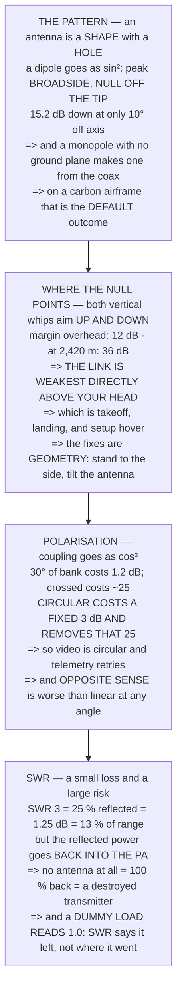

# FRA.03 Antennas: gain, pattern, polarisation

<!-- glance:start -->
<!-- generated by tools/build.py from curriculum/syllabus.yaml — edit the syllabus, not this block -->

| | |
|---|---|
| **Track** | Optional foundation |
| **Difficulty** | Beginner |
| **Time** | 1 h |
| **Hardware** | none |
| **Software** | python |
| **Prerequisites** | [FRA.02 The link budget](FRA.02-link-budget-math.md) |
| **Skip if** | You can place two antennas so that neither null points at the other vehicle, and explain polarisation loss. |

<!-- glance:end -->

## What you will learn

- That an antenna is **a shape with a hole in it**: a dipole peaks broadside and **nulls off the
  tip**, **15.2 dB down at only 10° off axis**
- That a monopole without a ground plane **makes one out of whatever is nearby** — on a carbon
  airframe, that is the default outcome
- That two vertical whips aim their nulls **up and down**, so the link is **weakest directly above
  your head**: **12 dB of margin overhead against 36 dB at 2,420 m**
- That this is why telemetry stutters on takeoff and is perfect at a kilometre — **it is the null**,
  and the fixes are geometry rather than power
- That polarisation couples as **cos²**: **1.2 dB at a 30° bank** and about **25 dB crossed**
- That **circular polarisation costs a fixed 3 dB and removes that variable 25** — but the **opposite
  sense is worse than linear at any angle**
- That **SWR 3 costs only 1.25 dB of signal**, and matters because the reflected power goes **back
  into the power amplifier** — and that **a perfect SWR proves nothing**, because a dummy load reads
  1.0

## Why it matters

[FRA.02](FRA.02-link-budget-math.md) concluded that 19.02's mission has 36 dB of margin and that the
radio is not what limits the flight. That conclusion is correct **and it has a hole in it, exactly
where you are standing.**

This lesson finds it. The pattern of a vertical whip has a deep null along its own axis, both ends of
the link have one, and they point at each other precisely when the aircraft is overhead — during
takeoff, during landing, and while you hover to check things. That turns a comfortable link into a
marginal one at the one moment you are looking at the screen most closely, and it explains an
experience nearly every operator has had and mostly blames on something else.

The other three sections are the practical vocabulary around it: why a ground plane is not optional,
what polarisation costs and when circular is worth its fixed 3 dB, and why the first rule of radio is
about protecting the transmitter rather than the signal.

## Prerequisites

<!-- prereqs:start -->
## Prerequisites

You need these first:

- [FRA.02 The link budget](FRA.02-link-budget-math.md)

### Optional prerequisite links

None.

Check your readiness: `python course.py why FRA.03`
<!-- prereqs:end -->

## Concept

FRA.02 used "2 dBi" as though it were a property of the antenna. It is a property of **one
direction**.

Every antenna has a **radiation pattern** — a three-dimensional shape describing how much it radiates
which way — and the gain figure on the box is the maximum of that shape. Where the shape is small,
your link is small, and the geometry of a drone flight puts you in different parts of that shape
minute by minute.

There are two further properties that a single gain number also hides. **Polarisation** is the plane
the field oscillates in, and two antennas only talk to the degree that theirs agree. **Match** is
whether the antenna accepts the power the radio offers it, and its failure mode is not a weak signal
— it is a damaged transmitter.

## Technical explanation

### Level 1 — the pattern: an antenna is a shape, and it has a hole

A half-wave dipole — the whip on your aircraft, near enough — radiates as `sin²` of the angle from
its own wire:

| angle from the wire | gain (dBi) | vs the peak |
|---|---|---|
| **0°** | **−inf** | **NULL** |
| 5° | −19.05 | −21.2 dB |
| **10°** | **−13.06** | **−15.2 dB** |
| 20° | −7.17 | −9.3 dB |
| 30° | −3.87 | −6.0 dB |
| 45° | −0.86 | −3.0 dB |
| 60° | 0.90 | −1.3 dB |
| **90°** | **2.15** | **−0.0 dB** |

The peak is **broadside** — straight out sideways from the wire. The null is **off the tip**. And the
null is not a soft dip: 10° off axis is still **15.2 dB down**, and 5° is 21.2.

**The shape is a donut and the antenna goes through the hole.**

A **monopole** — a whip over a **ground plane** — is half a dipole, with the ground plane standing in
for the missing half. That is why the ground plane is not optional:

| configuration | works? | what happens |
|---|---|---|
| dipole, both halves | yes | the pattern above |
| monopole + ground plane | yes | the same, upper half |
| **monopole, no ground plane** | **NO** | **the coax becomes it** |
| **whip taped along a carbon arm** | **NO** | **the arm becomes it** |

The last two rows are the same fault: something conductive and unplanned became part of the antenna,
and the pattern is now whatever that object's shape says it is. **On a carbon airframe this is the
default outcome, not an edge case.**

### Level 2 — where the null points on a drone

Put a vertical whip on the aircraft and a vertical whip on a tripod, and ask where each null is
aimed. **Both point straight up and straight down.** So the worst geometry in the whole flight
envelope is the aircraft **directly overhead** — exactly where it takes off, lands, and hovers while
you set up.

| horizontal | elevation | θ | each end | both ends |
|---|---|---|---|---|
| **0 m** | 90.0 | 0.0 | **−inf** | **−inf** |
| 5 m | 87.6 | 2.4 | −27.6 dB | **−55.2 dB** |
| 20 m | 80.5 | 9.5 | −15.7 dB | −31.4 dB |
| 50 m | 67.4 | 22.6 | −8.3 dB | −16.6 dB |
| 120 m | 45.0 | 45.0 | −3.0 dB | −6.0 dB |
| 300 m | 21.8 | 68.2 | −0.6 dB | −1.3 dB |
| 1000 m | 6.8 | 83.2 | −0.1 dB | −0.1 dB |
| 2420 m | 2.8 | 87.2 | −0.0 dB | −0.0 dB |

One honest correction before the next table: **those minus infinities are the mathematics, not the
antenna.** A real whip has a slightly bent wire, a nearby battery and an imperfect ground plane, and
its null bottoms out around **25 dB below the peak [E]**. The table below floors each end there — a
deep fade rather than a disconnection.

| horizontal | slant | path loss | pattern | **margin** |
|---|---|---|---|---|
| **0 m** | 120 m | 73.3 dB | −50.0 dB | **11.7 dB** |
| 5 m | 120 m | 73.3 dB | −50.0 dB | 11.7 dB |
| 10 m | 120 m | 73.3 dB | −43.2 dB | 18.5 dB |
| 20 m | 122 m | 73.4 dB | −31.4 dB | 30.2 dB |
| 50 m | 130 m | 74.0 dB | −16.6 dB | 44.4 dB |
| **120 m** | 170 m | 76.3 dB | −6.0 dB | **52.7 dB** |
| 1000 m | 1007 m | 91.8 dB | −0.1 dB | 43.1 dB |
| **2420 m** | 2423 m | 99.4 dB | −0.0 dB | **35.6 dB** |

**The margin is worst not at the furthest point but directly overhead — 12 dB there, against 36 dB at
the far end of the mission, 2,420 metres away.**

**The link is weakest directly above your head.**

That is the single most useful fact in this lesson, because it explains an experience every operator
has had and nobody believes: telemetry stuttering on takeoff and being perfect at a kilometre. It is
not interference and it is not the radio warming up. **It is the null.**

And every fix is geometry rather than power:

- lay the ground antenna over at an angle, not upright
- stand to the **side** of the takeoff point, not under it
- mount the aircraft whip at an angle if the frame allows
- or use circular polarisation — Level 3

> [!TIP]
> **Ask your teacher:** "Where do you stand during takeoff?" Almost everyone says "next to it".
> Level 2 says that is the worst place on the field for the radio, and that the fix costs nothing but
> ten paces.

### Level 3 — polarisation: the cosine that costs 25 dB

A linear antenna transmits a field that oscillates in **one plane**, and a linear receiver only
responds to the aligned part of it. The coupling is `cos²`:

| misalignment | loss |
|---|---|
| 0° | 0.0 dB — aligned |
| 15° | −0.3 dB |
| **30°** | **−1.2 dB** — a banked turn |
| 45° | −3.0 dB |
| 60° | −6.0 dB |
| 80° | −15.2 dB |
| **90°** | **−inf** — crossed, in theory |

In practice a crossed pair gives **20–30 dB** of isolation rather than infinity, because nothing is
perfect — but 25 dB is still most of FRA.02's 36 dB margin.

| attitude | tilt | loss |
|---|---|---|
| hover, level | 0.0° | 0.0 dB |
| 11.04's wind trim | 0.3° | −0.0 dB |
| cruise at 5 m/s | 8.0° | −0.1 dB |
| a brisk turn | 30.0° | −1.2 dB |
| 19.04's approach | 5.0° | −0.0 dB |
| an aggressive manoeuvre | 45.0° | −3.0 dB |

**Normal flight costs almost nothing** — under 1.2 dB at thirty degrees of bank. Linear polarisation
survives attitude perfectly well. What it does not survive is yaw on a *horizontal* antenna, or a
**reflection**, which arrives with its polarisation rotated by an amount nobody can predict.

| pairing | loss | |
|---|---|---|
| linear to linear, aligned | 0.0 dB | the best case |
| **linear to linear, crossed** | **−25.0 dB [E]** | **the worst case** |
| **circular to linear** | **−3.0 dB** | **ALWAYS, every angle** |
| circular to circular, same sense | 0.0 dB | the best case |
| **circular to circular, opposite** | **−25.0 dB [E]** | **the trap** |

**Circular costs a fixed 3 dB and removes a variable 25.** That is a trade you take whenever the
geometry is not under your control — which is why video links are circular and telemetry usually is
not: video cares about a dropout, telemetry retries.

And the last row is the trap. **Two circular antennas of opposite sense are worse than two linear
ones at any angle**, and RHCP and LHCP look identical in the photograph.

### Level 4 — SWR: a small loss and a large risk

An antenna that does not match the radio's 50 Ω reflects part of the power back down the cable:

| SWR | reflected | loss | verdict |
|---|---|---|---|
| 1.0 | 0.0 % | 0.00 dB | perfect |
| 1.5 | 4.0 % | 0.18 dB | fine |
| 2.0 | 11.1 % | 0.51 dB | acceptable |
| **3.0** | **25.0 %** | **1.25 dB** | **poor** |
| 5.0 | 44.4 % | 2.55 dB | broken |
| 10.0 | 66.9 % | 4.81 dB | broken |
| **infinite** | **100.0 %** | **infinite** | **nothing radiates** |

Look at the loss column honestly. **Even at SWR 3 — which every guide calls unacceptable — you lose
1.25 dB, which is 13 % of your range.** So why does anybody care? **Because of where the reflected
power goes: back into the transmitter.**

| SWR | reflected | back into the PA | |
|---|---|---|---|
| 1.5 | 4 % | 4.0 mW | fine |
| 2.0 | 11 % | 11.1 mW | warm |
| 3.0 | 25 % | 25.0 mW | hot |
| **infinite** | **100 %** | **100.0 mW** | **all of it** |

**A transmitter with no antenna connected receives its own full output back.** That is not "a bit
less range" — it is a destroyed power amplifier, and it is why the first rule of radio is: **never
power up a transmitter without its antenna.** The preflight already has that line; this is why it is
there, and it belongs **before the battery**, next to 17.02's pin.

And one more thing SWR hides: **a good SWR proves nothing about the pattern.** A dummy load is a
perfect 1.0 and radiates nothing at all. SWR says the power **left**; it does not say where it
**went**.

## Diagram



## Code

The pattern computed rather than sketched: a dipole's `sin²` gain against angle, that pattern mapped
onto a real flight geometry to find where the margin actually collapses, the `cos²` polarisation loss
against bank angle and the circular trade, and SWR turned into both a signal loss and a wattage
going backwards into the radio.

```python
"""FRA.03 -- antennas: the pattern, the null, polarisation, and SWR.

Pure stdlib. FRA.02 treated an antenna as a number. It is a SHAPE, and
the shape has a hole in it that points somewhere specific.
"""

import math

BAR = "=" * 70

C = 299792458.0
F_SIK = 917.0
LAM = C / (F_SIK * 1e6)

BUDGET = 135.0            # FRA.02 / 09.01
DIPOLE_PEAK = 2.15        # dBi
AGL = 120.0
VLOS = 2420.0


def head(n, title):
    print()
    print(BAR)
    print("%d. %s" % (n, title))
    print(BAR)
    print()


NULL_FLOOR = -25.0        # [E] how deep a real null actually gets


def dipole_dbi(theta_deg):
    """Half-wave dipole gain at theta from the WIRE AXIS, ideal."""
    s = math.sin(math.radians(theta_deg))
    if s <= 1e-9:
        return -99.0
    return 10 * math.log10(1.64 * s * s)


def dipole_real(theta_deg):
    """The same, with the null floored the way a real one is."""
    return max(dipole_dbi(theta_deg), DIPOLE_PEAK + NULL_FLOOR)


def fspl(d_m):
    return 20 * math.log10(4 * math.pi * d_m / LAM)


# ======================================================================
head(1, "THE PATTERN: AN ANTENNA IS A SHAPE, AND IT HAS A HOLE")

print("  FRA.02 used '2 dBi' as if it were a property of the antenna.")
print("  It is a property of ONE DIRECTION. A half-wave dipole -- the")
print("  whip on your aircraft, near enough -- radiates as sin^2 of")
print("  the angle from its own wire:")
print()
print("  %-20s %16s %18s" % ("angle from the wire", "gain (dBi)",
                             "vs the peak"))
for th in (0.0, 5.0, 10.0, 20.0, 30.0, 45.0, 60.0, 90.0):
    g = dipole_dbi(th)
    print("  %-18s %16s %16s"
          % ("%.0f deg" % th,
             "-inf" if g < -50 else "%.2f" % g,
             "NULL" if g < -50 else "%.1f dB" % (g - DIPOLE_PEAK)))

print()
print("  THE PEAK IS BROADSIDE -- straight out sideways from the wire.")
print("  THE NULL IS OFF THE TIP -- straight along it. And the null is")
print("  not a soft dip: %.0f degrees off the axis is still %.1f dB"
      % (10.0, dipole_dbi(10.0) - DIPOLE_PEAK))
print("  down, and %.0f degrees is %.1f."
      % (5.0, dipole_dbi(5.0) - DIPOLE_PEAK))
print()
print("  THE SHAPE IS A DONUT AND THE ANTENNA GOES THROUGH THE HOLE.")
print()
print("  A MONOPOLE (a whip over a GROUND PLANE) is half a dipole,")
print("  with the ground plane standing in for the missing half. That")
print("  is why the ground plane is not optional: without it the")
print("  antenna is not the antenna you think you installed.")
print()
print("  %-34s %14s %18s"
      % ("configuration", "works?", "what happens"))
for what, ok, note in (
        ("dipole, both halves", "yes", "the pattern above"),
        ("monopole + ground plane", "yes", "the same, upper half"),
        ("monopole, no ground plane", "NO", "the COAX becomes it"),
        ("whip taped along a carbon arm", "NO", "the arm becomes it")):
    print("  %-32s %14s %18s" % (what, ok, note))
print()
print("  THE LAST TWO ROWS ARE THE SAME FAULT: something conductive")
print("  and unplanned became part of the antenna, and the pattern is")
print("  now whatever that object's shape says it is. On a carbon")
print("  airframe this is the default outcome, not an edge case.")

# ======================================================================
head(2, "WHERE THE NULL POINTS ON A DRONE")

print("  Now put a vertical whip on the aircraft and a vertical whip")
print("  on a tripod, and ask where each one's null is aimed.")
print()
print("  BOTH NULLS POINT STRAIGHT UP AND STRAIGHT DOWN.")
print()
print("  So the worst geometry in the whole flight envelope is the")
print("  aircraft DIRECTLY OVERHEAD -- which is exactly where it")
print("  takes off, lands and hovers while you set up.")
print()
print("  %-14s %10s %10s %14s %14s"
      % ("horizontal", "elev", "theta", "each end", "both ends"))
for d in (0.0, 5.0, 20.0, 50.0, 120.0, 300.0, 1000.0, VLOS):
    if d < 1e-6:
        th = 0.0
    else:
        th = 90.0 - math.degrees(math.atan(AGL / d))
    g = dipole_dbi(th)
    per = g - DIPOLE_PEAK
    print("  %-12s %10.1f %10.1f %12s %14s"
          % ("%.0f m" % d, 90.0 - th, th,
             "-inf" if g < -50 else "%.1f dB" % per,
             "-inf" if g < -50 else "%.1f dB" % (2 * per)))

print()
print("  BEFORE THE NEXT TABLE, ONE HONEST CORRECTION. THOSE MINUS")
print("  INFINITIES ARE THE MATHEMATICS, NOT THE ANTENNA. A real")
print("  whip has a slightly bent wire, a nearby battery and an")
print("  imperfect ground plane, and its null bottoms out around")
print("  %.0f dB below the peak [E]. So the table below FLOORS each"
      % NULL_FLOOR)
print("  end at %.0f dB -- a deep fade rather than a disconnection."
      % NULL_FLOOR)
print()
print("  AND NOW THE PART THAT MATTERS -- THE ACTUAL RECEIVED MARGIN,")
print("  pattern AND path loss together, at %.0f m altitude:" % AGL)
print()
print("  %-14s %14s %14s %14s %12s"
      % ("horizontal", "slant", "path loss", "pattern", "margin"))
worst = (None, 1e9)
for d in (0.0, 2.0, 5.0, 10.0, 20.0, 50.0, 120.0, 300.0, 1000.0,
          VLOS):
    slant = math.hypot(d, AGL)
    if d < 1e-6:
        th = 0.0
    else:
        th = 90.0 - math.degrees(math.atan(AGL / d))
    pat = 2 * (dipole_real(th) - DIPOLE_PEAK)
    m = BUDGET - fspl(slant) + pat
    if m < worst[1]:
        worst = (d, m)
    print("  %-12s %12.0f m %12.1f dB %12.1f dB %10.1f dB"
          % ("%.0f m" % d, slant, fspl(slant), pat, m))

print()
print("  READ THE LAST COLUMN. THE MARGIN IS WORST NOT AT THE FURTHEST")
m_far = BUDGET - fspl(math.hypot(VLOS, AGL)) + 2 * (
    dipole_real(90.0 - math.degrees(math.atan(AGL / VLOS)))
    - DIPOLE_PEAK)
print("  POINT BUT DIRECTLY OVERHEAD -- %.0f dB there, against %.0f dB"
      % (worst[1], m_far))
print("  at the far end of the mission, %.0f metres away." % VLOS)
print()
print("  THE LINK IS WEAKEST DIRECTLY ABOVE YOUR HEAD.")
print()
print("  That is the single most useful fact in this lesson, because")
print("  it explains an experience every operator has had and nobody")
print("  believes: telemetry stuttering on takeoff and being perfect")
print("  at a kilometre. It is not interference and it is not the")
print("  radio warming up. IT IS THE NULL.")
print()
print("  AND THE FIXES ARE ALL GEOMETRY, NOT POWER:")
print("    * lay the ground antenna over at an angle, not upright")
print("    * stand to the SIDE of the takeoff point, not under it")
print("    * mount the aircraft whip at an angle if the frame allows")
print("    * or use circular polarisation -- section 3")

# ======================================================================
head(3, "POLARISATION: THE COSINE THAT COSTS 25 dB")

print("  A linear antenna transmits a field that oscillates in ONE")
print("  plane, and a linear receiver only responds to the part of")
print("  the field aligned with IT. The coupling is cos^2:")
print()
print("  %-24s %16s %20s" % ("misalignment", "loss (dB)", ""))
for psi, note in ((0.0, "aligned"), (15.0, ""), (30.0, "a banked turn"),
                  (45.0, ""), (60.0, ""), (80.0, ""),
                  (90.0, "CROSSED -- in theory, infinite")):
    c = math.cos(math.radians(psi))
    loss = -99.0 if c < 1e-6 else 20 * math.log10(c)
    print("  %-22s %16s %20s"
          % ("%.0f deg" % psi,
             "-inf" if loss < -50 else "%.1f" % loss, note))

print()
print("  IN PRACTICE A CROSSED PAIR GIVES %.0f TO %.0f dB OF"
      % (20, 30))
print("  ISOLATION rather than infinity, because nothing is perfect")
print("  -- but %.0f dB is still most of FRA.02's %.0f dB margin."
      % (25, 36))
print()
print("  NOW ASK WHAT AN AIRCRAFT DOES TO ITS OWN POLARISATION:")
print()
print("  %-30s %14s %18s" % ("attitude", "tilt", "loss"))
for what, tilt in (("hover, level", 0.0),
                   ("11.04's wind trim", 0.34),
                   ("cruise at 5 m/s", 8.0),
                   ("a brisk turn", 30.0),
                   ("19.04's approach", 5.0),
                   ("an aggressive manoeuvre", 45.0)):
    c = math.cos(math.radians(tilt))
    print("  %-28s %12.1f deg %16.1f dB"
          % (what, tilt, 20 * math.log10(c)))

print()
print("  SO NORMAL FLIGHT COSTS ALMOST NOTHING -- under %.1f dB at"
      % abs(20 * math.log10(math.cos(math.radians(30.0)))))
print("  thirty degrees of bank. Linear polarisation survives")
print("  attitude perfectly well.")
print()
print("  WHAT IT DOES NOT SURVIVE IS YAW ON A HORIZONTAL ANTENNA, or")
print("  a reflection, which arrives with its polarisation rotated by")
print("  an amount nobody can predict.")
print()
print("  CIRCULAR POLARISATION IS THE ANSWER TO BOTH, AND IT HAS A")
print("  FIXED PRICE:")
print()
print("  %-34s %16s %18s" % ("pairing", "loss", ""))
for what, loss, note in (
        ("linear to linear, aligned", 0.0, "the best case"),
        ("linear to linear, crossed", -25.0, "[E] the worst case"),
        ("circular to linear", -3.0, "ALWAYS, every angle"),
        ("circular to circular, same sense", 0.0, "the best case"),
        ("circular to circular, opposite", -25.0, "[E] the trap")):
    print("  %-32s %14.1f dB %18s" % (what, loss, note))

print()
print("  READ ROW THREE AGAINST ROW TWO. CIRCULAR COSTS A FIXED %.0f dB"
      % 3)
print("  AND REMOVES A VARIABLE %.0f. That is a trade you take every"
      % 25)
print("  time the geometry is not under your control -- which is why")
print("  video links are circular and telemetry usually is not: video")
print("  cares about a dropout, telemetry retries.")
print()
print("  AND ROW FIVE IS THE TRAP. TWO CIRCULAR ANTENNAS OF OPPOSITE")
print("  SENSE ARE WORSE THAN TWO LINEAR ONES AT ANY ANGLE. RHCP and")
print("  LHCP look identical in the photograph.")

# ======================================================================
head(4, "SWR: A SMALL LOSS AND A LARGE RISK")

print("  An antenna that does not match the radio's %.0f ohms reflects"
      % 50)
print("  part of the power back down the cable. SWR measures how much:")
print()
print("  %-14s %14s %16s %16s"
      % ("SWR", "reflected", "loss (dB)", "verdict"))
for swr in (1.0, 1.2, 1.5, 2.0, 3.0, 5.0, 10.0, 1e6):
    gamma = (swr - 1) / (swr + 1)
    refl = gamma * gamma
    loss = None if swr > 1e5 else -10 * math.log10(1 - refl)
    if swr > 1e5:
        label, verdict = "infinite", "NOTHING RADIATES"
    else:
        label = "%.1f" % swr
        verdict = ("perfect" if swr < 1.1 else
                   "fine" if swr <= 1.5 else
                   "acceptable" if swr <= 2.0 else
                   "poor" if swr <= 3.0 else "broken")
    print("  %-12s %12.1f %% %16s %16s"
          % (label, refl * 100,
             "infinite" if loss is None else "%.2f dB" % abs(loss),
             verdict))

g3 = ((3.0 - 1) / (3.0 + 1)) ** 2
print()
print("  NOW LOOK AT THE LOSS COLUMN HONESTLY. EVEN AT SWR 3 -- which")
print("  every guide calls unacceptable -- you lose %.2f dB, which is"
      % (-10 * math.log10(1 - g3)))
print("  %.0f per cent of your range." % ((1 - 10 ** (-(-10 * math.log10(1 - g3)) / 20)) * 100))
print()
print("  SO WHY DOES ANYBODY CARE? BECAUSE OF WHERE THE REFLECTED")
print("  POWER GOES: BACK INTO THE TRANSMITTER.")
print()
print("  %-24s %14s %18s %14s"
      % ("SWR", "reflected", "back into the PA", ""))
P_TX_MW = 100.0
for swr, note in ((1.5, "fine"), (2.0, "warm"), (3.0, "hot"),
                  (1e6, "ALL OF IT")):
    gamma = (swr - 1) / (swr + 1) if swr < 1e5 else 1.0
    refl = gamma * gamma
    print("  %-22s %12.0f %% %16.1f mW %14s"
          % ("infinite" if swr > 1e5 else "%.1f" % swr,
             refl * 100, refl * P_TX_MW, note))

print()
print("  A TRANSMITTER WITH NO ANTENNA CONNECTED RECEIVES ITS OWN")
print("  FULL OUTPUT BACK. That is not 'a bit less range' -- it is a")
print("  destroyed power amplifier, and it is why THE FIRST RULE OF")
print("  RADIO IS: NEVER POWER UP A TRANSMITTER WITHOUT ITS ANTENNA.")
print()
print("  04.06's preflight already has the line. This is why it is")
print("  there, and it belongs BEFORE the battery, next to 17.02's")
print("  pin.")
print()
print("  AND ONE MORE THING SWR HIDES: A GOOD SWR PROVES NOTHING")
print("  ABOUT THE PATTERN. A dummy load is a perfect 1.0 and")
print("  radiates nothing at all. SWR says the power LEFT; it does")
print("  not say where it WENT.")

# ======================================================================
print()
print(BAR)
print("THE FOUR THINGS TO CARRY FORWARD")
print(BAR)
print()
print("  1. An antenna is a SHAPE with a HOLE in it. A dipole peaks")
print("     broadside and NULLS OFF THE TIP -- %.1f dB down at only"
      % abs(dipole_dbi(10.0) - DIPOLE_PEAK))
print("     %.0f degrees off axis. And a monopole without a ground"
      % 10)
print("     plane makes one out of whatever is nearby.")
print("  2. BOTH VERTICAL WHIPS AIM THEIR NULLS UP AND DOWN, so the")
print("     margin is WORST DIRECTLY OVERHEAD: %.0f dB at %.0f m"
      % (worst[1], worst[0]))
print("     horizontally against %.0f dB at the far end of the"
      % m_far)
print("     mission. THE FIX IS GEOMETRY, NOT POWER.")
print("  3. Polarisation couples as cos^2: %.1f dB at a 30-degree"
      % abs(20 * math.log10(math.cos(math.radians(30.0)))))
print("     bank, and about %.0f dB crossed. CIRCULAR COSTS A FIXED"
      % 25)
print("     3 dB AND REMOVES THAT %.0f -- but the opposite sense is"
      % 25)
print("     worse than linear at any angle.")
print("  4. SWR 3 costs only %.2f dB of signal. It matters because"
      % (-10 * math.log10(1 - g3)))
print("     the reflected power goes BACK INTO THE PA -- and with no")
print("     antenna at all, ALL of it does. And a perfect SWR proves")
print("     nothing: a dummy load reads 1.0.")
```

Output:

```text

======================================================================
1. THE PATTERN: AN ANTENNA IS A SHAPE, AND IT HAS A HOLE
======================================================================

  FRA.02 used '2 dBi' as if it were a property of the antenna.
  It is a property of ONE DIRECTION. A half-wave dipole -- the
  whip on your aircraft, near enough -- radiates as sin^2 of
  the angle from its own wire:

  angle from the wire        gain (dBi)        vs the peak
  0 deg                          -inf             NULL
  5 deg                        -19.05         -21.2 dB
  10 deg                       -13.06         -15.2 dB
  20 deg                        -7.17          -9.3 dB
  30 deg                        -3.87          -6.0 dB
  45 deg                        -0.86          -3.0 dB
  60 deg                         0.90          -1.3 dB
  90 deg                         2.15          -0.0 dB

  THE PEAK IS BROADSIDE -- straight out sideways from the wire.
  THE NULL IS OFF THE TIP -- straight along it. And the null is
  not a soft dip: 10 degrees off the axis is still -15.2 dB
  down, and 5 degrees is -21.2.

  THE SHAPE IS A DONUT AND THE ANTENNA GOES THROUGH THE HOLE.

  A MONOPOLE (a whip over a GROUND PLANE) is half a dipole,
  with the ground plane standing in for the missing half. That
  is why the ground plane is not optional: without it the
  antenna is not the antenna you think you installed.

  configuration                              works?       what happens
  dipole, both halves                         yes  the pattern above
  monopole + ground plane                     yes the same, upper half
  monopole, no ground plane                    NO the COAX becomes it
  whip taped along a carbon arm                NO the arm becomes it

  THE LAST TWO ROWS ARE THE SAME FAULT: something conductive
  and unplanned became part of the antenna, and the pattern is
  now whatever that object's shape says it is. On a carbon
  airframe this is the default outcome, not an edge case.

======================================================================
2. WHERE THE NULL POINTS ON A DRONE
======================================================================

  Now put a vertical whip on the aircraft and a vertical whip
  on a tripod, and ask where each one's null is aimed.

  BOTH NULLS POINT STRAIGHT UP AND STRAIGHT DOWN.

  So the worst geometry in the whole flight envelope is the
  aircraft DIRECTLY OVERHEAD -- which is exactly where it
  takes off, lands and hovers while you set up.

  horizontal           elev      theta       each end      both ends
  0 m                90.0        0.0         -inf           -inf
  5 m                87.6        2.4     -27.6 dB       -55.2 dB
  20 m               80.5        9.5     -15.7 dB       -31.4 dB
  50 m               67.4       22.6      -8.3 dB       -16.6 dB
  120 m              45.0       45.0      -3.0 dB        -6.0 dB
  300 m              21.8       68.2      -0.6 dB        -1.3 dB
  1000 m              6.8       83.2      -0.1 dB        -0.1 dB
  2420 m              2.8       87.2      -0.0 dB        -0.0 dB

  BEFORE THE NEXT TABLE, ONE HONEST CORRECTION. THOSE MINUS
  INFINITIES ARE THE MATHEMATICS, NOT THE ANTENNA. A real
  whip has a slightly bent wire, a nearby battery and an
  imperfect ground plane, and its null bottoms out around
  -25 dB below the peak [E]. So the table below FLOORS each
  end at -25 dB -- a deep fade rather than a disconnection.

  AND NOW THE PART THAT MATTERS -- THE ACTUAL RECEIVED MARGIN,
  pattern AND path loss together, at 120 m altitude:

  horizontal              slant      path loss        pattern       margin
  0 m                   120 m         73.3 dB        -50.0 dB       11.7 dB
  2 m                   120 m         73.3 dB        -50.0 dB       11.7 dB
  5 m                   120 m         73.3 dB        -50.0 dB       11.7 dB
  10 m                  120 m         73.3 dB        -43.2 dB       18.5 dB
  20 m                  122 m         73.4 dB        -31.4 dB       30.2 dB
  50 m                  130 m         74.0 dB        -16.6 dB       44.4 dB
  120 m                 170 m         76.3 dB         -6.0 dB       52.7 dB
  300 m                 323 m         81.9 dB         -1.3 dB       51.8 dB
  1000 m               1007 m         91.8 dB         -0.1 dB       43.1 dB
  2420 m               2423 m         99.4 dB         -0.0 dB       35.6 dB

  READ THE LAST COLUMN. THE MARGIN IS WORST NOT AT THE FURTHEST
  POINT BUT DIRECTLY OVERHEAD -- 12 dB there, against 36 dB
  at the far end of the mission, 2420 metres away.

  THE LINK IS WEAKEST DIRECTLY ABOVE YOUR HEAD.

  That is the single most useful fact in this lesson, because
  it explains an experience every operator has had and nobody
  believes: telemetry stuttering on takeoff and being perfect
  at a kilometre. It is not interference and it is not the
  radio warming up. IT IS THE NULL.

  AND THE FIXES ARE ALL GEOMETRY, NOT POWER:
    * lay the ground antenna over at an angle, not upright
    * stand to the SIDE of the takeoff point, not under it
    * mount the aircraft whip at an angle if the frame allows
    * or use circular polarisation -- section 3

======================================================================
3. POLARISATION: THE COSINE THAT COSTS 25 dB
======================================================================

  A linear antenna transmits a field that oscillates in ONE
  plane, and a linear receiver only responds to the part of
  the field aligned with IT. The coupling is cos^2:

  misalignment                    loss (dB)                     
  0 deg                               0.0              aligned
  15 deg                             -0.3                     
  30 deg                             -1.2        a banked turn
  45 deg                             -3.0                     
  60 deg                             -6.0                     
  80 deg                            -15.2                     
  90 deg                             -inf CROSSED -- in theory, infinite

  IN PRACTICE A CROSSED PAIR GIVES 20 TO 30 dB OF
  ISOLATION rather than infinity, because nothing is perfect
  -- but 25 dB is still most of FRA.02's 36 dB margin.

  NOW ASK WHAT AN AIRCRAFT DOES TO ITS OWN POLARISATION:

  attitude                                 tilt               loss
  hover, level                          0.0 deg              0.0 dB
  11.04's wind trim                     0.3 deg             -0.0 dB
  cruise at 5 m/s                       8.0 deg             -0.1 dB
  a brisk turn                         30.0 deg             -1.2 dB
  19.04's approach                      5.0 deg             -0.0 dB
  an aggressive manoeuvre              45.0 deg             -3.0 dB

  SO NORMAL FLIGHT COSTS ALMOST NOTHING -- under 1.2 dB at
  thirty degrees of bank. Linear polarisation survives
  attitude perfectly well.

  WHAT IT DOES NOT SURVIVE IS YAW ON A HORIZONTAL ANTENNA, or
  a reflection, which arrives with its polarisation rotated by
  an amount nobody can predict.

  CIRCULAR POLARISATION IS THE ANSWER TO BOTH, AND IT HAS A
  FIXED PRICE:

  pairing                                        loss                   
  linear to linear, aligned                   0.0 dB      the best case
  linear to linear, crossed                 -25.0 dB [E] the worst case
  circular to linear                         -3.0 dB ALWAYS, every angle
  circular to circular, same sense            0.0 dB      the best case
  circular to circular, opposite            -25.0 dB       [E] the trap

  READ ROW THREE AGAINST ROW TWO. CIRCULAR COSTS A FIXED 3 dB
  AND REMOVES A VARIABLE 25. That is a trade you take every
  time the geometry is not under your control -- which is why
  video links are circular and telemetry usually is not: video
  cares about a dropout, telemetry retries.

  AND ROW FIVE IS THE TRAP. TWO CIRCULAR ANTENNAS OF OPPOSITE
  SENSE ARE WORSE THAN TWO LINEAR ONES AT ANY ANGLE. RHCP and
  LHCP look identical in the photograph.

======================================================================
4. SWR: A SMALL LOSS AND A LARGE RISK
======================================================================

  An antenna that does not match the radio's 50 ohms reflects
  part of the power back down the cable. SWR measures how much:

  SWR                 reflected        loss (dB)          verdict
  1.0                   0.0 %          0.00 dB          perfect
  1.2                   0.8 %          0.04 dB             fine
  1.5                   4.0 %          0.18 dB             fine
  2.0                  11.1 %          0.51 dB       acceptable
  3.0                  25.0 %          1.25 dB             poor
  5.0                  44.4 %          2.55 dB           broken
  10.0                 66.9 %          4.81 dB           broken
  infinite            100.0 %         infinite NOTHING RADIATES

  NOW LOOK AT THE LOSS COLUMN HONESTLY. EVEN AT SWR 3 -- which
  every guide calls unacceptable -- you lose 1.25 dB, which is
  13 per cent of your range.

  SO WHY DOES ANYBODY CARE? BECAUSE OF WHERE THE REFLECTED
  POWER GOES: BACK INTO THE TRANSMITTER.

  SWR                           reflected   back into the PA               
  1.5                               4 %              4.0 mW           fine
  2.0                              11 %             11.1 mW           warm
  3.0                              25 %             25.0 mW            hot
  infinite                        100 %            100.0 mW      ALL OF IT

  A TRANSMITTER WITH NO ANTENNA CONNECTED RECEIVES ITS OWN
  FULL OUTPUT BACK. That is not 'a bit less range' -- it is a
  destroyed power amplifier, and it is why THE FIRST RULE OF
  RADIO IS: NEVER POWER UP A TRANSMITTER WITHOUT ITS ANTENNA.

  04.06's preflight already has the line. This is why it is
  there, and it belongs BEFORE the battery, next to 17.02's
  pin.

  AND ONE MORE THING SWR HIDES: A GOOD SWR PROVES NOTHING
  ABOUT THE PATTERN. A dummy load is a perfect 1.0 and
  radiates nothing at all. SWR says the power LEFT; it does
  not say where it WENT.

======================================================================
THE FOUR THINGS TO CARRY FORWARD
======================================================================

  1. An antenna is a SHAPE with a HOLE in it. A dipole peaks
     broadside and NULLS OFF THE TIP -- 15.2 dB down at only
     10 degrees off axis. And a monopole without a ground
     plane makes one out of whatever is nearby.
  2. BOTH VERTICAL WHIPS AIM THEIR NULLS UP AND DOWN, so the
     margin is WORST DIRECTLY OVERHEAD: 12 dB at 5 m
     horizontally against 36 dB at the far end of the
     mission. THE FIX IS GEOMETRY, NOT POWER.
  3. Polarisation couples as cos^2: 1.2 dB at a 30-degree
     bank, and about 25 dB crossed. CIRCULAR COSTS A FIXED
     3 dB AND REMOVES THAT 25 -- but the opposite sense is
     worse than linear at any angle.
  4. SWR 3 costs only 1.25 dB of signal. It matters because
     the reflected power goes BACK INTO THE PA -- and with no
     antenna at all, ALL of it does. And a perfect SWR proves
     nothing: a dummy load reads 1.0.
```

## Exercise

### Exercise FRA.03-E1 — Plot your own pattern `[analysis]`

Compute and plot the dipole pattern in dB. Mark the angles at which it is 3, 10 and 20 dB down, and
relate each to a flight geometry.

### Exercise FRA.03-E2 — Find your own overhead hole `[analysis]`

Using your own altitude, antenna heights and link budget, compute the margin against horizontal
distance. Report the worst case and where it occurs.

### Exercise FRA.03-E3 — Measure the null `[build]`

Hover at a fixed altitude and walk from directly underneath to 100 m away, logging RSSI. Compare the
shape against Level 2's table.

### Exercise FRA.03-E4 — Audit every antenna `[analysis]`

For each antenna on the aircraft: is it a dipole or a monopole? If a monopole, where is its ground
plane? Is anything conductive within a quarter wavelength of it?

## Expected result

**FRA.03-E1**: expect 3 dB down at 45° from the wire and 10 dB down at about 18°, and expect the
curve to fall off a cliff in the last few degrees.

**FRA.03-E2**: expect the worst margin directly overhead and the best at roughly your own altitude in
horizontal distance — which is a 45° look angle.

**FRA.03-E3**: expect a real, measurable dip, shallower than −inf and deeper than you expected. If
you see nothing, check whether the aircraft antenna is actually vertical.

**FRA.03-E4**: expect at least one antenna with no defined ground plane, and at least one within a
quarter wave of carbon or a battery.

## Troubleshooting

**Telemetry stutters on takeoff and is perfect at range.** Level 2. The null, at both ends.

**RSSI is poor in one direction only.** Something conductive is shadowing the antenna. Level 1's last
two rows.

**A new, higher-gain antenna made close-in performance worse.** Higher gain means a flatter, narrower
pattern and a wider null. Gain is aim.

**Range is fine but video breaks up on turns.** Polarisation, if the video antenna is linear and
horizontal. That is the case circular exists for.

**Two circular antennas perform terribly.** Check the sense. Opposite-sense circular is the worst
pairing on Level 3's table.

**SWR is perfect and range is terrible.** The power left and went nowhere useful. Check the pattern
and the ground plane; SWR cannot see either.

**SWR reads differently with the aircraft on the bench and in the air.** That is real — the ground,
the bench and your hand are all part of the antenna's environment. Measure it the way it flies.

## Common mistakes

- **Treating gain as a single number.** It is the maximum of a shape.
- **Mounting a monopole with no ground plane.** The coax becomes one.
- **Routing an antenna along a carbon arm.** The arm becomes one.
- **Standing directly under the aircraft.** The worst spot on the field.
- **Mixing circular senses.** Worse than linear, and invisible in a photo.
- **Chasing SWR below 1.5.** 0.18 dB. Spend the effort on geometry.
- **Powering a transmitter with no antenna.** Not less range — a dead PA.

## Knowledge check

<details>
<summary>What shape does a dipole radiate, and where is its null?</summary>

A **donut**, with the antenna through the hole. The gain goes as `sin²` of the angle from the wire:
peak **broadside**, null **off the tip**. And the null is sharp — **15.2 dB down at 10° off axis**
and 21 dB at 5°. So "2 dBi" describes one direction and says nothing about the one you happen to be
flying in.
</details>

<details>
<summary>Why is a ground plane not optional for a monopole?</summary>

Because a monopole is **half a dipole**, and the ground plane supplies the missing half. Without one,
the antenna still radiates — but the other half is now whatever conductor is nearest, usually **the
coax braid** or a **carbon arm**. The pattern then belongs to that object rather than to the antenna
you installed, and on a carbon airframe this is the normal outcome rather than an unusual fault.
</details>

<details>
<summary>Where in a flight is the radio link at its weakest, and why?</summary>

**Directly overhead.** Both whips are vertical, so both nulls point up and down at each other. With a
realistic 25 dB null floor, the margin overhead is **12 dB** against **36 dB** at the far end of the
mission — the link is nine times weaker at five metres away than at two and a half kilometres. That
is takeoff, landing, and the setup hover, and it explains telemetry stuttering on the pad.
</details>

<details>
<summary>What does polarisation cost during normal flight?</summary>

Almost nothing. The coupling goes as `cos²`, so **30° of bank costs 1.2 dB** and even 45° costs 3.
Linear polarisation survives attitude well. What it does not survive is a **crossed** pair —
about **25 dB** in practice — which happens with a horizontal antenna and a yawing aircraft, or with
a reflection that arrives rotated by an unpredictable amount.
</details>

<details>
<summary>When is circular polarisation worth it?</summary>

When the geometry is out of your control. It costs a **fixed 3 dB** against a linear antenna at every
angle, and removes a **variable 25 dB**. Video links take that trade because a dropout is a lost
frame; telemetry often does not, because it retries. The trap is **sense**: two circular antennas of
**opposite** sense are worse than two linear ones at any angle, and RHCP and LHCP are
indistinguishable in a photograph.
</details>

<details>
<summary>Why does SWR matter if SWR 3 only costs 1.25 dB?</summary>

Because of where the reflected power **goes**: back into the power amplifier. At SWR 3 that is 25 mW
of a 100 mW radio coming home as heat; with **no antenna connected it is all 100 mW**, and the result
is a destroyed transmitter rather than a shorter link. That is why "never power up a transmitter
without its antenna" is a preflight line and belongs before the battery. And note the other half:
**a perfect SWR proves nothing about radiation** — a dummy load reads 1.0.
</details>

## Practical challenge

Find your own null and then remove it.

1. Audit every antenna: type, ground plane, and what conductive thing is nearest (E4).
2. Fix anything routed along carbon or taped to a battery.
3. Compute your own margin-against-distance curve (E2) and find the worst case.
4. Fly the walk-out test and log RSSI against distance (E3).
5. Compare the measurement against the prediction and note where they differ.
6. Try three mitigations — tilt the ground antenna, stand 20 m to the side, raise the tripod — and
   measure each.
7. Check SWR on every transmitter, in flight configuration rather than on the bench.
8. Add "antennas connected" to the preflight, before the battery line, if it is not already there.

Step 6 is the one worth doing carefully. All three mitigations are free, and knowing which one is
worth the most on your own aircraft is worth more than any of the arithmetic above.

## You can skip this if

You can place two antennas so that neither null points at the other vehicle, and explain polarisation
loss.

## Go deeper

- The ARRL antenna material on dipoles, monopoles and ground planes, which is the standard treatment
  of everything in Level 1: <https://www.arrl.org/antennas>
- A practical account of circular polarisation and sense-matching in the FPV context, where Level 3's
  trade is made routinely: <https://www.rcgroups.com/forums/showthread.php?1749397>
- ArduPilot's guidance on antenna placement and telemetry troubleshooting, which is Level 2's
  conclusion in operational language:
  <https://ardupilot.org/copter/docs/common-telemetry-landingpage.html>

## Progress checkpoint

You can now read a gain figure as the maximum of a shape, say where that shape's null points on your
own aircraft, predict where in a flight the link will be weakest, price polarisation loss and the
circular trade, and explain why SWR is about protecting the radio rather than the signal.

Next, FRA.04 closes the sequence with what actually travels over these links — SBUS, CRSF, MAVLink,
frequency hopping — and who owns the spectrum they travel in, including the one sub-GHz window that
is licence-exempt in Israel.
