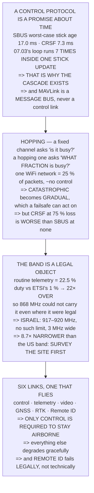

# FRA.04 Protocols and bands: SBUS, CRSF, MAVLink, and who owns the spectrum

<!-- glance:start -->
<!-- generated by tools/build.py from curriculum/syllabus.yaml — edit the syllabus, not this block -->

| | |
|---|---|
| **Track** | Optional foundation |
| **Difficulty** | Beginner |
| **Time** | 1 h |
| **Hardware** | none |
| **Software** | none |
| **Prerequisites** | [FRA.03 Antennas: gain, pattern, polarisation](FRA.03-antennas-and-polarisation.md) |
| **Skip if** | You can name the protocol on every wire and antenna of a drone and the band each one legally uses. |

<!-- glance:end -->

## What you will learn

- That a control protocol is **a promise about time**, and that the half nobody quotes is
  **worst-case age**: **17.0 ms for SBUS** against CRSF's 7.3
- That the **rate loop runs 7 times inside one stick update** — which is the architecture of module
  07 in a single number
- That **frequency hopping converts a catastrophic failure into a gradual one**: one WiFi network
  costs **25 % of packets and almost no control**
- And the honest limit of that: **CRSF at 50 % loss still beats SBUS at none, and at 75 % it does
  not**
- That **routine telemetry is 22× Europe's 1 % duty-cycle limit**, so 868 MHz could not carry it even
  where it is legal
- That **Israel's licence-exempt window is 917–920 MHz — 8.7× narrower than the American band**, so a
  hopping radio has 8.7× fewer places to hide
- That a modern aircraft has **six radio links and only one of them is required to keep flying** —
  and that **Remote ID is the only one whose failure is legal rather than technical**

## Why it matters

The previous three lessons were about whether a signal arrives. This one is about what is *in* it and
whether you are allowed to send it, which turns out to decide more of the aircraft's design than the
physics did.

Two results are worth the hour on their own. The first is a latency floor: no amount of PID tuning
makes an aircraft respond faster than its control protocol delivers sticks, and once you have that
number the entire cascade architecture of module 07 stops being a design style and becomes a
consequence.

The second is regulatory, and it is the reason this course's telemetry sits where it does. The
European band is not merely unavailable in Israel; it is **arithmetically incapable** of carrying a
normal telemetry stream, by a factor of twenty-two. That is the kind of fact worth deriving once
rather than being told.

## Prerequisites

<!-- prereqs:start -->
## Prerequisites

You need these first:

- [FRA.03 Antennas: gain, pattern, polarisation](FRA.03-antennas-and-polarisation.md)

### Optional prerequisite links

None.

Check your readiness: `python course.py why FRA.04`
<!-- prereqs:end -->

## Concept

There are two different questions hiding under "what protocol does it use".

For the **control** link the question is about **time**. Sticks are a continuously varying quantity
sampled and shipped at a fixed rate, and the only thing that matters is how old the number is when a
motor acts on it. Bandwidth is irrelevant — sixteen channels is a few hundred bits.

For the **telemetry** link the question is about **bytes and airtime**. MAVLink is a message bus, not
a control protocol, and its cost is measured in how long the transmitter is switched on — which is
exactly what a regulator limits.

Underneath both sits the band, and a band is a legal object rather than a technical one. Its width,
its duty-cycle rule and its neighbours decide what protocol is even possible, which is why this
lesson ends where the whole sequence has been heading: 917–920 MHz, and what that window costs.

## Technical explanation

### Level 1 — every wire, priced in milliseconds

| protocol | baud | frame | period | duty |
|---|---|---|---|---|
| **SBUS** | 100,000 | 3.00 ms | 14.01 ms | 21.4 % |
| SBUS fast | 200,000 | 1.50 ms | 7.00 ms | 21.4 % |
| **CRSF 150 Hz** | 420,000 | 0.62 ms | 6.67 ms | 9.3 % |
| CRSF 50 Hz | 420,000 | 0.62 ms | 20.00 ms | 3.1 % |
| PPM (legacy) | — | ~20 ms | 20.0 ms | 100 % |

The number nobody quotes is **worst-case age**: a stick moves just after a frame leaves, so it waits
a full period **and then** takes a frame time to arrive.

| protocol | period | frame | **worst-case age** |
|---|---|---|---|
| **SBUS** | 14.01 ms | 3.00 ms | **17.01 ms** |
| SBUS fast | 7.00 ms | 1.50 ms | 8.50 ms |
| **CRSF 150 Hz** | 6.67 ms | 0.62 ms | **7.29 ms** |
| CRSF 50 Hz | 20.00 ms | 0.62 ms | 20.62 ms |

| | |
|---|---|
| SBUS worst-case age | 17.01 ms |
| [07.03](../../07-control/07.03-rate-loops.md)'s rate loop period | 2.50 ms |
| **the loop is faster by** | **7×** |

**The inner loop runs seven times for every stick update.** Which is the whole architecture of module
07 in one number: the pilot cannot stabilise an aircraft over a 17 ms link and nobody expects them
to — the stick sets an **attitude** and the 400 Hz loop holds it. **If the control link were fast
enough to fly the aircraft directly, the cascade would not need to exist.**

And it sets a floor you cannot tune away:

| | SBUS | CRSF 150 Hz |
|---|---|---|
| worst-case stick age | 17.01 ms | 7.29 ms |
| + FC processing **[E]** | 2.50 ms | 2.50 ms |
| + ESC update **[E]** | 2.00 ms | 2.00 ms |
| **TOTAL to a motor** | **21.51 ms** | **11.79 ms** |

CRSF saves **9.7 ms — 45 %** — for the price of a different receiver and a non-inverted UART.

And MAVLink is a different kind of thing entirely. It is not a control protocol; it is a **message
bus** that happens to travel over a link, priced in bytes per second rather than in milliseconds.
**Never fly an aircraft on MAVLink sticks.**

### Level 2 — frequency hopping: turning a total loss into a partial one

2.4 GHz is not yours. A **fixed-channel** link has one question — is my channel busy? A **hopping**
link changes it to: **what fraction of my channels is busy?**

| interferer | MHz | channels | packets lost |
|---|---|---|---|
| nothing | 0 | 0 | 0 % |
| Bluetooth **[E]** | 2 | 2 | 2 % |
| **one WiFi network** | 20 | 20 | **25 %** |
| two WiFi networks | 40 | 40 | 50 % |
| three WiFi networks | 60 | 60 | 75 % |

One WiFi network costs **25 % of your packets and not one per cent of your control**, because a
control link sends the **same state** repeatedly — a lost packet is not lost information, the next
one carries it:

| packet loss | effective rate | gap if 3 lost | noticeable? |
|---|---|---|---|
| 0 % | 150.0 Hz | 20.0 ms | no |
| 25 % | 112.5 Hz | 26.7 ms | no |
| 50 % | 75.0 Hz | 40.0 ms | no |
| **75 %** | 37.5 Hz | **80.0 ms** | **YES** |
| 90 % | 15.0 Hz | 200.0 ms | YES |

And the honest place to stop is the row where CRSF stops beating the cheap protocol it replaced:

| packet loss | effective period | vs SBUS's 14.0 ms |
|---|---|---|
| 0 % | 6.7 ms | better |
| 25 % | 8.9 ms | better |
| **50 %** | **13.3 ms** | **better** |
| **75 %** | **26.7 ms** | **WORSE** |

**CRSF at 50 % loss is still better than SBUS at none.** At 75 % it is not, and that is the point at
which a hopping link's graceful degradation has finally degraded into something you would feel on the
sticks.

**Hopping does not make the interference go away.** It converts a catastrophic failure into a gradual
one, and gradual failures are the ones
[09.03](../../09-telemetry-datalink/09.03-failsafe-when-the-link-drops.md)'s failsafe can act on.

The same idea appears twice more: **LoRa** spreads one packet over wide bandwidth, which is where
FRA.01's −6 dB SNR came from; and **GNSS** puts every satellite on the same frequency at once,
separated by code.

### Level 3 — who owns the band, and the rule that decides it

| region **[S]** | band | width | the catch |
|---|---|---|---|
| USA / FCC | 902–928 MHz | 26.0 MHz | none for our purposes |
| **Europe / ETSI** | 868–868.6 MHz | 0.6 MHz | **1 % DUTY CYCLE** |
| **ISRAEL** | **917–920 MHz** | **3.0 MHz** | narrow, but continuous |

Start with the duty cycle, because it is the rule people meet last and the one that decides the
design. **A 1 % duty cycle means your transmitter may be on for 36 seconds in every hour.** Now price
09.04's telemetry against it:

| stream | bytes | airtime | duty at 10 Hz |
|---|---|---|---|
| a heartbeat | 21 | 2.62 ms | 2.62 % |
| ATTITUDE | 40 | 5.00 ms | 5.00 % |
| GLOBAL_POSITION_INT | 42 | 5.25 ms | 5.25 % |
| **a routine 10 Hz mix [E]** | 180 | **22.50 ms** | **22.50 %** |

| | |
|---|---|
| a routine telemetry stream | 22.50 % |
| ETSI's limit | 1.00 % |
| **over by** | **22.5×** |

**Routine telemetry is twenty-two times the European duty-cycle limit.** Not marginally over —
twenty-two times over. Which is why this course does not use 868 MHz, and why the usual advice to
"just use the European band" is wrong here twice: **it is not legal in Israel, and it could not carry
the stream if it were.**

Israel's window is **917–920 MHz [S]**, 3 MHz wide, with no duty-cycle limit of that kind. It is the
right band, and it has exactly one drawback:

| | width | 500 kHz channels |
|---|---|---|
| USA | 26.0 MHz | 52 |
| **ISRAEL** | **3.0 MHz** | **6** |
| Israel is narrower by | **8.7×** | **8.7×** |

**8.7 times fewer places to hide.** Level 2's hopping argument still works, but with 6 channels
instead of 52, so a single interferer costs proportionally more:

| interference | USA | ISRAEL |
|---|---|---|
| 0.5 MHz | 2 % | **17 %** |
| 1.0 MHz | 4 % | **33 %** |
| 2.0 MHz | 8 % | **67 %** |

The practical consequence is a **site-survey habit**: in a 3 MHz window you check what else is
transmitting **before** you fly, because you cannot out-hop a neighbour who is using half your band.
[09.05](../../09-telemetry-datalink/09.05-spectrum-and-regulation.md) has the procedure.

> [!TIP]
> **Ask your teacher:** "What band is this radio actually set to?" A 900 MHz radio bought abroad
> ships on the American 902–928 plan by default, and most of that plan is outside Israel's window.
> The firmware setting is one line; flying on it is not.

### Level 4 — the map: six links, and only one of them flies

| link | band | protocol | direction | if it fails |
|---|---|---|---|---|
| **control** | 2.4 GHz | CRSF/ELRS | up | **12.04 failsafe** |
| telemetry | 917 MHz | MAVLink | both | you fly on |
| video | 5.8 GHz | analogue/DVB | down | you fly on |
| GNSS | 1.575 GHz | receive only | down | 13.05's degraded |
| RTK corrections | 917 MHz | RTCM3 | up | 13.03 → float |
| **Remote ID** | 2.4 GHz | broadcast | out | **ILLEGAL to fly** |

Of six radio links on a modern aircraft, **exactly one is required to keep flying** — and it is not
the one you are looking at.

| | |
|---|---|
| required to stay airborne | **control only** |
| required to stay legal | control + Remote ID |
| required to do the job | + telemetry, + GNSS |
| nice to have | video, RTK |

Which is exactly [12.04](../../12-autonomous-flight/12.04-rtl-and-the-failsafe-tree.md)'s failsafe
tree seen from the radio side, and it explains the priority order: **control link first, because
everything else has a graceful degradation and that one does not.**

And the last row is the new one. [18.04](../../18-civil-ops/18.04-airspace-in-operations.md) said
Remote ID broadcasts where you are standing. Here is the other half: **it is the only link whose
failure is a legal failure rather than a technical one.** The aircraft flies perfectly well without
it and you may not.

## Diagram



## Code

Arithmetic about the protocols and the rules rather than a simulation: frame times and worst-case
stick age for each control protocol against the rate loop, packet loss converted into an effective
update rate and compared with the protocol it replaced, telemetry airtime priced against a
duty-cycle limit, and the three regulatory windows compared by width and by hop channels.

```python
"""FRA.04 -- what travels over the link, and who owns the band.

Pure stdlib, and no simulation: this is arithmetic ABOUT the protocols
and the rules, which is the only kind of model the subject admits.
"""

import math

BAR = "=" * 70

# protocol, baud, bits per byte on the wire, frame bytes, frames/s
PROTOCOLS = (
    ("SBUS", 100000, 12, 25, 71.4, "one way, RX -> FC, INVERTED"),
    ("SBUS fast", 200000, 12, 25, 142.9, "same frame, half the period"),
    ("CRSF 150 Hz", 420000, 10, 26, 150.0, "TWO way: RC out, telem back"),
    ("CRSF 50 Hz", 420000, 10, 26, 50.0, "the long-range setting"),
    ("PPM (legacy)", 0, 0, 0, 50.0, "one wire, 8 channels, ANALOGUE"),
)

LOOP_HZ = 400.0           # 07.03's rate loop

# Israel's licence-exempt sub-GHz window [S], and the American one
IL_LO, IL_HI = 917.0, 920.0
US_LO, US_HI = 902.0, 928.0
EU_LO, EU_HI = 868.0, 868.6
EU_DUTY = 0.01            # ETSI 1 per cent [S]

SIK_BPS = 64000.0         # 09.04's air data rate


def head(n, title):
    print()
    print(BAR)
    print("%d. %s" % (n, title))
    print(BAR)
    print()


# ======================================================================
head(1, "EVERY WIRE, PRICED IN MILLISECONDS")

print("  A control protocol is a promise about TIME, and the promise")
print("  has two halves: how long a frame takes to send, and how")
print("  often one is sent. Only the second is advertised.")
print()
print("  %-16s %10s %12s %12s %12s"
      % ("protocol", "baud", "frame (ms)", "period (ms)", "duty"))
for name, baud, bpb, fb, hz, note in PROTOCOLS:
    if baud == 0:
        print("  %-14s %10s %12s %12.1f %12s"
              % (name, "-", "~20", 1000.0 / hz, "100 %"))
        continue
    frame_ms = fb * bpb / baud * 1000.0
    period_ms = 1000.0 / hz
    print("  %-14s %10d %12.2f %12.2f %11.1f %%"
          % (name, baud, frame_ms, period_ms, frame_ms / period_ms * 100))

sbus_frame = 25 * 12 / 100000.0 * 1000.0
sbus_period = 1000.0 / 71.4
print()
print("  NOW THE NUMBER NOBODY QUOTES: WORST-CASE AGE. A stick moves")
print("  just after a frame leaves, so it waits a full period AND")
print("  THEN takes a frame time to arrive:")
print()
print("  %-18s %14s %14s %16s"
      % ("protocol", "period", "frame", "worst-case age"))
for name, baud, bpb, fb, hz, note in PROTOCOLS:
    if baud == 0:
        continue
    frame_ms = fb * bpb / baud * 1000.0
    period_ms = 1000.0 / hz
    print("  %-16s %12.2f ms %12.2f ms %14.2f ms"
          % (name, period_ms, frame_ms, period_ms + frame_ms))

worst_sbus = sbus_period + sbus_frame
print()
print("  %-38s %14.2f ms" % ("SBUS worst-case age", worst_sbus))
print("  %-38s %14.2f ms" % ("07.03's rate loop period",
                             1000.0 / LOOP_HZ))
print("  %-38s %14.0f x" % ("  the loop is faster by",
                            worst_sbus / (1000.0 / LOOP_HZ)))
print()
print("  THE INNER LOOP RUNS %.0f TIMES FOR EVERY STICK UPDATE."
      % (worst_sbus / (1000.0 / LOOP_HZ)))
print()
print("  WHICH IS THE WHOLE ARCHITECTURE OF MODULE 07 IN ONE NUMBER.")
print("  The pilot cannot stabilise an aircraft over a %.0f ms link"
      % worst_sbus)
print("  and nobody expects them to: the stick sets an ATTITUDE and")
print("  the %.0f Hz loop holds it. If the control link were fast"
      % LOOP_HZ)
print("  enough to fly the aircraft directly, the cascade would not")
print("  need to exist.")
print()
print("  AND IT SETS A FLOOR YOU CANNOT TUNE AWAY:")
print()
print("  %-34s %16s %16s" % ("", "SBUS", "CRSF 150 Hz"))
crsf_age = 1000.0 / 150.0 + 26 * 10 / 420000.0 * 1000.0
print("  %-32s %14.2f ms %14.2f ms"
      % ("worst-case stick age", worst_sbus, crsf_age))
print("  %-32s %14.2f ms %14.2f ms"
      % ("  + FC processing [E]", 2.5, 2.5))
print("  %-32s %14.2f ms %14.2f ms"
      % ("  + 15.xx's ESC update [E]", 2.0, 2.0))
print("  %-32s %14.2f ms %14.2f ms"
      % ("  TOTAL to a motor", worst_sbus + 4.5, crsf_age + 4.5))
print()
print("  CRSF SAVES %.1f ms OF THAT -- %.0f per cent -- for the price"
      % (worst_sbus - crsf_age,
         (worst_sbus - crsf_age) / (worst_sbus + 4.5) * 100))
print("  of a different receiver and a non-inverted UART.")
print()
print("  AND MAVLINK IS A DIFFERENT KIND OF THING ENTIRELY. It is not")
print("  a control protocol; it is a MESSAGE BUS that happens to")
print("  travel over a link, and 15.02 already priced it in bytes")
print("  per second rather than in milliseconds. NEVER FLY AN")
print("  AIRCRAFT ON MAVLINK STICKS.")

# ======================================================================
head(2, "FREQUENCY HOPPING: TURNING A TOTAL LOSS INTO A PARTIAL ONE")

print("  2.4 GHz is not yours. It is shared with WiFi, Bluetooth,")
print("  microwave ovens and every other drone on the field, and")
print("  none of them will move.")
print()
print("  A FIXED-CHANNEL LINK HAS ONE QUESTION: is my channel busy?")
print("  If yes, the link is dead. A HOPPING LINK CHANGES THE")
print("  QUESTION TO: WHAT FRACTION OF MY CHANNELS IS BUSY?")
print()
N_CH_24 = 80
print("  %-30s %14s %14s %14s"
      % ("interferer", "MHz", "channels", "packets lost"))
for what, mhz in (("nothing", 0), ("Bluetooth [E]", 2),
                  ("one WiFi network", 20), ("two WiFi networks", 40),
                  ("three WiFi networks", 60)):
    frac = min(1.0, mhz / float(N_CH_24))
    print("  %-28s %14d %14d %12.0f %%"
          % (what, mhz, mhz, frac * 100))

print()
print("  ONE WIFI NETWORK COSTS YOU %.0f PER CENT OF YOUR PACKETS AND"
      % (20.0 / N_CH_24 * 100))
print("  NOT ONE PER CENT OF YOUR CONTROL. Because a control link")
print("  sends the SAME STATE repeatedly, a lost packet is not lost")
print("  information -- the next one carries it:")
print()
print("  %-20s %16s %20s %16s"
      % ("packet loss", "at 150 Hz", "gap if 3 lost", "noticeable?"))
for loss in (0.0, 0.25, 0.50, 0.75, 0.90):
    gap3 = 3 * 1000.0 / 150.0 / max(1e-9, 1 - loss)
    print("  %-18s %14.1f Hz %16.1f ms %16s"
          % ("%.0f %%" % (loss * 100), 150.0 * (1 - loss), gap3,
             "no" if gap3 < 50 else "YES"))

print()
print("  AND THE HONEST PLACE TO STOP IS THE ROW WHERE CRSF STOPS")
print("  BEATING THE CHEAP PROTOCOL IT REPLACED:")
print()
print("  %-24s %18s %20s" % ("packet loss", "effective period",
                             "vs SBUS's %.1f ms" % sbus_period))
for loss in (0.0, 0.25, 0.50, 0.75):
    per = 1000.0 / 150.0 / (1 - loss)
    print("  %-22s %16.1f ms %18s"
          % ("%.0f %%" % (loss * 100), per,
             "better" if per < sbus_period else "WORSE"))
print()
print("  CRSF AT %.0f PER CENT LOSS IS STILL BETTER THAN SBUS AT NONE."
      % 50)
print("  At %.0f it is not, and that is the point at which a hopping"
      % 75)
print("  link's graceful degradation has finally degraded to")
print("  something you would notice on the sticks.")
print()
print("  HOPPING DOES NOT MAKE THE INTERFERENCE GO AWAY. It converts")
print("  a CATASTROPHIC failure into a GRADUAL one, and gradual")
print("  failures are the ones 09.03's failsafe can act on.")
print()
print("  AND THE SAME IDEA SHOWS UP IN THE OTHER TWO PLACES:")
print()
print("  %-24s %40s" % ("LoRa / spread spectrum",
                        "spreads ONE packet over wide bandwidth"))
print("  %-24s %40s" % ("  FRA.01's -6 dB SNR",
                        "which is where that came from"))
print("  %-24s %40s" % ("13.xx's GNSS",
                        "every satellite on the same frequency"))
print("  %-24s %40s" % ("  at once, by code",
                        "which is CDMA, the third variant"))

# ======================================================================
head(3, "WHO OWNS THE BAND, AND THE RULE THAT DECIDES IT")

print("  Three sub-GHz windows, three sets of rules, and only one of")
print("  them is legal where this course is flown:")
print()
print("  %-24s %14s %12s %20s"
      % ("region [S]", "band (MHz)", "width", "the catch"))
for name, lo, hi, catch in (
        ("USA / FCC", US_LO, US_HI, "none for our purposes"),
        ("Europe / ETSI", EU_LO, EU_HI, "1 PER CENT DUTY CYCLE"),
        ("ISRAEL", IL_LO, IL_HI, "narrow, but continuous")):
    print("  %-22s %8.0f-%-6.0f %10.1f %20s"
          % (name, lo, hi, hi - lo, catch))

print()
print("  START WITH THE DUTY CYCLE, because it is the rule people")
print("  meet last and it is the one that decides the design.")
print()
print("  A 1 PER CENT DUTY CYCLE MEANS YOUR TRANSMITTER MAY BE ON FOR")
print("  %.0f SECONDS IN EVERY HOUR." % (3600 * EU_DUTY))
print()
print("  Now price 09.04's telemetry against that:")
print()
print("  %-26s %12s %14s %14s"
      % ("stream", "bytes", "airtime", "duty at 10 Hz"))
for what, nbytes in (("a heartbeat", 21), ("ATTITUDE", 40),
                     ("GLOBAL_POSITION_INT", 42),
                     ("a routine 10 Hz mix [E]", 180)):
    air_ms = nbytes * 8 / SIK_BPS * 1000.0
    duty = air_ms * 10 / 1000.0
    print("  %-24s %12d %12.2f ms %12.2f %%"
          % (what, nbytes, air_ms, duty * 100))

mix_duty = 180 * 8 / SIK_BPS * 10
print()
print("  %-38s %14.2f %%" % ("a routine telemetry stream", mix_duty * 100))
print("  %-38s %14.2f %%" % ("  ETSI's limit", EU_DUTY * 100))
print("  %-38s %14.1f x" % ("  over by", mix_duty / EU_DUTY))
print()
print("  ROUTINE TELEMETRY IS %.0f TIMES THE EUROPEAN DUTY-CYCLE LIMIT."
      % (mix_duty / EU_DUTY))
print("  Not marginally over. %.0f times over." % (mix_duty / EU_DUTY))
print()
print("  WHICH IS WHY THIS COURSE DOES NOT USE 868 MHz, and why the")
print("  usual advice to 'just use the European band' is wrong here")
print("  twice: it is not legal in Israel AND it could not carry the")
print("  stream if it were.")
print()
print("  ISRAEL'S WINDOW IS %.0f-%.0f MHz [S] -- %.0f MHz WIDE, with no"
      % (IL_LO, IL_HI, IL_HI - IL_LO))
print("  duty-cycle limit of that kind. It is the right band, and it")
print("  has exactly one drawback:")
print()
print("  %-30s %14s %18s" % ("", "width (MHz)", "500 kHz channels"))
for name, lo, hi in (("USA", US_LO, US_HI), ("ISRAEL", IL_LO, IL_HI)):
    print("  %-28s %14.1f %18.0f"
          % (name, hi - lo, (hi - lo) / 0.5))
print("  %-28s %14.1f x %16.1f x"
      % ("  Israel is narrower by", (US_HI - US_LO) / (IL_HI - IL_LO),
         (US_HI - US_LO) / (IL_HI - IL_LO)))

print()
print("  %.1f TIMES FEWER PLACES TO HIDE. Section 2's hopping"
      % ((US_HI - US_LO) / (IL_HI - IL_LO)))
print("  argument still works, but with %.0f channels instead of %.0f,"
      % ((IL_HI - IL_LO) / 0.5, (US_HI - US_LO) / 0.5))
print("  so a single interferer costs proportionally more:")
print()
for mhz in (0.5, 1.0, 2.0):
    print("  %-30s %14.0f %% %14.0f %%"
          % ("%.1f MHz of interference" % mhz,
             mhz / (US_HI - US_LO) * 100,
             mhz / (IL_HI - IL_LO) * 100))
print("  %-30s %14s %14s" % ("", "USA", "ISRAEL"))
print()
print("  THE PRACTICAL CONSEQUENCE IS A SITE-SURVEY HABIT: in a")
print("  3 MHz window you check what else is transmitting BEFORE you")
print("  fly, because you cannot out-hop a neighbour who is using")
print("  half your band. 09.05 has the procedure.")

# ======================================================================
head(4, "THE MAP: SIX LINKS, AND ONLY ONE OF THEM FLIES")

print("  %-16s %10s %14s %12s %18s"
      % ("link", "band", "protocol", "direction", "if it fails"))
LINKS = (
    ("control", "2.4 GHz", "CRSF/ELRS", "up", "12.04 failsafe"),
    ("telemetry", "917 MHz", "MAVLink", "both", "you fly on"),
    ("video", "5.8 GHz", "analogue/DVB", "down", "you fly on"),
    ("GNSS", "1.575 GHz", "receive only", "down", "13.05's degraded"),
    ("RTK corrections", "917 MHz", "RTCM3", "up", "13.03 -> float"),
    ("Remote ID", "2.4 GHz", "broadcast", "out", "ILLEGAL to fly"),
)
for name, band, proto, direction, fail in LINKS:
    print("  %-14s %10s %14s %12s %18s"
          % (name, band, proto, direction, fail))

print()
print("  READ THE LAST COLUMN. OF SIX RADIO LINKS ON A MODERN")
print("  AIRCRAFT, EXACTLY ONE IS REQUIRED TO KEEP FLYING -- and it")
print("  is not the one you are looking at.")
print()
print("  %-34s %28s" % ("required to stay airborne", "CONTROL only"))
print("  %-34s %28s" % ("required to stay LEGAL", "control + Remote ID"))
print("  %-34s %28s" % ("required to do the JOB",
                        "+ telemetry, + GNSS"))
print("  %-34s %28s" % ("nice to have", "video, RTK"))
print()
print("  WHICH IS EXACTLY 12.04's FAILSAFE TREE SEEN FROM THE RADIO")
print("  SIDE, and it explains the priority order: control link")
print("  first, because everything else has a graceful degradation")
print("  and that one does not.")
print()
print("  AND THE LAST ROW IS THE NEW ONE. 18.04 said REMOTE ID")
print("  BROADCASTS WHERE YOU ARE STANDING. Here is the other half:")
print("  it is the only link whose failure is a LEGAL failure rather")
print("  than a technical one. The aircraft flies perfectly well")
print("  without it and you may not.")
print()
print("  THE ONE-LINE SUMMARY OF THE WHOLE FRA SEQUENCE:")
print()
print("    FRA.01  a decibel, an antenna length, and -174 dBm/Hz")
print("    FRA.02  135 dB of budget, and the ground takes most of it")
print("    FRA.03  the pattern has a hole and it points at you")
print("    FRA.04  %.0f-%.0f MHz, %.0f Hz of sticks, six links, one"
      % (IL_LO, IL_HI, 150.0))
print("            that matters")

# ======================================================================
print()
print(BAR)
print("THE FOUR THINGS TO CARRY FORWARD")
print(BAR)
print()
print("  1. A control protocol is a PROMISE ABOUT TIME. SBUS's")
print("     worst-case stick age is %.1f ms and 07.03's loop runs"
      % worst_sbus)
print("     %.0f times inside it. THAT IS WHY THE CASCADE EXISTS."
      % (worst_sbus / (1000.0 / LOOP_HZ)))
print("  2. HOPPING CONVERTS A CATASTROPHIC FAILURE INTO A GRADUAL")
print("     ONE. One WiFi network costs %.0f per cent of packets and"
      % (20.0 / N_CH_24 * 100))
print("     almost no control, because the next packet carries the")
print("     same state.")
print("  3. ROUTINE TELEMETRY IS %.0f TIMES ETSI's 1 PER CENT DUTY"
      % (mix_duty / EU_DUTY))
print("     CYCLE, so 868 MHz could not carry it even where it is")
print("     legal. Israel's %.0f-%.0f MHz has no such limit and is"
      % (IL_LO, IL_HI))
print("     %.1f x NARROWER than the American band -- fewer places"
      % ((US_HI - US_LO) / (IL_HI - IL_LO)))
print("     to hop, so SURVEY THE SITE FIRST.")
print("  4. Six radio links, and ONLY THE CONTROL LINK IS REQUIRED")
print("     TO KEEP FLYING. Remote ID is the only one whose failure")
print("     is LEGAL rather than technical.")
```

Output:

```text

======================================================================
1. EVERY WIRE, PRICED IN MILLISECONDS
======================================================================

  A control protocol is a promise about TIME, and the promise
  has two halves: how long a frame takes to send, and how
  often one is sent. Only the second is advertised.

  protocol               baud   frame (ms)  period (ms)         duty
  SBUS               100000         3.00        14.01        21.4 %
  SBUS fast          200000         1.50         7.00        21.4 %
  CRSF 150 Hz        420000         0.62         6.67         9.3 %
  CRSF 50 Hz         420000         0.62        20.00         3.1 %
  PPM (legacy)            -          ~20         20.0        100 %

  NOW THE NUMBER NOBODY QUOTES: WORST-CASE AGE. A stick moves
  just after a frame leaves, so it waits a full period AND
  THEN takes a frame time to arrive:

  protocol                   period          frame   worst-case age
  SBUS                    14.01 ms         3.00 ms          17.01 ms
  SBUS fast                7.00 ms         1.50 ms           8.50 ms
  CRSF 150 Hz              6.67 ms         0.62 ms           7.29 ms
  CRSF 50 Hz              20.00 ms         0.62 ms          20.62 ms

  SBUS worst-case age                             17.01 ms
  07.03's rate loop period                         2.50 ms
    the loop is faster by                             7 x

  THE INNER LOOP RUNS 7 TIMES FOR EVERY STICK UPDATE.

  WHICH IS THE WHOLE ARCHITECTURE OF MODULE 07 IN ONE NUMBER.
  The pilot cannot stabilise an aircraft over a 17 ms link
  and nobody expects them to: the stick sets an ATTITUDE and
  the 400 Hz loop holds it. If the control link were fast
  enough to fly the aircraft directly, the cascade would not
  need to exist.

  AND IT SETS A FLOOR YOU CANNOT TUNE AWAY:

                                                 SBUS      CRSF 150 Hz
  worst-case stick age                      17.01 ms           7.29 ms
    + FC processing [E]                      2.50 ms           2.50 ms
    + 15.xx's ESC update [E]                 2.00 ms           2.00 ms
    TOTAL to a motor                        21.51 ms          11.79 ms

  CRSF SAVES 9.7 ms OF THAT -- 45 per cent -- for the price
  of a different receiver and a non-inverted UART.

  AND MAVLINK IS A DIFFERENT KIND OF THING ENTIRELY. It is not
  a control protocol; it is a MESSAGE BUS that happens to
  travel over a link, and 15.02 already priced it in bytes
  per second rather than in milliseconds. NEVER FLY AN
  AIRCRAFT ON MAVLINK STICKS.

======================================================================
2. FREQUENCY HOPPING: TURNING A TOTAL LOSS INTO A PARTIAL ONE
======================================================================

  2.4 GHz is not yours. It is shared with WiFi, Bluetooth,
  microwave ovens and every other drone on the field, and
  none of them will move.

  A FIXED-CHANNEL LINK HAS ONE QUESTION: is my channel busy?
  If yes, the link is dead. A HOPPING LINK CHANGES THE
  QUESTION TO: WHAT FRACTION OF MY CHANNELS IS BUSY?

  interferer                                MHz       channels   packets lost
  nothing                                   0              0            0 %
  Bluetooth [E]                             2              2            2 %
  one WiFi network                         20             20           25 %
  two WiFi networks                        40             40           50 %
  three WiFi networks                      60             60           75 %

  ONE WIFI NETWORK COSTS YOU 25 PER CENT OF YOUR PACKETS AND
  NOT ONE PER CENT OF YOUR CONTROL. Because a control link
  sends the SAME STATE repeatedly, a lost packet is not lost
  information -- the next one carries it:

  packet loss                 at 150 Hz        gap if 3 lost      noticeable?
  0 %                         150.0 Hz             20.0 ms               no
  25 %                        112.5 Hz             26.7 ms               no
  50 %                         75.0 Hz             40.0 ms               no
  75 %                         37.5 Hz             80.0 ms              YES
  90 %                         15.0 Hz            200.0 ms              YES

  AND THE HONEST PLACE TO STOP IS THE ROW WHERE CRSF STOPS
  BEATING THE CHEAP PROTOCOL IT REPLACED:

  packet loss                effective period    vs SBUS's 14.0 ms
  0 %                                 6.7 ms             better
  25 %                                8.9 ms             better
  50 %                               13.3 ms             better
  75 %                               26.7 ms              WORSE

  CRSF AT 50 PER CENT LOSS IS STILL BETTER THAN SBUS AT NONE.
  At 75 it is not, and that is the point at which a hopping
  link's graceful degradation has finally degraded to
  something you would notice on the sticks.

  HOPPING DOES NOT MAKE THE INTERFERENCE GO AWAY. It converts
  a CATASTROPHIC failure into a GRADUAL one, and gradual
  failures are the ones 09.03's failsafe can act on.

  AND THE SAME IDEA SHOWS UP IN THE OTHER TWO PLACES:

  LoRa / spread spectrum     spreads ONE packet over wide bandwidth
    FRA.01's -6 dB SNR                which is where that came from
  13.xx's GNSS                every satellite on the same frequency
    at once, by code               which is CDMA, the third variant

======================================================================
3. WHO OWNS THE BAND, AND THE RULE THAT DECIDES IT
======================================================================

  Three sub-GHz windows, three sets of rules, and only one of
  them is legal where this course is flown:

  region [S]                   band (MHz)        width            the catch
  USA / FCC                   902-928          26.0 none for our purposes
  Europe / ETSI               868-869           0.6 1 PER CENT DUTY CYCLE
  ISRAEL                      917-920           3.0 narrow, but continuous

  START WITH THE DUTY CYCLE, because it is the rule people
  meet last and it is the one that decides the design.

  A 1 PER CENT DUTY CYCLE MEANS YOUR TRANSMITTER MAY BE ON FOR
  36 SECONDS IN EVERY HOUR.

  Now price 09.04's telemetry against that:

  stream                            bytes        airtime  duty at 10 Hz
  a heartbeat                        21         2.62 ms         2.62 %
  ATTITUDE                           40         5.00 ms         5.00 %
  GLOBAL_POSITION_INT                42         5.25 ms         5.25 %
  a routine 10 Hz mix [E]           180        22.50 ms        22.50 %

  a routine telemetry stream                      22.50 %
    ETSI's limit                                   1.00 %
    over by                                        22.5 x

  ROUTINE TELEMETRY IS 22 TIMES THE EUROPEAN DUTY-CYCLE LIMIT.
  Not marginally over. 22 times over.

  WHICH IS WHY THIS COURSE DOES NOT USE 868 MHz, and why the
  usual advice to 'just use the European band' is wrong here
  twice: it is not legal in Israel AND it could not carry the
  stream if it were.

  ISRAEL'S WINDOW IS 917-920 MHz [S] -- 3 MHz WIDE, with no
  duty-cycle limit of that kind. It is the right band, and it
  has exactly one drawback:

                                    width (MHz)   500 kHz channels
  USA                                    26.0                 52
  ISRAEL                                  3.0                  6
    Israel is narrower by                 8.7 x              8.7 x

  8.7 TIMES FEWER PLACES TO HIDE. Section 2's hopping
  argument still works, but with 6 channels instead of 52,
  so a single interferer costs proportionally more:

  0.5 MHz of interference                     2 %             17 %
  1.0 MHz of interference                     4 %             33 %
  2.0 MHz of interference                     8 %             67 %
                                            USA         ISRAEL

  THE PRACTICAL CONSEQUENCE IS A SITE-SURVEY HABIT: in a
  3 MHz window you check what else is transmitting BEFORE you
  fly, because you cannot out-hop a neighbour who is using
  half your band. 09.05 has the procedure.

======================================================================
4. THE MAP: SIX LINKS, AND ONLY ONE OF THEM FLIES
======================================================================

  link                   band       protocol    direction        if it fails
  control           2.4 GHz      CRSF/ELRS           up     12.04 failsafe
  telemetry         917 MHz        MAVLink         both         you fly on
  video             5.8 GHz   analogue/DVB         down         you fly on
  GNSS            1.575 GHz   receive only         down   13.05's degraded
  RTK corrections    917 MHz          RTCM3           up     13.03 -> float
  Remote ID         2.4 GHz      broadcast          out     ILLEGAL to fly

  READ THE LAST COLUMN. OF SIX RADIO LINKS ON A MODERN
  AIRCRAFT, EXACTLY ONE IS REQUIRED TO KEEP FLYING -- and it
  is not the one you are looking at.

  required to stay airborne                          CONTROL only
  required to stay LEGAL                      control + Remote ID
  required to do the JOB                      + telemetry, + GNSS
  nice to have                                         video, RTK

  WHICH IS EXACTLY 12.04's FAILSAFE TREE SEEN FROM THE RADIO
  SIDE, and it explains the priority order: control link
  first, because everything else has a graceful degradation
  and that one does not.

  AND THE LAST ROW IS THE NEW ONE. 18.04 said REMOTE ID
  BROADCASTS WHERE YOU ARE STANDING. Here is the other half:
  it is the only link whose failure is a LEGAL failure rather
  than a technical one. The aircraft flies perfectly well
  without it and you may not.

  THE ONE-LINE SUMMARY OF THE WHOLE FRA SEQUENCE:

    FRA.01  a decibel, an antenna length, and -174 dBm/Hz
    FRA.02  135 dB of budget, and the ground takes most of it
    FRA.03  the pattern has a hole and it points at you
    FRA.04  917-920 MHz, 150 Hz of sticks, six links, one
            that matters

======================================================================
THE FOUR THINGS TO CARRY FORWARD
======================================================================

  1. A control protocol is a PROMISE ABOUT TIME. SBUS's
     worst-case stick age is 17.0 ms and 07.03's loop runs
     7 times inside it. THAT IS WHY THE CASCADE EXISTS.
  2. HOPPING CONVERTS A CATASTROPHIC FAILURE INTO A GRADUAL
     ONE. One WiFi network costs 25 per cent of packets and
     almost no control, because the next packet carries the
     same state.
  3. ROUTINE TELEMETRY IS 22 TIMES ETSI's 1 PER CENT DUTY
     CYCLE, so 868 MHz could not carry it even where it is
     legal. Israel's 917-920 MHz has no such limit and is
     8.7 x NARROWER than the American band -- fewer places
     to hop, so SURVEY THE SITE FIRST.
  4. Six radio links, and ONLY THE CONTROL LINK IS REQUIRED
     TO KEEP FLYING. Remote ID is the only one whose failure
     is LEGAL rather than technical.
```

## Exercise

### Exercise FRA.04-E1 — Price your own control chain `[analysis]`

For your receiver's actual protocol and rate, compute worst-case stick age and add your flight
controller's loop rate and ESC protocol. Report the total to a motor.

### Exercise FRA.04-E2 — Survey your field `[build]`

Before your next flight, scan 2.4 GHz and your sub-GHz band for other transmitters. Record what you
find and estimate the fraction of your hop channels affected.

### Exercise FRA.04-E3 — Measure your telemetry duty cycle `[analysis]`

Work out your actual telemetry stream rates and message sizes, compute the airtime per second, and
express it as a duty cycle.

### Exercise FRA.04-E4 — Map your links `[analysis]`

List every radio on your aircraft with its band, protocol and failure consequence. Mark which ones
are required to fly, required to be legal, and merely useful.

## Expected result

**FRA.04-E1**: expect 10–25 ms total, expect the protocol to dominate, and expect your tuning to be
irrelevant to this number.

**FRA.04-E2**: expect at least two WiFi networks anywhere near a building, and expect the sub-GHz
band to be quieter than you feared.

**FRA.04-E3**: expect a few per cent at default stream rates. Expect it to be well over 1 % and well
under anything Israel's band cares about.

**FRA.04-E4**: expect five or six entries, and expect exactly one of them to be flight-critical.

## Troubleshooting

**Control feels laggy and tuning does not help.** Level 1. You are at the protocol's floor, not the
controller's.

**SBUS works on one flight controller and not another.** SBUS is **inverted**; some boards invert in
hardware and some do not. It is a wiring property, not a protocol fault.

**Link quality drops when someone opens a laptop.** Level 2, and the arithmetic says it costs 25 % of
packets — which should be survivable. If it is not, you are already degraded elsewhere.

**Telemetry works on the bench and not at the field.** Check the band plan first: a radio bought
abroad defaults outside Israel's window.

**Everything works but Remote ID is not broadcasting.** That is a legal grounding, not a technical
one. Level 4's last row.

**The failsafe triggers with good RSSI.** Look at link quality rather than signal strength — high
packet loss with a strong signal means interference, not distance.

**RTK corrections and telemetry fight each other.** They share the 917 MHz window in Level 4's map.
Two transmitters in a 3 MHz band is Level 3's problem at its sharpest.

## Common mistakes

- **Quoting frame rate and ignoring worst-case age.** 6.67 ms is not 7.29 ms.
- **Tuning to fix a protocol delay.** The floor is the floor.
- **Flying an aircraft on MAVLink sticks.** It is a message bus.
- **Assuming hopping makes interference irrelevant.** It makes it gradual.
- **Using an 868 MHz radio for telemetry.** 22× the duty-cycle limit.
- **Leaving an imported radio on its factory band plan.** Mostly outside Israel's window.
- **Treating Remote ID as optional.** It is the one legal-failure link.

## Knowledge check

<details>
<summary>What is "worst-case stick age" and why does it matter more than the frame rate?</summary>

It is the full period **plus** the frame time — a stick that moves just after a frame leaves waits
for the next one and then for it to transmit. SBUS is 14.01 + 3.00 = **17.01 ms**; CRSF at 150 Hz is
**7.29 ms**. Frame rate alone hides the transmission time, which for SBUS is 21 % of the period. Add
processing and the ESC update and SBUS is **21.5 ms to a motor** against CRSF's 11.8.
</details>

<details>
<summary>What does the 17 ms number say about module 07's architecture?</summary>

That the rate loop runs **seven times inside one stick update**. The pilot is not stabilising the
aircraft and could not: the stick sets an **attitude** and the 400 Hz inner loop holds it against
disturbances it can see seven times sooner than the pilot can. **If the control link were fast enough
to fly the aircraft directly, the cascade would not need to exist.**
</details>

<details>
<summary>What does frequency hopping actually buy you?</summary>

It changes the question from "is my channel busy?" — where the answer *yes* means the link is dead —
to "what fraction of my channels is busy?", where the answer is a packet-loss percentage. One WiFi
network occupies 20 of about 80 channels, so it costs **25 % of packets** and almost no control,
because each packet carries the same state. **Hopping converts a catastrophic failure into a gradual
one**, and gradual failures are the ones a failsafe can act on.
</details>

<details>
<summary>Where does hopping stop helping?</summary>

At around **75 % loss**. CRSF at 150 Hz has a 6.7 ms period; at 50 % loss that is 13.3 ms, still
better than SBUS's 14.0 ms at zero loss. At 75 % it is 26.7 ms — worse than the protocol it replaced
— and a run of three lost packets is an **80 ms** gap, which you can feel. That is the honest end of
the graceful-degradation argument.
</details>

<details>
<summary>Why can't you use 868 MHz for telemetry?</summary>

Two reasons and either is sufficient. It is not licence-exempt in Israel. And ETSI's **1 % duty
cycle** allows **36 seconds of transmission per hour**, while a routine 10 Hz MAVLink mix needs
**22.5 %** — **twenty-two times over**. The band is not merely unavailable, it is arithmetically
incapable of the job.
</details>

<details>
<summary>What does Israel's 917–920 MHz window cost you?</summary>

Width. It is **3 MHz against the American 26** — **8.7× narrower** — so a hopping radio has about
**6 channels instead of 52**, and a single 1 MHz interferer costs **33 % of your packets instead of
4 %**. The band has no ETSI-style duty-cycle limit, so it is the right band; it just means **you
cannot out-hop a bad neighbour**, and a site survey before flying is a habit rather than a
precaution.
</details>

## Practical challenge

Write your own radio page for the operations manual.

1. Map every link: band, protocol, direction, failure consequence (E4).
2. Compute the control chain's total latency to a motor (E1).
3. Compute your telemetry duty cycle and check it against the rules for your band (E3).
4. Verify every radio's band plan is set for where you fly, not where it shipped from.
5. Survey the field for interferers on both bands (E2).
6. Estimate what fraction of your hop channels each one affects.
7. Decide, in writing, which links you will abort for and which you will fly on without.
8. Put step 7 next to 12.04's failsafe configuration and confirm they say the same thing.

Step 8 is the check that matters: an operator's intent and the firmware's configured behaviour are
two different documents, and they disagree more often than anyone expects.

## You can skip this if

You can name the protocol on every wire and antenna of a drone and the band each one legally uses.

## Go deeper

- The MAVLink protocol overview, which shows why it is a message bus rather than a control link and
  where its byte costs come from: <https://mavlink.io/en/about/overview.html>
- ExpressLRS's documentation on packet rates, hopping and link quality, which is Level 2 in
  practice: <https://www.expresslrs.org/quick-start/transmitters/lua-howto/>
- The ITU's table of national frequency allocations, the authoritative starting point for Level 3's
  `[S]` band figures: <https://www.itu.int/en/ITU-R/terrestrial/fmd/Pages/default.aspx>

## Progress checkpoint

You can now price a control protocol in milliseconds and say why the cascade exists, explain what
hopping buys and where it stops buying it, compute a duty cycle and check it against a band's rules,
and map every radio on the aircraft against what its failure actually costs.

That completes the RF and datalink foundation. Next, the FOP sequence leaves the hardware entirely
for the habits that separate a professional from a hobbyist: planning a mission on paper, managing
risk before it happens, and debriefing honestly afterwards.
