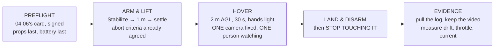

# P01 — First hover

<!-- glance:start -->
<!-- generated by tools/build.py from curriculum/syllabus.yaml — edit the syllabus, not this block -->

| | |
|---|---|
| **Track** | Project |
| **Difficulty** | Intermediate |
| **Time** | 1 h 30 min |
| **Hardware** | First flight (Hermon core) (stage 1) |
| **Software** | ardupilot, qgc |
| **Prerequisites** | [11.03 Basic manoeuvres: takeoff, hover, box, turn, land](../11-first-flights/11.03-basic-maneuvers.md) |

<!-- glance:end -->

## Goal

**Hover Hermon for 30 continuous seconds with horizontal drift ≤ 0.5 m, and produce the evidence.**

Not "fly it". Hover it, once, deliberately, with a log and a video that let somebody who was not
there check both numbers.

## Why this project

Every number in modules 01–11 has been a prediction. This is the first time the aircraft is asked to
agree with one, and the honest version of that question is not "did it fly?" — it is "did it fly the
way the arithmetic said it would?"

Three predictions get tested in ninety seconds of flight:

| the course said | where | you will measure |
|---|---|---|
| hover throttle ≈ **26.5 %** | [FA.02](../optional-foundations/flight-aerodynamics/FA.02-newtons-laws-flight.md) | `RCOU` / `CTUN.ThO` in the log |
| hover current ≈ **10.2 A** at 22.2 V | [FEL.01](../optional-foundations/drone-electronics-power/FEL.01-electricity-refresher.md) | `BAT.Curr` |
| hover power ≈ **226 W** | `references/hermon-numbers.md` | `BAT.Volt × BAT.Curr` |

If all three agree within about 15 %, the aircraft you built is the aircraft the course has been
describing, and everything downstream inherits that. If one of them is badly off, **you have found
something before it mattered**, which is the entire point of doing this as a project rather than as a
first flight.

And the drift criterion is not arbitrary. [12.05](../12-autonomous-flight/12.05-auto-takeoff-land-precision.md)
needs 0.300 m of landing accuracy; if the aircraft cannot hold half a metre in the air on a calm day,
nothing later in the course will work.

## Prerequisites

- [11.03](../11-first-flights/11.03-basic-maneuvers.md) and everything it requires
- A completed [04.06](../04-frame-and-assembly/04.06-preflight-and-airworthiness.md) preflight, signed
- A site chosen under [12.03](../12-autonomous-flight/12.03-geofence.md)'s separation rules
- Wind **under 3 m/s** at the surface — this is a measurement, not an impression

## Hardware and software

| | |
|---|---|
| **Hardware** | Hermon, stage 1 complete. Three charged packs. A tripod or a helper with a camera. |
| **Software** | ArduPilot on the aircraft, QGroundControl on the ground, a log viewer |
| **Site** | Open ground, ≥ 30 m from anything you would mind hitting |
| **Consumables** | One flight's worth of battery. You will use less than you think. |

The camera matters as much as the flight controller here. **A hover you did not record is a hover
you cannot show**, and [FOP.03](../optional-foundations/civil-ops/FOP.03-debrief-and-aar.md)'s
Level 1 applies to your own work: an observation without a baseline is not evidence.

## Architecture

The shape to notice is that **four of the five boxes are not flying.** That is P01's other lesson,
and [18.02](../18-civil-ops/18.02-the-operators-job.md) already priced it: the flying is 4.4 % of
the day.

## Milestones

1. **Bench check.** Motor order and direction confirmed, props off. Compass and accelerometer
   calibrated ([05.06](../05-sensors/05.06-noise-bias-and-calibration.md)).
2. **A written plan.** One page, [FOP.01](../optional-foundations/civil-ops/FOP.01-mission-planning-process.md)'s
   five paragraphs. It takes ten minutes and it is what the debrief will read.
3. **Site set-up and brief.** Including the read-back, even if your crew is one other person.
4. **Ground run.** Armed, props on, 15 % throttle, no lift. Listen. Disarm. This catches a
   surprising fraction of build errors while the aircraft is still on the ground.
5. **First lift.** To 1 m, five seconds, land. Disarm. Inspect. Nothing dramatic.
6. **The hover.** 2 m AGL, 30 continuous seconds, minimal stick.
7. **Land, disarm, and leave it alone** until the log is off it.
8. **Measure.** Drift from the log's position track, throttle from `RCOU`, current from `BAT`.
9. **Debrief and write one change** ([FOP.03](../optional-foundations/civil-ops/FOP.03-debrief-and-aar.md)).

## Acceptance criteria

Every one of these is a **state**, testable by someone who was not there — FOP.01's Level 2 rule
applied to the course's own project.

| # | criterion | evidence |
|---|---|---|
| 1 | **30 continuous seconds** of hover, armed and airborne throughout | log timestamps |
| 2 | **Horizontal drift ≤ 0.5 m** over those 30 s, measured from the log | position track |
| 3 | **Altitude held within ± 0.5 m** | `CTUN.Alt` vs `CTUN.DAlt` |
| 4 | Hover throttle recorded, and **within 15 % of 26.5 %** | `RCOU` mean |
| 5 | Hover current recorded, and **within 15 % of 10.2 A** | `BAT.Curr` mean |
| 6 | No warning or error message in the log you cannot explain | `MSG`, `ERR` |
| 7 | A video showing the whole hover, with the aircraft in frame throughout | the file |
| 8 | A written debrief with **one change**, naming the artefact it modified | one page |

Criterion 8 is the one people skip and it is the one that compounds. A flight that changed nothing is
a flight you will fly again identically.

## Safety

> [!WARNING]
> This is the first time the aircraft leaves the ground, and the two failure modes that matter both
> happen in the first five seconds. **Props go on last and the battery goes in last** — in that
> order, after everyone is clear. And before you arm, say out loud where you will move if it comes
> toward you, because you will not decide it in the moment.

> [!CAUTION]
> Stand **to the side**, not under it. That is a safety rule and, per
> [FRA.03](../optional-foundations/rf-datalink/FRA.03-antennas-and-polarisation.md), also the fix
> for the telemetry null directly overhead — the one place in the whole envelope where the link is
> weakest is where you are standing.

Non-negotiables for this flight:

- A **charged**, **balanced** pack, and the pack alarm set to the measured floor, not the default
- **30 m** from anything you would mind hitting, and nobody downwind or downhill
- One person on the sticks, one person watching the aircraft, and **both** may call the abort
- Abort on: any unexpected noise, any unexpected attitude, any message you do not recognise
- If it touches down hard, **disarm and inspect before anything else**

## Troubleshooting

**It leans hard on lift-off.** Motor order or direction. Land, disarm, recheck on the bench —
this is not tuneable.

**It climbs unevenly or oscillates in yaw.** Two motors are fighting: check prop direction against
motor direction, and check that a prop nut is not slipping.

**Hover throttle is well above 30 %.** The aircraft is heavier than the model, a prop is wrong, or
the battery is sagging. Weigh it and re-read `references/hermon-numbers.md` before flying again.

**Hover throttle is well below 20 %.** Check that the props are the ones you think they are, and
that the aircraft really is at the mass the course assumes.

**It drifts consistently in one direction.** In wind, that is
[11.04](../11-first-flights/11.04-flying-in-wind.md)'s trim. In still air, it is an accelerometer
calibration or a level-horizon error.

**Position hold wanders and Stabilize is fine.** GNSS. Check HDOP and satellite count against
[13.02](../13-navigation-gnss/13.02-error-sources.md) before touching anything else.

**Telemetry stutters on the pad and is fine in the air.** Expected. FRA.03's null.

**The log has no position data.** `LOG_BITMASK`. Set it before the next flight; you cannot recover
this one.

## Stretch goals

- Hover for **three minutes** and plot current against time. FEL.01 predicted it **rises** as the
  pack empties, from 8.97 A to 10.76 A — see whether yours does.
- Repeat the 30 s hover **five times** and report the drift as a mean and a spread rather than a
  single number. [19.05](../19-capstone-hermon-mission/19.05-the-campaign-and-the-report.md)'s
  statistics start here.
- Hover at 2 m and again at 10 m, and compare current. Ground effect is real and it is worth seeing.
- Measure the actual all-up mass and recompute FA.02's hover throttle from **your** number rather
  than the course's.

## Evidence to keep

Everything here goes in the folder you will still have in a year:

- The **flight log**, unedited, named with the date
- The **video**, full length, not trimmed to the good part
- The **written plan**, as briefed
- A **one-page report** with: measured drift, hover throttle, hover current, hover power, and each
  one next to the course's predicted value with the difference as a percentage
- The **debrief**, with the one change and the artefact it modified
- A **photograph of the aircraft** as flown, which is your configuration baseline for everything
  after this

That report is the first page of the portfolio the capstone finishes. Its format is the same every
time: **predicted, measured, difference, and what you changed.**

## Progress checkpoint

You have flown the aircraft you built, and more importantly you have **checked it against the model**
— three numbers, measured, with the differences written down.

From here the course stops predicting and starts tuning. P02 takes the same aircraft and asks it for
a step response you can defend.
