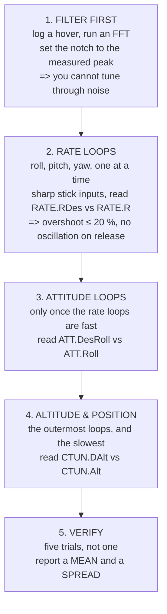

# P02 — A tuned cascade, measured

<!-- glance:start -->
<!-- generated by tools/build.py from curriculum/syllabus.yaml — edit the syllabus, not this block -->

| | |
|---|---|
| **Track** | Project |
| **Difficulty** | Advanced |
| **Time** | 3 h |
| **Hardware** | First flight (Hermon core) (stage 1) |
| **Software** | ardupilot, python |
| **Prerequisites** | [07.07 Filtering, notches and the methodic tuning procedure](../07-control/07.07-filtering-and-methodic-tuning.md) [11.03 Basic manoeuvres: takeoff, hover, box, turn, land](../11-first-flights/11.03-basic-maneuvers.md) |

<!-- glance:end -->

## Goal

**Tune Hermon's cascade until the rate-loop step response overshoots ≤ 20 %, and it holds altitude
within ± 0.3 m over five consecutive trials — proven from logs, not from feel.**

"It flies nicely" is not an acceptance criterion. A number from a log is.

## Why this project

Module 07 built a cascade in theory and
[11.03](../11-first-flights/11.03-basic-maneuvers.md) flew it on defaults. This project closes the
gap, and the gap is where most people stop: they fly a default tune, it feels fine, and every
measurement later in the course inherits a control loop nobody characterised.

Three things become concrete here.

**A step response is a measurement, not an impression.** You command a rate, you log the demanded and
achieved values, and you read overshoot and settling time off the trace. That is the same procedure
every later project uses — [16.03](../16-testing-analysis/16.03-reading-flight-logs.md) is entirely
about reading these traces.

**Tuning is a sequence, not a search.** Rate loops before attitude loops before position loops,
because each outer loop assumes the inner one is already fast.
[07.07](../07-control/07.07-filtering-and-methodic-tuning.md) gives the order; this project makes you
follow it and record the result at each stage.

**Filtering and tuning are the same problem.** Raise a D gain past what the noise floor supports and
the aircraft heats its motors while looking fine on the sticks. The log shows it; your hands do not.

## Prerequisites

- [07.07](../07-control/07.07-filtering-and-methodic-tuning.md) and all of module 07
- [11.03](../11-first-flights/11.03-basic-maneuvers.md), and a completed
  [P01](P01-first-hover.md) with its numbers written down
- [06.06](../06-state-estimation/06.06-ekf-health-and-logs.md), so you can tell a control problem
  from an estimation one
- A `LOG_BITMASK` that actually contains `RATE`, `ATT`, `CTUN` and `IMU`

## Hardware and software

| | |
|---|---|
| **Hardware** | Hermon, stage 1. **Six** charged packs — tuning eats batteries. A thermometer or your hand for motor temperature. |
| **Software** | ArduPilot, a log viewer with an FFT, Python for plotting step responses |
| **Site** | Larger than P01's: you will be making deliberate, sharp inputs |
| **Conditions** | **Wind under 2 m/s.** Wind and tuning are indistinguishable in a log. |

## Architecture

**Step 1 is the one people skip and it invalidates everything after it.** A D term fighting gyro
noise looks exactly like a D term doing its job, right up until the motors are hot.

## Milestones

1. **Baseline.** Fly P01's hover again with the current tune and archive the log. Everything after
   this is measured against it.
2. **FFT and notch.** Log a hover, run the FFT, find the motor peak, set the harmonic notch. Fly
   again and confirm the peak is gone.
3. **Rate roll.** Sharp inputs, log, plot `RATE.RDes` against `RATE.R`. Adjust. Repeat until
   overshoot ≤ 20 % with no post-release oscillation.
4. **Rate pitch**, then **rate yaw**, the same way. Expect pitch to differ from roll — Hermon's Ixx
   and Iyy are **0.01199** and **0.01350**, a 13 % difference, and it shows.
5. **Attitude loops.** Only now. Step the attitude demand and read `ATT.DesRoll` against `ATT.Roll`.
6. **Altitude.** Command 2 m climbs and descents, read `CTUN.DAlt` against `CTUN.Alt`.
7. **Motor temperature check** after every tuning flight. A tune that overheats motors is not a tune.
8. **Five verification trials**, flown back to back, with the same configuration.
9. **Report**, with plots, and the tune archived as a parameter file.

## Acceptance criteria

| # | criterion | evidence |
|---|---|---|
| 1 | Rate-loop **overshoot ≤ 20 %** on roll, pitch and yaw | step-response plots, all three axes |
| 2 | **No sustained oscillation** on stick release, any axis | the same plots |
| 3 | Altitude held **within ± 0.3 m** of demand in level flight | `CTUN` over five trials |
| 4 | Criterion 3 met on **five consecutive trials**, not the best one | five logs |
| 5 | A **measured** noise peak, and a notch set to it | FFT before and after |
| 6 | **Motors no more than warm** after a full tuning flight | recorded, per motor |
| 7 | The tune saved as a **parameter file**, with a date and a note on what changed | the file |
| 8 | A report stating overshoot and altitude error as **mean and spread**, not best case | one page |

Criterion 4 is the one that separates a tune from a lucky flight, and criterion 8 is
[19.05](../19-capstone-hermon-mission/19.05-the-campaign-and-the-report.md)'s rule arriving early:
**a number without its spread is a press release.**

## Safety

> [!WARNING]
> Tuning means deliberately provoking the aircraft, and a badly tuned rate loop can diverge in under
> a second. Change **one gain at a time**, by **no more than 50 %**, and always have a mode you can
> switch to that you know is stable — a saved, working parameter set loaded on a switch position, or
> at minimum written down and reloadable in the field.

> [!CAUTION]
> **Hot motors are a fire risk and a bearing risk.** Check them after every flight in this project.
> If a motor is too hot to hold, the D term is fighting noise: go back to the FFT rather than
> continuing to tune.

- Fly this project **low** — 3 to 5 m. A divergence at 3 m is a repair; at 50 m it is an accident.
- Larger separation than P01: **50 m** from anything, because you are provoking it deliberately.
- Abort on: any oscillation that does not stop when you release the sticks, any motor note that
  changes, any smell.
- Land and **let the motors cool** between flights. Tuning back-to-back on hot motors changes the
  measurement as well as the hardware.

## Troubleshooting

**Fast oscillation, high pitch, everything looks tuned.** That is D fighting noise. FFT, notch, and
lower D — not higher.

**Slow oscillation that builds after a stick input.** P is too high for the current D. Reduce P
first.

**The aircraft feels sluggish but the log looks fine.** Check the rate loop against the *demand*, not
against your expectation. The cascade may be doing exactly what you asked.

**Roll tunes beautifully and pitch does not.** Expected. Different inertia (0.01199 vs 0.01350) and
usually a different mass distribution. Tune them separately; they are separate loops.

**Altitude wanders with a good rate tune.** That is the barometer or the EKF, not the cascade.
[06.06](../06-state-estimation/06.06-ekf-health-and-logs.md) before touching a gain.

**Everything is worse after a battery change.** Check the pack voltage under load. A sagging pack
changes the effective gain of the whole system — FEL.03's flat curve makes this easy to miss.

**The five trials disagree wildly.** Wind. Check it, and if it is above 2 m/s the trials are not
comparable.

## Stretch goals

- Run ArduPilot's autotune and then **compare its result against yours**, gain by gain, and account
  for every difference.
- Measure the **step response at two different masses** — with and without a 250 g payload — and see
  how far the tune travels. [17.01](../17-payloads-delivery/17.01-payload-mass-and-com.md) predicts
  the pitch axis moves much further than the roll axis.
- Compute the closed-loop bandwidth from your step response and compare it against
  [FRA.04](../optional-foundations/rf-datalink/FRA.04-protocols-and-bands.md)'s finding that the
  control link delivers sticks every 17 ms.
- Deliberately over-tune D until the motors warm, then back off, and record where that boundary is.
  It is a property of **your** airframe and nobody else's.

## Evidence to keep

- **Every log**, including the bad ones. The divergent flights are the most instructive.
- **Step-response plots**, all three axes, before and after
- **FFT plots**, before and after the notch
- The **parameter file**, dated, with a changelog of what moved and why
- **Motor temperatures** per flight
- A **report** with overshoot and altitude error as mean ± spread over the five trials
- A short **video** of the final verification flight

The parameter file is the artefact. [FOP.03](../optional-foundations/civil-ops/FOP.03-debrief-and-aar.md)'s
rule applies: a tune you did not save is a tune you did not make.

## Progress checkpoint

Hermon now has a control loop you characterised rather than inherited, with a number attached and a
spread around it, and a parameter file that says when and why.

That matters for everything after this. P04 measures a link, P05 flies missions, P06 geolocates
targets — and every one of them assumes the aircraft goes where it is told, at a speed you can state.
