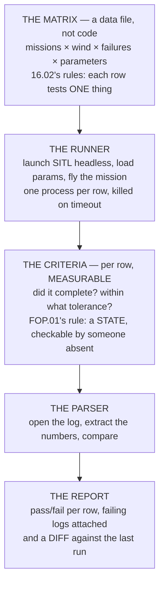

# P03 — An overnight SITL regression harness

<!-- glance:start -->
<!-- generated by tools/build.py from curriculum/syllabus.yaml — edit the syllabus, not this block -->

| | |
|---|---|
| **Track** | Project |
| **Difficulty** | Advanced |
| **Time** | 3 h |
| **Hardware** | none |
| **Software** | sitl, python, docker |
| **Prerequisites** | [10.05 Gazebo, sim-to-real, and a regression matrix that runs overnight](../10-simulation/10.05-gazebo-and-regression-ci.md) |

<!-- glance:end -->

## Goal

**One command runs your whole mission matrix unattended and produces a pass/fail report with the
failing logs attached.**

Not "I can run SITL". One command, no supervision, a report at the end, and the evidence for every
failure already in the right folder.

## Why this project

This is the only project in the course with no aircraft in it, and it is the one that protects every
other project.

Module 16 established the reason in numbers: a real flight costs a battery cycle, a site, weather and
a day, and [18.02](../18-civil-ops/18.02-the-operators-job.md) priced that day at **₪2,084**. A SITL
run costs electricity. So the question is never "should I simulate?" but "what is the cheapest place
to find this failure?" — and [FOP.01](../optional-foundations/civil-ops/FOP.01-mission-planning-process.md)
already gave the shape of that answer: **1 at the desk, 50 on site, 100 after delivery.**

The second reason is regression. Every parameter you change in P02, every mission you write in P05,
every behaviour tree in P07 can break something that worked last week, and **nothing in this course
will tell you it broke** unless you build the thing that checks.

And the third reason is that the harness is what makes a *change* cheap. Once a full matrix runs
overnight, "try it and see" stops being expensive, and the way you work changes.

## Prerequisites

- [10.05](../10-simulation/10.05-gazebo-and-regression-ci.md) and all of module 10
- [12.06](../12-autonomous-flight/12.06-missions-from-python.md) — you will be generating missions
  programmatically
- [16.02](../16-testing-analysis/16.02-test-matrices.md) for what belongs in a matrix
- Working Docker, or a very disciplined virtual environment

## Hardware and software

| | |
|---|---|
| **Hardware** | None. A machine that can be left running overnight. |
| **Software** | ArduPilot SITL, Python, Docker, a log parser |
| **Storage** | Logs accumulate fast. Budget for it and set a retention rule on day one. |
| **Time** | The matrix should fit in one night. If it does not, it is too big to be useful. |

## Architecture

The line to hold is that **the matrix is data and the runner is code.** Once they are mixed, adding a
test case means editing a program, and people stop adding test cases.

## Milestones

1. **One mission, headless, by hand.** SITL starts, flies, exits, and you have a log. No automation
   yet.
2. **Wrap it in a script.** One mission, one command, exits non-zero on failure.
3. **Extract one number from the log** and compare it against a threshold. This is the whole idea in
   miniature.
4. **Make the matrix a file.** YAML or JSON: mission, wind, failure injection, parameter overrides,
   pass criteria.
5. **Loop the runner over the matrix**, one process per row, with a hard timeout.
6. **Write the report** — a table of rows and outcomes, and the failing logs copied into a dated
   folder.
7. **Add failure injection** ([16.04](../16-testing-analysis/16.04-failure-injection-and-ci.md)): GNSS
   loss, a motor failure, a link drop. These are the rows that matter.
8. **Add the diff.** Compare this run against the previous one and report only what *changed*. A
   report of 200 passes is not read; a report of "two rows changed" is.
9. **Run it overnight**, unattended, twice, and confirm the two runs agree.

## Acceptance criteria

| # | criterion | evidence |
|---|---|---|
| 1 | **One command** runs the whole matrix with no further input | the command, in the README |
| 2 | It runs **unattended to completion**, including on a row that crashes SITL | a run with a deliberate crash in it |
| 3 | The matrix has **at least 20 rows**, spanning missions, wind and failures | the matrix file |
| 4 | Every row has a **measurable** pass criterion, not "it flew" | the matrix file |
| 5 | A **pass/fail report** is produced, with counts | the report |
| 6 | **Failing logs are attached** to the report, in a dated folder | the folder |
| 7 | The report **diffs against the previous run** and names what changed | two consecutive reports |
| 8 | Two identical runs produce **identical results** | two reports, compared |

Criterion 8 is the one that makes the harness trustworthy. A flaky harness is worse than no harness,
because it teaches you to ignore failures — which is exactly the reporting-rate problem
[FOP.03](../optional-foundations/civil-ops/FOP.03-debrief-and-aar.md) priced at **3.6×**.

## Safety

> [!WARNING]
> There is no aircraft in this project, and that is precisely the risk: **a green SITL report is not
> airworthiness.** SITL models the flight controller faithfully and models the world optimistically —
> no vibration, no multipath, no wind gust structure, no loose prop nut. A row that passes here has
> been shown not to fail *for the reasons SITL knows about*.

> [!CAUTION]
> Never let a parameter file flow from the harness to the aircraft automatically. The harness exists
> to tell you a change is safe to **try**; a human loads it, and
> [04.06](../04-frame-and-assembly/04.06-preflight-and-airworthiness.md)'s preflight still happens.

The safety value of this project is real but indirect: every failure you find here is one you do not
find at 120 m. State that plainly in the report, and record which rows have **never** been verified
in the air — that list is the one [FOP.02](../optional-foundations/civil-ops/FOP.02-risk-management-bowtie.md)
calls a barrier without evidence.

## Troubleshooting

**SITL hangs instead of exiting.** Always run with a hard timeout and kill the process group, not the
process. This is the single most common reason an overnight run produces nothing.

**Results differ between runs.** Something is not seeded — wind, sensor noise, or the mission's start
time. Find it; criterion 8 depends on it.

**The matrix takes six hours.** Run rows in parallel, one container each, and cap the concurrency at
what your machine can actually schedule.

**Everything passes and nothing is being tested.** Check your criteria. "The mission completed" is
satisfied by an aircraft that flew nowhere near the waypoints.

**Logs fill the disk.** Keep failing logs, discard passing ones after a week, and put that rule in
the harness rather than in your memory.

**A row passes in SITL and fails in the air.** Expected, and worth writing down. That is a model
error, and finding it is how the model improves.

**Failure injection does not inject.** Confirm the failure actually reached the firmware by checking
the log for the expected `ERR` or `MSG` — an injection that silently does nothing is a row that
always passes.

## Stretch goals

- Add **Gazebo** rows with terrain and obstacles, and keep them in a separate, slower matrix.
- Add a **parameter sweep** — a rate gain across ten values — and plot the resulting overshoot. That
  is P02 done a hundred times for free.
- Run the harness on every commit of your own mission code, and make the report a build artefact.
- Add a row per **abort criterion** from [19.01](../19-capstone-hermon-mission/19.01-the-brief.md)'s
  thirteen, and check that each one actually triggers.
- Measure how long the whole matrix takes and compute what the equivalent flight testing would cost
  at 18.02's day rate. That number belongs in the README.

## Evidence to keep

- The **harness itself**, in version control, with a README containing the one command
- The **matrix file**, and its history — what you added and when
- Two consecutive **reports** showing the diff working
- A **dated archive** of failing logs, with at least one real regression you caught
- A short note on **what SITL does not model**, written by you, as the standing caveat on every
  report
- The cost comparison from the stretch goals, if you did it

## Progress checkpoint

You now have a place to find failures that costs nothing to visit, and a report that tells you what
*changed* rather than what exists.

Every project after this gets cheaper. P05's five clean missions should fly in SITL first, P07's
watchdog should be proven here before a cable is pulled in the field, and the capstone's mission
should have run overnight, fifty times, before it flies once.
