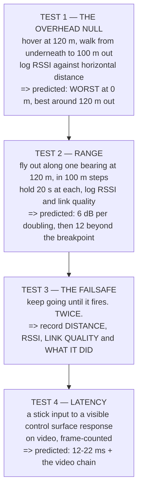

# P04 — The datalink, measured

<!-- glance:start -->
<!-- generated by tools/build.py from curriculum/syllabus.yaml — edit the syllabus, not this block -->

| | |
|---|---|
| **Track** | Project |
| **Difficulty** | Intermediate |
| **Time** | 2 h 30 min |
| **Hardware** | First flight (Hermon core) (stage 1) |
| **Software** | qgc, python |
| **Prerequisites** | [09.05 Spectrum and regulation: what you may transmit, in Israel and under Part 107](../09-telemetry-datalink/09.05-spectrum-and-regulation.md) |

<!-- glance:end -->

## Goal

**Produce a measured RSSI-versus-distance curve for both links, the distance at which the failsafe
actually triggers, and an end-to-end latency figure.**

[FRA.02](../optional-foundations/rf-datalink/FRA.02-link-budget-math.md) predicted 146 km of
free-space range and then explained why you will not get it. This project finds out what you
actually have.

## Why this project

The link budget is the most-quoted and least-verified number in this hobby, and module 09 gave you
three predictions that are all testable in an afternoon:

| the course predicted | where | what you will measure |
|---|---|---|
| **36 dB of fade margin** at 2,420 m and 120 m altitude | FRA.02 | RSSI against distance |
| a deep fade **directly overhead** — 12 dB against 36 | [FRA.03](../optional-foundations/rf-datalink/FRA.03-antennas-and-polarisation.md) | RSSI on a walk-out |
| the failsafe triggers on **link quality**, not distance | [09.03](../09-telemetry-datalink/09.03-failsafe-when-the-link-drops.md) | where it fires, twice |

The second one is the one worth the project on its own. FRA.03 predicted that the weakest point in
the whole flight envelope is the aircraft directly above your head — the moment you are least
expecting a link problem and most likely to blame something else. **Measuring that changes where you
stand for the rest of your flying career.**

And the failsafe distance matters operationally. [19.02](../19-capstone-hermon-mission/19.02-phase-1-preflight-and-launch.md)
found that eyesight limits you to 242 m of useful attitude judgement long before the radio does; this
project confirms the radio really is the comfortable one.

## Prerequisites

- [09.05](../09-telemetry-datalink/09.05-spectrum-and-regulation.md) and all of module 09
- FRA.01–FRA.04 if the units are not automatic yet
- [P02](P02-tuned-cascade.md), so the aircraft holds position while you walk away from it
- A site with **at least 600 m** of clear, safe, legal separation in one direction

## Hardware and software

| | |
|---|---|
| **Hardware** | Hermon stage 1, a tripod for the ground antenna, a tape measure or a second GNSS receiver, a stopwatch |
| **Software** | QGroundControl, a log parser, Python for plotting |
| **Site** | Long, open, flat, and **legal** — check the airspace before you check the radio |
| **Conditions** | Calm and dry. Rain changes the answer and you do not want that variable yet. |

A tripod is not optional. FRA.02's Level 3 shows the ground antenna height appears in **both** the
Fresnel midpoint and the two-ray breakpoint, and it is the cheapest change on this list.

## Architecture

## Milestones

1. **Plan and permissions.** This is the project most likely to take you somewhere you need to check
   first. Airspace, land, and people, in that order.
2. **Baseline RSSI on the bench**, at 2 m, both links. Everything else is relative to this.
3. **Test 1 — the overhead null.** Hover at 120 m, walk out, log continuously. Ten positions is
   plenty.
4. **Plot it before flying again.** If it does not look like FRA.03's curve, find out why now.
5. **Test 2 — the range walk-out**, in 100 m steps, holding at each. Record altitude as well as
   distance; the slant range is what matters.
6. **Fit the slope.** Is it 6 dB per doubling or 12? Where is your breakpoint, and does it match
   `4h₁h₂/λ`?
7. **Test 3 — the failsafe.** Approach the limit deliberately, with the abort agreed in advance, and
   let it fire. **Twice**, to confirm it is repeatable.
8. **Test 4 — latency.** Video at a known frame rate, a stick input, a visible response. Count
   frames.
9. **Report**, with four plots and four numbers.

## Acceptance criteria

| # | criterion | evidence |
|---|---|---|
| 1 | **RSSI versus horizontal distance** at fixed altitude, ≥ 8 points, both links | the plot |
| 2 | The **overhead null measured**, with its depth in dB | the same plot |
| 3 | **RSSI versus slant range**, ≥ 6 points, with the fitted slope in dB per doubling | the plot |
| 4 | A stated **breakpoint distance**, measured, compared against `4h₁h₂/λ` | the report |
| 5 | The **failsafe trigger distance**, measured **twice**, with RSSI and link quality at trigger | two logs |
| 6 | **What the failsafe did**, confirmed against your configured behaviour | the log's mode changes |
| 7 | **End-to-end latency** in milliseconds, with the method stated | the video and the count |
| 8 | Every measurement reported with **the conditions**: wind, antenna height, altitude | the report |

Criterion 8 is not bureaucracy. FRA.02 showed the ground antenna height changes the answer by more
than most equipment choices; a range figure without it is not reproducible.

## Safety

> [!WARNING]
> This project deliberately flies the aircraft to the edge of its control link, which is the one
> failure [FEL.05](../optional-foundations/drone-electronics-power/FEL.05-wiring-fuses-and-measurement.md)
> called unmitigable. **Configure and verify the failsafe in SITL first** — P03's harness is exactly
> the right place — and confirm the RTL altitude clears everything between you and the far point
> before you fly a single metre outward.

> [!CAUTION]
> Never power a transmitter with its antenna disconnected (FRA.03's Level 4: 100 % of the power comes
> back into the amplifier). And do not increase transmit power to extend the test — EIRP is what the
> regulator measures, and [09.05](../09-telemetry-datalink/09.05-spectrum-and-regulation.md) has the
> Israeli limits.

- **Visual line of sight throughout.** 19.02 measured the real limit: a dot at 2,420 m and attitude
  unreadable past **242 m**. The radio will outlast your eyes, and the legal limit is your eyes.
- Fly the outbound leg **along** a clear corridor, never over a road, a building or people.
- Agree the abort before the first flight: **who** calls it, and at what indication.
- Expect the failsafe to fire. That is the test. Everyone on site should know it is coming and what
  the aircraft will do.

## Troubleshooting

**RSSI is terrible everywhere.** Check the antennas first — connector, orientation, and whether
anything conductive is within a quarter wavelength (FRA.03's Level 1).

**The overhead null is not there.** Check that the aircraft's antenna is actually vertical, and that
the ground antenna is too. Also check you were close enough: the null is sharp, and at 20 m
horizontal from a 120 m hover you are already 9.5° off axis.

**RSSI drops faster than 6 dB per doubling from the start.** You are past the breakpoint already —
raise the ground antenna and repeat.

**The failsafe fires at a different distance each time.** That is normal and it is the finding:
report the two numbers and the spread, not an average of one.

**The failsafe does not fire at all.** Check the configured thresholds, and check you are reading
link quality rather than RSSI. They are different numbers with different failure modes.

**Latency measurements scatter wildly.** Your video frame rate is the resolution limit. At 30 fps one
frame is 33 ms, which is larger than the whole control chain — use a high-speed mode or a different
method.

**Telemetry drops long before control.** Expected. They are different bands, different
sensitivities, different antennas, and FRA.04's map says only one of them is required to fly.

## Stretch goals

- Repeat Test 2 at **two altitudes**, 30 m and 120 m, and show that the breakpoint moves as
  `4h₁h₂/λ` says it should.
- Repeat Test 1 with the **ground antenna laid over at 45°** and measure how much of the overhead
  null you removed. This is the free mitigation FRA.03 suggested.
- Measure the link with a **second aircraft airborne on the same band** and quantify the interference
  — FRA.04's hopping arithmetic, checked.
- Compare the measured margin at your longest leg against FRA.02's predicted **36 dB** and account
  for the difference term by term.

## Evidence to keep

- **All logs**, with the flight geometry recorded for each
- **Four plots**: overhead null, RSSI vs slant range with fitted slope, failsafe approach ×2,
  latency frames
- The **conditions sheet**: wind, temperature, antenna heights, aircraft altitude, band and power
- A **table** of predicted versus measured for every number FRA.01–FRA.04 gave you
- The **failsafe configuration** as a parameter file, dated
- A **video** of one failsafe event, because it is the most useful thing to show another operator

That predicted-versus-measured table is the deliverable. It is also the first page of evidence for
two of [16.05](../16-testing-analysis/16.05-field-protocols-and-the-safety-case.md)'s barriers.

## Progress checkpoint

You now know what your link actually does, where its weakest point is, at what distance it gives up,
and how long it takes — all four as measurements with conditions attached.

More importantly you have turned two of the safety case's assumed barriers into **evidenced** ones,
which is the distinction FOP.02 spent a whole lesson on. P05 flies missions that depend on both.
