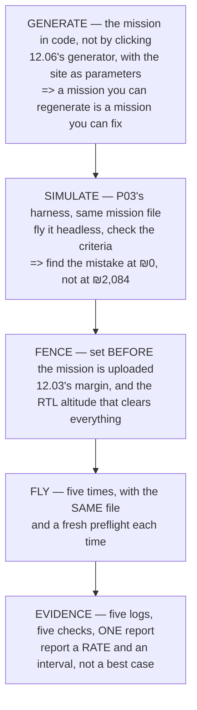

# P05 — Five clean autonomous missions

<!-- glance:start -->
<!-- generated by tools/build.py from curriculum/syllabus.yaml — edit the syllabus, not this block -->

| | |
|---|---|
| **Track** | Project |
| **Difficulty** | Advanced |
| **Time** | 3 h |
| **Hardware** | First flight (Hermon core) (stage 1) |
| **Software** | ardupilot, qgc |
| **Prerequisites** | [12.06 Writing your own mission logic in Python](../12-autonomous-flight/12.06-missions-from-python.md) |

<!-- glance:end -->

## Goal

**Fly five waypoint missions that complete and return, with the geofence never touched and every log
archived.**

Five, not one. The word doing the work is **clean**: no manual intervention, no fence breach, no
unexplained message, five times running.

## Why this project

One successful autonomous mission proves almost nothing.
[19.05](../19-capstone-hermon-mission/19.05-the-campaign-and-the-report.md) did the arithmetic that
makes this concrete: **eight successes out of ten means somewhere between 49 % and 94 %** — an
interval so wide it cannot support a decision. Five in a row is not a proof either, but it is the
smallest number that distinguishes "it works" from "it worked".

What this project actually teaches is the discipline around the flight rather than the flight itself.
An autonomous mission is easy to start and hard to supervise: the aircraft is doing exactly what it
was told, and the only question that matters is whether what it was told is what you meant. Module 12
gave you the tools; this is where you find out whether your habits match them.

And it is the first project where the **fence** is an acceptance criterion rather than a safety net.
[12.03](../12-autonomous-flight/12.03-geofence.md)'s margin exists so that a mistake becomes a
recovery instead of an accident — but a fence that gets touched on three flights in five is not a
margin, it is a wall you are leaning on.

## Prerequisites

- [12.06](../12-autonomous-flight/12.06-missions-from-python.md) and all of module 12
- [P02](P02-tuned-cascade.md) — an untuned aircraft flies waypoints badly and you will blame the
  mission
- [P03](P03-sitl-harness.md) — **every mission in this project flies in SITL first**
- [P04](P04-datalink-range.md), so you know where your link gives up relative to your mission's
  furthest point

## Hardware and software

| | |
|---|---|
| **Hardware** | Hermon stage 1. Six packs; five missions plus a spare is realistic. |
| **Software** | ArduPilot, QGroundControl, your own mission generator from 12.06 |
| **Site** | Large enough that the fence is a genuine margin, not a formality |
| **Conditions** | Under 4 m/s. Above that, [FA.04](../optional-foundations/flight-aerodynamics/FA.04-wind-trajectories-and-units.md)'s cross/along asymmetry starts changing your timings by minutes. |

## Architecture

**The same mission file, five times.** Changing it between flights turns five trials into five
experiments with one sample each, which is the mistake 19.05 spent a whole lesson on.

## Milestones

1. **Survey the site.** Boundaries, obstacles, the RTL altitude that clears everything, and where
   people can be.
2. **Write the mission in code.** Site corners as parameters, waypoints generated, the file written
   out. 12.06's method.
3. **Set the fence and the failsafes first.** Fence, RTL altitude, battery failsafe, link failsafe.
   Before the mission is uploaded, not after.
4. **Fly it in SITL** through P03's harness, including with wind and with a link drop injected.
5. **Fly one mission in the air**, supervised closely, hand on the mode switch.
6. **Debrief it** properly before flying the second. If flight 1 taught you something, the remaining
   four test the new thing, not the old one.
7. **Fly four more**, same file, same configuration, fresh preflight each time.
8. **Archive every log immediately** — at the field, not at home.
9. **Report**: five outcomes, the fence's closest approach on each, and the success rate **with its
   interval**.

## Acceptance criteria

| # | criterion | evidence |
|---|---|---|
| 1 | **Five missions** flown with the same mission file and configuration | five logs |
| 2 | Every one **completed and returned** without manual intervention | mode history in each log |
| 3 | **The fence was never touched** on any flight | fence breach messages: none |
| 4 | Closest approach to the fence **recorded per flight** | computed from the position track |
| 5 | No `ERR` or unexplained `MSG` in any log | the logs |
| 6 | Landed battery state above the configured floor on all five | `BAT` at land |
| 7 | All five logs **archived with the mission file and parameter file** beside them | the folder |
| 8 | A report giving the success rate **as a rate with an interval**, not "5/5" | one page |

Criterion 4 is the interesting one. "Did not breach" is binary and uninformative; **how close it got
each time** is a distribution, and it tells you whether your margin is generous or lucky.

Criterion 8 follows 19.05: five out of five is not 100 %. Compute the interval and write it down.

## Safety

> [!WARNING]
> An autonomous mission does exactly what it was uploaded to do, including the parts you did not
> mean. **Verify the mission in SITL and then verify the uploaded mission on the ground station map
> before arming** — read every waypoint's altitude, and confirm the last item is a land or an RTL and
> not a waypoint the aircraft will hold at until the battery failsafe fires.

> [!CAUTION]
> The fence and the RTL altitude must be set **before** the mission is uploaded and must clear every
> obstacle between every waypoint and home — including the ones behind you. An RTL that flies through
> a tree is a failsafe that made things worse.

- Hand on the mode switch, every flight, all five. Autonomy you cannot interrupt is not autonomy.
- Agree the abort criteria before flight 1 and **do not relax them by flight 4** — the fourth flight
  is where complacency arrives, and it is a well-documented effect.
- Nobody inside the fence. Not a spotter, not a photographer, not you.
- If any flight is aborted, it does not count toward the five. Start again rather than counting a
  partial.

## Troubleshooting

**The aircraft flies to the first waypoint by a route you did not expect.** Check the mission's first
item — many planners insert a takeoff command, and its absence changes everything about the first
leg.

**It overshoots waypoints.** That is the position controller's speed and acceleration limits, not the
mission. [07.05](../07-control/07.05-velocity-position-and-modes.md), and P02's tune.

**The fence triggers at a distance you did not expect.** Fence radius is measured from home, and home
may not be where you think — [FGL.02](../optional-foundations/gnss-navigation-math/FGL.02-local-frames-enu.md)'s
last section: the EKF origin and home are two different points.

**Altitudes are wrong by about 17 m.** That is
[FGL.01](../optional-foundations/gnss-navigation-math/FGL.01-earth-coordinates-and-datums.md)'s
geoid separation, and it means something in your chain is mixing an orthometric source with an
ellipsoidal one.

**Flight 3 behaves differently from flights 1 and 2.** Check the wind first, then check whether
anything changed — a parameter, a battery, a prop. If nothing changed, you have found real variance,
and that is the most valuable result in the project.

**The mission completes but the log has an `ERR`.** Investigate it before flying again. A completed
mission with an unexplained error is a passing test that is measuring the wrong thing.

**It returns home at the wrong altitude.** `RTL_ALT` and the terrain between here and there. Check
both, on the map, before the next flight.

## Stretch goals

- Fly the same mission **along** and **across** the wind and compare the times. FA.04 predicted
  **525 s versus 375 s** at 3 m/s — twice 19.01's whole margin.
- Fly **ten** missions instead of five and watch the confidence interval narrow. 19.05 says going
  from 5 to 19 flights is what separates 48 % from 88 %.
- Deliberately upload a mission with an error — a waypoint at the wrong altitude — **in SITL** and
  check that your review process catches it.
- Generate the mission at two different overlaps and compare flight time against
  [18.01](../18-civil-ops/18.01-uav-missions.md)'s predicted edge overhead.

## Evidence to keep

- **Five logs**, archived at the field, named by date and flight number
- The **mission file** and the **generator** that produced it, in version control
- The **parameter file** as flown, unchanged across all five
- The **fence configuration** and the closest-approach figure per flight
- A **site sketch** with the fence, the obstacles and the RTL altitude marked
- A **report**: five outcomes, closest approaches, timings, and the success rate with its interval
- One **debrief** per flight, however short, each naming one change or explicitly naming none

## Progress checkpoint

Hermon now flies missions you generated, inside a fence that was never touched, five times running —
and you can state that as a rate with an interval rather than as a claim.

That is the last purely-flight project. P06 adds a camera and a detector, and the question changes
from "did it fly the pattern?" to "did it *find* anything, and how often was it wrong?"
