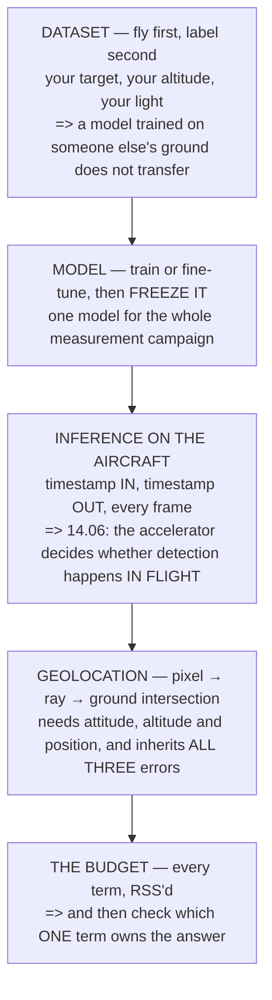

# P06 — Target detection from the air

<!-- glance:start -->
<!-- generated by tools/build.py from curriculum/syllabus.yaml — edit the syllabus, not this block -->

| | |
|---|---|
| **Track** | Project |
| **Difficulty** | Advanced |
| **Time** | 3 h 30 min |
| **Hardware** | Onboard computer & vision (stage 2) |
| **Software** | python, yolo, ros2 |
| **Prerequisites** | [14.05 From detection to a track, and from a pixel to a ground coordinate](../14-vision-perception/14.05-tracking-and-geolocation.md) |

<!-- glance:end -->

## Goal

**Find the target in ≥ 90 % of frames at 30 m, with a measured end-to-end latency and a written
geolocation error budget.**

Three numbers, and the third is the one that matters: a detection without a position is a picture,
and a position without an error bar is a guess.

## Why this project

Module 14 built a perception chain and [19.03](../19-capstone-hermon-mission/19.03-phase-2-survey-and-detect.md)
flew it, and between them they produced the single most important result in the vision half of this
course: **at a confidence threshold of 0.85 a survey produces about 50 false positives, and at 0.50
it produces 3,300.** The detector is not the hard part. The **base rate** is.

This project makes that concrete on your own hardware, and it tests three predictions:

| the course predicted | where | what you will measure |
|---|---|---|
| recall ≥ 90 % at a workable threshold | [14.04](../14-vision-perception/14.04-detection-in-the-air.md) | detections per labelled frame |
| end-to-end latency dominated by the **accelerator**, not the link | [14.06](../14-vision-perception/14.06-edge-compute-and-latency.md) | frame timestamp to result timestamp |
| geolocation error dominated by **where the aircraft is**, not by the pixel | [14.05](../14-vision-perception/14.05-tracking-and-geolocation.md) | ground truth versus reported |

19.03 found that **87 % of the geolocation variance is where the target is** rather than anything
about the camera, and that averaging eleven fixes improves the position by **0.27 %** because the
dominant terms are biases. If your own budget says the same thing, you can stop optimising the wrong
half of the system.

## Prerequisites

- [14.05](../14-vision-perception/14.05-tracking-and-geolocation.md) and all of module 14
- [P05](P05-first-mission.md) — you need repeatable flight before you can attribute a detection
  failure to the detector
- [P02](P02-tuned-cascade.md) — motion blur is a tuning problem before it is a camera problem
- Stage 2 hardware: the companion computer, the camera, and the mount from
  [14.03](../14-vision-perception/14.03-gimbals-and-stabilisation.md)

## Hardware and software

| | |
|---|---|
| **Hardware** | Hermon stage 2. A target you can place accurately. A means of surveying its true position. |
| **Software** | Python, a YOLO-family detector, ROS 2, your own labelling |
| **Site** | Somewhere you may leave a target and fly a repeatable pattern over it |
| **Ground truth** | A surveyed marker position. A ₪50 printed sheet at a measured point is enough — [19.04](../19-capstone-hermon-mission/19.04-phase-3-delivery-and-precision-rtl.md) found it bought the same 100 % as a ₪2,000 RTK receiver |

## Architecture

## Milestones

1. **Place and survey the target.** Its true position is the reference for everything; measure it
   properly and write it down with its own uncertainty.
2. **Fly a data-collection pattern** at 30 m and capture raw frames with full telemetry timestamps.
   No detection yet.
3. **Label the frames.** This is the slow part and there is no way around it. Label honestly,
   including the frames where the target is barely visible.
4. **Train or fine-tune**, then **freeze the model**. Changing it mid-campaign invalidates every
   measurement before the change.
5. **Measure recall and precision offline**, on held-out frames, across a sweep of confidence
   thresholds. Plot both against threshold.
6. **Deploy to the aircraft** and measure end-to-end latency in flight, frame by frame.
7. **Fly the pattern again** with detection live, and record every detection's reported ground
   position.
8. **Build the geolocation budget**: attitude error, altitude error, position error, pixel error,
   timing error. Root-sum-square them and compare against the measured scatter.
9. **Report**, including the false-positive rate extrapolated to a full survey — 19.03's arithmetic,
   on your numbers.

## Acceptance criteria

| # | criterion | evidence |
|---|---|---|
| 1 | **Recall ≥ 90 %** at 30 m on held-out labelled frames, at a stated threshold | the sweep plot |
| 2 | **Precision reported at the same threshold** — recall alone is meaningless | the same plot |
| 3 | A **threshold sweep** showing both curves, with the operating point marked and justified | the plot |
| 4 | **End-to-end latency** measured in flight, reported as a median and a 95th percentile | per-frame timings |
| 5 | A written **geolocation error budget**, every term named, RSS'd to a single figure | one page |
| 6 | **Measured geolocation scatter** compared against that budget | the two numbers, side by side |
| 7 | The **dominant term identified**, and stated plainly | one sentence |
| 8 | **Expected false positives per survey** at your operating threshold, extrapolated | the calculation |

Criterion 8 is the one that decides whether the system is usable. A detector with 95 % recall and
3,300 false positives per survey is not a detector, it is a random number generator with a good
press release.

## Safety

> [!WARNING]
> A companion computer changes the aircraft's failure modes. It can saturate a CPU, brown out a
> shared rail, or hold a UART open while the flight controller waits. **The companion must never be
> able to prevent the flight controller from flying** — verify that by pulling its power in flight,
> in SITL first and then at 5 m over grass, before you fly a survey with it.

> [!CAUTION]
> Vision work encourages long flights at low altitude over a fixed spot, which is exactly the profile
> that drains a pack without you noticing. Use [11.05](../11-first-flights/11.05-battery-discipline.md)'s
> three numbers, and remember that the companion computer is a continuous load the endurance model
> did not originally include — FEL.02 priced avionics at 5 %, and an accelerator is not avionics.

- Fly the detection pattern **only** over ground you would be willing to land on.
- The target is a target, not a person and not an animal. Test on objects.
- Anyone helping place or move the target is **outside the fence before arming**, every time.
- If the companion computer is doing anything that can command the aircraft, this project is P07 and
  you should do P07's safety work first.

## Troubleshooting

**Recall collapses at altitude.** Ground sample distance. [18.01](../18-civil-ops/18.01-uav-missions.md)
showed images go as `1/GSD²` — check the target's size in pixels before blaming the model.

**Detections are good but geolocation is metres out.** Check attitude timing first. A 100 ms
misalignment between the frame and the attitude solution at 5 m/s is half a metre of error before
anything else contributes.

**Geolocation error is much worse than the budget.** Something is not in the budget. The usual
missing terms are camera mounting misalignment and the geoid — FGL.01's **17 m** if a DEM is
involved.

**Averaging many fixes does not help.** Expected. 19.03 measured **0.27 %** improvement from eleven
fixes, because the dominant terms are **biases**, not noise. Averaging removes the wrong kind of
error.

**Latency is fine on the bench and terrible in flight.** Thermal throttling, or the accelerator
sharing a bus with the camera. Log the clock speeds as well as the timings.

**False positives explode on a real survey.** That is the base rate, and it was predictable: 19.03's
arithmetic turns a per-frame precision into a per-survey count, and the count is what an operator
experiences.

**The model works on my labelled set and nowhere else.** You labelled your own flights and trained
on them. Hold out a **different day**, not a random subset of the same day.

## Stretch goals

- Implement **19.03's confirmation rule** — 3 detections of 11 within 2.8 m — and measure the false
  confirmation rate. 19.03 predicted **one in 303 flights at conf 0.85 and 1,008 at conf 0.50**:
  confirmation multiplies a good threshold, it does not fix a bad one.
- Measure recall at **three altitudes** and plot it against GSD rather than against height.
- Quantify what a **gimbal** buys by flying the same pattern with it locked and stabilised.
- Compare a **surveyed marker** against an RTK fix as ground truth and see whether you can tell the
  difference at your error level. 19.04 could not.

## Evidence to keep

- The **labelled dataset**, with its labelling conventions written down
- The **frozen model file**, with a hash, and the date it was frozen
- The **threshold sweep**, with the operating point and the reason for it
- **Per-frame latency data**, not just a mean
- The **geolocation error budget**, as a table with every term and its source
- **Measured versus predicted** scatter, side by side
- The **false-positive extrapolation** for a full survey
- All flight logs and the raw frames for at least one complete pass

The budget table is the artefact that outlives the project. It is also the thing that will tell you,
in a year, whether a new camera is worth buying — because you will be able to see which term it would
actually change.

## Progress checkpoint

You have a detector with a stated recall **and** precision at a justified threshold, a latency figure
with a tail, and a geolocation budget that names its dominant term.

That last one is the real output. P07 gives the companion computer authority over the aircraft, and
the only reason that is defensible is that you now know how wrong its answers are.
