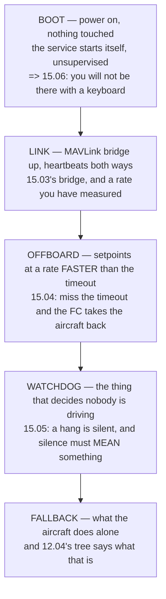

# P07 — Offboard autonomy, end to end

<!-- glance:start -->
<!-- generated by tools/build.py from curriculum/syllabus.yaml — edit the syllabus, not this block -->

| | |
|---|---|
| **Track** | Project |
| **Difficulty** | Advanced |
| **Time** | 3 h 30 min |
| **Hardware** | Onboard computer & vision (stage 2) |
| **Software** | ros2, ardupilot, docker |
| **Prerequisites** | [15.06 Deployment, and the first computer-piloted flight](../15-onboard-autonomy/15.06-deployment-and-first-autonomous-flight.md) |

<!-- glance:end -->

## Goal

**Hermon flies a computer-commanded pattern from a service that starts itself, and survives a cable
pull with a safe fallback.**

Two halves, and the second one is the project. Anything can command a drone once; the engineering is
in what happens when the thing commanding it stops.

## Why this project

This is where the companion computer stops observing and starts deciding, and that is a different
safety argument entirely. Up to P06 the worst a software bug could do was produce a wrong number;
from here it can produce a wrong **command**.

Module 15 built the answer and this project proves it, against three predictions:

| the course predicted | where | what you will measure |
|---|---|---|
| a **watchdog** turns a hang into a mode change | [15.05](../15-onboard-autonomy/15.05-behaviour-trees-and-watchdogs.md) | time from cut to fallback |
| offboard setpoints must arrive **faster than the timeout** | [15.04](../15-onboard-autonomy/15.04-offboard-control.md) | setpoint rate, measured in flight |
| the service must **start itself**, because you will not be there | [15.06](../15-onboard-autonomy/15.06-deployment-and-first-autonomous-flight.md) | a cold boot to a flying pattern |

And the cable-pull test is the one that earns this project its place.
[FOP.02](../optional-foundations/civil-ops/FOP.02-risk-management-bowtie.md) was blunt about it:
**a barrier without evidence is a belief.** Everybody configures a watchdog; almost nobody pulls the
cable. Until you do, the watchdog is a line in a config file, not a barrier.

## Prerequisites

- [15.06](../15-onboard-autonomy/15.06-deployment-and-first-autonomous-flight.md) and all of
  module 15
- [P03](P03-sitl-harness.md) — **every failure mode in this project is exercised in SITL first**
- [P05](P05-first-mission.md), so a mission-level failure can be distinguished from an offboard one
- [P06](P06-detection-in-the-air.md), or at least a companion computer you have already flown as a
  passenger

## Hardware and software

| | |
|---|---|
| **Hardware** | Hermon stage 2, with the companion computer on a rail you can interrupt **deliberately and safely** |
| **Software** | ROS 2, ArduPilot, Docker, a service manager that starts on boot |
| **Site** | Small — this project needs 20 m of space and a lot of restraint |
| **Conditions** | Calm. Every test here is about the software; wind is a confounder you do not need |

The interruptible rail matters. You need a way to remove power from the companion **without**
touching the flight controller, and it must be operable by a person standing outside the fence — or
better, by a channel on the transmitter.

## Architecture

**The watchdog is the load-bearing box.** Everything else is plumbing; the watchdog is the only part
that has to work on the worst day.

## Milestones

1. **Cold boot on the bench.** Power on, hands off, and confirm the service comes up and publishes.
   Do this ten times before anything flies.
2. **Bridge and rates.** Measure the actual setpoint rate reaching the flight controller, and confirm
   it comfortably exceeds the offboard timeout.
3. **Fly the pattern in SITL** through P03's harness, including the hang, the kill and the cable
   pull.
4. **Instrument the fallback.** In SITL, measure the time from "setpoints stop" to "mode changed",
   and confirm the mode is the one you intended.
5. **First airborne offboard flight**, low, small pattern, hand on the mode switch throughout.
6. **The kill test**: stop the service in flight, deliberately, and measure the fallback.
7. **The hang test**: make the service stop publishing *without* exiting — the harder case, and the
   one a process monitor misses.
8. **The cable-pull test**: remove companion power in flight. This is the acceptance test.
9. **Repeat each failure test three times** and report the fallback time as a range, not a single
   number.

## Acceptance criteria

| # | criterion | evidence |
|---|---|---|
| 1 | A **cold boot to a publishing service** with no human intervention, ten times | boot logs |
| 2 | A **computer-commanded pattern** flown, with the flight controller in offboard throughout | the flight log |
| 3 | Measured **setpoint rate** in flight, stated against the configured timeout | the log |
| 4 | **Kill test**: service stopped in flight, fallback observed, time measured, ×3 | three logs |
| 5 | **Hang test**: publishing stops without the process exiting, fallback still occurs, ×3 | three logs |
| 6 | **Cable-pull test**: companion power removed in flight, fallback observed, ×3 | three logs |
| 7 | Fallback time reported as a **range over all nine tests**, not a best case | the report |
| 8 | The fallback **mode and behaviour** confirmed to match 12.04's configured tree | the log's mode history |

Criterion 5 is the one that separates this from a checkbox. A crashed process is easy to detect; **a
process that is alive and silent is the real failure mode**, and it is the one most watchdogs are
accidentally configured not to see.

## Safety

> [!WARNING]
> This project deliberately breaks the thing that is flying the aircraft, three different ways, while
> it is in the air. Every one of those tests **must pass in SITL before it is attempted at altitude**,
> and every one must be flown **low, small and over ground you would accept landing on**. The correct
> order is: SITL, then a 2 m hover, then a 5 m pattern. Not the other way round.

> [!CAUTION]
> The pilot's mode switch must override the companion **at all times and in every state**, including
> while the companion is mid-command. Verify that explicitly, on the ground and then in a hover,
> before any of the failure tests. If there is any state in which the switch does not take the
> aircraft back, stop and fix that before flying again.

- **Hand on the mode switch for every flight in this project.** No exceptions, including flight ten.
- The failure tests happen at **2 to 5 m**, over grass, with nobody inside the fence.
- Announce every test out loud before it happens, so nobody mistakes an intended failure for an
  emergency — and so an unintended one is recognised immediately.
- Any test that produces an unexpected behaviour ends the session. Debrief it, fix it, fly it in
  SITL, and come back.

## Troubleshooting

**The service starts on the bench and not on boot.** Almost always a dependency ordering problem —
the network, the serial device or a mount point is not there yet. Make the service wait and retry
rather than assume.

**Offboard rejects the mode change.** Setpoints must already be streaming before the mode is
requested. The flight controller will not enter offboard on a promise.

**The aircraft drifts during offboard.** Check the setpoint rate against the timeout, and check for
gaps — a median rate of 20 Hz with occasional 500 ms gaps behaves nothing like a steady 20 Hz.

**The kill test works and the hang test does not.** Expected, and it is the finding. A process
monitor watches whether the process exists; a watchdog watches whether **data arrives**. You need the
second.

**The cable pull also resets the flight controller.** Then they share a rail, and
[FEL.05](../optional-foundations/drone-electronics-power/FEL.05-wiring-fuses-and-measurement.md)'s
rule applies: fuse and separate what you can lose. This is a wiring change, not a software one.

**The fallback mode is not what was configured.** Read 12.04's tree again with the log beside it —
the failsafe order matters, and a battery or link condition may be taking priority.

**Fallback times vary by hundreds of milliseconds.** That is real, and it is why criterion 7 asks
for a range. Report it honestly; it is a barrier's actual performance.

## Stretch goals

- Add a **second, independent watchdog** on the flight controller side and measure whether it fires
  first. FOP.02's β argument says a second barrier is only worth having if it fails for a different
  reason.
- Measure the fallback time **as a function of altitude and speed**, and convert it into metres of
  travel. That number belongs in your safety case, not milliseconds.
- Run the hang test with the companion under **full CPU load** from P06's detector, which is when it
  is most likely to happen for real.
- Make the harness from P03 run all nine failure tests automatically, every night.

## Evidence to keep

- **Ten boot logs** showing unattended startup
- **Nine failure-test logs** — three each of kill, hang and cable pull
- A **table**: test, attempt, fallback time, resulting mode
- The **service definition** and the **watchdog configuration**, in version control
- A **video** of one cable-pull test, because it is the most persuasive evidence you will produce in
  this course
- A one-line entry for [FOP.02](../optional-foundations/civil-ops/FOP.02-risk-management-bowtie.md)'s
  barrier register: *"watchdog fallback — evidence: nine in-flight tests, fallback 0.x–0.y s"*

That last line is the point of the whole project. You have turned a belief into a barrier with
evidence, which is the thing 16.05 said it could not do for one of its seventeen.

## Progress checkpoint

A computer flies Hermon, it starts itself, and you have measured — three ways, three times each —
what happens when it stops.

Everything the capstone needs is now built and, more importantly, **measured**. P08 puts it together
and flies it ten times.
