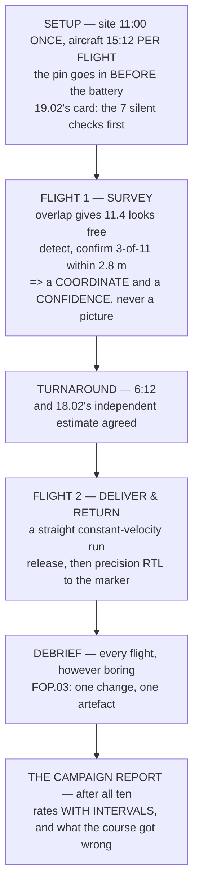

# P08 — Hermon's mission (capstone)

<!-- glance:start -->
<!-- generated by tools/build.py from curriculum/syllabus.yaml — edit the syllabus, not this block -->

| | |
|---|---|
| **Track** | Project |
| **Difficulty** | Advanced |
| **Time** | 10 h |
| **Hardware** | First flight (Hermon core) (stage 1), Onboard computer & vision (stage 2), Payload & delivery pod (stage 4), Precision landing & final (stage 5) |
| **Software** | python, yolo, ardupilot, ros2, qgc |
| **Prerequisites** | [19.05 The campaign, the report, and the debrief](../19-capstone-hermon-mission/19.05-the-campaign-and-the-report.md) |

<!-- glance:end -->

## Goal

**Fly ten clean Hermon capstone missions — survey, detect, deliver, precision return — and produce
the full evidence pack.**

Ten, because [19.05](../19-capstone-hermon-mission/19.05-the-campaign-and-the-report.md) showed that
eight out of ten means **somewhere between 49 % and 94 %**. One mission is a demonstration. Ten is
the smallest number that lets you say anything at all, and it still leaves you with an honest
interval you have to quote.

## Why this project

Everything in this course arrives here, and it arrives with a prediction attached. Module 19 flew
this mission on paper and produced a number that this project is going to test:

| the course predicted | where |
|---|---|
| the mission is **10:01 of 11:12 usable**, so **two flights** | [19.01](../19-capstone-hermon-mission/19.01-the-brief.md) |
| setup is site 11:00 once + aircraft **15:12** per flight; flight 2 is **6:12** | [19.02](../19-capstone-hermon-mission/19.02-phase-1-preflight-and-launch.md) |
| **~50 false positives** per survey at conf 0.85, and **3 of 11 within 2.8 m** confirms | [19.03](../19-capstone-hermon-mission/19.03-phase-2-survey-and-detect.md) |
| **4.8 clean flights in 10** on GPS alone, **8.8 with a printed marker sheet** | [19.04](../19-capstone-hermon-mission/19.04-phase-3-delivery-and-precision-rtl.md) |
| ten flights pin the bias to **9 cm** and leave the CEP at **± 22 %** | 19.05 |

**The 4.8-versus-8.8 prediction is the one to watch.** It says that without a ₪50 printed sheet,
fewer than half your capstone attempts will be clean — which means that if you fly ten and get eight,
either the sheet is on the ground or the model is wrong, and both of those are findings worth having.

And [FOP.03](../optional-foundations/civil-ops/FOP.03-debrief-and-aar.md) named the third thing this
project has to settle: **16.05's flow-plus-inertial barrier still has no evidence**, three modules
after it was identified. It is the course's own open item, and it is yours now.

## Prerequisites

- [19.05](../19-capstone-hermon-mission/19.05-the-campaign-and-the-report.md) and all of module 19
- **[P01](P01-first-hover.md) through [P07](P07-offboard-autonomy.md), all complete and all with
  their reports.** This project assembles their outputs; it does not replace them.
- Stage 1, 2, 4 and 5 hardware, all built and all flown separately first
- The full mission running nightly in [P03](P03-sitl-harness.md)'s harness

## Hardware and software

| | |
|---|---|
| **Hardware** | Hermon complete: airframe, companion and camera, delivery pod, precision-landing marker |
| **Software** | Everything: ArduPilot, ROS 2, the detector from P06, the offboard service from P07 |
| **Consumables** | **Ten missions × two flights × one pack** plus spares — about 25 charged packs across the campaign, and [FEL.03](../optional-foundations/drone-electronics-power/FEL.03-lipo-deep-dive.md)'s cycle count matters at this scale |
| **Site** | One site, used for all ten. Changing sites changes the measurement. |
| **Time** | Ten hours of work, spread over several days. It is not a single session. |

## Architecture

## Milestones

1. **Dry run in SITL**, the full mission, fifty times overnight, through P03's harness.
2. **Assemble the evidence template** *before* flying: the folder structure, the report format, the
   fields you will fill in. Deciding what to record afterwards is how campaigns lose data.
3. **Survey the site and place the marker.** One site, one marker position, surveyed and written
   down.
4. **Mission 1**, flown slowly and supervised closely. Debrief it fully before mission 2.
5. **Missions 2–5.** Expect something to change in this stretch; record what and when.
6. **Mid-campaign review.** Are the numbers tracking 19.04's 48 %? If the rate is far off in either
   direction, find out why before flying five more.
7. **Missions 6–10**, with the configuration frozen. Changing anything here restarts the count.
8. **Test the open barrier.** 16.05's flow-plus-inertial fallback, deliberately, in a controlled
   place. This is the course's outstanding item and this is where it closes.
9. **The campaign report**: rates with intervals, the bias, the CEP, and a list of what the course
   predicted wrongly.

## Acceptance criteria

| # | criterion | evidence |
|---|---|---|
| 1 | **Ten missions attempted**, all logged, including the failures | twenty flight logs |
| 2 | Every mission's outcome classified against **pre-written** criteria, not after the fact | the criteria, dated before mission 1 |
| 3 | The **clean-flight rate** reported with a confidence interval | the report |
| 4 | **Delivery CEP** reported as a value with a **± interval**, per 19.05's ± 22 % at n = 10 | the report |
| 5 | **Landing accuracy** measured against 12.05's 0.300 m criterion, all ten | measured from the marker |
| 6 | **Detection results** per survey: true positives, false positives, confirmations | per-mission tables |
| 7 | A **debrief per mission**, each naming one change or explicitly naming none | ten debriefs |
| 8 | **Every configuration frozen and recorded** — parameters, model hash, service versions | the archive |
| 9 | A **predicted-versus-measured table** covering every number in the table above | one page |
| 10 | A written list of **what the course got wrong**, in your own campaign | one page |

Criterion 10 is the real deliverable. 19.05 found three things the course got wrong and wrote them
down; your campaign will find more, and the ones you find are worth more than the ones you were
handed.

## Safety

> [!WARNING]
> This is the most complex configuration Hermon will ever fly: a payload that releases, a computer
> that commands, a camera that decides, and a marker that the landing depends on. **Every subsystem
> must have been flown and measured on its own first** — that is what P01 to P07 were for. If any
> one of them has not, fly that project rather than this one.

> [!CAUTION]
> The delivery release is the highest-energy event in the course. 17.01 measured the landing case at
> **40 N — sixteen times hover thrust** — and 17.02's mechanism is bistable so that it holds without
> power. **The pin goes in before the battery and comes out after the brief**, every flight, all
> twenty. It is one line on the card and it is the barrier with the least aircraft in it.

- Use **19.01's thirteen abort rows** as written. Five are the aircraft's, six are the PIC's, and
  **two may be called by anybody** — say that out loud at every brief, all ten times.
- Do not relax the criteria as the campaign proceeds. Mission 9 gets the same brief as mission 1;
  that is the single hardest instruction in this project.
- Nothing is released over anything you would mind hitting, and the drop zone is cleared and
  confirmed **on the flight**, not at the brief.
- If a mission is aborted, it counts as an attempt. Ten attempts, not ten successes — the whole
  statistical point is that you do not get to discard the bad ones.

## Troubleshooting

**The clean-flight rate is much better than 48 %.** Check whether the marker sheet is down. 19.04
predicted 4.8 in 10 without it and 8.8 with it, so a high rate probably means you are measuring the
better configuration.

**The rate is much worse than predicted.** Look at landing first — 12.05's precision landing acquires
only **55 %** of the time on GPS, and that single term dominates the mission's clean rate.

**False positives are far above 50 per survey.** Check the confidence threshold. 19.03's jump from 50
to 3,300 happens between 0.85 and 0.50, and the curve is steep in between.

**Detections confirm on the wrong thing.** The 3-of-11-within-2.8 m rule multiplies a good threshold;
it does not fix a bad one. 19.03 measured **1,008 false confirmations at conf 0.50**.

**Delivery accuracy is worse than P06's geolocation budget said.** Check release timing against
17.04's dynamics and 17.05's lead — the drop is a different error chain from the detection.

**One mission in eight finds nothing.** That is 19.03's expected outcome and **it is a success**, not
a failure. Classify it against the criteria you wrote in advance.

**The turnaround takes twenty minutes instead of six.** Compare against 19.02's breakdown: site
setup is once, aircraft setup is per flight, and the waits are free if you sequence them. Most
overruns are a serialised wait that did not need to be.

**Something changed between mission 5 and mission 6.** Then you have two campaigns of five, and
19.05's arithmetic says two campaigns of five tell you far less than one of ten. Decide deliberately
which it is, and say so in the report.

## Stretch goals

- Fly **nineteen** missions rather than ten. 19.05 computed that as the number needed to distinguish
  48 % from 88 % — the difference the marker sheet makes.
- Fly five **with** the marker sheet and five **without**, and test 19.04's prediction directly as a
  comparison rather than as an absolute.
- Test **16.05's unevidenced barrier** properly — flow plus inertial, GNSS denied deliberately, in a
  place where failure is survivable — and close the course's oldest open item.
- Run the whole campaign's numbers back through
  [FOP.02](../optional-foundations/civil-ops/FOP.02-risk-management-bowtie.md)'s bowtie and produce
  an updated residual, with the barriers that now have evidence marked as such.

## Evidence to keep

This is the **evidence pack**, and it is the portfolio:

- **Twenty flight logs**, named and dated, failures included
- The **acceptance criteria**, dated before mission 1
- **Ten mission reports**, one page each: outcome, detections, delivery, landing, timings
- **Ten debriefs**, each with one change or an explicit none
- The **frozen configuration**: parameter file, model hash, service versions, mission files
- A **video** of at least one complete mission, end to end, unedited
- The **campaign report**: clean rate with interval, delivery CEP ± interval, landing accuracy
  against 0.300 m, detection statistics
- The **predicted-versus-measured table** for every number module 19 published
- The **list of what the course got wrong**
- An updated **barrier register**, with the ones you have now evidenced

Anyone who reads that pack can tell what your aircraft does, how often, and how sure you are — which
is the only claim worth making about an aircraft, and the one almost nobody can support.

## Progress checkpoint

You have built an aircraft from first principles, measured every subsystem, flown a real mission ten
times, and written down what it actually does with an interval around it.

The course is finished. What you have that a certificate does not give you is the habit underneath
all of it: **a number, its spread, and the list of things you have not checked yet.** Keep that list.
It is the most valuable page in the pack.
