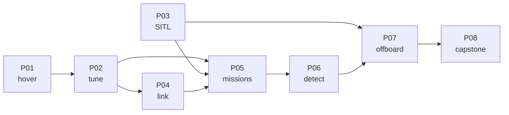

# Projects

Eight pieces of work that produce **evidence** rather than understanding.

A lesson ends when you know something. A project ends when you can **show** something — a log, a
plot, a parameter file, a video — to somebody who was not there. That distinction is the whole point
of this section, and it is the same rule
[FOP.01](../optional-foundations/civil-ops/FOP.01-mission-planning-process.md) applies to a client's
request: an objective is a **state**, testable by someone absent.

## The eight

| | Project | Needs | Time | Produces |
|---|---|---|---|---|
| [P01](P01-first-hover.md) | **First hover** | 11.03 | 1 h 30 | 30 s of hover, drift ≤ 0.5 m, three predictions checked |
| [P02](P02-tuned-cascade.md) | **A tuned cascade, measured** | 07.07, 11.03 | 3 h | overshoot ≤ 20 %, altitude ± 0.3 m over five trials |
| [P03](P03-sitl-harness.md) | **An overnight SITL harness** | 10.05 | 3 h | one command, a pass/fail report, failing logs attached |
| [P04](P04-datalink-range.md) | **The datalink, measured** | 09.05 | 2 h 30 | RSSI vs distance, the failsafe distance, a latency figure |
| [P05](P05-first-mission.md) | **Five clean missions** | 12.06 | 3 h | five autonomous flights, fence never touched |
| [P06](P06-detection-in-the-air.md) | **Detection from the air** | 14.05 | 3 h 30 | recall ≥ 90 %, a latency tail, a geolocation budget |
| [P07](P07-offboard-autonomy.md) | **Offboard autonomy** | 15.06 | 3 h 30 | a self-starting service that survives a cable pull |
| [P08](P08-hermons-mission.md) | **Hermon's mission** | 19.05 | 10 h | ten capstone missions and the full evidence pack |

**About 30 hours in total**, and the last one is a third of it.

## The order is not negotiable

Each project consumes the previous ones' outputs:

P03 has no hardware in it and can be done at any point — the earlier the better, because everything
after it gets cheaper once a mission can be flown for free.

## What every project has in common

- **A goal with a number in it.** Not "fly a mission" but "five missions, fence never touched".
- **A table of course predictions it tests.** Every project checks arithmetic from the lessons, and
  the differences are the interesting part.
- **Acceptance criteria written as states**, each with an evidence column.
- **A safety section with real limits**, because every project except P03 flies.
- **An evidence list**, which is the portfolio.

## The rule that runs through all of them

> **Report a rate with an interval, not a best case.**

[19.05](../19-capstone-hermon-mission/19.05-the-campaign-and-the-report.md) showed that eight
successes in ten means anywhere from **49 % to 94 %**, and that separating 48 % from 88 % takes
**nineteen** flights. Every project asks for repeats for that reason, and P08 asks for ten.

The other rule, from [FOP.03](../optional-foundations/civil-ops/FOP.03-debrief-and-aar.md): a project
that changed no artefact — no checklist line, no parameter, no manual section — produced an
experience rather than a result.

## Tracking

`py course.py project P01 start` and `py course.py project P01 done` record progress, and
[PROGRESS.md](../PROGRESS.md) is regenerated from it.
